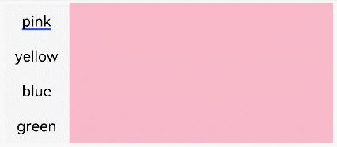

# Tabs

通过页签进行内容视图切换的容器组件，每个页签对应一个内容视图。

>  **说明：**
>
>  该组件从API Version 7开始支持。后续版本如有新增内容，则采用上角标单独标记该内容的起始版本。


## 子组件

仅可包含子组件[TabContent](ts-container-tabcontent.md)。


## 接口

Tabs(value?: {barPosition?: BarPosition, index?: number, controller?: [TabsController](#tabscontroller)})

**参数：**

| 参数名 | 参数类型 | 必填 | 参数描述 |
| -------- | -------- | -------- | -------- |
| barPosition | BarPosition | 否 | 设置Tabs的页签位置。<br/>默认值：BarPosition.Start |
| index | number | 否 | 设置初始页签索引。<br/>默认值：0 |
| controller | [TabsController](#tabscontroller) | 否 | 设置Tabs控制器。 |

## BarPosition枚举说明

| 名称 | 描述 |
| -------- | -------- |
| Start | vertical属性方法设置为true时，页签位于容器左侧；vertical属性方法设置为false时，页签位于容器顶部。 |
| End | vertical属性方法设置为true时，页签位于容器右侧；vertical属性方法设置为false时，页签位于容器底部。 |


## 属性

不支持[触摸热区设置](ts-universal-attributes-touch-target.md)，除支持[通用属性](ts-universal-attributes-size.md)外，还支持以下属性：

| 名称 | 参数类型 | 描述 |
| -------- | -------- | -------- |
| vertical          | boolean | 设置为false是为横向Tabs，设置为true时为纵向Tabs。<br/>默认值：false |
| scrollable        | boolean | 设置为true时可以通过滑动页面进行页面切换，为false时不可滑动切换页面。<br/>默认值：true |
| barMode           | BarMode | TabBar布局模式，具体描述见BarMode枚举说明。<br/>默认值：BarMode.Fixed |
| barWidth          | number&nbsp;\|&nbsp;Length<sup>8+</sup>  | TabBar的宽度值。     |
| barHeight         | number&nbsp;\|&nbsp;Length<sup>8+</sup>  | TabBar的高度值。     |
| animationDuration | number | TabContent滑动动画时长。<br/>默认值：200 |

## BarMode枚举说明

| 名称 | 描述 |
| -------- | -------- |
| Scrollable | 每一个TabBar均使用实际布局宽度，超过总长度（横向Tabs的barWidth，纵向Tabs的barHeight）后可滑动。 |
| Fixed | 所有TabBar平均分配barWidth宽度（纵向时平均分配barHeight高度）。 |

## 事件

除支持[通用事件](ts-universal-events-click.md)外，还支持以下事件：

| 名称 | 功能描述 |
| -------- | -------- |
| onChange(event:&nbsp;(index:&nbsp;number)&nbsp;=&gt;&nbsp;void) | Tab页签切换后触发的事件。 |

## TabsController

Tabs组件的控制器，用于控制Tabs组件进行页签切换。

### 导入对象

```
controller: TabsController = new TabsController()

```

### changeIndex

changeIndex(value: number): void

控制Tabs切换到指定页签。

**参数：**

| 参数名 | 参数类型 | 必填 | 参数描述 |
| -------- | -------- | -------- | -------- |
| value | number | 是 | 页签在Tabs里的索引值，索引值从0开始。 |


## 示例

```ts
// xxx.ets
@Entry
@Component
struct TabsExample {
  private controller: TabsController = new TabsController()

  build() {
    Column() {
      Tabs({ barPosition: BarPosition.Start, controller: this.controller }) {
        TabContent() {
          Column().width('100%').height('100%').backgroundColor(Color.Pink)
        }.tabBar('pink')

        TabContent() {
          Column().width('100%').height('100%').backgroundColor(Color.Yellow)
        }.tabBar('yellow')

        TabContent() {
          Column().width('100%').height('100%').backgroundColor(Color.Blue)
        }.tabBar('blue')

        TabContent() {
          Column().width('100%').height('100%').backgroundColor(Color.Green)
        }.tabBar('green')
      }
      .vertical(true)
      .scrollable(true)
      .barMode(BarMode.Fixed)
      .barWidth(70)
      .barHeight(150)
      .animationDuration(400)
      .onChange((index: number) => {
        console.info(index.toString())
      })
      .width('90%')
      .backgroundColor(0xF5F5F5)
    }.width('100%').height(150).margin({ top: 5 })
  }
}
```


