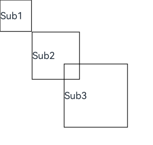
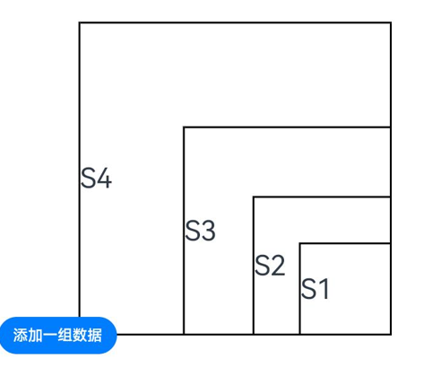

# 自定义组件的生命周期

自定义组件的生命周期回调函数用于通知用户该自定义组件的生命周期，这些回调函数是私有的，在运行时由开发框架在特定的时间进行调用，不能从应用程序中手动调用这些回调函数。

>**说明：**
>
>- 本模块首批接口从API version 7开始支持，后续版本的新增接口，采用上角标单独标记接口的起始版本。
>- 允许在生命周期函数中使用Promise和异步回调函数，比如网络资源获取，定时器设置等。


## aboutToAppear

aboutToAppear?(): void

aboutToAppear函数在创建自定义组件的新实例后，在执行其build()函数之前执行。允许在aboutToAppear函数中改变状态变量，更改将在后续执行build()函数中生效。

从API version 9开始，该接口支持在ArkTS卡片中使用。

## aboutToDisappear

aboutToDisappear?(): void

aboutToDisappear函数在自定义组件析构销毁之前执行。不允许在aboutToDisappear函数中改变状态变量，特别是\@Link变量的修改可能会导致应用程序行为不稳定。

从API version 9开始，该接口支持在ArkTS卡片中使用。

## onPageShow

onPageShow?(): void

页面每次显示时触发一次，包括路由过程、应用进入前台等场景，仅\@Entry装饰的自定义组件生效。


## onPageHide

onPageHide?(): void

页面每次隐藏时触发一次，包括路由过程、应用进入前后台等场景，仅\@Entry装饰的自定义组件生效。


## onBackPress

onBackPress?(): void | boolean

当用户点击返回按钮时触发，仅\@Entry装饰的自定义组件生效。


```ts
// xxx.ets
@Entry
@Component
struct IndexComponent {
  @State textColor: Color = Color.Black;

  onPageShow() {
    this.textColor = Color.Blue;
    console.info('IndexComponent onPageShow');
  }

  onPageHide() {
    this.textColor = Color.Transparent;
    console.info('IndexComponent onPageHide');
  }

  onBackPress() {
    this.textColor = Color.Red;
    console.info('IndexComponent onBackPress');
  }

  build() {
    Column() {
      Text('Hello World')
        .fontColor(this.textColor)
        .fontSize(30)
        .margin(30)
    }.width('100%')
  }
}
```


## onLayout<sup>(deprecated)</sup>

onLayout?(children: Array&lt;LayoutChild&gt;, constraint: ConstraintSizeOptions): void

ArkUI框架会在自定义组件布局时，将该自定义组件的子节点信息和自身的尺寸范围通过onLayout传递给该自定义组件。不允许在onLayout函数中改变状态变量。

该接口从API version 9开始支持，从API version 10开始废弃，推荐使用[onPlaceChildren](#onplacechildren10)替代。

**参数：**

| 参数名        | 类型                                                         | 说明               |
|------------|------------------------------------------------------------|------------------|
| children   | Array&lt;[LayoutChild](#layoutchild(deprecated))&gt;                  | 子组件布局信息。         |
| constraint | [ConstraintSizeOptions](ts-types.md#constraintsizeoptions) | 父组件constraint信息。 |

## onPlaceChildren<sup>10+</sup>

onPlaceChildren?(selfLayoutInfo: GeometryInfo, children: Array&lt;Layoutable&gt, constraint: ConstraintSizeOptions):void

ArkUI框架会在自定义组件布局时，将该自定义组件的子节点自身的尺寸范围通过onPlaceChildren传递给该自定义组件。不允许在onPlaceChildren函数中改变状态变量。

从API version 10开始，该接口支持在ArkTS卡片中使用。

**参数：**

| 参数名            | 类型                                                         | 说明               |
|----------------|------------------------------------------------------------|------------------|
| selfLayoutInfo | [GeometryInfo](#geometryinfo10)                            | 父组件布局信息。         |
| children       | Array&lt;[Layoutable](#layoutable10)&gt;                   | 子组件布局信息。         |
| constraint     | [ConstraintSizeOptions](ts-types.md#constraintsizeoptions) | 父组件constraint信息。 |

## onMeasure<sup>(deprecated)</sup>

onMeasure?(children: Array&lt;LayoutChild&gt;, constraint: ConstraintSizeOptions): void

ArkUI框架会在自定义组件确定尺寸时，将该自定义组件的子节点信息和自身的尺寸范围通过onMeasure传递给该自定义组件。不允许在onMeasure函数中改变状态变量。

该接口从API version 9开始支持，从API version 10开始废弃，推荐使用[onMeasureSize](#onmeasuresize10+)替代。

**参数：**

| 参数名        | 类型                                                         | 说明               |
|------------|------------------------------------------------------------|------------------|
| children   | Array&lt;[LayoutChild](#layoutchild(deprecated))&gt;                  | 子组件布局信息。         |
| constraint | [ConstraintSizeOptions](ts-types.md#constraintsizeoptions) | 父组件constraint信息。 |

## onMeasureSize<sup>10+</sup>

onMeasureSize?(selfLayoutInfo: GeometryInfo, children: Array&lt;Measurable&gt, constraint: ConstraintSizeOptions):MeasureResult

ArkUI框架会在自定义组件确定尺寸时，将该自定义组件的节点信息和尺寸范围通过onMeasureSize传递给该开发者。不允许在onMeasureSize函数中改变状态变量。

从API version 10开始，该接口支持在ArkTS卡片中使用。

**参数：**

| 参数名            | 类型                                                         | 说明               |
|----------------|------------------------------------------------------------|------------------|
| selfLayoutInfo | [GeometryInfo](#geometryinfo10)                            | 父组件布局信息。         |
| children       | Array&lt;[Measurable](#measurable10)&gt;                   | 子组件布局信息。         |
| constraint     | [ConstraintSizeOptions](ts-types.md#constraintsizeoptions) | 父组件constraint信息。 |

## aboutToReuse<sup>10+</sup>

aboutToReuse?(params: { [key: string]: unknown }): void

当一个可复用的自定义组件从复用缓存中重新加入到节点树时，触发aboutToReuse生命周期回调，并将组件的构造参数传递给aboutToReuse。

从API version 10开始，该接口支持在ArkTS卡片中使用。

**参数：**

| 参数名    | 类型                         | 说明         |
|--------|----------------------------|------------|
| params | { [key: string]: unknown } | 自定义组件的构造参数。|

```ts
// xxx.ets
@Entry
@Component
struct Index {
  @State message: string = 'Hello World'
  @State switch: boolean = true

  build() {
    Column() {
      Button(this.message)
        .fontSize(50)
        .fontWeight(FontWeight.Bold)
        .onClick(() => {
          this.switch = !this.switch
        })
      if (this.switch) {
        Child()
      }
    }
    .height("100%")
    .width('100%')
  }
}

@Reusable
@Component
struct Child {
  aboutToReuse(params: Object) {
    console.info("Recycle Child")
  }

  build() {
    Column() {
      Text("Child Component")
        .fontSize(20)
    }
    .borderWidth(2)
    .height(100)
  }
}
```

## LayoutChild<sup>(deprecated)</sup>

子组件布局信息。

从API version 9开始，从API version 10开始废弃，该接口支持在ArkTS卡片中使用。


| 参数         | 参数类型                                                               | 描述                  |
|------------|--------------------------------------------------------------------|---------------------|
| name       | string                                                             | 子组件名称。              |
| id         | string                                                             | 子组件id。              |
| constraint | [ConstraintSizeOptions](ts-types.md#constraintsizeoptions)         | 子组件约束尺寸。            |
| borderInfo | [LayoutBorderInfo](#layoutborderinfo(deprecated))                             | 子组件border信息。        |
| position   | [Position](ts-types.md#position)                                   | 子组件位置坐标。            |
| measure    | (childConstraint:)&nbsp;=&gt;&nbsp;void                            | 调用此方法对子组件的尺寸范围进行限制。 |
| layout     | (LayoutInfo：&nbsp;[LayoutInfo](#layoutinfo(deprecated)))&nbsp;=&gt;&nbsp;void | 调用此方法对子组件的位置信息进行限制。 |

## LayoutBorderInfo<sup>(deprecated)</sup>

子组件border信息。

从API version 9开始，从API version 10开始废弃，该接口支持在ArkTS卡片中使用。

| 参数          | 参数类型                                 | 描述                      |
|-------------|--------------------------------------|-------------------------|
| borderWidth | [EdgeWidths](ts-types.md#edgewidths) | 边框宽度类型，用于描述组件边框不同方向的宽度。 |
| margin      | [Margin](ts-types.md#margin)         | 外边距类型，用于描述组件不同方向的外边距。   |
| padding     | [Padding](ts-types.md#padding)       | 内边距类型，用于描述组件不同方向的内边距。   |

## LayoutInfo<sup>(deprecated)</sup>

子组件layout信息。

从API version 9开始，从API version 10开始废弃，该接口支持在ArkTS卡片中使用。

| 参数         | 参数类型                                                       | 描述       |
|------------|------------------------------------------------------------|----------|
| position   | [Position](ts-types.md#position)                           | 子组件位置坐标。 |
| constraint | [ConstraintSizeOptions](ts-types.md#constraintsizeoptions) | 子组件约束尺寸。 |

```ts
// xxx.ets
@Entry
@Component
struct Index {
  build() {
    Column() {
      CustomLayout() {
        ForEach([1, 2, 3], (index: number) => {
          Text('Sub' + index)
            .fontSize(30)
            .borderWidth(2)
        })
      }
    }
  }
}


@Component
struct CustomLayout {
  @Builder
  doNothingBuilder() {
  };

  @BuilderParam builder: () => void = this.doNothingBuilder;

  onLayout(children: Array<LayoutChild>, constraint: ConstraintSizeOptions) {
    let pos = 0;
    children.forEach((child) => {
      child.layout({ position: { x: pos, y: pos }, constraint: constraint })
      pos += 70;
    })
  }

  onMeasure(children: Array<LayoutChild>, constraint: ConstraintSizeOptions) {
    let size = 100;
    children.forEach((child) => {
      child.measure({ minHeight: size, minWidth: size, maxWidth: size, maxHeight: size })
      size += 50;
    })
  }

  build() {
    this.builder()
  }
}
```



## GeometryInfo<sup>10+</sup>

父组件布局信息。

从API version 10开始支持，该接口支持在ArkTS卡片中使用。

| 参数          | 参数类型      | 描述                  |
|-------------|-----------|---------------------|
| borderWidth | [EdgeWidth](ts-types.md#edgewidths) | 父组件边框宽度。<br>单位：vp            |
| margin      | [Margin](ts-types.md#margin)       | 父组件margin信息。 <br>单位：vp       |
| padding     | [Padding](ts-types.md#padding)   | 父组件padding信息。<br>单位：vp |
| width  | Number | 测量后的宽。<br>单位：vp<br> **说明：** <br>若值为空时，则返回组件的百分比宽。 |
| height | Number | 测量后的高。<br>单位：vp<br> **说明：** <br>若值为空时，则返回组件的百分比高。 |


## Layoutable<sup>10+</sup>

子组件布局信息。

从API version 10开始支持，该接口支持在ArkTS卡片中使用。

| 参数         | 参数类型                                                    | 描述                  |
|------------|---------------------------------------------------------|---------------------|
| measureResult| [MeasureResult](#measureresult10+)      | 子组件测量后的尺寸信息。   <br>单位：vp     |
| layout     | ([Position](ts-types.md#position))&nbsp;=&gt;&nbsp;void | 调用此方法对子组件的位置信息进行限制。 |

## Measurable<sup>10+</sup>

子组件位置信息。

从API version 10开始支持，该接口支持在ArkTS卡片中使用。

| 参数         | 参数类型                                                                             | 描述                                    |
|------------|----------------------------------------------------------------------------------|---------------------------------------|
| measure    | (childConstraint:)&nbsp;=&gt;&nbsp;[MeasureResult](#measureresult10+) | 调用此方法对子组件的尺寸范围进行限制。<br/>返回值：子组件测量后的尺寸。 |

## MeasureResult<sup>10+</sup>

测量后的组件布局信息。

从API version 10开始，该接口支持在ArkTS卡片中使用。

| 参数     | 参数类型   | 描述    |
|--------|--------|-------|
| width  | Number | 测量后的宽。<br>单位：vp |
| height | Number | 测量后的高。<br>单位：vp |


## SizeResult<sup>10+</sup>

组件尺寸信息。

从API version 10开始，该接口支持在ArkTS卡片中使用。

| 参数     | 参数类型   | 描述    |
|--------|--------|-------|
| width  | Number | 测量后的宽。<br>单位：vp |
| height | Number | 测量后的高。<br>单位：vp |

> **说明：**
>
>- 自定义布局暂不支持LazyForEach写法。
>- 使用builder形式的自定义布局创建，自定义组件的build()方法内只允许存在this.builder()，即示例的推荐用法。
>- 子组件设置的位置信息和尺寸信息，优先级小于onMeasureSize设置的尺寸信息和onPlaceChildren设置的位置信息。
>- 使用自定义布局方法时，如未调用子组件的measure和layout方法，将不显示布局。
>- 调用onPlaceChildren后，影响子组件布局位置的部分通用属性将失效，如margin、align等。

```
// xxx.ets
@Entry
@Component
struct Index {
  build() {
    Column() {
      CustomLayout({ builder: ColumnChildren })
    }
  }
}

@Builder
function ColumnChildren() {
  ForEach([1, 2, 3], (index: number) => { //暂不支持lazyForEach的写法
    Text('S' + index)
      .fontSize(30)
      .width(100)
      .height(100)
      .borderWidth(2)
      .offset({ x: 10, y: 20 })
  })
}

@Component
struct CustomLayout {
  @Builder
  doNothingBuilder() {
  };

  @BuilderParam builder: () => void = this.doNothingBuilder;
  @State startSize: number = 100;
  result: SizeResult = {
    width: 0,
    height: 0
  };

  onPlaceChildren(selfLayoutInfo: GeometryInfo, children: Array<Layoutable>, constraint: ConstraintSizeOptions) {
    let startPos = 300;
    children.forEach((child) => {
      let pos = startPos - child.measureResult.height;
      child.layout({ x: pos, y: pos })
    })
  }

  onMeasureSize(selfLayoutInfo: GeometryInfo, children: Array<Measurable>, constraint: ConstraintSizeOptions) {
    let size = 100;
    children.forEach((child) => {
      let result: MeasureResult = child.measure({ minHeight: size, minWidth: size, maxWidth: size, maxHeight: size })
      size += result.width / 2
      ;
    })
    this.result.width = 100;
    this.result.height = 400;
    return this.result;
  }

  build() {
    this.builder()
  }
}
```

