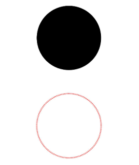

# Circle

圆形绘制组件。

>  **说明：**
>
>  该组件从API Version 7开始支持。后续版本如有新增内容，则采用上角标单独标记该内容的起始版本。


## 权限列表

无


## 子组件

无


## 接口

Circle(options?: {width?: string | number, height?: string | number})

## 参数
| 参数名 | 参数类型 | 必填 | 默认值 | 参数描述 |
| -------- | -------- | -------- | -------- | -------- |
| width | string \| number | 否 | 0 | 宽度。 |
| height | string \| number | 否 | 0 | 高度。 |


## 属性

除支持[通用属性](ts-universal-attributes-size.md)外，还支持以下属性：

| 参数名称 | 参数类型 | 默认值 | 必填 | 参数描述 |
| -------- | -------- | -------- | -------- | -------- |
| fill | [ResourceColor](ts-types.md#resourcecolor8) | Color.Black | 否 | 设置填充区域颜色。 |
| fillOpacity | number&nbsp;\|&nbsp;string&nbsp;\|&nbsp;[Resource](ts-types.md#resource) | 1 | 否 | 设置填充区域透明度。 |
| stroke | [ResourceColor](ts-types.md#resourcecolor8) | - | 否 | 设置边框颜色，不设置时，默认没有边框。 |
| strokeDashArray | Array&lt;Length&gt; | [] | 否 | 设置边框间隙。 |
| strokeDashOffset | number&nbsp;\|&nbsp;string | 0 | 否 | 边框绘制起点的偏移量。 |
| strokeLineCap | [LineCapStyle](ts-appendix-enums.md#linecapstyle) | LineCapStyle.Butt | 否 | 设置边框端点绘制样式。 |
| strokeLineJoin | [LineJoinStyle](ts-appendix-enums.md#linejoinstyle) | LineJoinStyle.Miter | 否 | 设置边框拐角绘制样式。 |
| strokeMiterLimit | number&nbsp;\|&nbsp;string | 4 | 否 | 设置锐角绘制成斜角的极限值。 |
| strokeOpacity | number&nbsp;\|&nbsp;string&nbsp;\|&nbsp;[Resource](ts-types.md#resource) | 1 | 否 | 设置边框透明度。 |
| strokeWidth | Length | 1 | 否 | 设置边框宽度。 |
| antiAlias | boolean | true | 否 | 是否开启抗锯齿效果。 |


## 示例

```ts
// xxx.ets
@Entry
@Component
struct CircleExample {
  build() {
    Column({ space: 10 }) {
      // 绘制一个直径为150的圆
      Circle({ width: 150, height: 150 })
      // 绘制一个直径为150、线条为红色虚线的圆环（宽高设置不一致时以短边为直径）
      Circle()
        .width(150)
        .height(200)
        .fillOpacity(0)
        .strokeWidth(3)
        .stroke(Color.Red)
        .strokeDashArray([1, 2])
    }.width('100%')
  }
}
```


