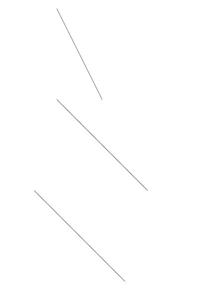

# Line

>  **说明：**
> 该组件从API Version 7开始支持。后续版本如有新增内容，则采用上角标单独标记该内容的起始版本。


直线绘制组件。


## 权限列表

无


## 子组件

无


## 接口

Line(options?: {width: Length, height: Length})

- 参数
  | 参数名 | 参数类型 | 必填 | 默认值 | 参数描述 |
  | -------- | -------- | -------- | -------- | -------- |
  | options | Object | 否 | - | 见options参数说明。 |

- options参数说明
  | 参数名 | 参数类型 | 必填 | 默认值 | 参数描述 | 
  | -------- | -------- | -------- | -------- | -------- |
  | width | Length | 是 | - | 宽度。 | 
  | height | Length | 是 | - | 高度。 | 


## 属性

| 参数名称 | 参数类型 | 默认值 | 必填 | 参数描述 | 
| -------- | -------- | -------- | -------- | -------- |
| width | Length | 0 | 否 | 直线所在矩形的宽度。 | 
| height | Length | 0 | 否 | 直线所在矩形的高度。 | 
| startPoint | Point | [0,&nbsp;0] | 是 | 直线起点坐标(相对坐标)。 | 
| endPoint | Point | [0,&nbsp;0] | 是 | 直线终点坐标(相对坐标)。 | 


## 示例

```ts
// xxx.ets
@Entry
@Component
struct LineExample {
  build() {
    Column() {
      Line({ width: 50, height: 100 }).startPoint([0, 0]).endPoint([50, 100])
      Line().width(200).height(200).startPoint([50, 50]).endPoint([150, 150])
    }.margin({ top: 5 })
  }
}
```


