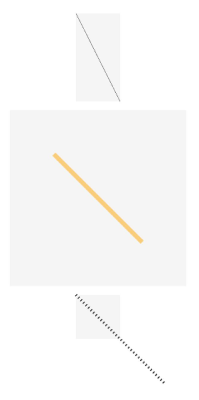
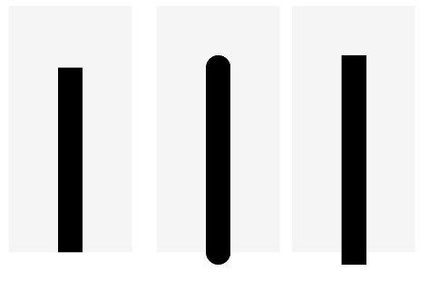
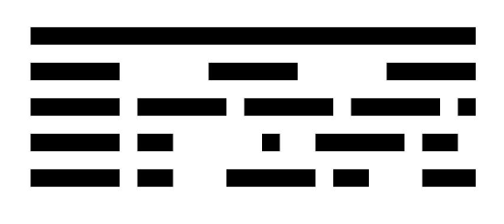

# Line

直线绘制组件。

>  **说明：**
>
>  该组件从API Version 7开始支持。后续版本如有新增内容，则采用上角标单独标记该内容的起始版本。


## 权限列表

无


## 子组件

无


## 接口

Line(options?: {width?: string | number, height?: string | number})

**参数：**

| 参数名 | 参数类型 | 必填 | 默认值 | 参数描述 |
| -------- | -------- | -------- | -------- | -------- |
| width | string \| number | 否 | 0 | 宽度。 |
| height | string \| number | 否 | 0 | 高度。 |


## 属性

除支持[通用属性](ts-universal-attributes-size.md)外，还支持以下属性：

| 名称 | 类型 | 默认值 | 描述 |
| -------- | -------- | -------- | -------- |
| startPoint | Array | [0,&nbsp;0] | 直线起点坐标点(相对坐标)。 |
| endPoint   | Array | [0,&nbsp;0] | 直线终点坐标点(相对坐标)。 |
| fill | [ResourceColor](ts-types.md#resourcecolor8) | Color.Black | 设置填充区域颜色。<br/>**说明：**<br/>Line组件无法形成闭合区域，该属性设置无效。 |
| fillOpacity | number&nbsp;\|&nbsp;string&nbsp;\|&nbsp;[Resource](ts-types.md#resource) | 1 | 设置填充区域透明度。<br/>**说明：**<br/>Line组件无法形成闭合区域，该属性设置无效。 |
| stroke | [ResourceColor](ts-types.md#resourcecolor8) | Color.Black | 设置线条颜色。 |
| strokeDashArray | Array&lt;Length&gt; | [] | 设置线条间隙。 |
| strokeDashOffset | number&nbsp;\|&nbsp;string | 0 | 线条绘制起点的偏移量。 |
| strokeLineCap | [LineCapStyle](ts-appendix-enums.md#linecapstyle) | LineCapStyle.Butt | 设置线条端点绘制样式。 |
| strokeLineJoin | [LineJoinStyle](ts-appendix-enums.md#linejoinstyle) | LineJoinStyle.Miter | 设置线条拐角绘制样式。 |
| strokeMiterLimit | number&nbsp;\|&nbsp;string | 4 | 设置锐角绘制成斜角的极限值。<br/>**说明：**<br/>Line组件无法设置锐角图形，该属性设置无效。 |
| strokeOpacity | number&nbsp;\|&nbsp;string&nbsp;\|&nbsp;[Resource](ts-types.md#resource) | 1 | 设置线条透明度。 |
| strokeWidth | Length | 1 | 设置线条宽度。 |
| antiAlias | boolean | true | 是否开启抗锯齿效果。 |

## 示例

### 示例1

```ts
// xxx.ets
@Entry
@Component
struct LineExample {
  build() {
    Column({ space: 10 }) {
      // 线条绘制的起止点坐标均是相对于Line组件本身绘制区域的坐标
      Line()
        .startPoint([0, 0])
        .endPoint([50, 100])
        .backgroundColor('#F5F5F5')
      Line()
        .width(200)
        .height(200)
        .startPoint([50, 50])
        .endPoint([150, 150])
        .strokeWidth(5)
        .stroke(Color.Orange)
        .strokeOpacity(0.5)
        .backgroundColor('#F5F5F5')
      // 当坐标点设置的值超出Line组件的宽高范围时，线条会画出组件绘制区域
      Line({ width: 50, height: 50 })
        .startPoint([0, 0])
        .endPoint([100, 100])
        .strokeWidth(3)
        .strokeDashArray([10, 3])
        .backgroundColor('#F5F5F5')
      // strokeDashOffset用于定义关联虚线strokeDashArray数组渲染时的偏移
      Line({ width: 50, height: 50 })
        .startPoint([0, 0])
        .endPoint([100, 100])
        .strokeWidth(3)
        .strokeDashArray([10, 3])
        .strokeDashOffset(5)
        .backgroundColor('#F5F5F5')
    }
  }
}
```



### 示例2

```ts
// xxx.ets
@Entry
@Component
struct LineExample1 {
  build() {
    Row({ space: 10 }) {
      // 当LineCapStyle值为Butt时
      Line()
        .width(100)
        .height(200)
        .startPoint([50, 50])
        .endPoint([50, 200])
        .strokeWidth(20)
        .strokeLineCap(LineCapStyle.Butt)
        .backgroundColor('#F5F5F5').margin(10)
      // 当LineCapStyle值为Round时
      Line()
        .width(100)
        .height(200)
        .startPoint([50, 50])
        .endPoint([50, 200])
        .strokeWidth(20)
        .strokeLineCap(LineCapStyle.Round)
        .backgroundColor('#F5F5F5')
      // 当LineCapStyle值为Square时
      Line()
        .width(100)
        .height(200)
        .startPoint([50, 50])
        .endPoint([50, 200])
        .strokeWidth(20)
        .strokeLineCap(LineCapStyle.Square)
        .backgroundColor('#F5F5F5')
    }
  }
}
```



### 示例3

```ts
// xxx.ets
@Entry
@Component
struct LineExample {
  build() {
    Column() {
      Line()
        .startPoint([50, 30])
        .endPoint([300, 30])
        .strokeWidth(10)
      // 设置strokeDashArray的数组间隔为 50
      Line()
        .startPoint([50, 20])
        .endPoint([300, 20])
        .strokeWidth(10)
        .strokeDashArray([50])
      // 设置strokeDashArray的数组间隔为 50, 10
      Line()
        .startPoint([50, 20])
        .endPoint([300, 20])
        .strokeWidth(10)
        .strokeDashArray([50, 10])
      // 设置strokeDashArray的数组间隔为 50, 10, 20
      Line()
        .startPoint([50, 20])
        .endPoint([300, 20])
        .strokeWidth(10)
        .strokeDashArray([50, 10, 20])
      // 设置strokeDashArray的数组间隔为 50, 10, 20, 30
      Line()
        .startPoint([50, 20])
        .endPoint([300, 20])
        .strokeWidth(10)
        .strokeDashArray([50, 10, 20, 30])

    }
  }
}
```

