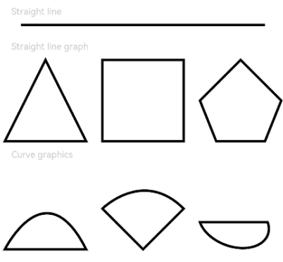

# Path

> **说明：**
>
> 该组件从API Version 7开始支持。后续版本如有新增内容，则采用上角标单独标记该内容的起始版本。


路径绘制组件。


## 子组件

无

## 接口

Path(value?: { width?: number | string; height?: number | string; commands?: string })

**参数：**

| 参数名   | 参数类型 | 必填 | 默认值 | 参数描述             |
| -------- | -------- | ---- | ------ | -------------------- |
| width    | number \| string   | 否   | 0      | 路径所在矩形的宽度   |
| height   | number \| string   | 否   | 0      | 路径所在矩形的高度   |
| commands | string   | 否   | ''  | 路径绘制的命令字符串 |


## 属性

除支持[通用属性](ts-universal-attributes-size.md)外，还支持以下属性：

| 名称     | 类型                                | 默认值  | 描述                                     |
| -------- | ----------------------------------- | ---- | ---------------------------------------- |
| commands | string                              | ''   | 路径绘制的命令字符串，单位为px。像素单位转换方法请参考[像素单位转换](../../ui/ts-pixel-units.md)。 |
| fill | [ResourceColor](ts-types.md#resourcecolor8) | Color.Black | 设置填充区域颜色。 |
| fillOpacity | number&nbsp;\|&nbsp;string&nbsp;\|&nbsp;[Resource](ts-types.md#resource) | 1 | 设置填充区域透明度。 |
| stroke | [ResourceColor](ts-types.md#resourcecolor8) | - | 设置线条颜色。 |
| strokeDashArray | Array&lt;Length&gt; | [] | 设置线条间隙。 |
| strokeDashOffset | number&nbsp;\|&nbsp;string | 0 | 线条绘制起点的偏移量。 |
| strokeLineCap | [LineCapStyle](ts-appendix-enums.md#linecapstyle) | LineCapStyle.Butt | 设置线条端点绘制样式。 |
| strokeLineJoin | [LineJoinStyle](ts-appendix-enums.md#linejoinstyle) | LineJoinStyle.Miter | 设置线条拐角绘制样式。 |
| strokeMiterLimit | number&nbsp;\|&nbsp;string | 4 | 设置锐角绘制成斜角的极限值。 |
| strokeOpacity | number&nbsp;\|&nbsp;string&nbsp;\|&nbsp;[Resource](ts-types.md#resource) | 1 | 设置线条透明度。 |
| strokeWidth | Length | 1 | 设置线条宽度。 |
| antiAlias | boolean | true | 是否开启抗锯齿效果。 |


commands支持的绘制命令如下：

| 命令   | 名称                               | 参数                                       | 说明                                       |
| ---- | -------------------------------- | ---------------------------------------- | ---------------------------------------- |
| M    | moveto                           | （x y）                                    | 在给定的 (x, y) 坐标处开始一个新的子路径。例如，`M 0 0` 表示将（0, 0）点作为新子路径的起始点。 |
| L    | lineto                           | （x y）                                    | 从当前点到给定的 (x, y) 坐标画一条线，该坐标成为新的当前点。例如，`L 50 50` 表示绘制当前点到（50, 50）点的直线，并将（50, 50）点作为新子路径的起始点。 |
| H    | horizontal lineto                | x                                        | 从当前点绘制一条水平线，等效于将y坐标指定为0的L命令。例如，`H 50 ` 表示绘制当前点到（50, 0）点的直线，并将（50, 0）点作为新子路径的起始点。 |
| V    | vertical lineto                  | y                                        | 从当前点绘制一条垂直线，等效于将x坐标指定为0的L命令。例如，`V 50 ` 表示绘制当前点到（0, 50）点的直线，并将（0, 50）点作为新子路径的起始点。 |
| C    | curveto                          | (x1 y1 x2 y2 x y)                        | 使用 (x1, y1) 作为曲线起点的控制点， (x2, y2) 作为曲线终点的控制点，从当前点到 (x, y) 绘制三次贝塞尔曲线。例如，`C100 100 250 100 250 200 ` 表示绘制当前点到（250, 200）点的三次贝塞尔曲线，并将（250, 200）点作为新子路径的起始点。 |
| S    | smooth curveto                   | (x2 y2 x y)                              | (x2, y2) 作为曲线终点的控制点，绘制从当前点到 (x, y) 绘制三次贝塞尔曲线。若前一个命令是C或S，则起点控制点是上一个命令的终点控制点相对于起点的映射。 例如，`C100 100 250 100 250 200 S400 300 400 200`第二段贝塞尔曲线的起点控制点为（250, 300）。如果没有前一个命令或者前一个命令不是 C或S，则第一个控制点与当前点重合。 |
| Q    | quadratic Belzier curve          | (x1 y1 x y)                              | 使用 (x1, y1) 作为控制点，从当前点到 (x, y) 绘制二次贝塞尔曲线。例如，`Q400 50 600 300 ` 表示绘制当前点到（600, 300）点的二次贝塞尔曲线，并将（600, 300）点作为新子路径的起始点。 |
| T    | smooth quadratic Belzier curveto | (x y)                                    | 绘制从当前点到 (x, y) 绘制二次贝塞尔曲线。若前一个命令是Q或T，则控制点是上一个命令的终点控制点相对于起点的映射。 例如，`Q400 50 600 300 T1000 300`第二段贝塞尔曲线的控制点为（800, 350）。 如果没有前一个命令或者前一个命令不是 Q或T，则第一个控制点与当前点重合。 |
| A    | elliptical Arc                   | (rx ry x-axis-rotation large-arc-flag sweep-flag x y) | 从当前点到 (x, y) 绘制一条椭圆弧。椭圆的大小和方向由两个半径 (rx, ry) 和x-axis-rotation定义，指示整个椭圆相对于当前坐标系如何旋转（以度为单位）。 large-arc-flag 和 sweep-flag确定弧的绘制方式。 |
| Z    | closepath                        | none                                     | 通过将当前路径连接回当前子路径的初始点来关闭当前子路径。             |

例如： commands('M0 20 L50 50 L50 100 Z')定义了一个三角形，起始于位置（0，20），接着绘制点（0，20）到点（50，50）的直线，再绘制点（50，50）到点（50，100）的直线，最后绘制点（50，100）到（0，20）的直线关闭路径，形成封闭三角形。


## 示例

```ts
// xxx.ets
@Entry
@Component
struct PathExample {
  build() {
    Column({ space: 10 }) {
      Text('Straight line')
        .fontSize(11)
        .fontColor(0xCCCCCC)
        .width('90%')
      // 绘制一条长900px，宽3vp的直线
      Path()
        .width(300)
        .height(10)
        .commands('M0 0 L900 0')
        .stroke(Color.Black)
        .strokeWidth(3)

      Text('Straight line graph')
        .fontSize(11)
        .fontColor(0xCCCCCC)
        .width('90%')
      // 绘制直线图形
      Row({ space: 20 }) {
        Path()
          .width(100)
          .height(100)
          .commands('M150 0 L300 300 L0 300 Z')
          .fillOpacity(0)
          .stroke(Color.Black)
          .strokeWidth(3)
        Path()
          .width(100)
          .height(100)
          .commands('M0 0 H300 V300 H0 Z')
          .fillOpacity(0)
          .stroke(Color.Black)
          .strokeWidth(3)
        Path()
          .width(100)
          .height(100)
          .commands('M150 0 L0 150 L60 300 L240 300 L300 150 Z')
          .fillOpacity(0)
          .stroke(Color.Black)
          .strokeWidth(3)
      }.width('100%')

      Text('Curve graphics').fontSize(11).fontColor(0xCCCCCC).width('90%')
      // 绘制弧线图形
      Row({ space: 20 }) {
        Path()
          .width(100)
          .height(100)
          .commands("M0 300 S150 0 300 300 Z")
          .fillOpacity(0)
          .stroke(Color.Black)
          .strokeWidth(3)
        Path()
          .width(100)
          .height(100)
          .commands('M0 150 C0 150 150 0 300 150 L150 300 Z')
          .fillOpacity(0)
          .stroke(Color.Black)
          .strokeWidth(3)
        Path()
          .width(100)
          .height(100)
          .commands('M0 200 A30 20 20 0 0 250 200 Z')
          .fillOpacity(0)
          .stroke(Color.Black)
          .strokeWidth(3)
      }
    }.width('100%')
    .margin({ top: 5 })
  }
}
```


