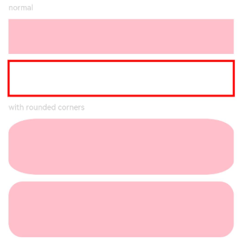

# Rect

矩形绘制组件。

>  **说明：**
>
>  该组件从API Version 7开始支持。后续版本如有新增内容，则采用上角标单独标记该内容的起始版本。


## 子组件

无


## 接口

Rect(value?: {width?: string | number,height?: string | number,radius?: string | number | Array&lt;string | number&gt;} |
  {width?: string | number,height?: string | number,radiusWidth?: string | number,radiusHeight?: string | number})

**参数：**

| 参数名 | 参数类型 | 必填 | 默认值 | 参数描述 |
| -------- | -------- | -------- | -------- | -------- |
| width | string&nbsp;\|&nbsp;number | 否 | 0 | 宽度。 |
| height | string&nbsp;\|&nbsp;number | 否 | 0 | 高度。 |
| radius | string&nbsp;\|&nbsp;number&nbsp;\|&nbsp;Array&lt;string&nbsp;\|&nbsp;number&gt; | 否 | 0 | 圆角半径，支持分别设置四个角的圆角度数。 |
| radiusWidth | string&nbsp;\|&nbsp;number | 否 | 0 | 圆角宽度。 |
| radiusHeight | string&nbsp;\|&nbsp;number | 否 | 0 | 圆角高度。 |


## 属性

除支持[通用属性](ts-universal-attributes-size.md)外，还支持以下属性：

| 参数名称 | 参数类型 | 默认值 | 必填 | 参数描述 |
| -------- | -------- | -------- | -------- | -------- |
| radiusWidth | string&nbsp;\|&nbsp;number | 0 | 否 | 圆角的宽度，仅设置宽时宽高一致。 |
| radiusHeight | string&nbsp;\|&nbsp;number | 0 | 否 | 圆角的高度，仅设置高时宽高一致。 |
| radius | string&nbsp;\|&nbsp;number&nbsp;\|&nbsp;Array&lt;string&nbsp;\|&nbsp;number&gt; | 0 | 否 | 圆角半径大小。 |
| fill | [ResourceColor](ts-types.md) | Color.Black | 否 | 设置填充区域颜色。 |
| fillOpacity | number&nbsp;\|&nbsp;string&nbsp;\|&nbsp;[Resource](ts-types.md#resource类型) | 1 | 否 | 设置填充区域透明度。 |
| stroke | [ResourceColor](ts-types.md) | - | 否 | 设置边框颜色，不设置时，默认没有边框。 |
| strokeDashArray | Array&lt;Length&gt; | [] | 否 | 设置边框间隙。 |
| strokeDashOffset | number&nbsp;\|&nbsp;string | 0 | 否 | 边框绘制起点的偏移量。 |
| strokeLineCap | [LineCapStyle](ts-appendix-enums.md#linecapstyle) | LineCapStyle.Butt | 否 | 设置边框端点绘制样式。 |
| strokeLineJoin | [LineJoinStyle](ts-appendix-enums.md#linejoinstyle) | LineJoinStyle.Miter | 否 | 设置边框拐角绘制样式。 |
| strokeMiterLimit | number&nbsp;\|&nbsp;string | 4 | 否 | 设置锐角绘制成斜角的极限值。 |
| strokeOpacity | number&nbsp;\|&nbsp;string&nbsp;\|&nbsp;[Resource](ts-types.md#resource类型) | 1 | 否 | 设置边框透明度。 |
| strokeWidth | Length | 1 | 否 | 设置边框宽度。 |
| antiAlias | boolean | true | 否 | 是否开启抗锯齿效果。 |


## 示例

```ts
// xxx.ets
@Entry
@Component
struct RectExample {
  build() {
    Column({ space: 10 }) {
      Text('normal').fontSize(11).fontColor(0xCCCCCC).width('90%')
      // 绘制90% * 50的矩形
      Column({ space: 5 }) {
        Text('normal').fontSize(9).fontColor(0xCCCCCC).width('90%')
        // 绘制90% * 50矩形
        Rect({ width: '90%', height: 50 })
          .fill(Color.Pink)
        // 绘制90% * 50的矩形框
        Rect()
          .width('90%')
          .height(50)
          .fillOpacity(0)
          .stroke(Color.Red)
          .strokeWidth(3)

        Text('with rounded corners').fontSize(11).fontColor(0xCCCCCC).width('90%')
        // 绘制90% * 80的矩形, 圆角宽高分别为40、20
        Rect({ width: '90%', height: 80 })
          .radiusHeight(20)
          .radiusWidth(40)
          .fill(Color.Pink)
        // 绘制90% * 80的矩形, 圆角宽高为20
        Rect({ width: '90%', height: 80 })
          .radius(20)
          .fill(Color.Pink)
      }.width('100%').margin({ top: 10 })
      // 绘制90% * 50矩形, 左上圆角宽高40,右上圆角宽高20,右下圆角宽高40,左下圆角宽高20
      Rect({ width: '90%', height: 80 })
        .radius([[40, 40], [20, 20], [40, 40], [20, 20]])
        .fill(Color.Pink)
    }.width('100%').margin({ top: 5 })
  }
}
```


