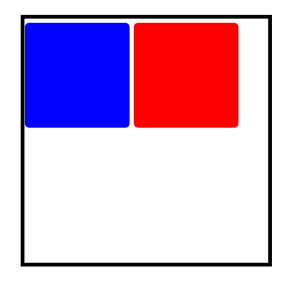
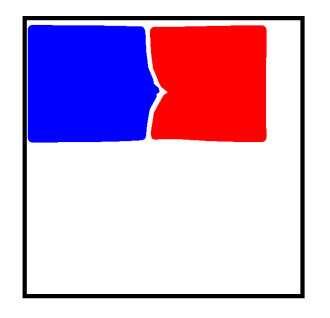

# Shape

绘制组件的父组件，父组件中会描述所有绘制组件均支持的通用属性。


1、绘制组件使用Shape作为父组件，实现类似SVG的效果。

2、绘制组件单独使用，用于在页面上绘制指定的图形。

>  **说明：**
>
>  该组件从API Version 7开始支持。后续版本如有新增内容，则采用上角标单独标记该内容的起始版本。


## 子组件

包含[Rect](ts-drawing-components-rect.md)、[Path](ts-drawing-components-path.md)、[Circle](ts-drawing-components-circle.md)、[Ellipse](ts-drawing-components-ellipse.md)、[Polyline](ts-drawing-components-polyline.md)、[Polygon](ts-drawing-components-polygon.md)、[Image](ts-basic-components-image.md)、[Text](ts-basic-components-text.md)、[Column](ts-container-column.md)、[Row](ts-container-row.md)子组件。


## 接口

Shape(value?: PixelMap)

**参数：**

| 参数名 | 参数类型 | 必填 | 默认值 | 参数描述 |
| -------- | -------- | -------- | -------- | -------- |
| value | [PixelMap](../apis/js-apis-image.md#pixelmap7) | 否 | - | 绘制目标，可将图形绘制在指定的PixelMap对象中，若未设置，则在当前绘制目标中进行绘制。 |


## 属性

除支持[通用属性](ts-universal-attributes-size.md)外，还支持以下属性：

| 名称 | 类型 | 默认值 | 描述 |
| -------- | -------- | -------- | -------- |
| viewPort | {<br/>x?:&nbsp;number \| string,<br/>y?:&nbsp;number \| string,<br/>width?:&nbsp;number \| string,<br/>height?:&nbsp;number \| string<br/>} | { x:0, y:0, width:0, height:0 } | 形状的视口。 |
| fill | [ResourceColor](ts-types.md) | Color.Black | 设置填充区域颜色。 |
| fillOpacity | number&nbsp;\|&nbsp;string&nbsp;\|&nbsp;[Resource](ts-types.md#resource类型) | 1 | 设置填充区域透明度。 |
| stroke | [ResourceColor](ts-types.md) | - | 设置边框颜色，不设置时，默认没有边框线条。 |
| strokeDashArray | Array&lt;Length&gt; | [] | 设置边框间隙。 |
| strokeDashOffset | number&nbsp;\|&nbsp;string | 0 | 边框绘制起点的偏移量。 |
| strokeLineCap | [LineCapStyle](ts-appendix-enums.md#linecapstyle) | LineCapStyle.Butt | 设置边框端点绘制样式。 |
| strokeLineJoin | [LineJoinStyle](ts-appendix-enums.md#linejoinstyle) | LineJoinStyle.Miter | 设置边框拐角绘制样式。 |
| strokeMiterLimit | number&nbsp;\|&nbsp;string | 4 | 设置锐角绘制成斜角的极限值。 |
| strokeOpacity | number&nbsp;\|&nbsp;string&nbsp;\|&nbsp;[Resource](ts-types.md#resource类型) | 1 | 设置边框透明度。<br/>**说明：**<br/>该属性的取值范围是[0.0, 1.0]，若给定值小于0.0，则取值为0.0；若给定值大于1.0，则取值为1.0。 |
| strokeWidth | number&nbsp;\|&nbsp;string | 1 | 设置边框宽度。 |
| antiAlias | boolean | true | 是否开启抗锯齿效果。 |
| mesh<sup>8+</sup> | Array&lt;number&gt;,number,number | [],0,0 | 设置mesh效果。第一个参数为长度（column + 1）* （row + 1）* 2的数组，它记录了扭曲后的位图各个顶点位置，第二个参数为mesh矩阵列数column，第三个参数为mesh矩阵行数row。 |

## 示例

### 示例1

```ts
// xxx.ets
@Entry
@Component
struct ShapeExample {
  build() {
    Column({ space: 10 }) {
      Text('basic').fontSize(11).fontColor(0xCCCCCC).width(320)
      // 在Shape的(-2, -2)点绘制一个 300 * 50 带边框的矩形,颜色0x317AF7,边框颜色黑色,边框宽度4,边框间隙20,向左偏移10,线条两端样式为半圆,拐角样式圆角,抗锯齿(默认开启)
      // 在Shape的(-2, 58)点绘制一个 300 * 50 带边框的椭圆,颜色0x317AF7,边框颜色黑色,边框宽度4,边框间隙20,向左偏移10,线条两端样式为半圆,拐角样式圆角,抗锯齿(默认开启)
      // 在Shape的(-2, 118)点绘制一个 300 * 10 直线路径,颜色0x317AF7,边框颜色黑色,宽度4,间隙20,向左偏移10,线条两端样式为半圆,拐角样式圆角,抗锯齿(默认开启)
      Shape() {
        Rect().width(300).height(50)
        Ellipse().width(300).height(50).offset({ x: 0, y: 60 })
        Path().width(300).height(10).commands('M0 0 L900 0').offset({ x: 0, y: 120 })
      }
      .viewPort({ x: -2, y: -2, width: 304, height: 130 })
      .fill(0x317AF7)
      .stroke(Color.Black)
      .strokeWidth(4)
      .strokeDashArray([20])
      .strokeDashOffset(10)
      .strokeLineCap(LineCapStyle.Round)
      .strokeLineJoin(LineJoinStyle.Round)
      .antiAlias(true)
      // 分别在Shape的(0, 0)、(-5, -5)点绘制一个 300 * 50 带边框的矩形,可以看出之所以将视口的起始位置坐标设为负值是因为绘制的起点默认为线宽的中点位置，因此要让边框完全显示则需要让视口偏移半个线宽
      Shape() {
        Rect().width(300).height(50)
      }
      .viewPort({ x: 0, y: 0, width: 320, height: 70 })
      .fill(0x317AF7)
      .stroke(Color.Black)
      .strokeWidth(10)

      Shape() {
        Rect().width(300).height(50)
      }
      .viewPort({ x: -5, y: -5, width: 320, height: 70 })
      .fill(0x317AF7)
      .stroke(Color.Black)
      .strokeWidth(10)

      Text('path').fontSize(11).fontColor(0xCCCCCC).width(320)
      // 在Shape的(0, -5)点绘制一条直线路径,颜色0xEE8443,线条宽度10,线条间隙20
      Shape() {
        Path().width(300).height(10).commands('M0 0 L900 0')
      }
      .viewPort({ x: 0, y: -5, width: 300, height: 20 })
      .stroke(0xEE8443)
      .strokeWidth(10)
      .strokeDashArray([20])
      // 在Shape的(0, -5)点绘制一条直线路径,颜色0xEE8443,线条宽度10,线条间隙20,向左偏移10
      Shape() {
        Path().width(300).height(10).commands('M0 0 L900 0')
      }
      .viewPort({ x: 0, y: -5, width: 300, height: 20 })
      .stroke(0xEE8443)
      .strokeWidth(10)
      .strokeDashArray([20])
      .strokeDashOffset(10)
      // 在Shape的(0, -5)点绘制一条直线路径,颜色0xEE8443,线条宽度10,透明度0.5
      Shape() {
        Path().width(300).height(10).commands('M0 0 L900 0')
      }
      .viewPort({ x: 0, y: -5, width: 300, height: 20 })
      .stroke(0xEE8443)
      .strokeWidth(10)
      .strokeOpacity(0.5)
      // 在Shape的(0, -5)点绘制一条直线路径,颜色0xEE8443,线条宽度10,线条间隙20,线条两端样式为半圆
      Shape() {
        Path().width(300).height(10).commands('M0 0 L900 0')
      }
      .viewPort({ x: 0, y: -5, width: 300, height: 20 })
      .stroke(0xEE8443)
      .strokeWidth(10)
      .strokeDashArray([20])
      .strokeLineCap(LineCapStyle.Round)
      // 在Shape的(-80, -5)点绘制一个封闭路径,颜色0x317AF7,线条宽度10,边框颜色0xEE8443,拐角样式锐角（默认值）
      Shape() {
        Path().width(200).height(60).commands('M0 0 L400 0 L400 150 Z')
      }
      .viewPort({ x: -80, y: -5, width: 310, height: 90 })
      .fill(0x317AF7)
      .stroke(0xEE8443)
      .strokeWidth(10)
      .strokeLineJoin(LineJoinStyle.Miter)
      .strokeMiterLimit(5)
    }.width('100%').margin({ top: 15 })
  }
}
```


### 示例2

```ts
// xxx.ets
@Entry
@Component
struct ShapeMeshExample {
  @State columnVal: number = 0
  @State rowVal: number = 0
  @State count: number = 0
  @State verts: Array<number> = []
  @State shapeWidth: number = 600
  @State shapeHeight: number = 600

  build() {
    Column() {
      Shape() {
        Rect()
          .width('250px')
          .height('250px')
          .radiusWidth('10px')
          .radiusHeight('10px')
          .stroke('10px')
          .margin({ left: '10px', top: '10px' })
          .strokeWidth('10px')
          .fill(Color.Blue)
        Rect()
          .width('250px')
          .height('250px')
          .radiusWidth('10px')
          .radiusHeight('10px')
          .stroke('10px')
          .margin({ left: '270px', top: '10px' })
          .strokeWidth('10px')
          .fill(Color.Red)
      }
      .mesh(this.verts, this.columnVal, this.rowVal)
      .width(this.shapeWidth + 'px')
      .height(this.shapeHeight + 'px')
      // 手指触摸Shape组件时会显示mesh扭曲效果
      .onTouch((event: TouchEvent) => {
        var touchX = event.touches[0].x * 2
        var touchY = event.touches[0].y * 2
        this.columnVal = 20
        this.rowVal = 20
        this.count = (this.columnVal + 1) * (this.rowVal + 1)
        var orig = [this.count * 2]
        var index = 0
        for (var i = 0; i <= this.rowVal; i++) {
          var fy = this.shapeWidth * i / this.rowVal
          for (var j = 0; j <= this.columnVal; j++) {
            var fx = this.shapeWidth * j / this.columnVal
            orig[index * 2 + 0] = this.verts[index * 2 + 0] = fx
            orig[index * 2 + 1] = this.verts[index * 2 + 1] = fy
            index++;
          }
        }
        for (var k = 0; k < this.count * 2; k += 2) {
          var dx = touchX - orig[k + 0]
          var dy = touchY - orig[k + 1]
          var dd = dx * dx + dy * dy
          var d = Math.sqrt(dd)
          var pull = 80000 / (dd * d)
          if (pull >= 1) {
            this.verts[k + 0] = touchX
            this.verts[k + 1] = touchY
          } else {
            this.verts[k + 0] = orig[k + 0] + dx * pull
            this.verts[k + 1] = orig[k + 1] + dy * pull
          }
        }
      })
    }
    .width('600px')
    .height('600px')
    .border({ width: 3, color: Color.Black })
  }
}
```

示意图：



手指触摸Shape组件时会显示mesh扭曲效果：

