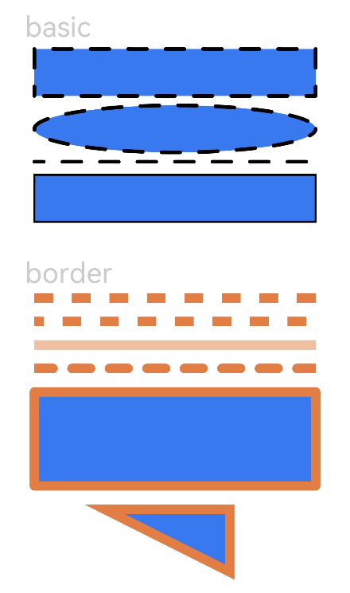

# Shape<a name="ZH-CN_TOPIC_0000001237555097"></a>

> **说明：** 
>该组件从API Version 7开始支持。后续版本如有新增内容，则采用上角标单独标记该内容的起始版本。

绘制组件的父组件，父组件中会描述所有绘制组件均支持的通用属性。

1、绘制组件使用Shape作为父组件，实现类似SVG的效果。

2、绘制组件单独使用，用于在页面上绘制指定的图形。

## 权限列表<a name="section53281531154915"></a>

无

## 子组件<a name="section5989144051714"></a>

可以包含子组件。

## 接口<a name="section5143192918416"></a>

Shape\(value:\{target?: PixelMap\}\)

-   参数

    <table><thead align="left"><tr><th class="cellrowborder" valign="top" width="15.47%" id="mcps1.1.6.1.1"><p>参数名</p>
    </th>
    <th class="cellrowborder" valign="top" width="17.22%" id="mcps1.1.6.1.2"><p>参数类型</p>
    </th>
    <th class="cellrowborder" valign="top" width="12.49%" id="mcps1.1.6.1.3"><p>必填</p>
    </th>
    <th class="cellrowborder" valign="top" width="18.6%" id="mcps1.1.6.1.4"><p>默认值</p>
    </th>
    <th class="cellrowborder" valign="top" width="36.22%" id="mcps1.1.6.1.5"><p>参数描述</p>
    </th>
    </tr>
    </thead>
    <tbody><tr><td class="cellrowborder" valign="top" width="15.47%" headers="mcps1.1.6.1.1 "><p>target</p>
    </td>
    <td class="cellrowborder" valign="top" width="17.22%" headers="mcps1.1.6.1.2 "><p>PixelMap</p>
    </td>
    <td class="cellrowborder" valign="top" width="12.49%" headers="mcps1.1.6.1.3 "><p>否</p>
    </td>
    <td class="cellrowborder" valign="top" width="18.6%" headers="mcps1.1.6.1.4 "><p>null</p>
    </td>
    <td class="cellrowborder" valign="top" width="36.22%" headers="mcps1.1.6.1.5 "><p>绘制目标，可将图形绘制在指定的PixelMap对象中，若未设置，则在当前绘制目标中进行绘制。</p>
    </td>
    </tr>
    </tbody>
    </table>


## 属性<a name="section922483920810"></a>

<table><thead align="left"><tr><th class="cellrowborder" valign="top" width="20%" id="mcps1.1.6.1.1"><p>参数名称</p>
</th>
<th class="cellrowborder" valign="top" width="20%" id="mcps1.1.6.1.2"><p>参数类型</p>
</th>
<th class="cellrowborder" valign="top" width="20%" id="mcps1.1.6.1.3"><p>默认值</p>
</th>
<th class="cellrowborder" valign="top" width="20%" id="mcps1.1.6.1.4"><p>必填</p>
</th>
<th class="cellrowborder" valign="top" width="20%" id="mcps1.1.6.1.5"><p>参数描述</p>
</th>
</tr>
</thead>
<tbody><tr><td class="cellrowborder" valign="top" width="20%" headers="mcps1.1.6.1.1 "><p>viewPort</p>
</td>
<td class="cellrowborder" valign="top" width="20%" headers="mcps1.1.6.1.2 "><p>{</p>
<p>x: Length,</p>
<p>y: Length,</p>
<p>width: Length,</p>
<p>height: Length</p>
<p>}</p>
</td>
<td class="cellrowborder" valign="top" width="20%" headers="mcps1.1.6.1.3 "><p>-</p>
</td>
<td class="cellrowborder" valign="top" width="20%" headers="mcps1.1.6.1.4 "><p>是</p>
</td>
<td class="cellrowborder" valign="top" width="20%" headers="mcps1.1.6.1.5 "><p>形状的视口。</p>
</td>
</tr>
<tr><td class="cellrowborder" valign="top" width="20%" headers="mcps1.1.6.1.1 "><p>fill</p>
</td>
<td class="cellrowborder" valign="top" width="20%" headers="mcps1.1.6.1.2 "><p>Color</p>
</td>
<td class="cellrowborder" valign="top" width="20%" headers="mcps1.1.6.1.3 "><p>Black</p>
</td>
<td class="cellrowborder" valign="top" width="20%" headers="mcps1.1.6.1.4 "><p>否</p>
</td>
<td class="cellrowborder" valign="top" width="20%" headers="mcps1.1.6.1.5 "><p>填充颜色。</p>
</td>
</tr>
<tr><td class="cellrowborder" valign="top" width="20%" headers="mcps1.1.6.1.1 "><p>stroke</p>
</td>
<td class="cellrowborder" valign="top" width="20%" headers="mcps1.1.6.1.2 "><p>Color</p>
</td>
<td class="cellrowborder" valign="top" width="20%" headers="mcps1.1.6.1.3 "><p>-</p>
</td>
<td class="cellrowborder" valign="top" width="20%" headers="mcps1.1.6.1.4 "><p>否</p>
</td>
<td class="cellrowborder" valign="top" width="20%" headers="mcps1.1.6.1.5 "><p>边框颜色。</p>
</td>
</tr>
<tr><td class="cellrowborder" valign="top" width="20%" headers="mcps1.1.6.1.1 "><p>strokeDashArray</p>
</td>
<td class="cellrowborder" valign="top" width="20%" headers="mcps1.1.6.1.2 "><p>Array<span>&lt;</span><span>Length</span><span>&gt;</span></p>
</td>
<td class="cellrowborder" valign="top" width="20%" headers="mcps1.1.6.1.3 "><p>[]</p>
</td>
<td class="cellrowborder" valign="top" width="20%" headers="mcps1.1.6.1.4 "><p>否</p>
</td>
<td class="cellrowborder" valign="top" width="20%" headers="mcps1.1.6.1.5 "><p>设置边框的间隙。</p>
</td>
</tr>
<tr><td class="cellrowborder" valign="top" width="20%" headers="mcps1.1.6.1.1 "><p>strokeDashOffset</p>
</td>
<td class="cellrowborder" valign="top" width="20%" headers="mcps1.1.6.1.2 "><p>Length</p>
</td>
<td class="cellrowborder" valign="top" width="20%" headers="mcps1.1.6.1.3 "><p>0</p>
</td>
<td class="cellrowborder" valign="top" width="20%" headers="mcps1.1.6.1.4 "><p>否</p>
</td>
<td class="cellrowborder" valign="top" width="20%" headers="mcps1.1.6.1.5 "><p>边框绘制起点的偏移量。</p>
</td>
</tr>
<tr><td class="cellrowborder" valign="top" width="20%" headers="mcps1.1.6.1.1 "><p>strokeLineCap</p>
</td>
<td class="cellrowborder" valign="top" width="20%" headers="mcps1.1.6.1.2 "><p><a href="ts-appendix-enums.md#section549694781614">LineCapStyle</a></p>
</td>
<td class="cellrowborder" valign="top" width="20%" headers="mcps1.1.6.1.3 "><p>Butt</p>
</td>
<td class="cellrowborder" valign="top" width="20%" headers="mcps1.1.6.1.4 "><p>否</p>
</td>
<td class="cellrowborder" valign="top" width="20%" headers="mcps1.1.6.1.5 "><p>路径端点绘制样式。</p>
</td>
</tr>
<tr><td class="cellrowborder" valign="top" width="20%" headers="mcps1.1.6.1.1 "><p>strokeLineJoin</p>
</td>
<td class="cellrowborder" valign="top" width="20%" headers="mcps1.1.6.1.2 "><p><a href="#li0434521283">LineJoinStyle</a></p>
</td>
<td class="cellrowborder" valign="top" width="20%" headers="mcps1.1.6.1.3 "><p>Miter</p>
</td>
<td class="cellrowborder" valign="top" width="20%" headers="mcps1.1.6.1.4 "><p>否</p>
</td>
<td class="cellrowborder" valign="top" width="20%" headers="mcps1.1.6.1.5 "><p>边框拐角绘制样式。</p>
</td>
</tr>
<tr><td class="cellrowborder" valign="top" width="20%" headers="mcps1.1.6.1.1 "><p>strokeMiterLimit</p>
</td>
<td class="cellrowborder" valign="top" width="20%" headers="mcps1.1.6.1.2 "><p>number</p>
</td>
<td class="cellrowborder" valign="top" width="20%" headers="mcps1.1.6.1.3 "><p>4</p>
</td>
<td class="cellrowborder" valign="top" width="20%" headers="mcps1.1.6.1.4 "><p>否</p>
</td>
<td class="cellrowborder" valign="top" width="20%" headers="mcps1.1.6.1.5 "><p>锐角绘制成斜角的极限值。</p>
</td>
</tr>
<tr><td class="cellrowborder" valign="top" width="20%" headers="mcps1.1.6.1.1 "><p>strokeOpacity</p>
</td>
<td class="cellrowborder" valign="top" width="20%" headers="mcps1.1.6.1.2 "><p>number</p>
</td>
<td class="cellrowborder" valign="top" width="20%" headers="mcps1.1.6.1.3 "><p>1</p>
</td>
<td class="cellrowborder" valign="top" width="20%" headers="mcps1.1.6.1.4 "><p>否</p>
</td>
<td class="cellrowborder" valign="top" width="20%" headers="mcps1.1.6.1.5 "><p>设置边框的不透明度。</p>
</td>
</tr>
<tr><td class="cellrowborder" valign="top" width="20%" headers="mcps1.1.6.1.1 "><p>strokeWidth</p>
</td>
<td class="cellrowborder" valign="top" width="20%" headers="mcps1.1.6.1.2 "><p>Length</p>
</td>
<td class="cellrowborder" valign="top" width="20%" headers="mcps1.1.6.1.3 "><p>1</p>
</td>
<td class="cellrowborder" valign="top" width="20%" headers="mcps1.1.6.1.4 "><p>否</p>
</td>
<td class="cellrowborder" valign="top" width="20%" headers="mcps1.1.6.1.5 "><p>设置边框的宽度。</p>
</td>
</tr>
<tr><td class="cellrowborder" valign="top" width="20%" headers="mcps1.1.6.1.1 "><p>antiAlias</p>
</td>
<td class="cellrowborder" valign="top" width="20%" headers="mcps1.1.6.1.2 "><p>boolean</p>
</td>
<td class="cellrowborder" valign="top" width="20%" headers="mcps1.1.6.1.3 "><p>true</p>
</td>
<td class="cellrowborder" valign="top" width="20%" headers="mcps1.1.6.1.4 "><p>否</p>
</td>
<td class="cellrowborder" valign="top" width="20%" headers="mcps1.1.6.1.5 "><p>是否开启抗锯齿。</p>
</td>
</tr>
</tbody>
</table>

-   <a name="li0434521283"></a>LineJoinStyle枚举说明

    <table><thead align="left"><tr><th class="cellrowborder" valign="top" width="25.2%" id="mcps1.1.3.1.1"><p>名称</p>
    </th>
    <th class="cellrowborder" valign="top" width="74.8%" id="mcps1.1.3.1.2"><p>描述</p>
    </th>
    </tr>
    </thead>
    <tbody><tr><td class="cellrowborder" valign="top" width="25.2%" headers="mcps1.1.3.1.1 "><p>Bevel</p>
    </td>
    <td class="cellrowborder" valign="top" width="74.8%" headers="mcps1.1.3.1.2 "><p>使用斜角连接路径段。</p>
    </td>
    </tr>
    <tr><td class="cellrowborder" valign="top" width="25.2%" headers="mcps1.1.3.1.1 "><p>Miter</p>
    </td>
    <td class="cellrowborder" valign="top" width="74.8%" headers="mcps1.1.3.1.2 "><p>使用尖角连接路径段。</p>
    </td>
    </tr>
    <tr><td class="cellrowborder" valign="top" width="25.2%" headers="mcps1.1.3.1.1 "><p>Round</p>
    </td>
    <td class="cellrowborder" valign="top" width="74.8%" headers="mcps1.1.3.1.2 "><p>使用圆角连接路径段。</p>
    </td>
    </tr>
    </tbody>
    </table>


## 示例<a name="section4459736105512"></a>

```
@Entry
@Component
struct ShapeExample {
  build() {
    Column({ space: 5 }) {
      Text('basic').fontSize(30).fontColor(0xCCCCCC).width(320)
      // 在Shape的(-2, -2)点绘制一个 300 * 50 带边框的矩形,颜色0x317Af7,边框颜色黑色,边框宽度4,边框间隙20,向左偏移10,尖端样式圆角,拐角样式圆角,抗锯齿(默认开启)
      // 在Shape的(-2, 58)点绘制一个 300 * 50 带边框的椭圆,颜色0x317Af7,边框颜色黑色,边框宽度4,边框间隙20,向左偏移10,尖端样式圆角,拐角样式圆角,抗锯齿(默认开启)
      // 在Shape的(-2, 118)点绘制一个 300 * 10 线段,颜色0x317Af7,边框颜色黑色,宽度4,间隙20,向左偏移10,尖端样式圆角,拐角样式圆角,抗锯齿(默认开启)
      Shape() {
        Rect().width(300).height(50)
        Ellipse().width(300).height(50).offset({ x: 0, y: 60 })
        Path().width(300).height(10).commands('M0 0 L900 0').offset({ x: 0, y: 120 })
      }
      .viewPort({ x: -2, y: -2, width: 304, height: 130 })
      .fill(0x317Af7).stroke(Color.Black).strokeWidth(4)
      .strokeDashArray([20]).strokeDashOffset(10).strokeLineCap(LineCapStyle.Round)
      .strokeLineJoin(LineJoinStyle.Round).antiAlias(true)
      // 在Shape的(-1, -1)点绘制一个 300 * 50 带边框的矩形,颜色0x317Af7,边框颜色黑色,边框宽度2
      Shape() {
        Rect().width(300).height(50)
      }.viewPort({ x: -1, y: -1, width: 302, height: 52 }).fill(0x317Af7).stroke(Color.Black).strokeWidth(2)

      Text('border').fontSize(30).fontColor(0xCCCCCC).width(320).margin({top:30})
      // 在Shape的(0, -5)点绘制一个 300 * 10 直线,颜色0xEE8443,边框宽度10,边框间隙20
      Shape() {
        Path().width(300).height(10).commands('M0 0 L900 0')
      }.viewPort({ x: 0, y: -5, width: 300, height: 20 }).stroke(0xEE8443).strokeWidth(10).strokeDashArray([20])
      // 在Shape的(0, -5)点绘制一个 300 * 10 直线,颜色0xEE8443,边框宽度10,边框间隙20,向左偏移10
      Shape() {
        Path().width(300).height(10).commands('M0 0 L900 0')
      }
      .viewPort({ x: 0, y: -5, width: 300, height: 20 })
      .stroke(0xEE8443).strokeWidth(10).strokeDashArray([20]).strokeDashOffset(10)
      // 在Shape的(0, -5)点绘制一个 300 * 10 直线,颜色0xEE8443,边框宽度10,透明度0.5
      Shape() {
        Path().width(300).height(10).commands('M0 0 L900 0')
      }.viewPort({ x: 0, y: -5, width: 300, height: 20 }).stroke(0xEE8443).strokeWidth(10).strokeOpacity(0.5)
      // 在Shape的(0, -5)点绘制一个 300 * 10 直线,颜色0xEE8443,边框宽度10,边框间隙20,向左偏移10,尖端样式圆角
      Shape() {
        Path().width(300).height(10).commands('M0 0 L900 0')
      }
      .viewPort({ x: 0, y: -5, width: 300, height: 20 })
      .stroke(0xEE8443).strokeWidth(10).strokeDashArray([20]).strokeLineCap(LineCapStyle.Round)
      // 在Shape的(-5, -5)点绘制一个 300 * 50 带边框的矩形,颜色0x317Af7,边框宽度10,边框颜色0xEE8443,拐角样式圆角
      Shape() {
        Rect().width(300).height(100)
      }
      .viewPort({ x: -5, y: -5, width: 310, height: 120 })
      .fill(0x317Af7).stroke(0xEE8443).strokeWidth(10).strokeLineJoin(LineJoinStyle.Round)
      Shape() {
        Path().width(300).height(60).commands('M0 0 L400 0 L400 200 Z')
      }
      .viewPort({ x: -80, y: -5, width: 310, height: 100 })
      .fill(0x317Af7).stroke(0xEE8443).strokeWidth(10)
      .strokeLineJoin(LineJoinStyle.Miter).strokeMiterLimit(5)
    }.width('100%').margin({ top: 15 })
  }
}
```



