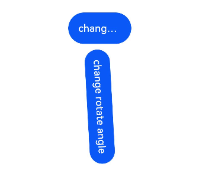

# 显式动画

提供全局animateTo显式动画接口来指定由于闭包代码导致的状态变化插入过渡动效。

>  **说明：**
>
>  从API Version 7开始支持。后续版本如有新增内容，则采用上角标单独标记该内容的起始版本。


animateTo(value: AnimateParam, event: () => void): void

| 参数             | 类型        |       是否必填     |        描述        |
| ---------------- | ------------ | -------------------- | -------------------- |
| value | [AnimateParam](#animateparam对象说明) | 是 | 设置动画效果相关参数。 |
| event | () => void | 是 | 指定显示动效的闭包函数，在闭包函数中导致的状态变化系统会自动插入过渡动画。 |

## AnimateParam对象说明

| 名称 | 类型 | 描述 |
| -------- | -------- | -------- |
| duration | number | 动画持续时间，单位为毫秒。<br/>默认值：1000 |
| tempo | number | 动画的播放速度，值越大动画播放越快，值越小播放越慢，为0时无动画效果。<br/>默认值：1.0 |
| curve | [Curve](ts-appendix-enums.md#curve)&nbsp;\|&nbsp;[ICurve](../apis/js-apis-curve.md#icurve)&nbsp;\|&nbsp;string | 动画曲线。<br/>默认值：Curve.Linear |
| delay | number | 单位为ms(毫秒)，默认不延时播放。<br/>默认值：0 |
| iterations | number | 默认播放一次，设置为-1时表示无限次播放。<br/>默认值：1 |
| playMode | [PlayMode](ts-appendix-enums.md#playmode) | 设置动画播放模式，默认播放完成后重头开始播放。<br/>默认值：PlayMode.Normal |
| onFinish   | ()&nbsp;=&gt;&nbsp;void   | 动效播放完成回调。 |


## 示例

```ts
// xxx.ets
@Entry
@Component
struct AnimateToExample {
  @State widthSize: number = 250
  @State heightSize: number = 100
  @State rotateAngle: number = 0
  private flag: boolean = true

  build() {
    Column() {
      Button('change width and height')
        .width(this.widthSize)
        .height(this.heightSize)
        .margin(30)
        .onClick(() => {
          if (this.flag) {
            animateTo({
              duration: 2000,
              curve: Curve.EaseOut,
              iterations: 3,
              playMode: PlayMode.Normal,
              onFinish: () => {
                console.info('play end')
              }
            }, () => {
              this.widthSize = 100
              this.heightSize = 50
            })
          } else {
            animateTo({}, () => {
              this.widthSize = 250
              this.heightSize = 100
            })
          }
          this.flag = !this.flag
        })
      Button('change rotate angle')
        .margin(50)
        .rotate({ x: 0, y: 0, z: 1, angle: this.rotateAngle })
        .onClick(() => {
          animateTo({
            duration: 1200,
            curve: Curve.Friction,
            delay: 500,
            iterations: -1, // 设置-1表示动画无限循环
            playMode: PlayMode.AlternateReverse,
            onFinish: () => {
              console.info('play end')
            }
          }, () => {
            this.rotateAngle = 90
          })
        })
    }.width('100%').margin({ top: 5 })
  }
}
```

示意图：


点击第一个按钮播放改变按钮大小的动画，点击第二个按钮播放按钮顺时针旋转90度的动画。

