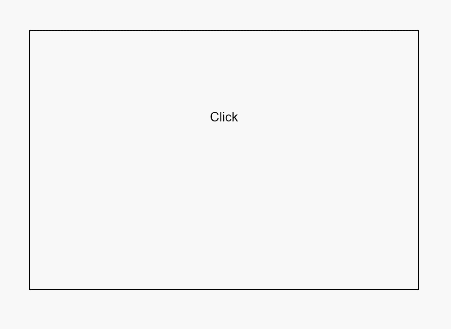

# 绑定手势方法<a name="ZH-CN_TOPIC_0000001237555115"></a>

> **说明：** 
>从API Version 7开始支持。后续版本如有新增内容，则采用上角标单独标记该内容的起始版本。

## 权限列表<a name="section781125411508"></a>

无

## 绑定手势识别<a name="section42396384106"></a>

通过如下属性给组件绑定手势识别，手势识别成功后可以通过事件回调通知组件。

<table><thead align="left"><tr><th class="cellrowborder" valign="top" width="18.108189181081894%" id="mcps1.1.5.1.1"><p>名称</p>
</th>
<th class="cellrowborder" valign="top" width="20.73792620737926%" id="mcps1.1.5.1.2"><p>参数类型</p>
</th>
<th class="cellrowborder" valign="top" width="22.617738226177384%" id="mcps1.1.5.1.3"><p>默认值</p>
</th>
<th class="cellrowborder" valign="top" width="38.53614638536146%" id="mcps1.1.5.1.4"><p>描述</p>
</th>
</tr>
</thead>
<tbody><tr><td class="cellrowborder" valign="top" width="18.108189181081894%" headers="mcps1.1.5.1.1 "><p>gesture</p>
</td>
<td class="cellrowborder" valign="top" width="20.73792620737926%" headers="mcps1.1.5.1.2 "><p>gesture: <a href="#li13550165717410">GestureType</a>,</p>
<p>mask?: <a href="#li05419551143">GestureMask</a></p>
</td>
<td class="cellrowborder" valign="top" width="22.617738226177384%" headers="mcps1.1.5.1.3 "><p>gesture: -，</p>
<p>mask: GestureMask.Normal</p>
</td>
<td class="cellrowborder" valign="top" width="38.53614638536146%" headers="mcps1.1.5.1.4 "><p>绑定手势识别。</p>
<p>gesture: 绑定的手势类型， mask: 事件响应设置。</p>
</td>
</tr>
<tr><td class="cellrowborder" valign="top" width="18.108189181081894%" headers="mcps1.1.5.1.1 "><p>priorityGesture</p>
</td>
<td class="cellrowborder" valign="top" width="20.73792620737926%" headers="mcps1.1.5.1.2 "><p>gesture: <a href="#li13550165717410">GestureType</a>,</p>
<p>mask?: <a href="#li05419551143">GestureMask</a></p>
</td>
<td class="cellrowborder" valign="top" width="22.617738226177384%" headers="mcps1.1.5.1.3 "><p>gesture: -，</p>
<p>mask: GestureMask.Normal</p>
</td>
<td class="cellrowborder" valign="top" width="38.53614638536146%" headers="mcps1.1.5.1.4 "><p>绑定优先识别手势。</p>
<p>gesture: 绑定的手势类型， mask: 事件响应设置。</p>
<div class="note"><span class="notetitle"> 说明： </span><div class="notebody"><ul><li>默认情况下，子组件优先于父组件识别手势，当父组件配置priorityGesture时，父组件优先于子组件进行识别。</li></ul>
</div></div>
</td>
</tr>
<tr><td class="cellrowborder" valign="top" width="18.108189181081894%" headers="mcps1.1.5.1.1 "><p>parallelGesture</p>
</td>
<td class="cellrowborder" valign="top" width="20.73792620737926%" headers="mcps1.1.5.1.2 "><p>gesture: <a href="#li13550165717410">GestureType</a>,</p>
<p>mask?: <a href="#li05419551143">GestureMask</a></p>
</td>
<td class="cellrowborder" valign="top" width="22.617738226177384%" headers="mcps1.1.5.1.3 "><p>gesture: -，</p>
<p>mask: GestureMask.Normal</p>
</td>
<td class="cellrowborder" valign="top" width="38.53614638536146%" headers="mcps1.1.5.1.4 "><p>绑定可与子组件手势同时触发的手势。</p>
<p>gesture: 绑定的手势类型， mask: 事件响应设置。</p>
<div class="note"><span class="notetitle"> 说明： </span><div class="notebody"><ul><li>手势事件为非冒泡事件。父组件设置parallelGesture时，父子组件相同的手势事件都可以触发，实现类似冒泡效果。</li></ul>
</div></div>
</td>
</tr>
</tbody>
</table>

-   <a name="li05419551143"></a>GestureMask枚举说明

    <table><thead align="left"><tr><th class="cellrowborder" valign="top" width="25.2%" id="mcps1.1.3.1.1"><p>名称</p>
    </th>
    <th class="cellrowborder" valign="top" width="74.8%" id="mcps1.1.3.1.2"><p>描述</p>
    </th>
    </tr>
    </thead>
    <tbody><tr><td class="cellrowborder" valign="top" width="25.2%" headers="mcps1.1.3.1.1 "><p>Normal</p>
    </td>
    <td class="cellrowborder" valign="top" width="74.8%" headers="mcps1.1.3.1.2 "><p>不屏蔽子组件的手势，按照默认手势识别顺序进行识别。</p>
    </td>
    </tr>
    <tr><td class="cellrowborder" valign="top" width="25.2%" headers="mcps1.1.3.1.1 "><p>IgnoreInternal</p>
    </td>
    <td class="cellrowborder" valign="top" width="74.8%" headers="mcps1.1.3.1.2 "><p>屏蔽子组件的手势，仅当前容器的手势进行识别。</p>
    <div class="note"><span class="notetitle"> 说明： </span><div class="notebody"><p>子组件上系统内置的手势不会被屏蔽，如子组件为List组件时，内置的滑动手势仍然会触发。</p>
    </div></div>
    </td>
    </tr>
    </tbody>
    </table>


-   <a name="li13550165717410"></a>系统提供如下Gesture类型

    <table><thead align="left"><tr><th class="cellrowborder" valign="top" width="25.2%" id="mcps1.1.3.1.1"><p>名称</p>
    </th>
    <th class="cellrowborder" valign="top" width="74.8%" id="mcps1.1.3.1.2"><p>描述</p>
    </th>
    </tr>
    </thead>
    <tbody><tr><td class="cellrowborder" valign="top" width="25.2%" headers="mcps1.1.3.1.1 "><p>TapGesture</p>
    </td>
    <td class="cellrowborder" valign="top" width="74.8%" headers="mcps1.1.3.1.2 "><p>点击手势，支持单次点击、多次点击识别。</p>
    </td>
    </tr>
    <tr><td class="cellrowborder" valign="top" width="25.2%" headers="mcps1.1.3.1.1 "><p>LongPressGesture</p>
    </td>
    <td class="cellrowborder" valign="top" width="74.8%" headers="mcps1.1.3.1.2 "><p>长按手势。</p>
    </td>
    </tr>
    <tr><td class="cellrowborder" valign="top" width="25.2%" headers="mcps1.1.3.1.1 "><p>PanGesture</p>
    </td>
    <td class="cellrowborder" valign="top" width="74.8%" headers="mcps1.1.3.1.2 "><p>平移手势。</p>
    </td>
    </tr>
    <tr><td class="cellrowborder" valign="top" width="25.2%" headers="mcps1.1.3.1.1 "><p>PinchGesture</p>
    </td>
    <td class="cellrowborder" valign="top" width="74.8%" headers="mcps1.1.3.1.2 "><p>捏合手势。</p>
    </td>
    </tr>
    <tr><td class="cellrowborder" valign="top" width="25.2%" headers="mcps1.1.3.1.1 "><p>RotationGesture</p>
    </td>
    <td class="cellrowborder" valign="top" width="74.8%" headers="mcps1.1.3.1.2 "><p>旋转手势。</p>
    </td>
    </tr>
    <tr><td class="cellrowborder" valign="top" width="25.2%" headers="mcps1.1.3.1.1 "><p>GestureGroup</p>
    </td>
    <td class="cellrowborder" valign="top" width="74.8%" headers="mcps1.1.3.1.2 "><p>手势识别组，多种手势组合为复合手势，支持连续识别、并行识别和互斥识别。</p>
    </td>
    </tr>
    </tbody>
    </table>


## 响应手势事件<a name="section13681164710593"></a>

组件通过gesture方法绑定手势对象，可以通过手势对象提供的事件相应响应手势操作。如通过TapGesture对象的onAction事件响应点击事件。具体事件定义见各个手势对象章节。

-   TapGesture事件说明

    <table><thead align="left"><tr><th class="cellrowborder" colspan="2" valign="top" id="mcps1.1.4.1.1"><p>名称</p>
    </th>
    <th class="cellrowborder" valign="top" id="mcps1.1.4.1.2"><p>功能描述</p>
    </th>
    </tr>
    </thead>
    <tbody><tr><td class="cellrowborder" colspan="2" valign="top" headers="mcps1.1.4.1.1 "><p>onAction((event?: <a href="#li209321550192419">GestureEvent</a>) =&gt; void)</p>
    </td>
    <td class="cellrowborder" valign="top" headers="mcps1.1.4.1.2 "><p>Tap手势识别成功回调。</p>
    </td>
    </tr>
    </tbody>
    </table>


-   <a name="li209321550192419"></a>GestureEvent对象说明

    <a name="table290mcpsimp"></a>
    <table><thead align="left"><tr><th class="cellrowborder" valign="top" width="20.09%" id="mcps1.1.4.1.1"><p>属性名称</p>
    </th>
    <th class="cellrowborder" valign="top" width="18.41%" id="mcps1.1.4.1.2"><p>属性类型</p>
    </th>
    <th class="cellrowborder" valign="top" width="61.5%" id="mcps1.1.4.1.3"><p>描述</p>
    </th>
    </tr>
    </thead>
    <tbody><tr><td class="cellrowborder" valign="top" width="20.09%" headers="mcps1.1.4.1.1 "><p>timestamp</p>
    </td>
    <td class="cellrowborder" valign="top" width="18.41%" headers="mcps1.1.4.1.2 "><p>number</p>
    </td>
    <td class="cellrowborder" valign="top" width="61.5%" headers="mcps1.1.4.1.3 "><p>事件时间戳。</p>
    </td>
    </tr>
    <tr><td class="cellrowborder" valign="top" width="20.09%" headers="mcps1.1.4.1.1 "><p>target<sup><span>8+</span></sup></p>
    </td>
    <td class="cellrowborder" valign="top" width="18.41%" headers="mcps1.1.4.1.2 "><p><a href="ts-universal-events-click.md#li552912253714">EventTarget</a></p>
    </td>
    <td class="cellrowborder" valign="top" width="61.5%" headers="mcps1.1.4.1.3 "><p>触发手势事件的元素对象。</p>
    </td>
    </tr>
    </tbody>
    </table>


## 示例<a name="section5447171181015"></a>

```
@Entry
@Component
struct GestureSettingsExample {
  @State value: string = ''

  build() {
    Column(){
      Column() {
        Text('Click\n' + this.value)
          .gesture(
          TapGesture()
            .onAction(() => {
              this.value = 'gesture onAction'
            }))
      }.height(200).width(300).padding(60).border({ width: 1 })
      //设置为priorityGesture时，会优先识别该绑定手势忽略内部gesture手势
      .priorityGesture(
      TapGesture()
        .onAction((event: GestureEvent) => {
          this.value = 'priorityGesture onAction' + '\ncomponent globalPos：（'
          + event.target.area.globalPos.x + ',' + event.target.area.globalPos.y + '）\nwidth:'
          + event.target.area.width + '\nheight：' + event.target.area.height
        }), GestureMask.IgnoreInternal
      )
    }.padding(60)
  }
}
```



