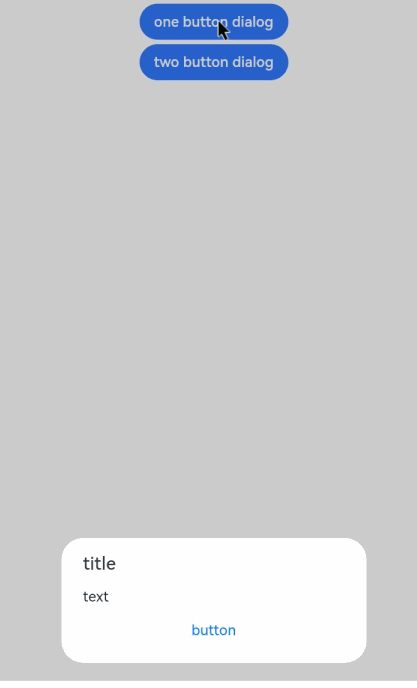

# 警告弹窗

显示警告弹窗组件，可设置文本内容与响应回调。

>  **说明：**
>
> 从API Version 7开始支持。后续版本如有新增内容，则采用上角标单独标记该内容的起始版本。
>
> 本模块功能依赖UI的执行上下文，不可在UI上下文不明确的地方使用，参见[UIContext](../apis/js-apis-arkui-UIContext.md#uicontext)说明。
>
> 从API version 10开始，可以通过使用[UIContext](../apis/js-apis-arkui-UIContext.md#uicontext)中的[showAlertDialog](../apis/js-apis-arkui-UIContext.md#showalertdialog)来明确UI的执行上下文。

## 属性

| 名称    | 参数类型  | 参数描述 |
| ---- | --------------- | -------- |
| show | [AlertDialogParamWithConfirm](#alertdialogparamwithconfirm对象说明)&nbsp;\|&nbsp;[AlertDialogParamWithButtons](#alertdialogparamwithbuttons对象说明)&nbsp;\|&nbsp;[AlertDialogParamWithOptions](#alertdialogparamwithoptions10对象说明) | 定义并显示AlertDialog组件。 |

## AlertDialogParamWithConfirm对象说明
| 参数名       | 参数类型     | 必填     | 参数描述         |
| ---------- | ---------------- | ---------- | ------------------------------- |
| title      | [ResourceStr](ts-types.md#resourcestr) | 否    | 弹窗标题。 |
| subtitle<sup>10+</sup> | [ResourceStr](ts-types.md#resourcestr) | 否 | 弹窗副标题。 |
| message    | [ResourceStr](ts-types.md#resourcestr) | 是    | 弹窗内容。 |
| autoCancel | boolean | 否   | 点击遮障层时，是否关闭弹窗。<br>默认值：true |
| confirm    | {<br/>enabled<sup>10+</sup>?: boolean,<br/>defaultFocus<sup>10+</sup>?: boolean,<br />style<sup>10+</sup>?: [DialogButtonStyle](#dialogbuttonstyle10枚举说明),<br />value:&nbsp;[ResourceStr](ts-types.md#resourcestr),<br/>fontColor?:&nbsp;[ResourceColor](ts-types.md#resourcecolor),<br/>backgroundColor?:&nbsp;&nbsp;[ResourceColor](ts-types.md#resourcecolor),<br/>action:&nbsp;()&nbsp;=&gt;&nbsp;void<br/>} | 否   | 确认按钮的使能状态、默认焦点、按钮风格、文本内容、文本色、按钮背景色和点击回调。<br />enabled：点击button是否响应。<br />默认值：true。<br />defaultFocus：设置button是否是默认焦点。<br />默认值：false。<br />style：设置button的风格样式。<br />默认值：DialogButtonStyle.DEFAULT。<br />value：按钮文本内容。<br />fontColor：按钮文本颜色。<br />backgroundColor：按钮背景颜色。<br />action：&nbsp;按钮选中时的回调。 |
| cancel     | ()&nbsp;=&gt;&nbsp;void      | 否     | 点击遮障层关闭dialog时的回调。 |
| alignment  | [DialogAlignment](#dialogalignment枚举说明) | 否   | 弹窗在竖直方向上的对齐方式。<br>默认值：DialogAlignment.Default |
| offset     | [Offset](ts-types.md#offset) | 否     | 弹窗相对alignment所在位置的偏移量。<br/>默认值：{&nbsp;dx:&nbsp;0&nbsp;,&nbsp;dy:&nbsp;0&nbsp;} |
| gridCount  | number                       | 否     | 弹窗容器宽度所占用栅格数。<br/>默认值：4 |
| maskRect<sup>10+</sup>| [Rectangle](#rectangle10类型说明) | 否     | 弹窗遮蔽层区域，在遮蔽层区域内的事件不透传，在遮蔽层区域外的事件透传。<br/>默认值：{ x: 0, y: 0, width: '100%', height: '100%' } |

confirm参数优先级：fontColor、backgroundColor  > style > defaultFocus

| backgroundColor | fontColor | style                       | defaultFocus | 效果     |
| --------------- | --------- | --------------------------- | ------------ | -------- |
| 绿底            | 红字      | -                           | -            | 绿底红字 |
| 绿底            | -         | DialogButtonStyle.HIGHLIGHT | -            | 绿底白字 |
| 绿底            | -         | DialogButtonStyle.DEFAULT   | -            | 绿底蓝字 |
| 绿底            | -         | -                           | TRUE         | 绿底白字 |
| 绿底            | -         | -                           | FALSE/-      | 绿底蓝字 |
| -               | 红字      | DialogButtonStyle.HIGHLIGHT | -            | 蓝底红字 |
| -               | 红字      | DialogButtonStyle.DEFAULT   | -            | 白底红字 |
| -               | 红字      | -                           | TRUE         | 蓝底红字 |
| -               | 红字      | -                           | FALSE/-      | 白底红字 |
| -               | -         | DialogButtonStyle.HIGHLIGHT | -            | 蓝底白字 |
| -               | -         | DialogButtonStyle.DEFAULT   | -            | 白底蓝字 |
| -               | -         | -                           | TRUE         | 蓝底白字 |
| -               | -         | -                           | FALSE/-      | 白底蓝字 |

## AlertDialogParamWithButtons对象说明
| 参数名             | 参数类型                | 必填     | 参数描述                     |
| --------------- | ---------------------- | ------------ | --------------------- |
| title           | [ResourceStr](ts-types.md#resourcestr) | 否     | 弹窗标题。              |
| subtitle<sup>10+</sup> | [ResourceStr](ts-types.md#resourcestr) | 否 | 弹窗副标题。 |
| message         | [ResourceStr](ts-types.md#resourcestr) | 是     | 弹窗内容。              |
| autoCancel      | boolean           | 否   | 点击遮障层时，是否关闭弹窗。<br>默认值：true      |
| primaryButton   | {<br/>enabled<sup>10+</sup>?: boolean,<br/>defaultFocus<sup>10+</sup>?: boolean,<br />style<sup>10+</sup>?: [DialogButtonStyle](#dialogbuttonstyle10枚举说明),<br />value:&nbsp;[ResourceStr](ts-types.md#resourcestr),<br/>fontColor?:&nbsp;[ResourceColor](ts-types.md#resourcecolor),<br/>backgroundColor?:&nbsp;[ResourceColor](ts-types.md#resourcecolor),<br/>action:&nbsp;()&nbsp;=&gt;&nbsp;void;<br/>} | 否 | 确认按钮的使能状态、默认焦点、按钮风格、文本内容、文本色、按钮背景色和点击回调。<br />enabled：点击button是否响应。<br />默认值：true。<br />defaultFocus：设置button是否是默认焦点。<br />默认值：false。<br />style：设置button的风格样式。<br />默认值：DialogButtonStyle.DEFAULT。<br />value：按钮文本内容。<br />fontColor：按钮文本颜色。<br />backgroundColor：按钮背景颜色。<br />action：&nbsp;按钮选中时的回调。 |
| secondaryButton | {<br/>enabled<sup>10+</sup>?: boolean,<br/>defaultFocus<sup>10+</sup>?: boolean,<br />style<sup>10+</sup>?: [DialogButtonStyle](#dialogbuttonstyle10枚举说明),<br />value:&nbsp;[ResourceStr](ts-types.md#resourcestr),<br/>fontColor?:&nbsp;[ResourceColor](ts-types.md#resourcecolor),<br/>backgroundColor?:&nbsp;[ResourceColor](ts-types.md#resourcecolor),<br/>action:&nbsp;()&nbsp;=&gt;&nbsp;void;<br/>} | 否  | 确认按钮的使能状态、默认焦点、按钮风格、文本内容、文本色、按钮背景色和点击回调。<br />enabled：点击button是否响应。<br />默认值：true。<br />defaultFocus：设置button是否是默认焦点。<br />默认值：false。<br />style：设置button的风格样式。<br />默认值：DialogButtonStyle.DEFAULT。<br />value：按钮文本内容。<br />fontColor：按钮文本颜色。<br />backgroundColor：按钮背景颜色。<br />action：&nbsp;按钮选中时的回调。 |
| cancel          | ()&nbsp;=&gt;&nbsp;void      | 否  | 点击遮障层关闭dialog时的回调。         |
| alignment       | [DialogAlignment](#dialogalignment枚举说明) | 否   | 弹窗在竖直方向上的对齐方式。<br>默认值：DialogAlignment.Default |
| offset          | [Offset](ts-types.md#offset) | 否  | 弹窗相对alignment所在位置的偏移量。 |
| gridCount       | number                       | 否  | 弹窗容器宽度所占用栅格数。 |
| maskRect<sup>10+</sup> | [Rectangle](#rectangle10类型说明) | 否     | 弹窗遮蔽层区域，在遮蔽层区域内的事件不透传，在遮蔽层区域外的事件透传。<br/>默认值：{ x: 0, y: 0, width: '100%', height: '100%' } |

## AlertDialogParamWithOptions<sup>10+</sup>对象说明
| 参数名             | 参数类型                | 必填     | 参数描述                     |
| --------------- | ---------------------- | ------------ | --------------------- |
| title           | [ResourceStr](ts-types.md#resourcestr) | 否     | 弹窗标题。              |
| subtitle<sup>10+</sup>           | [ResourceStr](ts-types.md#resourcestr) | 否     | 弹窗子标题。              |
| message         | [ResourceStr](ts-types.md#resourcestr) | 是     | 弹窗内容。              |
| autoCancel      | boolean           | 否   | 点击遮障层时，是否关闭弹窗。<br>默认值：true      |
| cancel          | ()&nbsp;=&gt;&nbsp;void      | 否  | 点击遮障层关闭dialog时的回调。         |
| alignment       | [DialogAlignment](#dialogalignment枚举说明) | 否   | 弹窗在竖直方向上的对齐方式。<br>默认值：DialogAlignment.Default |
| offset          | [Offset](ts-types.md#offset) | 否  | 弹窗相对alignment所在位置的偏移量。 |
| gridCount       | number                       | 否  | 弹窗容器宽度所占用栅格数。 |
| maskRect<sup>10+</sup>| [Rectangle](#rectangle10类型说明) | 否     | 弹窗遮蔽层区域，在遮蔽层区域内的事件不透传，在遮蔽层区域外的事件透传。<br/>默认值：{ x: 0, y: 0, width: '100%', height: '100%' } |
| buttons<sup>10+</sup>       | Array&lt;[AlertDialogButtonOptions](#alertdialogbuttonoptions10对象说明)&gt;                 | 否  | 弹窗容器中的多个按钮。 |
|buttonDirection<sup>10+</sup>      | [DialogButtonDirection](#dialogbuttondirection10枚举说明)| 否  | 按钮排布方向默认值为DialogButtonDirection.AUTO，建议3个以上按钮使用Auto模式（两个以上按钮会切换为纵向模式，通常能显示更多按钮），非Auto模式下，3个以上按钮可能会显示不全，超出显示范围的按钮会被截断。|

## AlertDialogButtonOptions<sup>10+</sup>对象说明
| 参数名             | 参数类型                | 必填     | 参数描述                     |
| ------------------| ---------------------- | ------------ | --------------------- |
| enabled           | boolean | 否     | 点击button是否响应，默认值true。              |
| defaultFocus           | boolean | 否     | 设置button是否是默认焦点，默认值false。              |
| style           | [DialogButtonStyle](#dialogbuttonstyle10枚举说明) | 否     | 设置button的风格样式，默认值DialogButtonStyle.DEFAULT。              |
| value           | [ResourceStr](ts-types.md#resourcestr) | 是     | 按钮的文本内容，若值为null，则该按钮不显示。              |
| fontColor           | [ResourceColor](ts-types.md#resourcecolor) | 否     | 按钮的文本颜色。              |
| backgroundColor           | [ResourceColor](ts-types.md#resourcecolor) | 否     | 按钮背景颜色。              |
| action           | 	() => void | 是     | 按钮选中时的回调。              |

## DialogButtonDirection<sup>10+</sup>枚举说明
| 名称                       | 描述      |
| -------------------------- | --------- |
| AUTO                      | 两个及以下按钮水平排布，两个以上为竖直排布。 |
| HORIZONTAL                      | 按钮水平布局。 |
| VERTICAL                      | 按钮竖直布局。 |

confirm参数优先级：fontColor、backgroundColor  > style > defaultFocus

| backgroundColor | fontColor | style                       | defaultFocus | 效果     |
| --------------- | --------- | --------------------------- | ------------ | -------- |
| 绿底            | 红字      | -                           | -            | 绿底红字 |
| 绿底            | -         | DialogButtonStyle.HIGHLIGHT | -            | 绿底白字 |
| 绿底            | -         | DialogButtonStyle.DEFAULT   | -            | 绿底蓝字 |
| 绿底            | -         | -                           | TRUE         | 绿底白字 |
| 绿底            | -         | -                           | FALSE/-      | 绿底蓝字 |
| -               | 红字      | DialogButtonStyle.HIGHLIGHT | -            | 蓝底红字 |
| -               | 红字      | DialogButtonStyle.DEFAULT   | -            | 白底红字 |
| -               | 红字      | -                           | TRUE         | 蓝底红字 |
| -               | 红字      | -                           | FALSE/-      | 白底红字 |
| -               | -         | DialogButtonStyle.HIGHLIGHT | -            | 蓝底白字 |
| -               | -         | DialogButtonStyle.DEFAULT   | -            | 白底蓝字 |
| -               | -         | -                           | TRUE         | 蓝底白字 |
| -               | -         | -                           | FALSE/-      | 白底蓝字 |

## DialogAlignment枚举说明

| 名称                       | 描述      |
| ------------------------ | ------- |
| Top                      | 垂直顶部对齐。 |
| Center                   | 垂直居中对齐。 |
| Bottom                   | 垂直底部对齐。 |
| Default                  | 默认对齐。   |
| TopStart<sup>8+</sup>    | 左上对齐。   |
| TopEnd<sup>8+</sup>      | 右上对齐。   |
| CenterStart<sup>8+</sup> | 左中对齐。   |
| CenterEnd<sup>8+</sup>   | 右中对齐。   |
| BottomStart<sup>8+</sup> | 左下对齐。   |
| BottomEnd<sup>8+</sup>   | 右下对齐。   |

## Rectangle<sup>10+</sup>类型说明

Rectangle是各种Dialog中maskRect参数的类型。

| 名称     | 类型                           | 必填 | 描述                                |
|--------|------------------------------|----|-----------------------------------|
| x      | [Length](ts-types.md#length) | 否  | 弹窗遮蔽层区域相对于窗口左上角的x轴坐标。<br/>默认值：0vp |
| y      | [Length](ts-types.md#length) | 否  | 弹窗遮蔽层区域相对于窗口左上角的y轴坐标。<br/>默认值：0vp |
| width  | [Length](ts-types.md#length) | 否  | 弹窗遮蔽层区域的宽度。<br/>默认值：'100%'        |
| height | [Length](ts-types.md#length) | 否  | 弹窗遮蔽层区域的高度。<br/>默认值：'100%'        |

>  **说明：**
>
>  x和y可以设置正负值百分比。当x设置为'100%'时表示遮蔽层区域往右偏移窗口本身宽度大小，当x设置为'-100%'时表示遮蔽层区域往左偏移窗口本身宽度大小。当y设置为'100%'时表示遮蔽层区域往下偏移窗口本身高度大小，当y设置为'-100%'时表示遮蔽层区域往上偏移窗口本身高度大小。
>
>  width和height只能设置正值，支持百分比，如果设置为负值，那么该值将被重置为默认值。
>
>  百分比相对于窗口自身宽高进行计算。

## DialogButtonStyle<sup>10+</sup>枚举说明

| 名称      | 描述                              |
| --------- | --------------------------------- |
| DEFAULT   | 白底蓝字（深色主题：白底=黑底）。 |
| HIGHLIGHT | 蓝底白字。                        |

## 示例

```ts
// xxx.ets
@Entry
@Component
struct AlertDialogExample {
  build() {
    Column({ space: 5 }) {
      Button('one button dialog')
        .onClick(() => {
          AlertDialog.show(
            {
              title: 'title',
              message: 'text',
              autoCancel: true,
              alignment: DialogAlignment.Bottom,
              offset: { dx: 0, dy: -20 },
              gridCount: 3,
              confirm: {
                value: 'button',
                action: () => {
                  console.info('Button-clicking callback')
                }
              },
              cancel: () => {
                console.info('Closed callbacks')
              }
            }
          )
        })
        .backgroundColor(0x317aff)
      Button('two button dialog')
        .onClick(() => {
          AlertDialog.show(
            {
              title: 'title',
              subtitle: 'subtitle',
              message: 'text',
              autoCancel: true,
              alignment: DialogAlignment.Bottom,
              gridCount: 4,
              offset: { dx: 0, dy: -20 },
              primaryButton: {
                value: 'cancel',
                action: () => {
                  console.info('Callback when the first button is clicked')
                }
              },
              secondaryButton: {
                enabled: true,
                defaultFocus: true,
                style: DialogButtonStyle.HIGHLIGHT,
                value: 'ok',
                action: () => {
                  console.info('Callback when the second button is clicked')
                }
              },
              cancel: () => {
                console.info('Closed callbacks')
              }
            }
          )
        }).backgroundColor(0x317aff)
        Button('three button dialog')
        .onClick(() => {
          AlertDialog.show(
            {
              title: 'title',
              subtitle: 'subtitle',
              message: 'text',
              autoCancel: true,
              alignment: DialogAlignment.Bottom,
              gridCount: 4,
              offset: { dx: 0, dy: -20 },
              buttonDirection: DialogButtonDirection.HORIZONTAL,
              buttons: [
                {
                  value: '按钮',
                  action: () => {
                    console.info('Callback when button1 is clicked')
                  }
                },
                {
                  value: '按钮',
                  action: () => {
                    console.info('Callback when button2 is clicked')
                  }
                },
                {
                  value: '按钮',
                  enabled: true,
                  defaultFocus: true,
                  style: DialogButtonStyle.HIGHLIGHT,
                  action: () => {
                    console.info('Callback when button3 is clicked')
                  }
                },
              ],
              cancel: () => {
                console.info('Closed callbacks')
              }
            }
          )
        }).backgroundColor(0x317aff)
    }.width('100%').margin({ top: 5 })
  }
}
```


