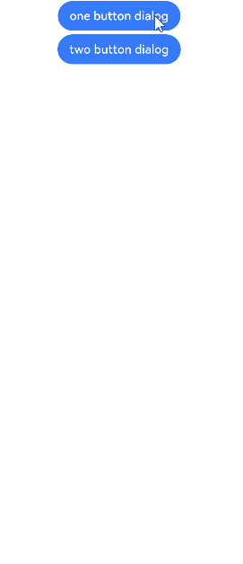

# 警告弹窗

显示警告弹窗组件，可设置文本内容与响应回调。

>  **说明：**
>
> 从API Version 7开始支持。后续版本如有新增内容，则采用上角标单独标记该内容的起始版本。
>
> 本模块功能依赖UI的执行上下文，不可在UI上下文不明确的地方使用，参见[UIContext](../apis/js-apis-arkui-UIContext.md#uicontext)说明。
>
> 从API version 10开始，可以通过使用[UIContext](../apis/js-apis-arkui-UIContext.md#uicontext)中的[showAlertDialog](../apis/js-apis-arkui-UIContext.md#showalertdialog)来明确UI的执行上下文。

## 属性

| 名称    | 参数类型  | 参数描述 |
| ---- | --------------- | -------- |
| show | [AlertDialogParamWithConfirm](#alertdialogparamwithconfirm对象说明)&nbsp;\|&nbsp;[AlertDialogParamWithButtons](#alertdialogparamwithbuttons对象说明)  | 定义并显示AlertDialog组件。 |

## AlertDialogParamWithConfirm对象说明
| 参数名       | 参数类型     | 必填     | 参数描述         |
| ---------- | ---------------- | ---------- | ------------------------------- |
| title      | [ResourceStr](ts-types.md#resourcestr) | 否    | 弹窗标题。 |
| message    | [ResourceStr](ts-types.md#resourcestr) | 是    | 弹窗内容。 |
| autoCancel | boolean | 否   | 点击遮障层时，是否关闭弹窗。<br>默认值：true |
| confirm    | {<br/>value:&nbsp;[ResourceStr](ts-types.md#resourcestr),<br/>fontColor?:&nbsp;[ResourceColor](ts-types.md#resourcecolor),<br/>backgroundColor?:&nbsp;&nbsp;[ResourceColor](ts-types.md#resourcecolor),<br/>action:&nbsp;()&nbsp;=&gt;&nbsp;void<br/>} | 否   | 确认按钮的文本内容、文本色、按钮背景色和点击回调。 |
| cancel     | ()&nbsp;=&gt;&nbsp;void      | 否     | 点击遮障层关闭dialog时的回调。 |
| alignment  | [DialogAlignment](#dialogalignment枚举说明) | 否   | 弹窗在竖直方向上的对齐方式。<br>默认值：DialogAlignment.Default |
| offset     | [Offset](ts-types.md#offset) | 否     | 弹窗相对alignment所在位置的偏移量。 |
| gridCount  | number                       | 否     | 弹窗容器宽度所占用栅格数。 |

## AlertDialogParamWithButtons对象说明
| 参数名             | 参数类型                | 必填     | 参数描述                     |
| --------------- | ---------------------- | ------------ | --------------------- |
| title           | [ResourceStr](ts-types.md#resourcestr) | 否     | 弹窗标题。              |
| message         | [ResourceStr](ts-types.md#resourcestr) | 是     | 弹窗内容。              |
| autoCancel      | boolean           | 否   | 点击遮障层时，是否关闭弹窗。<br>默认值：true      |
| primaryButton   | {<br/>value:&nbsp;[ResourceStr](ts-types.md#resourcestr),<br/>fontColor?:&nbsp;[ResourceColor](ts-types.md#resourcecolor),<br/>backgroundColor?:&nbsp;[ResourceColor](ts-types.md#resourcecolor),<br/>action:&nbsp;()&nbsp;=&gt;&nbsp;void;<br/>} | 否 | 按钮的文本内容、文本色、按钮背景色和点击回调。 |
| secondaryButton | {<br/>value:&nbsp;[ResourceStr](ts-types.md#resourcestr),<br/>fontColor?:&nbsp;[ResourceColor](ts-types.md#resourcecolor),<br/>backgroundColor?:&nbsp;[ResourceColor](ts-types.md#resourcecolor),<br/>action:&nbsp;()&nbsp;=&gt;&nbsp;void;<br/>} | 否  | 按钮的文本内容、文本色、按钮背景色和点击回调。 |
| cancel          | ()&nbsp;=&gt;&nbsp;void      | 否  | 点击遮障层关闭dialog时的回调。         |
| alignment       | [DialogAlignment](#dialogalignment枚举说明) | 否   | 弹窗在竖直方向上的对齐方式。<br>默认值：DialogAlignment.Default |
| offset          | [Offset](ts-types.md#offset) | 否  | 弹窗相对alignment所在位置的偏移量。 |
| gridCount       | number                       | 否  | 弹窗容器宽度所占用栅格数。 |

## DialogAlignment枚举说明

| 名称                       | 描述      |
| ------------------------ | ------- |
| Top                      | 垂直顶部对齐。 |
| Center                   | 垂直居中对齐。 |
| Bottom                   | 垂直底部对齐。 |
| Default                  | 默认对齐。   |
| TopStart<sup>8+</sup>    | 左上对齐。   |
| TopEnd<sup>8+</sup>      | 右上对齐。   |
| CenterStart<sup>8+</sup> | 左中对齐。   |
| CenterEnd<sup>8+</sup>   | 右中对齐。   |
| BottomStart<sup>8+</sup> | 左下对齐。   |
| BottomEnd<sup>8+</sup>   | 右下对齐。   |

## 示例

```ts
// xxx.ets
@Entry
@Component
struct AlertDialogExample {
  build() {
    Column({ space: 5 }) {
      Button('one button dialog')
        .onClick(() => {
          AlertDialog.show(
            {
              title: 'title',
              message: 'text',
              autoCancel: true,
              alignment: DialogAlignment.Bottom,
              offset: { dx: 0, dy: -20 },
              gridCount: 3,
              confirm: {
                value: 'button',
                action: () => {
                  console.info('Button-clicking callback')
                }
              },
              cancel: () => {
                console.info('Closed callbacks')
              }
            }
          )
        })
        .backgroundColor(0x317aff)
      Button('two button dialog')
        .onClick(() => {
          AlertDialog.show(
            {
              title: 'title',
              message: 'text',
              autoCancel: true,
              alignment: DialogAlignment.Bottom,
              gridCount: 4,
              offset: { dx: 0, dy: -20 },
              primaryButton: {
                value: 'cancel',
                action: () => {
                  console.info('Callback when the first button is clicked')
                }
              },
              secondaryButton: {
                value: 'ok',
                action: () => {
                  console.info('Callback when the second button is clicked')
                }
              },
              cancel: () => {
                console.info('Closed callbacks')
              }
            }
          )
        }).backgroundColor(0x317aff)
    }.width('100%').margin({ top: 5 })
  }
}
```


