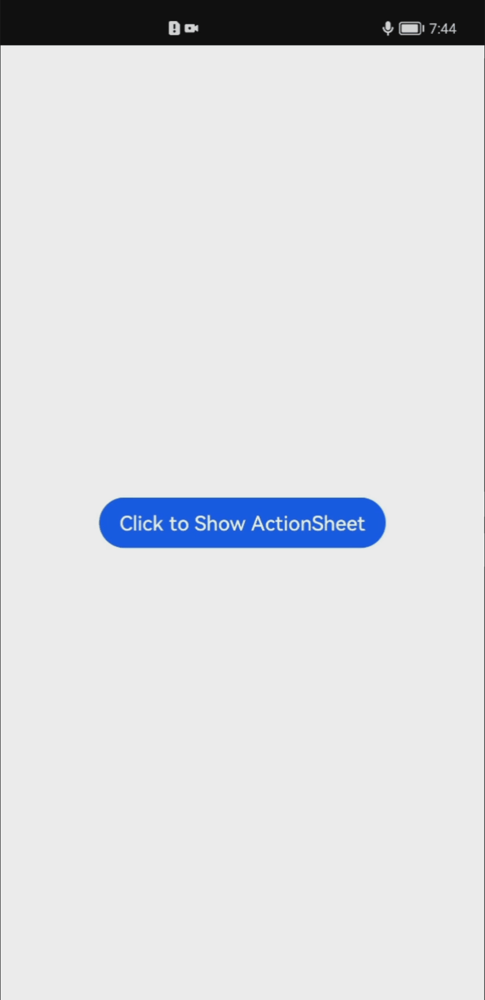

# 列表选择弹窗<a name="ZH-CN_TOPIC_0000001192755136"></a>

> **说明：** 
>从API Version 8开始支持。后续版本如有新增内容，则采用上角标单独标记该内容的起始版本。

列表弹窗。

## 权限列表<a name="section137491348987"></a>

无

## ActionSheet.show<a name="section91411857161619"></a>

show\(options: \{  [paramObject1](#table816913216616)\}\)

定义列表弹窗并弹出。

-   paramObject1参数

    <a name="table816913216616"></a>
    <table><thead align="left"><tr><th class="cellrowborder" valign="top" width="12.31%" id="mcps1.1.6.1.1"><p>参数名</p>
    </th>
    <th class="cellrowborder" valign="top" width="32.61%" id="mcps1.1.6.1.2"><p>参数类型</p>
    </th>
    <th class="cellrowborder" valign="top" width="7.1499999999999995%" id="mcps1.1.6.1.3"><p>必填</p>
    </th>
    <th class="cellrowborder" valign="top" width="20.54%" id="mcps1.1.6.1.4"><p>默认值</p>
    </th>
    <th class="cellrowborder" valign="top" width="27.389999999999997%" id="mcps1.1.6.1.5"><p>参数描述</p>
    </th>
    </tr>
    </thead>
    <tbody><tr><td class="cellrowborder" valign="top" width="12.31%" headers="mcps1.1.6.1.1 "><p>title</p>
    </td>
    <td class="cellrowborder" valign="top" width="32.61%" headers="mcps1.1.6.1.2 "><p>string</p>
    </td>
    <td class="cellrowborder" valign="top" width="7.1499999999999995%" headers="mcps1.1.6.1.3 "><p>否</p>
    </td>
    <td class="cellrowborder" valign="top" width="20.54%" headers="mcps1.1.6.1.4 "><p>无标题</p>
    </td>
    <td class="cellrowborder" valign="top" width="27.389999999999997%" headers="mcps1.1.6.1.5 "><p>弹窗标题。</p>
    </td>
    </tr>
    <tr><td class="cellrowborder" valign="top" width="12.31%" headers="mcps1.1.6.1.1 "><p>message</p>
    </td>
    <td class="cellrowborder" valign="top" width="32.61%" headers="mcps1.1.6.1.2 "><p>string</p>
    </td>
    <td class="cellrowborder" valign="top" width="7.1499999999999995%" headers="mcps1.1.6.1.3 "><p>是</p>
    </td>
    <td class="cellrowborder" valign="top" width="20.54%" headers="mcps1.1.6.1.4 "><p>-</p>
    </td>
    <td class="cellrowborder" valign="top" width="27.389999999999997%" headers="mcps1.1.6.1.5 "><p>弹窗内容。</p>
    </td>
    </tr>
    <tr><td class="cellrowborder" valign="top" width="12.31%" headers="mcps1.1.6.1.1 "><p>autoCancel</p>
    </td>
    <td class="cellrowborder" valign="top" width="32.61%" headers="mcps1.1.6.1.2 "><p>boolean</p>
    </td>
    <td class="cellrowborder" valign="top" width="7.1499999999999995%" headers="mcps1.1.6.1.3 "><p>否</p>
    </td>
    <td class="cellrowborder" valign="top" width="20.54%" headers="mcps1.1.6.1.4 "><p>true</p>
    </td>
    <td class="cellrowborder" valign="top" width="27.389999999999997%" headers="mcps1.1.6.1.5 "><p>点击遮障层时，是否关闭弹窗。</p>
    </td>
    </tr>
    <tr><td class="cellrowborder" valign="top" width="12.31%" headers="mcps1.1.6.1.1 "><p>confirm</p>
    </td>
    <td class="cellrowborder" valign="top" width="32.61%" headers="mcps1.1.6.1.2 "><p>{</p>
    <p>value: string,</p>
    <p>action: () =&gt; void</p>
    <p>}</p>
    </td>
    <td class="cellrowborder" valign="top" width="7.1499999999999995%" headers="mcps1.1.6.1.3 "><p>否</p>
    </td>
    <td class="cellrowborder" valign="top" width="20.54%" headers="mcps1.1.6.1.4 "><p>-</p>
    </td>
    <td class="cellrowborder" valign="top" width="27.389999999999997%" headers="mcps1.1.6.1.5 "><p>确认按钮的文本内容和点击回调。</p>
    <p>value：按钮文本内容。</p>
    <p>action: 按钮选中时的回调。</p>
    </td>
    </tr>
    <tr><td class="cellrowborder" valign="top" width="12.31%" headers="mcps1.1.6.1.1 "><p>cancel</p>
    </td>
    <td class="cellrowborder" valign="top" width="32.61%" headers="mcps1.1.6.1.2 "><p>() =&gt; void</p>
    </td>
    <td class="cellrowborder" valign="top" width="7.1499999999999995%" headers="mcps1.1.6.1.3 "><p>否</p>
    </td>
    <td class="cellrowborder" valign="top" width="20.54%" headers="mcps1.1.6.1.4 "><p>-</p>
    </td>
    <td class="cellrowborder" valign="top" width="27.389999999999997%" headers="mcps1.1.6.1.5 "><p>点击遮障层关闭dialog时的回调。</p>
    </td>
    </tr>
    <tr><td class="cellrowborder" valign="top" width="12.31%" headers="mcps1.1.6.1.1 "><p>alignment</p>
    </td>
    <td class="cellrowborder" valign="top" width="32.61%" headers="mcps1.1.6.1.2 "><p><a href="ts-methods-custom-dialog-box.md#li46304184186">DialogAlignment</a></p>
    </td>
    <td class="cellrowborder" valign="top" width="7.1499999999999995%" headers="mcps1.1.6.1.3 "><p>否</p>
    </td>
    <td class="cellrowborder" valign="top" width="20.54%" headers="mcps1.1.6.1.4 "><p>DialogAlignment.Default</p>
    </td>
    <td class="cellrowborder" valign="top" width="27.389999999999997%" headers="mcps1.1.6.1.5 "><p>弹窗在竖直方向上的对齐方式。</p>
    </td>
    </tr>
    <tr><td class="cellrowborder" valign="top" width="12.31%" headers="mcps1.1.6.1.1 "><p>offset</p>
    </td>
    <td class="cellrowborder" valign="top" width="32.61%" headers="mcps1.1.6.1.2 "><p>{</p>
    <p>dx: Length,</p>
    <p>dy: Length</p>
    <p>}</p>
    </td>
    <td class="cellrowborder" valign="top" width="7.1499999999999995%" headers="mcps1.1.6.1.3 "><p>否</p>
    </td>
    <td class="cellrowborder" valign="top" width="20.54%" headers="mcps1.1.6.1.4 "><p>{</p>
    <p>dx: 0,</p>
    <p>dy: 0</p>
    <p>}</p>
    </td>
    <td class="cellrowborder" valign="top" width="27.389999999999997%" headers="mcps1.1.6.1.5 "><p>弹窗相对alignment所在位置的偏移量。</p>
    </td>
    </tr>
    <tr><td class="cellrowborder" valign="top" width="12.31%" headers="mcps1.1.6.1.1 "><p>sheets</p>
    </td>
    <td class="cellrowborder" valign="top" width="32.61%" headers="mcps1.1.6.1.2 "><p>Array&lt;<a href="#table896716596134">SheetInfo</a>&gt;</p>
    </td>
    <td class="cellrowborder" valign="top" width="7.1499999999999995%" headers="mcps1.1.6.1.3 "><p>是</p>
    </td>
    <td class="cellrowborder" valign="top" width="20.54%" headers="mcps1.1.6.1.4 "><p>-</p>
    </td>
    <td class="cellrowborder" valign="top" width="27.389999999999997%" headers="mcps1.1.6.1.5 "><p>设置选项内容，每个选择项支持设置图片、文本和选中的回调。</p>
    </td>
    </tr>
    </tbody>
    </table>

-   SheetInfo接口说明

    <table><thead align="left"><tr><th class="cellrowborder" valign="top" width="13.848615138486153%" id="mcps1.1.6.1.1"><p>参数名</p>
    </th>
    <th class="cellrowborder" valign="top" width="21.85781421857814%" id="mcps1.1.6.1.2"><p>参数类型</p>
    </th>
    <th class="cellrowborder" valign="top" width="13.858614138586143%" id="mcps1.1.6.1.3"><p>必填</p>
    </th>
    <th class="cellrowborder" valign="top" width="10.958904109589042%" id="mcps1.1.6.1.4"><p>默认值</p>
    </th>
    <th class="cellrowborder" valign="top" width="39.47605239476052%" id="mcps1.1.6.1.5"><p>参数描述</p>
    </th>
    </tr>
    </thead>
    <tbody><tr><td class="cellrowborder" valign="top" width="13.848615138486153%" headers="mcps1.1.6.1.1 "><p>title</p>
    </td>
    <td class="cellrowborder" valign="top" width="21.85781421857814%" headers="mcps1.1.6.1.2 "><p>string</p>
    </td>
    <td class="cellrowborder" valign="top" width="13.858614138586143%" headers="mcps1.1.6.1.3 "><p>是</p>
    </td>
    <td class="cellrowborder" valign="top" width="10.958904109589042%" headers="mcps1.1.6.1.4 "><p>-</p>
    </td>
    <td class="cellrowborder" valign="top" width="39.47605239476052%" headers="mcps1.1.6.1.5 "><p>sheet文本。</p>
    </td>
    </tr>
    <tr><td class="cellrowborder" valign="top" width="13.848615138486153%" headers="mcps1.1.6.1.1 "><p>icon</p>
    </td>
    <td class="cellrowborder" valign="top" width="21.85781421857814%" headers="mcps1.1.6.1.2 "><p>string</p>
    </td>
    <td class="cellrowborder" valign="top" width="13.858614138586143%" headers="mcps1.1.6.1.3 "><p>否</p>
    </td>
    <td class="cellrowborder" valign="top" width="10.958904109589042%" headers="mcps1.1.6.1.4 "><p>无</p>
    </td>
    <td class="cellrowborder" valign="top" width="39.47605239476052%" headers="mcps1.1.6.1.5 "><p>sheet图标。</p>
    </td>
    </tr>
    <tr><td class="cellrowborder" valign="top" width="13.848615138486153%" headers="mcps1.1.6.1.1 "><p>action</p>
    </td>
    <td class="cellrowborder" valign="top" width="21.85781421857814%" headers="mcps1.1.6.1.2 "><p>()=&gt;void</p>
    </td>
    <td class="cellrowborder" valign="top" width="13.858614138586143%" headers="mcps1.1.6.1.3 "><p>是</p>
    </td>
    <td class="cellrowborder" valign="top" width="10.958904109589042%" headers="mcps1.1.6.1.4 "><p>-</p>
    </td>
    <td class="cellrowborder" valign="top" width="39.47605239476052%" headers="mcps1.1.6.1.5 "><p>sheet选中的回调。</p>
    </td>
    </tr>
    </tbody>
    </table>


## 示例<a name="section080615383813"></a>

```
@Entry
@Component
struct ActionSheetExapmle {
  build() {
    Flex({ direction: FlexDirection.Column, alignItems: ItemAlign.Center, justifyContent: FlexAlign.Center }) {
      Button('Click to Show ActionSheet')
        .onClick(() => {
          ActionSheet.show({
            title: 'ActionSheet title',
            message: 'message',
            confirm: {
              value: 'Confirm button',
              action: () => {
                console.log('Get Alert Dialog handled')
              }
            },
            sheets: [
              {
                title: 'Apples',
                action: () => {
                  console.error('Apples')
                }
              },
              {
                title: 'bananas',
                action: () => {
                  console.error('bananas')
                }
              },
              {
                title: 'pears',
                action: () => {
                  console.error('pears')
                }
              }
            ]
          })
        })
    }.width('100%')
    .height('100%')
  }
}
```



