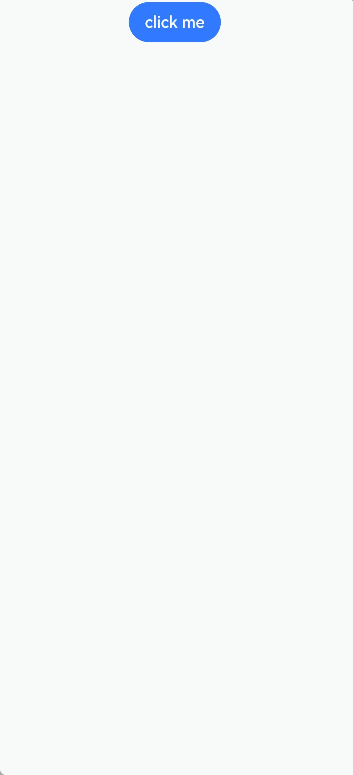

# 自定义弹窗（CustomDialog）

通过CustomDialogController类显示自定义弹窗。使用弹窗组件时，可优先考虑自定义弹窗，便于自定义弹窗的样式与内容。

> **说明：**
>
> 从API Version 7开始支持。后续版本如有新增内容，则采用上角标单独标记该内容的起始版本。


## 接口

CustomDialogController(value:{builder: CustomDialog, cancel?: () =&gt; void, autoCancel?: boolean, alignment?: DialogAlignment, offset?: Offset, customStyle?: boolean, gridCount?: number, maskColor?: ResourceColor, maskRect?: Rectangle, openAnimation?: AnimateParam, closeAnimation?: AnimateParam, showInSubWindow?: boolean, backgroundColor?:ResourceColor, cornerRadius?:Dimension&nbsp;\|&nbsp;BorderRadiuses})

**参数:**

| 参数名                           | 参数类型                                     | 必填   | 参数描述                                     |
| ----------------------------- | ---------------------------------------- | ---- | ---------------------------------------- |
| builder                       | CustomDialog                             | 是    | 自定义弹窗内容构造器。                              |
| cancel                        | ()&nbsp;=&gt;&nbsp;void                  | 否    | 点击遮障层退出时的回调。                             |
| autoCancel                    | boolean                                  | 否    | 是否允许点击遮障层退出。<br>默认值：true                 |
| alignment                     | [DialogAlignment](ts-methods-alert-dialog-box.md#dialogalignment枚举说明) | 否    | 弹窗在竖直方向上的对齐方式。<br>默认值：DialogAlignment.Default |
| offset                        | [Offset](ts-types.md#offset)             | 否    | 弹窗相对alignment所在位置的偏移量。                   |
| customStyle                   | boolean                                  | 否    | 弹窗容器样式是否自定义。<br>默认值：false，弹窗容器的宽度根据栅格系统自适应，不跟随子节点；高度自适应子节点，最大为窗口高度的90%；圆角为24vp。 |
| gridCount<sup>8+</sup>        | number                                   | 否    | 弹窗宽度占[栅格宽度](../../ui/arkts-layout-development-grid-layout.md)的个数。<br>默认为按照窗口大小自适应，异常值按默认值处理，最大栅格数为系统最大栅格数。 |
| maskColor<sup>10+</sup>       | [ResourceColor](ts-types.md#resourcecolor) | 否    | 自定义蒙层颜色。<br>默认值: 0x33000000              |
| maskRect<sup>10+</sup>        | [Rectangle](ts-methods-alert-dialog-box.md#rectangle10类型说明) | 否     | 弹窗遮蔽层区域，在遮蔽层区域内的事件不透传，在遮蔽层区域外的事件透传。<br/>默认值：{ x: 0, y: 0, width: '100%', height: '100%' } |
| openAnimation<sup>10+</sup>   | [AnimateParam](ts-explicit-animation.md#animateparam对象说明) | 否    | 自定义设置弹窗弹出的动画效果相关参数。<br>**说明**：<br>iterations默认值为1，默认播放一次，设置为其他数值时按默认值处理。<br>playMode控制动画播放模式，默认值为PlayMode.Normal，设置为其他数值时按照默认值处理。 |
| closeAnimation<sup>10+</sup>  | [AnimateParam](ts-explicit-animation.md#animateparam对象说明) | 否    | 自定义设置弹窗关闭的动画效果相关参数。<br>**说明**：<br>iterations默认值为1，默认播放一次，设置为其他数值时按默认值处理。<br>playMode控制动画播放模式，默认值为PlayMode.Normal，设置为其他数值时按照默认值处理。                    |
| showInSubWindow<sup>10+</sup> | boolean                                  | 否    | 某弹框需要显示在主窗口之外时，是否在子窗口显示此弹窗。<br>默认值：false，在子窗口不显示弹窗。<br>**说明**：showInSubWindow为true的弹窗无法触发显示另一个showInSubWindow为true的弹窗。 |
| backgroundColor<sup>10+</sup> | [ResourceColor](ts-types.md#resourcecolor)      | 否   | 设置弹窗背板填充。<br />**说明**：如果同时设置了内容构造器的背景色，则backgroundColor会被内容构造器的背景色覆盖。 |
| cornerRadius<sup>10+</sup>    | [BorderRadiuses](ts-types.md#borderradiuses9) \| [Dimension](ts-types.md#dimension10) | 否   | 设置背板的圆角半径。<br />可分别设置4个圆角的半径。<br />默认值：{ topLeft: '24vp', topRight: '24vp', bottomLeft: '24vp', bottomRight: '24vp' }<br />**说明**：自定义弹窗默认的背板圆角半径为24vp，如果需要使用cornerRadius属性，请和[borderRadius](ts-universal-attributes-border.md)属性一起使用。 |

## CustomDialogController

### 导入对象

```ts
let dialogController : CustomDialogController = new CustomDialogController(...)
```
**说明**：CustomDialogController仅在作为@CustomDialog和@Component struct的成员变量，且在@Component struct内部定义时赋值才有效，具体用法可看下方示例。

### open()
open(): void


显示自定义弹窗内容，允许多次使用，但如果弹框为SubWindow模式，则该弹框不允许再弹出SubWindow弹框。


### close
close(): void


关闭显示的自定义弹窗，若已关闭，则不生效。


## 示例

```ts
// xxx.ets
@CustomDialog
struct CustomDialogExampleTwo {
  controllerTwo?: CustomDialogController

  build() {
    Column() {
      Text('我是第二个弹窗')
        .fontSize(30)
        .height(100)
      Button('点我关闭第二个弹窗')
        .onClick(() => {
          if (this.controllerTwo != undefined) {
            this.controllerTwo.close()
          }
        })
        .margin(20)
    }
  }
}

@CustomDialog
struct CustomDialogExample {
  @Link textValue: string
  @Link inputValue: string
  dialogControllerTwo: CustomDialogController | null = new CustomDialogController({
    builder: CustomDialogExampleTwo(),
    alignment: DialogAlignment.Bottom,
    offset: { dx: 0, dy: -25 } })
  controller?: CustomDialogController
  // 若尝试在CustomDialog中传入多个其他的Controller，以实现在CustomDialog中打开另一个或另一些CustomDialog，那么此处需要将指向自己的controller放在所有controller的后面
  cancel: () => void = () => {
  }
  confirm: () => void = () => {
  }

  build() {
    Column() {
      Text('Change text').fontSize(20).margin({ top: 10, bottom: 10 })
      TextInput({ placeholder: '', text: this.textValue }).height(60).width('90%')
        .onChange((value: string) => {
          this.textValue = value
        })
      Text('Whether to change a text?').fontSize(16).margin({ bottom: 10 })
      Flex({ justifyContent: FlexAlign.SpaceAround }) {
        Button('cancel')
          .onClick(() => {
            if (this.controller != undefined) {
              this.controller.close()
              this.cancel()
            }
          }).backgroundColor(0xffffff).fontColor(Color.Black)
        Button('confirm')
          .onClick(() => {
            if (this.controller != undefined) {
              this.inputValue = this.textValue
              this.controller.close()
              this.confirm()
            }
          }).backgroundColor(0xffffff).fontColor(Color.Red)
      }.margin({ bottom: 10 })

      Button('点我打开第二个弹窗')
        .onClick(() => {
          if (this.dialogControllerTwo != null) {
            this.dialogControllerTwo.open()
          }
        })
        .margin(20)
    }.borderRadius(10)
    // 如果需要使用border属性或cornerRadius属性，请和borderRadius属性一起使用。
  }
}

@Entry
@Component
struct CustomDialogUser {
  @State textValue: string = ''
  @State inputValue: string = 'click me'
  dialogController: CustomDialogController | null = new CustomDialogController({
    builder: CustomDialogExample({
      cancel: this.onCancel,
      confirm: this.onAccept,
      textValue: $textValue,
      inputValue: $inputValue
    }),
    cancel: this.existApp,
    autoCancel: true,
    alignment: DialogAlignment.Bottom,
    offset: { dx: 0, dy: -20 },
    gridCount: 4,
    customStyle: false,
    backgroundColor: 0xd9ffffff,
    cornerRadius: 10,
  })

  // 在自定义组件即将析构销毁时将dialogControlle置空
  aboutToDisappear() {
    this.dialogController = null // 将dialogController置空
  }

  onCancel() {
    console.info('Callback when the first button is clicked')
  }

  onAccept() {
    console.info('Callback when the second button is clicked')
  }

  existApp() {
    console.info('Click the callback in the blank area')
  }

  build() {
    Column() {
      Button(this.inputValue)
        .onClick(() => {
          if (this.dialogController != null) {
            this.dialogController.open()
          }
        }).backgroundColor(0x317aff)
    }.width('100%').margin({ top: 5 })
  }
}
```


