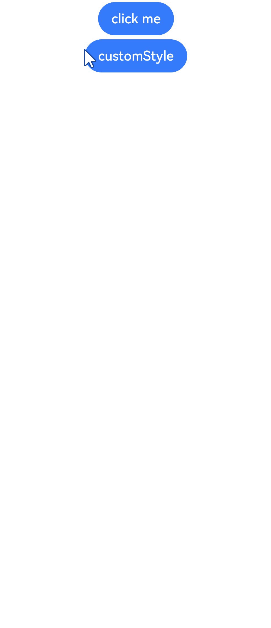

# 自定义弹窗

通过CustomDialogController类显示自定义弹窗。使用弹窗组件时，可优先考虑自定义弹窗，便于自定义弹窗的样式与内容。

> **说明：**
>
> 从API Version 7开始支持。后续版本如有新增内容，则采用上角标单独标记该内容的起始版本。


## 接口

CustomDialogController(value:{builder: CustomDialog, cancel?: () =&gt; void, autoCancel?: boolean, alignment?: DialogAlignment, offset?: Offset, customStyle?: boolean, gridCount?: number})


**参数:**

| 参数名                    | 参数类型                                     | 必填                  | 参数描述                   |
| ---------------------- | ---------------------------------------- | ------------------------- | ---------------------- |
| builder                | [CustomDialog](../../quick-start/arkts-dynamic-ui-elememt-building.md#customdialog) | 是     | 自定义弹窗内容构造器。            |
| cancel                 | ()&nbsp;=&gt;&nbsp;void                            | 否              | 点击遮障层退出时的回调。           |
| autoCancel             | boolean                                            | 否              | 是否允许点击遮障层退出。<br>默认值：true           |
| alignment              | [DialogAlignment](ts-methods-alert-dialog-box.md#dialogalignment枚举说明)           | 否              | 弹窗在竖直方向上的对齐方式。<br>默认值：DialogAlignment.Default        |
| offset                 | [Offset](ts-types.md#offset) | 否    | 弹窗相对alignment所在位置的偏移量。 |
| customStyle            | boolean                                  | 否                    | 弹窗容器样式是否自定义。<br>默认值：false           |
| gridCount<sup>8+</sup> | number                                   | 否                    | 弹窗宽度占[栅格宽度](../../ui/ui-ts-layout-grid-container-new.md)的个数。<br>默认值为4，异常值按默认值处理，最大栅格数为系统最大栅格数。 |


## CustomDialogController

### 导入对象

```ts
dialogController : CustomDialogController = new CustomDialogController(value:{builder: CustomDialog, cancel?: () => void, autoCancel?: boolean})
```

### open()
open(): void


显示自定义弹窗内容，若已显示，则不生效。


### close
close(): void


关闭显示的自定义弹窗，若已关闭，则不生效。


## 示例

```ts
// xxx.ets
@CustomDialog
struct CustomDialogExample {
  @Link textValue: string
  @Link inputValue: string
  controller: CustomDialogController
  cancel: () => void
  confirm: () => void

  build() {
    Column() {
      Text('Change text').fontSize(20).margin({ top: 10, bottom: 10 })
      TextInput({ placeholder: '', text: this.textValue }).height(60).width('90%')
        .onChange((value: string) => {
          this.textValue = value
        })
      Text('Whether to change a text?').fontSize(16).margin({ bottom: 10 })
      Flex({ justifyContent: FlexAlign.SpaceAround }) {
        Button('cancel')
          .onClick(() => {
            this.controller.close()
            this.cancel()
          }).backgroundColor(0xffffff).fontColor(Color.Black)
        Button('confirm')
          .onClick(() => {
            this.inputValue = this.textValue
            this.controller.close()
            this.confirm()
          }).backgroundColor(0xffffff).fontColor(Color.Red)
      }.margin({ bottom: 10 })
    }
  }
}

@Entry
@Component
struct CustomDialogUser {
  @State textValue: string = ''
  @State inputValue: string = 'click me'
  dialogController: CustomDialogController = new CustomDialogController({
    builder: CustomDialogExample({
      cancel: this.onCancel,
      confirm: this.onAccept,
      textValue: $textValue,
      inputValue: $inputValue
    }),
    cancel: this.existApp,
    autoCancel: true,
    alignment: DialogAlignment.Default,
    offset: { dx: 0, dy: -20 },
    gridCount: 4,
    customStyle: false
  })

  onCancel() {
    console.info('Callback when the first button is clicked')
  }

  onAccept() {
    console.info('Callback when the second button is clicked')
  }

  existApp() {
    console.info('Click the callback in the blank area')
  }

  build() {
    Column() {
      Button(this.inputValue)
        .onClick(() => {
          this.dialogController.open()
        }).backgroundColor(0x317aff)
    }.width('100%').margin({ top: 5 })
  }
}
```


