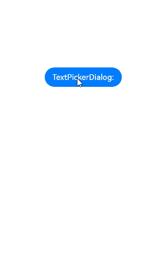

# 文本滑动选择器弹窗（TextPickerDialog）

根据指定的选择范围创建文本选择器，展示在弹窗上。

>  **说明：**
>
> 该组件从API Version 8开始支持。后续版本如有新增内容，则采用上角标单独标记该内容的起始版本。
>
> 本模块功能依赖UI的执行上下文，不可在UI上下文不明确的地方使用，参见[UIContext](../apis/js-apis-arkui-UIContext.md#uicontext)说明。
>
> 从API version 10开始，可以通过使用[UIContext](../apis/js-apis-arkui-UIContext.md#uicontext)中的[showTextPickerDialog](../apis/js-apis-arkui-UIContext.md#showtextpickerdialog)来明确UI的执行上下文。

## TextPickerDialog.show

show(options?: TextPickerDialogOptions)

定义文本滑动选择器弹窗并弹出。

**TextPickerDialogOptions参数：**

| 参数名 | 参数类型 | 必填 |  参数描述 |
| -------- | -------- | -------- |  -------- |
| range | string[]&nbsp;\|&nbsp;[Resource](ts-types.md#resource)\|[TextPickerRangeContent](ts-basic-components-textpicker.md#textpickerrangecontent10类型说明)[]<sup>10+</sup> | 是 | 设置文本选择器的选择范围。不可设置为空数组，若设置为空数组，则不弹出弹窗。<br/>**说明：** <br/>Resource类型只支持[strarray.json](../../quick-start/resource-categories-and-access.md#资源组目录)。 |
| selected | number | 否 |  设置选中项的索引值。<br>默认值：0 |
| value       | string           | 否    | 设置选中项的文本内容。当设置了selected参数时，该参数不生效。如果设置的value值不在range范围内，则默认取range第一个元素。<br>**说明**：只有显示文本列表时该值有效。显示图片或图片加文本的列表时，该值无效。 |
| defaultPickerItemHeight | number \| string | 否 | 设置选择器中选项的高度。 |
| disappearTextStyle<sup>10+</sup> | [PickerTextStyle](ts-basic-components-datepicker.md#pickertextstyle10类型说明) | 否 | 设置所有选项中最上和最下两个选项的文本颜色、字号、字体粗细。<br/>默认值：<br/>{<br/>color: '#ff182431',<br/>font: {<br/>size: '14fp', <br/>weight: FontWeight.Regular<br/>}<br/>} |
| textStyle<sup>10+</sup> | [PickerTextStyle](ts-basic-components-datepicker.md#pickertextstyle10类型说明) | 否 | 设置所有选项中除了最上、最下及选中项以外的文本颜色、字号、字体粗细。<br/>默认值：<br/>{<br/>color: '#ff182431',<br/>font: {<br/>size: '16fp', <br/>weight: FontWeight.Regular<br/>}<br/>} |
| selectedTextStyle<sup>10+</sup> | [PickerTextStyle](ts-basic-components-datepicker.md#pickertextstyle10类型说明) | 否 | 设置选中项的文本颜色、字号、字体粗细。<br/>默认值：<br/>{<br/>color: '#ff007dff',<br/>font: {<br/>size: '20vp', <br/>weight: FontWeight.Medium<br/>}<br/>} |
| canLoop<sup>10+</sup> | boolean | 否 | 设置是否可循环滚动，true：可循环，false：不可循环，默认值：true。 |
| alignment<sup>10+</sup>  | [DialogAlignment](ts-methods-alert-dialog-box.md#dialogalignment枚举说明) | 否   | 弹窗在竖直方向上的对齐方式。<br>默认值：DialogAlignment.Default |
| offset<sup>10+</sup>     | [Offset](ts-types.md#offset) | 否     | 弹窗相对alignment所在位置的偏移量。<br/>默认值：{&nbsp;dx:&nbsp;0&nbsp;,&nbsp;dy:&nbsp;-56&nbsp;} |
| maskRect<sup>10+</sup>| [Rectangle](ts-methods-alert-dialog-box.md#rectangle10类型说明) | 否     | 弹窗遮蔽层区域，在遮蔽层区域内的事件不透传，在遮蔽层区域外的事件透传。<br/>默认值：{ x: 0, y: 0, width: '100%', height: '100%' } |
| onAccept | (value: [TextPickerResult](#textpickerresult对象说明)) => void | 否 |  点击弹窗中的“确定”按钮时触发该回调。 |
| onCancel | () => void | 否 | 点击弹窗中的“取消”按钮时触发该回调。 |
| onChange | (value: [TextPickerResult](#textpickerresult对象说明)) => void | 否 |  滑动弹窗中的选择器使当前选中项改变时触发该回调。 |

## TextPickerResult对象说明

| 名称 | 类型 | 描述 |
| -------- | -------- | -------- |
| value | string \| string []<sup>10+</sup> | 选中项的文本内容。<br/>**说明**：当显示文本或图片加文本列表时，value值为选中项中的文本值。（文本选择器显示多列时，value为数组类型。）<br/>当显示图片列表时，value值为空。 |
| index | number \| number []<sup>10+</sup> | 选中项在选择范围数组中的索引值。（文本选择器显示多列时，index为数组类型。） |

## 示例

```ts
// xxx.ets
@Entry
@Component
struct TextPickerDialogExample {
  private select: number | number[] = 0
  private fruits: string[] = ['apple1', 'orange2', 'peach3', 'grape4', 'banana5']
  @State v:string = '';

  build() {
    Row() {
      Column() {
        Button("TextPickerDialog:" + this.v)
          .margin(20)
          .onClick(() => {
            TextPickerDialog.show({
              range: this.fruits,
              selected: this.select,
              disappearTextStyle: {color: Color.Red, font: {size: 15, weight: FontWeight.Lighter}},
              textStyle: {color: Color.Black, font: {size: 20, weight: FontWeight.Normal}},
              selectedTextStyle: {color: Color.Blue, font: {size: 30, weight: FontWeight.Bolder}},
              onAccept: (value: TextPickerResult) => {
                // 设置select为按下确定按钮时候的选中项index，这样当弹窗再次弹出时显示选中的是上一次确定的选项
                this.select = value.index
                console.log(this.select + '')
                // 点击确定后，被选到的文本数据展示到页面
                this.v = value.value as string
                console.info("TextPickerDialog:onAccept()" + JSON.stringify(value))
              },
              onCancel: () => {
                console.info("TextPickerDialog:onCancel()")
              },
              onChange: (value: TextPickerResult) => {
                console.info("TextPickerDialog:onChange()" + JSON.stringify(value))
              }
            })
          })
      }.width('100%')
    }.height('100%')
  }
}
```


