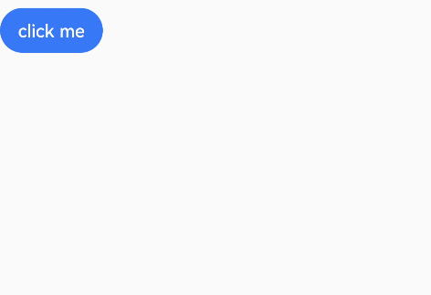

# 路径动画

设置组件进行位移动画时的运动路径。

>  **说明：**
>
> 从API Version 7开始支持。后续版本如有新增内容，则采用上角标单独标记该内容的起始版本。


## 属性

| 名称 | 参数类型 | 默认值 | 描述 |
| -------- | -------- | -------- | -------- |
| motionPath | {<br/>path:&nbsp;string,<br/>from?:&nbsp;number,<br/>to?:&nbsp;number,<br/>rotatable?:&nbsp;boolean<br/>}<br/>**说明：**<br/>path中支持使用start和end进行起点和终点的替代，如：<br/>'Mstart.x&nbsp;start.y&nbsp;L50&nbsp;50&nbsp;Lend.x&nbsp;end.y&nbsp;Z'，更多说明请参考[绘制路径](../../ui/ui-js-components-svg-path.md)。 | {<br/>'',<br/>0.0,<br/>1.0,<br/>false<br/>} | 设置组件的运动路径，入参说明如下：<br/>-&nbsp;path：位移动画的运动路径，使用svg路径字符串。<br/>-&nbsp;from：运动路径的起点。<br/>默认值：0.0<br/>取值范围：[0, 1]<br/>设置小于0的值时，按值为0处理。设置大于1的值时，按值为1处理。<br/>-&nbsp;to：运动路径的终点。<br/>默认值：1.0<br/>取值范围：[0, 1]<br/>设置小于0的值时，按值为0处理。设置大于1的值时，按值为1处理。<br/>-&nbsp;rotatable：是否跟随路径进行旋转。 |


## 示例

```ts
// xxx.ets
@Entry
@Component
struct MotionPathExample {
  @State toggle: boolean = true

  build() {
    Column() {
      Button('click me').margin(50)
        // 执行动画：从起点移动到(300,200)，再到(300,500)，再到终点
        .motionPath({ path: 'Mstart.x start.y L300 200 L300 500 Lend.x end.y', from: 0.0, to: 1.0, rotatable: true })
        .onClick(() => {
          animateTo({ duration: 4000, curve: Curve.Linear }, () => {
            this.toggle = !this.toggle // 通过this.toggle变化组件的位置
          })
        })
    }.width('100%').height('100%').alignItems(this.toggle ? HorizontalAlign.Start : HorizontalAlign.Center)
  }
}
```


