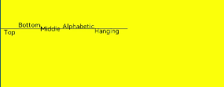
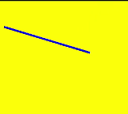

# OffscreenCanvasRenderingContext2D

使用OffscreenCanvasRenderingContext2D在Canvas上进行离屏绘制，绘制对象可以是矩形、文本、图片等。离屏绘制是指将需要绘制的内容先绘制在缓存区，然后将其转换成图片，一次性绘制到canvas上，加快了绘制速度。

>  **说明：**
>
>  从 API Version 8 开始支持。后续版本如有新增内容，则采用上角标单独标记该内容的起始版本。


## 接口

OffscreenCanvasRenderingContext2D(width: number, height: number, settings?: RenderingContextSettings)

从API version 9开始，该接口支持在ArkTS卡片中使用。

**参数：**

| 参数名      | 参数类型                                     | 必填   | 参数描述                           |
| -------- | ---------------------------------------- | ---- | ------------------------------ |
| width    | number                                   | 是    | 离屏画布的宽度，单位：vp。                        |
| height   | number                                   | 是    | 离屏画布的高度，单位：vp。                        |
| settings | [RenderingContextSettings](ts-canvasrenderingcontext2d.md#renderingcontextsettings) | 否    | 见RenderingContextSettings接口描述。 |


## 属性

| 名称                                       | 类型                                       | 描述                                       |
| ---------------------------------------- | ---------------------------------------- | ---------------------------------------- |
| [fillStyle](#fillstyle)                  | string&nbsp;\|number<sup>10+</sup>&nbsp;\|[CanvasGradient](ts-components-canvas-canvasgradient.md)&nbsp;\|&nbsp;[CanvasPattern](ts-components-canvas-canvaspattern.md#canvaspattern) | 指定绘制的填充色。<br/>-&nbsp;类型为string时，表示设置填充区域的颜色。<br/>- 类型为number时，表示设置填充区域的颜色。<br/>-&nbsp;类型为CanvasGradient时，表示渐变对象，使用[createLinearGradient](#createlineargradient)方法创建。<br/>-&nbsp;类型为CanvasPattern时，使用[createPattern](#createpattern)方法创建。<br/>从API version 9开始，该接口支持在ArkTS卡片中使用。 |
| [lineWidth](#linewidth)                  | number                                   | 设置绘制线条的宽度。<br/>单位：vp。<br/>从API version 9开始，该接口支持在ArkTS卡片中使用。 |
| [strokeStyle](#strokestyle)              | string&nbsp;\|number<sup>10+</sup>&nbsp;\|[CanvasGradient](ts-components-canvas-canvasgradient.md)&nbsp;\|&nbsp;[CanvasPattern](ts-components-canvas-canvaspattern.md#canvaspattern) | 设置描边的颜色。<br/>-&nbsp;类型为string时，表示设置描边使用的颜色。<br/>- 类型为number时，表示设置描边使用的颜色。<br/>-&nbsp;类型为CanvasGradient时，表示渐变对象，使用[createLinearGradient](#createlineargradient)方法创建。<br/>-&nbsp;类型为CanvasPattern时，使用[createPattern](#createpattern)方法创建。<br/>从API version 9开始，该接口支持在ArkTS卡片中使用。 |
| [lineCap](#linecap)                      | [CanvasLineCap](ts-canvasrenderingcontext2d.md#canvaslinecap)                            | 指定线端点的样式，可选值为：<br/>-&nbsp;'butt'：线端点以方形结束。<br/>-&nbsp;'round'：线端点以圆形结束。<br/>-&nbsp;'square'：线端点以方形结束，该样式下会增加一个长度和线段厚度相同，宽度是线段厚度一半的矩形。<br/>默认值：'butt'。<br/>从API version 9开始，该接口支持在ArkTS卡片中使用。 |
| [lineJoin](#linejoin)                    | [CanvasLineJoin](ts-canvasrenderingcontext2d.md#canvaslinejoin)                           | 指定线段间相交的交点样式，可选值为：<br/>-&nbsp;'round'：在线段相连处绘制一个扇形，扇形的圆角半径是线段的宽度。<br/>-&nbsp;'bevel'：在线段相连处使用三角形为底填充，&nbsp;每个部分矩形拐角独立。<br/>-&nbsp;'miter'：在相连部分的外边缘处进行延伸，使其相交于一点，形成一个菱形区域，该属性可以通过设置miterLimit属性展现效果。<br/>默认值：'miter'。<br/>从API version 9开始，该接口支持在ArkTS卡片中使用。 |
| [miterLimit](#miterlimit)                | number                                   | 设置斜接面限制值，该值指定了线条相交处内角和外角的距离。  <br/>默认值：10。<br/>单位：px。<br/>从API version 9开始，该接口支持在ArkTS卡片中使用。 |
| [font](#font)                            | string                                   | 设置文本绘制中的字体样式。<br/>语法：ctx.font='font-size&nbsp;font-family'<br/>-&nbsp;font-size(可选)，指定字号和行高，单位支持px和vp。<br/>-&nbsp;font-family(可选)，指定字体系列。<br/>语法：ctx.font='font-style&nbsp;font-weight&nbsp;font-size&nbsp;font-family'<br/>-&nbsp;font-style(可选)，用于指定字体样式，支持如下几种样式：'normal','italic'。<br/>-&nbsp;font-weight(可选)，用于指定字体的粗细，支持如下几种类型：'normal',&nbsp;'bold',&nbsp;'bolder',&nbsp;'lighter',&nbsp;100,&nbsp;200,&nbsp;300,&nbsp;400,&nbsp;500,&nbsp;600,&nbsp;700,&nbsp;800,&nbsp;900。<br/>-&nbsp;font-size(可选)，指定字号和行高，单位支持px、vp。使用时需要添加单位。<br/>-&nbsp;font-family(可选)，指定字体系列，支持如下几种类型：'sans-serif',&nbsp;'serif',&nbsp;'monospace'。<br/>默认值：'normal normal 14px sans-serif'<br/>从API version 9开始，该接口支持在ArkTS卡片中使用。 |
| [textAlign](#textalign)                  | [CanvasTextAlign](ts-canvasrenderingcontext2d.md#canvastextalign)                          | 设置文本绘制中的文本对齐方式，可选值为：<br/>-&nbsp;'left'：文本左对齐。<br/>-&nbsp;'right'：文本右对齐。<br/>-&nbsp;'center'：文本居中对齐。<br/>-&nbsp;'start'：文本对齐界线开始的地方。<br/>-&nbsp;'end'：文本对齐界线结束的地方。<br/>> **说明：**<br/>>&nbsp;ltr布局模式下'start'和'left'一致，rtl布局模式下'start'和'right'一致·。<br/>默认值：'left'。<br/>从API version 9开始，该接口支持在ArkTS卡片中使用。 |
| [textBaseline](#textbaseline)            | [CanvasTextBaseline](ts-canvasrenderingcontext2d.md#canvastextbaseline)                       | 设置文本绘制中的水平对齐方式，可选值为：<br/>-&nbsp;'alphabetic'：文本基线是标准的字母基线。<br/>-&nbsp;'top'：文本基线在文本块的顶部。<br/>-&nbsp;'hanging'：文本基线是悬挂基线。<br/>-&nbsp;'middle'：文本基线在文本块的中间。<br/>-&nbsp;'ideographic'：文字基线是表意字基线；如果字符本身超出了alphabetic基线，那么ideograhpic基线位置在字符本身的底部。<br/>-&nbsp;'bottom'：文本基线在文本块的底部。&nbsp;与ideographic基线的区别在于ideographic基线不需要考虑下行字母。<br/>默认值：'alphabetic'。<br/>从API version 9开始，该接口支持在ArkTS卡片中使用。 |
| [globalAlpha](#globalalpha)              | number                                   | 设置透明度，0.0为完全透明，1.0为完全不透明。                |
| [lineDashOffset](#linedashoffset)        | number                                   | 设置画布的虚线偏移量，精度为float。    <br/>默认值：0.0。<br/>单位：px。<br/>从API version 9开始，该接口支持在ArkTS卡片中使用。 |
| [globalCompositeOperation](#globalcompositeoperation) | string                                   | 设置合成操作的方式。类型字段可选值有'source-over'，'source-atop'，'source-in'，'source-out'，'destination-over'，'destination-atop'，'destination-in'，'destination-out'，'lighter'，'copy'，'xor'。<br/>-&nbsp;默认值：'source-over'。<br/>从API version 9开始，该接口支持在ArkTS卡片中使用。 |
| [shadowBlur](#shadowblur)                | number                                   | 设置绘制阴影时的模糊级别，值越大越模糊，精度为float。   <br/>默认值：0.0。<br/>从API version 9开始，该接口支持在ArkTS卡片中使用。 |
| [shadowColor](#shadowcolor)              | string                                   | 设置绘制阴影时的阴影颜色。<br/>从API version 9开始，该接口支持在ArkTS卡片中使用。 |
| [shadowOffsetX](#shadowoffsetx)          | number                                   | 设置绘制阴影时和原有对象的水平偏移值。<br/>单位：vp。<br/>从API version 9开始，该接口支持在ArkTS卡片中使用。 |
| [shadowOffsetY](#shadowoffsety)          | number                                   | 设置绘制阴影时和原有对象的垂直偏移值。<br/>单位：vp。<br/>从API version 9开始，该接口支持在ArkTS卡片中使用。 |
| [imageSmoothingEnabled](#imagesmoothingenabled) | boolean                                  | 用于设置绘制图片时是否进行图像平滑度调整，true为启用，false为不启用。 <br/>默认值：true。<br/>从API version 9开始，该接口支持在ArkTS卡片中使用。 |
| [imageSmoothingQuality](#imagesmoothingquality) | [ImageSmoothingQuality](ts-canvasrenderingcontext2d.md#imagesmoothingquality-1)                    | imageSmoothingEnabled为true时，用于设置图像平滑度。可选值为：<br/>- 'low'：低画质<br/>- 'medium'：中画质<br/>- 'high'：高画质。<br/>默认值：low<br/>从API version 9开始，该接口支持在ArkTS卡片中使用。 |
| [direction](#direction)                  | [CanvasDirection](ts-canvasrenderingcontext2d.md#canvasdirection)                          | 用于设置绘制文字时使用的文字方向。可选值为：<br/>- 'inherit'：继承canvas组件已设定的文本方向<br/>- 'ltr'：从左往右<br/>- 'rtl'：从右往左。<br/>默认值：inherit<br/>从API version 9开始，该接口支持在ArkTS卡片中使用。 |
| [filter](#filter)                        | string                                   | 用于设置图像的滤镜。支持的滤镜效果如下：<br/>- 'none': 无滤镜效果<br/>- 'blur'：给图像设置高斯模糊<br/>- 'brightness'：给图片应用一种线性乘法，使其看起来更亮或更暗<br/>- 'contrast'：调整图像的对比度<br/>- 'grayscale'：将图像转换为灰度图像<br/>- 'hue-rotate'：给图像应用色相旋转<br/>- 'invert'：反转输入图像<br/>- 'opacity'：转化图像的透明程度<br/>- 'saturate'：转换图像饱和度<br/>- 'sepia'：将图像转换为深褐色<br/>默认值：'none'<br/>从API version 9开始，该接口支持在ArkTS卡片中使用。 |

> **说明：**
> fillStyle、shadowColor与 strokeStyle 中string类型格式为 'rgb(255, 255, 255)'，'rgba(255, 255, 255, 1.0)'，'\#FFFFFF'。


### fillStyle

```ts
// xxx.ets
@Entry
@Component
struct FillStyleExample {
  private settings: RenderingContextSettings = new RenderingContextSettings(true)
  private context: CanvasRenderingContext2D = new CanvasRenderingContext2D(this.settings)
  private offCanvas: OffscreenCanvas = new OffscreenCanvas(600, 600)

  build() {
    Flex({ direction: FlexDirection.Column, alignItems: ItemAlign.Center, justifyContent: FlexAlign.Center }) {
      Canvas(this.context)
        .width('100%')
        .height('100%')
        .backgroundColor('#ffff00')
        .onReady(() =>{
          let offContext = this.offCanvas.getContext("2d", this.settings)
          offContext.fillStyle = '#0000ff'
          offContext.fillRect(20, 20, 150, 100)
          let image = this.offCanvas.transferToImageBitmap()
          this.context.transferFromImageBitmap(image)
        })
    }
    .width('100%')
    .height('100%')
  }
}
```


```ts
// xxx.ets
@Entry
@Component
struct FillStyleExample {
  private settings: RenderingContextSettings = new RenderingContextSettings(true)
  private context: CanvasRenderingContext2D = new CanvasRenderingContext2D(this.settings)
  private offCanvas: OffscreenCanvas = new OffscreenCanvas(600, 600)

  build() {
    Flex({ direction: FlexDirection.Column, alignItems: ItemAlign.Center, justifyContent: FlexAlign.Center }) {
      Canvas(this.context)
        .width('100%')
        .height('100%')
        .backgroundColor('#ffff00')
        .onReady(() =>{
          let offContext = this.offCanvas.getContext("2d", this.settings)
          offContext.fillStyle = 0x0000FF
          offContext.fillRect(20, 20, 150, 100)
          let image = this.offCanvas.transferToImageBitmap()
          this.context.transferFromImageBitmap(image)
        })
    }
    .width('100%')
    .height('100%')
  }
}
```


### lineWidth

```ts
// xxx.ets
@Entry
@Component
struct LineWidthExample {
  private settings: RenderingContextSettings = new RenderingContextSettings(true)
  private context: CanvasRenderingContext2D = new CanvasRenderingContext2D(this.settings)
  private offCanvas: OffscreenCanvas = new OffscreenCanvas(600, 600)

  build() {
    Flex({ direction: FlexDirection.Column, alignItems: ItemAlign.Center, justifyContent: FlexAlign.Center }) {
      Canvas(this.context)
        .width('100%')
        .height('100%')
        .backgroundColor('#ffff00')
        .onReady(() =>{
          let offContext = this.offCanvas.getContext("2d", this.settings)
          offContext.lineWidth = 5
          offContext.strokeRect(25, 25, 85, 105)
          let image = this.offCanvas.transferToImageBitmap()
          this.context.transferFromImageBitmap(image)
      })
    }
    .width('100%')
    .height('100%')
  }
}
```


### strokeStyle

```ts
// xxx.ets
@Entry
@Component
struct StrokeStyleExample {
  private settings: RenderingContextSettings = new RenderingContextSettings(true)
  private context: CanvasRenderingContext2D = new CanvasRenderingContext2D(this.settings)
  private offCanvas: OffscreenCanvas = new OffscreenCanvas(600, 600)

  build() {
    Flex({ direction: FlexDirection.Column, alignItems: ItemAlign.Center, justifyContent: FlexAlign.Center }) {
      Canvas(this.context)
        .width('100%')
        .height('100%')
        .backgroundColor('#ffff00')
        .onReady(() =>{
          let offContext = this.offCanvas.getContext("2d", this.settings)
          offContext.lineWidth = 10
          offContext.strokeStyle = '#0000ff'
          offContext.strokeRect(25, 25, 155, 105)
          let image = this.offCanvas.transferToImageBitmap()
          this.context.transferFromImageBitmap(image)
        })
    }
    .width('100%')
    .height('100%')
  }
}
```


```ts
// xxx.ets
@Entry
@Component
struct StrokeStyleExample {
  private settings: RenderingContextSettings = new RenderingContextSettings(true)
  private context: CanvasRenderingContext2D = new CanvasRenderingContext2D(this.settings)
  private offCanvas: OffscreenCanvas = new OffscreenCanvas(600, 600)

  build() {
    Flex({ direction: FlexDirection.Column, alignItems: ItemAlign.Center, justifyContent: FlexAlign.Center }) {
      Canvas(this.context)
        .width('100%')
        .height('100%')
        .backgroundColor('#ffff00')
        .onReady(() =>{
          let offContext = this.offCanvas.getContext("2d", this.settings)
          offContext.lineWidth = 10
          offContext.strokeStyle = 0x0000ff
          offContext.strokeRect(25, 25, 155, 105)
          let image = this.offCanvas.transferToImageBitmap()
          this.context.transferFromImageBitmap(image)
        })
    }
    .width('100%')
    .height('100%')
  }
}
```


### lineCap

```ts
// xxx.ets
@Entry
@Component
struct LineCapExample {
  private settings: RenderingContextSettings = new RenderingContextSettings(true)
  private context: CanvasRenderingContext2D = new CanvasRenderingContext2D(this.settings)
  private offCanvas: OffscreenCanvas = new OffscreenCanvas(600, 600)

  build() {
    Flex({ direction: FlexDirection.Column, alignItems: ItemAlign.Center, justifyContent: FlexAlign.Center }) {
      Canvas(this.context)
        .width('100%')
        .height('100%')
        .backgroundColor('#ffff00')
        .onReady(() =>{
          let offContext = this.offCanvas.getContext("2d", this.settings)
          offContext.lineWidth = 8
          offContext.beginPath()
          offContext.lineCap = 'round'
          offContext.moveTo(30, 50)
          offContext.lineTo(220, 50)
          offContext.stroke()
          let image = this.offCanvas.transferToImageBitmap()
          this.context.transferFromImageBitmap(image)
        })
    }
    .width('100%')
    .height('100%')
  }
}
```


### lineJoin

```ts
// xxx.ets
@Entry
@Component
struct LineJoinExample {
  private settings: RenderingContextSettings = new RenderingContextSettings(true)
  private context: CanvasRenderingContext2D = new CanvasRenderingContext2D(this.settings)
  private offCanvas: OffscreenCanvas = new OffscreenCanvas(600, 600)

  build() {
    Flex({ direction: FlexDirection.Column, alignItems: ItemAlign.Center, justifyContent: FlexAlign.Center }) {
      Canvas(this.context)
        .width('100%')
        .height('100%')
        .backgroundColor('#ffff00')
        .onReady(() =>{
          let offContext = this.offCanvas.getContext("2d", this.settings)
          offContext.beginPath()
          offContext.lineWidth = 8
          offContext.lineJoin = 'miter'
          offContext.moveTo(30, 30)
          offContext.lineTo(120, 60)
          offContext.lineTo(30, 110)
          offContext.stroke()
          let image = this.offCanvas.transferToImageBitmap()
          this.context.transferFromImageBitmap(image)
      })
    }
    .width('100%')
    .height('100%')
  }
}
```


### miterLimit

```ts
// xxx.ets
@Entry
@Component
struct MiterLimit {
  private settings: RenderingContextSettings = new RenderingContextSettings(true)
  private context: CanvasRenderingContext2D = new CanvasRenderingContext2D(this.settings)
  private offCanvas: OffscreenCanvas = new OffscreenCanvas(600, 600)
  
  build() {
    Flex({ direction: FlexDirection.Column, alignItems: ItemAlign.Center, justifyContent: FlexAlign.Center }) {
      Canvas(this.context)
        .width('100%')
        .height('100%')
        .backgroundColor('#ffff00')
        .onReady(() =>{
          let offContext = this.offCanvas.getContext("2d", this.settings)
          offContext.lineWidth = 8
          offContext.lineJoin = 'miter'
          offContext.miterLimit = 3
          offContext.moveTo(30, 30)
          offContext.lineTo(60, 35)
          offContext.lineTo(30, 37)
          offContext.stroke()
          let image = this.offCanvas.transferToImageBitmap()
          this.context.transferFromImageBitmap(image)
      })
    }
    .width('100%')
    .height('100%')
  }
}
```


### font

```ts
// xxx.ets
@Entry
@Component
struct Fonts {
  private settings: RenderingContextSettings = new RenderingContextSettings(true)
  private context: CanvasRenderingContext2D = new CanvasRenderingContext2D(this.settings)
  private offCanvas: OffscreenCanvas = new OffscreenCanvas(600, 600)

  build() {
    Flex({ direction: FlexDirection.Column, alignItems: ItemAlign.Center, justifyContent: FlexAlign.Center }) {
      Canvas(this.context)
        .width('100%')
        .height('100%')
        .backgroundColor('#ffff00')
        .onReady(() =>{
          let offContext = this.offCanvas.getContext("2d", this.settings)
          offContext.font = '30px sans-serif'
          offContext.fillText("Hello px", 20, 60)
          offContext.font = '30vp sans-serif'
          offContext.fillText("Hello vp", 20, 100)
          let image = this.offCanvas.transferToImageBitmap()
          this.context.transferFromImageBitmap(image)
        })
    }
    .width('100%')
    .height('100%')
  }
}
```


### textAlign

```ts
// xxx.ets
@Entry
@Component
struct CanvasExample {
  private settings: RenderingContextSettings = new RenderingContextSettings(true)
  private context: CanvasRenderingContext2D = new CanvasRenderingContext2D(this.settings)
  private offCanvas: OffscreenCanvas = new OffscreenCanvas(600, 600)
  
  build() {
    Flex({ direction: FlexDirection.Column, alignItems: ItemAlign.Center, justifyContent: FlexAlign.Center }) {
      Canvas(this.context)
        .width('100%')
        .height('100%')
        .backgroundColor('#ffff00')
        .onReady(() =>{
        let offContext = this.offCanvas.getContext("2d", this.settings)
        offContext.strokeStyle = '#0000ff'
        offContext.moveTo(140, 10)
        offContext.lineTo(140, 160)
        offContext.stroke()

        offContext.font = '18px sans-serif'

        offContext.textAlign = 'start'
        offContext.fillText('textAlign=start', 140, 60)
        offContext.textAlign = 'end'
        offContext.fillText('textAlign=end', 140, 80)
        offContext.textAlign = 'left'
        offContext.fillText('textAlign=left', 140, 100)
        offContext.textAlign = 'center'
        offContext.fillText('textAlign=center',140, 120)
        offContext.textAlign = 'right'
        offContext.fillText('textAlign=right',140, 140)
        let image = this.offCanvas.transferToImageBitmap()
        this.context.transferFromImageBitmap(image)
      })
    }
    .width('100%')
    .height('100%')
  }
}
```


### textBaseline

```ts
// xxx.ets
@Entry
@Component
struct TextBaseline {
  private settings: RenderingContextSettings = new RenderingContextSettings(true)
  private context: CanvasRenderingContext2D = new CanvasRenderingContext2D(this.settings)
  private offCanvas: OffscreenCanvas = new OffscreenCanvas(600, 600)
  
  build() {
    Flex({ direction: FlexDirection.Column, alignItems: ItemAlign.Center, justifyContent: FlexAlign.Center }) {
      Canvas(this.context)
        .width('100%')
        .height('100%')
        .backgroundColor('#ffff00')
        .onReady(() =>{
          let offContext = this.offCanvas.getContext("2d", this.settings)
          offContext.strokeStyle = '#0000ff'
          offContext.moveTo(0, 120)
          offContext.lineTo(400, 120)
          offContext.stroke()

          offContext.font = '20px sans-serif'

          offContext.textBaseline = 'top'
          offContext.fillText('Top', 10, 120)
          offContext.textBaseline = 'bottom'
          offContext.fillText('Bottom', 55, 120)
          offContext.textBaseline = 'middle'
          offContext.fillText('Middle', 125, 120)
          offContext.textBaseline = 'alphabetic'
          offContext.fillText('Alphabetic', 195, 120)
          offContext.textBaseline = 'hanging'
          offContext.fillText('Hanging', 295, 120)
          let image = this.offCanvas.transferToImageBitmap()
          this.context.transferFromImageBitmap(image)
      })
    }
    .width('100%')
    .height('100%')
  }
}
```




### globalAlpha

```ts
// xxx.ets
@Entry
@Component
struct GlobalAlpha {
  private settings: RenderingContextSettings = new RenderingContextSettings(true)
  private context: CanvasRenderingContext2D = new CanvasRenderingContext2D(this.settings)
  private offCanvas: OffscreenCanvas = new OffscreenCanvas(600, 600)
  
  build() {
    Flex({ direction: FlexDirection.Column, alignItems: ItemAlign.Center, justifyContent: FlexAlign.Center }) {
      Canvas(this.context)
        .width('100%')
        .height('100%')
        .backgroundColor('#ffff00')
        .onReady(() =>{
          let offContext = this.offCanvas.getContext("2d", this.settings)
          offContext.fillStyle = 'rgb(0,0,255)'
          offContext.fillRect(0, 0, 50, 50)
          offContext.globalAlpha = 0.4
          offContext.fillStyle = 'rgb(0,0,255)'
          offContext.fillRect(50, 50, 50, 50)
          let image = this.offCanvas.transferToImageBitmap()
          this.context.transferFromImageBitmap(image)
      })
    }
    .width('100%')
    .height('100%')
  }
}
```


### lineDashOffset

```ts
// xxx.ets
@Entry
@Component
struct LineDashOffset {
  private settings: RenderingContextSettings = new RenderingContextSettings(true)
  private context: CanvasRenderingContext2D = new CanvasRenderingContext2D(this.settings)
  private offCanvas: OffscreenCanvas = new OffscreenCanvas(600, 600)
  
  build() {
    Flex({ direction: FlexDirection.Column, alignItems: ItemAlign.Center, justifyContent: FlexAlign.Center }) {
      Canvas(this.context)
        .width('100%')
        .height('100%')
        .backgroundColor('#ffff00')
        .onReady(() =>{
          let offContext = this.offCanvas.getContext("2d", this.settings)
          offContext.arc(100, 75, 50, 0, 6.28)
          offContext.setLineDash([10,20])
          offContext.lineDashOffset = 10.0
          offContext.stroke()
          let image = this.offCanvas.transferToImageBitmap()
          this.context.transferFromImageBitmap(image)
      })
    }
    .width('100%')
    .height('100%')
  }
}

```


### globalCompositeOperation

| 名称               | 描述                       |
| ---------------- | ------------------------ |
| source-over      | 在现有绘制内容上显示新绘制内容，属于默认值。   |
| source-atop      | 在现有绘制内容顶部显示新绘制内容。        |
| source-in        | 在现有绘制内容中显示新绘制内容。         |
| source-out       | 在现有绘制内容之外显示新绘制内容。        |
| destination-over | 在新绘制内容上方显示现有绘制内容。        |
| destination-atop | 在新绘制内容顶部显示现有绘制内容。        |
| destination-in   | 在新绘制内容中显示现有绘制内容。         |
| destination-out  | 在新绘制内容外显示现有绘制内容。         |
| lighter          | 显示新绘制内容和现有绘制内容。          |
| copy             | 显示新绘制内容而忽略现有绘制内容。        |
| xor              | 使用异或操作对新绘制内容与现有绘制内容进行融合。 |

```ts
// xxx.ets
@Entry
@Component
struct GlobalCompositeOperation {
  private settings: RenderingContextSettings = new RenderingContextSettings(true)
  private context: CanvasRenderingContext2D = new CanvasRenderingContext2D(this.settings)
  private offCanvas: OffscreenCanvas = new OffscreenCanvas(600, 600)
  
  build() {
    Flex({ direction: FlexDirection.Column, alignItems: ItemAlign.Center, justifyContent: FlexAlign.Center }) {
      Canvas(this.context)
        .width('100%')
        .height('100%')
        .backgroundColor('#ffff00')
        .onReady(() =>{
          let offContext = this.offCanvas.getContext("2d", this.settings)
          offContext.fillStyle = 'rgb(255,0,0)'
          offContext.fillRect(20, 20, 50, 50)
          offContext.globalCompositeOperation = 'source-over'
          offContext.fillStyle = 'rgb(0,0,255)'
          offContext.fillRect(50, 50, 50, 50)
          offContext.fillStyle = 'rgb(255,0,0)'
          offContext.fillRect(120, 20, 50, 50)
          offContext.globalCompositeOperation = 'destination-over'
          offContext.fillStyle = 'rgb(0,0,255)'
          offContext.fillRect(150, 50, 50, 50)
          let image = this.offCanvas.transferToImageBitmap()
          this.context.transferFromImageBitmap(image)
      })
    }
    .width('100%')
    .height('100%')
  }
}
```


### shadowBlur

```ts
// xxx.ets
@Entry
@Component
struct ShadowBlur {
  private settings: RenderingContextSettings = new RenderingContextSettings(true)
  private context: CanvasRenderingContext2D = new CanvasRenderingContext2D(this.settings)
  private offCanvas: OffscreenCanvas = new OffscreenCanvas(600, 600)
  
  build() {
    Flex({ direction: FlexDirection.Column, alignItems: ItemAlign.Center, justifyContent: FlexAlign.Center }) {
      Canvas(this.context)
        .width('100%')
        .height('100%')
        .backgroundColor('#ffff00')
        .onReady(() =>{
          let offContext = this.offCanvas.getContext("2d", this.settings)
          offContext.shadowBlur = 30
          offContext.shadowColor = 'rgb(0,0,0)'
          offContext.fillStyle = 'rgb(255,0,0)'
          offContext.fillRect(20, 20, 100, 80)
          let image = this.offCanvas.transferToImageBitmap()
          this.context.transferFromImageBitmap(image)
      })
    }
    .width('100%')
    .height('100%')
  }
}
```


### shadowColor

```ts
// xxx.ets
@Entry
@Component
struct ShadowColor {
  private settings: RenderingContextSettings = new RenderingContextSettings(true)
  private context: CanvasRenderingContext2D = new CanvasRenderingContext2D(this.settings)
  private offCanvas: OffscreenCanvas = new OffscreenCanvas(600, 600)
  
  build() {
    Flex({ direction: FlexDirection.Column, alignItems: ItemAlign.Center, justifyContent: FlexAlign.Center }) {
      Canvas(this.context)
        .width('100%')
        .height('100%')
        .backgroundColor('#ffff00')
        .onReady(() =>{
          let offContext = this.offCanvas.getContext("2d", this.settings)
          offContext.shadowBlur = 30
          offContext.shadowColor = 'rgb(0,0,255)'
          offContext.fillStyle = 'rgb(255,0,0)'
          offContext.fillRect(30, 30, 100, 100)
          let image = this.offCanvas.transferToImageBitmap()
          this.context.transferFromImageBitmap(image)
      })
    }
    .width('100%')
    .height('100%')
  }
}
```


### shadowOffsetX

```ts
// xxx.ets
@Entry
@Component
struct ShadowOffsetX {
  private settings: RenderingContextSettings = new RenderingContextSettings(true)
  private context: CanvasRenderingContext2D = new CanvasRenderingContext2D(this.settings)
  private offCanvas: OffscreenCanvas = new OffscreenCanvas(600, 600)
  
  build() {
    Flex({ direction: FlexDirection.Column, alignItems: ItemAlign.Center, justifyContent: FlexAlign.Center }) {
      Canvas(this.context)
        .width('100%')
        .height('100%')
        .backgroundColor('#ffff00')
        .onReady(() =>{
          let offContext = this.offCanvas.getContext("2d", this.settings)
          offContext.shadowBlur = 10
          offContext.shadowOffsetX = 20
          offContext.shadowColor = 'rgb(0,0,0)'
          offContext.fillStyle = 'rgb(255,0,0)'
          offContext.fillRect(20, 20, 100, 80)
          let image = this.offCanvas.transferToImageBitmap()
          this.context.transferFromImageBitmap(image)
      })
    }
    .width('100%')
    .height('100%')
  }
}
```


### shadowOffsetY

```ts
// xxx.ets
@Entry
@Component
struct ShadowOffsetY {
  private settings: RenderingContextSettings = new RenderingContextSettings(true)
  private context: CanvasRenderingContext2D = new CanvasRenderingContext2D(this.settings)
  private offCanvas: OffscreenCanvas = new OffscreenCanvas(600, 600)

  build() {
    Flex({ direction: FlexDirection.Column, alignItems: ItemAlign.Center, justifyContent: FlexAlign.Center }) {
      Canvas(this.context)
        .width('100%')
        .height('100%')
        .backgroundColor('#ffff00')
        .onReady(() =>{
          let offContext = this.offCanvas.getContext("2d", this.settings)
          offContext.shadowBlur = 10
          offContext.shadowOffsetY = 20
          offContext.shadowColor = 'rgb(0,0,0)'
          offContext.fillStyle = 'rgb(255,0,0)'
          offContext.fillRect(30, 30, 100, 100)
          let image = this.offCanvas.transferToImageBitmap()
          this.context.transferFromImageBitmap(image)
      })
    }
    .width('100%')
    .height('100%')
  }
}
```


### imageSmoothingEnabled

```ts
// xxx.ets
@Entry
@Component
struct ImageSmoothingEnabled {
  private settings: RenderingContextSettings = new RenderingContextSettings(true)
  private context: CanvasRenderingContext2D = new CanvasRenderingContext2D(this.settings)
  private img:ImageBitmap = new ImageBitmap("common/images/icon.jpg")
  private offCanvas: OffscreenCanvas = new OffscreenCanvas(600, 600)
  
  build() {
    Flex({ direction: FlexDirection.Column, alignItems: ItemAlign.Center, justifyContent: FlexAlign.Center }) {
      Canvas(this.context)
        .width('100%')
        .height('100%')
        .backgroundColor('#ffff00')
        .onReady(() =>{
          let offContext = this.offCanvas.getContext("2d", this.settings)
          offContext.imageSmoothingEnabled = false
          offContext.drawImage(this.img,0,0,400,200)
          let image = this.offCanvas.transferToImageBitmap()
          this.context.transferFromImageBitmap(image)
      })
    }
    .width('100%')
    .height('100%')
  }
}
```


## 方法


### fillRect

fillRect(x: number, y: number, w: number, h: number): void

填充一个矩形。

从API version 9开始，该接口支持在ArkTS卡片中使用。

 **参数：**

| 参数     | 类型     | 必填   | 默认值  | 说明            |
| ------ | ------ | ---- | ---- | ------------- |
| x      | number | 是    | 0    | 指定矩形左上角点的x坐标，单位：vp。 |
| y      | number | 是    | 0    | 指定矩形左上角点的y坐标，单位：vp。 |
| width  | number | 是    | 0    | 指定矩形的宽度，单位：vp。      |
| height | number | 是    | 0    | 指定矩形的高度，单位：vp。      |

 **示例：**

  ```ts
  // xxx.ets
  @Entry
  @Component
  struct FillRect {
    private settings: RenderingContextSettings = new RenderingContextSettings(true)
    private context: CanvasRenderingContext2D = new CanvasRenderingContext2D(this.settings)
    private offCanvas: OffscreenCanvas = new OffscreenCanvas(600, 600)
    
    build() {
      Flex({ direction: FlexDirection.Column, alignItems: ItemAlign.Center, justifyContent: FlexAlign.Center }) {
        Canvas(this.context)
          .width('100%')
          .height('100%')
          .backgroundColor('#ffff00')
          .onReady(() =>{
            let offContext = this.offCanvas.getContext("2d", this.settings)
            offContext.fillRect(30,30,100,100)
            let image = this.offCanvas.transferToImageBitmap()
            this.context.transferFromImageBitmap(image)
         })
        }
      .width('100%')
      .height('100%')
    }
  }
  ```

  


### strokeRect

strokeRect(x: number, y: number, w: number, h: number): void

绘制具有边框的矩形，矩形内部不填充。

从API version 9开始，该接口支持在ArkTS卡片中使用。

 **参数：**

| 参数     | 类型     | 必填   | 默认值  | 说明           |
| ------ | ------ | ---- | ---- | ------------ |
| x      | number | 是    | 0    | 指定矩形的左上角x坐标，单位：vp。 |
| y      | number | 是    | 0    | 指定矩形的左上角y坐标，单位：vp。 |
| width  | number | 是    | 0    | 指定矩形的宽度，单位：vp。     |
| height | number | 是    | 0    | 指定矩形的高度，单位：vp。     |

 **示例：**

  ```ts
  // xxx.ets
  @Entry
  @Component
  struct StrokeRect {
    private settings: RenderingContextSettings = new RenderingContextSettings(true)
    private context: CanvasRenderingContext2D = new CanvasRenderingContext2D(this.settings)
    private offCanvas: OffscreenCanvas = new OffscreenCanvas(600, 600)

    build() {
      Flex({ direction: FlexDirection.Column, alignItems: ItemAlign.Center, justifyContent: FlexAlign.Center }) {
        Canvas(this.context)
          .width('100%')
          .height('100%')
          .backgroundColor('#ffff00')
          .onReady(() =>{
            let offContext = this.offCanvas.getContext("2d", this.settings)
            offContext.strokeRect(30, 30, 200, 150)
            let image = this.offCanvas.transferToImageBitmap()
            this.context.transferFromImageBitmap(image)
        })
      }
      .width('100%')
      .height('100%')
    }
  }
  ```

  


### clearRect

clearRect(x: number, y: number, w: number, h: number): void

删除指定区域内的绘制内容。

从API version 9开始，该接口支持在ArkTS卡片中使用。

 **参数：**

| 参数     | 类型     | 必填   | 默认值  | 描述            |
| ------ | ------ | ---- | ---- | ------------- |
| x      | number | 是    | 0    | 指定矩形上的左上角x坐标，单位：vp。 |
| y      | number | 是    | 0    | 指定矩形上的左上角y坐标，单位：vp。 |
| width  | number | 是    | 0    | 指定矩形的宽度，单位：vp。      |
| height | number | 是    | 0    | 指定矩形的高度，单位：vp。      |

 **示例：**

  ```ts
  // xxx.ets
  @Entry
  @Component
  struct ClearRect {
    private settings: RenderingContextSettings = new RenderingContextSettings(true)
    private context: CanvasRenderingContext2D = new CanvasRenderingContext2D(this.settings)
    private offCanvas: OffscreenCanvas = new OffscreenCanvas(600, 600)

    build() {
      Flex({ direction: FlexDirection.Column, alignItems: ItemAlign.Center, justifyContent: FlexAlign.Center }) {
        Canvas(this.context)
          .width('100%')
          .height('100%')
          .backgroundColor('#ffff00')
          .onReady(() =>{
            let offContext = this.offCanvas.getContext("2d", this.settings)
            offContext.fillStyle = 'rgb(0,0,255)'
            offContext.fillRect(20,20,200,200)
            offContext.clearRect(30,30,150,100)
            let image = this.offCanvas.transferToImageBitmap()
            this.context.transferFromImageBitmap(image)
        })
      }
      .width('100%')
      .height('100%')
    }
  }
  ```

  


### fillText

fillText(text: string, x: number, y: number, maxWidth?: number): void

绘制填充类文本。

从API version 9开始，该接口支持在ArkTS卡片中使用。

**参数：**

| 参数       | 类型     | 必填   | 默认值  | 说明              |
| -------- | ------ | ---- | ---- | --------------- |
| text     | string | 是    | ""   | 需要绘制的文本内容。      |
| x        | number | 是    | 0    | 需要绘制的文本的左下角x坐标，单位：vp。 |
| y        | number | 是    | 0    | 需要绘制的文本的左下角y坐标，单位：vp。 |
| maxWidth | number | 否    | -    | 指定文本允许的最大宽度，单位：vp。    |

 **示例：**

  ```ts
  // xxx.ets
  @Entry
  @Component
  struct FillText {
    private settings: RenderingContextSettings = new RenderingContextSettings(true)
    private context: CanvasRenderingContext2D = new CanvasRenderingContext2D(this.settings)
    private offCanvas: OffscreenCanvas = new OffscreenCanvas(600, 600)

    build() {
      Flex({ direction: FlexDirection.Column, alignItems: ItemAlign.Center, justifyContent: FlexAlign.Center }) {
        Canvas(this.context)
          .width('100%')
          .height('100%')
          .backgroundColor('#ffff00')
          .onReady(() =>{
            let offContext = this.offCanvas.getContext("2d", this.settings)
            offContext.font = '30px sans-serif'
            offContext.fillText("Hello World!", 20, 100)
            let image = this.offCanvas.transferToImageBitmap()
            this.context.transferFromImageBitmap(image)
        })
      }
      .width('100%')
      .height('100%')
    }
  }
  ```

  


### strokeText

strokeText(text: string, x: number, y: number): void

绘制描边类文本。

从API version 9开始，该接口支持在ArkTS卡片中使用。

**参数：**

| 参数       | 类型     | 必填   | 默认值  | 描述              |
| -------- | ------ | ---- | ---- | --------------- |
| text     | string | 是    | ""   | 需要绘制的文本内容。      |
| x        | number | 是    | 0    | 需要绘制的文本的左下角x坐标，单位：vp。 |
| y        | number | 是    | 0    | 需要绘制的文本的左下角y坐标，单位：vp。 |
| maxWidth | number | 否    | -    | 需要绘制的文本的最大宽度，单位：vp。  |

 **示例：**

  ```ts
  // xxx.ets
  @Entry
  @Component
  struct StrokeText {
    private settings: RenderingContextSettings = new RenderingContextSettings(true)
    private context: CanvasRenderingContext2D = new CanvasRenderingContext2D(this.settings)
    private offCanvas: OffscreenCanvas = new OffscreenCanvas(600, 600)

    build() {
      Flex({ direction: FlexDirection.Column, alignItems: ItemAlign.Center, justifyContent: FlexAlign.Center }) {
        Canvas(this.context)
          .width('100%')
          .height('100%')
          .backgroundColor('#ffff00')
          .onReady(() =>{
            let offContext = this.offCanvas.getContext("2d", this.settings)
            offContext.font = '55px sans-serif'
            offContext.strokeText("Hello World!", 20, 60)
            let image = this.offCanvas.transferToImageBitmap()
            this.context.transferFromImageBitmap(image)
        })
      }
      .width('100%')
      .height('100%')
    }
  }
  ```

  


### measureText

measureText(text: string): TextMetrics

该方法返回一个文本测算的对象，通过该对象可以获取指定文本的宽度值。

从API version 9开始，该接口支持在ArkTS卡片中使用。

 **参数：**

| 参数   | 类型     | 必填   | 默认值  | 说明         |
| ---- | ------ | ---- | ---- | ---------- |
| text | string | 是    | ""   | 需要进行测量的文本。 |

 **返回值：**

| 类型          | 说明                                       |
| ----------- | ---------------------------------------- |
| TextMetrics | 文本的尺寸信息<br/>从API version 9开始，该接口支持在ArkTS卡片中使用。 |

**TextMetrics类型描述:**

| 属性                       | 类型     | 描述                                       |
| ------------------------ | ------ | ---------------------------------------- |
| width                    | number | 字符串的宽度，单位：vp。                                  |
| height                   | number | 字符串的高度，单位：vp。                                  |
| actualBoundingBoxAscent  | number | 从CanvasRenderingContext2D.textBaseline 属性标明的水平线到渲染文本的矩形边界顶部的距离，当前值为0，单位：vp。 |
| actualBoundingBoxDescent | number | 从CanvasRenderingContext2D.textBaseline 属性标明的水平线到渲染文本的矩形边界底部的距离，当前值为0，单位：vp。 |
| actualBoundingBoxLeft    | number | 平行于基线，从CanvasRenderingContext2D.textAlign 属性确定的对齐点到文本矩形边界左侧的距离，当前值为0，单位：vp。 |
| actualBoundingBoxRight   | number | 平行于基线，从CanvasRenderingContext2D.textAlign 属性确定的对齐点到文本矩形边界右侧的距离，当前值为0，单位：vp。 |
| alphabeticBaseline       | number | 从CanvasRenderingContext2D.textBaseline 属性标明的水平线到线框的 alphabetic 基线的距离，当前值为0，单位：vp。 |
| emHeightAscent           | number | 从CanvasRenderingContext2D.textBaseline 属性标明的水平线到线框中 em 方块顶部的距离，当前值为0，单位：vp。 |
| emHeightDescent          | number | 从CanvasRenderingContext2D.textBaseline 属性标明的水平线到线框中 em 方块底部的距离，当前值为0，单位：vp。 |
| fontBoundingBoxAscent    | number | 从CanvasRenderingContext2D.textBaseline 属性标明的水平线到渲染文本的所有字体的矩形最高边界顶部的距离，当前值为0，单位：vp。 |
| fontBoundingBoxDescent   | number | 从CanvasRenderingContext2D.textBaseline 属性标明的水平线到渲染文本的所有字体的矩形边界最底部的距离，当前值为0，单位：vp。 |
| hangingBaseline          | number | 从CanvasRenderingContext2D.textBaseline 属性标明的水平线到线框的 hanging 基线的距离，当前值为0，单位：vp。 |
| ideographicBaseline      | number | 从CanvasRenderingContext2D.textBaseline 属性标明的水平线到线框的 ideographic 基线的距离，当前值为0，单位：vp。 |

 **示例：**

  ```ts
  // xxx.ets
  @Entry
  @Component
  struct MeasureText {
    private settings: RenderingContextSettings = new RenderingContextSettings(true)
    private context: CanvasRenderingContext2D = new CanvasRenderingContext2D(this.settings)
    private offCanvas: OffscreenCanvas = new OffscreenCanvas(600, 600)

    build() {
      Flex({ direction: FlexDirection.Column, alignItems: ItemAlign.Center, justifyContent: FlexAlign.Center }) {
        Canvas(this.context)
          .width('100%')
          .height('100%')
          .backgroundColor('#ffff00')
          .onReady(() =>{
            let offContext = this.offCanvas.getContext("2d", this.settings)
            offContext.font = '50px sans-serif'
            offContext.fillText("Hello World!", 20, 100)
            offContext.fillText("width:" + this.context.measureText("Hello World!").width, 20, 200)
            let image = this.offCanvas.transferToImageBitmap()
            this.context.transferFromImageBitmap(image)
        })
      }
      .width('100%')
      .height('100%')
    }
  }
  ```

  


### stroke

stroke(path?: Path2D): void

进行边框绘制操作。

从API version 9开始，该接口支持在ArkTS卡片中使用。

 **参数：**

| 参数   | 类型                                       | 必填   | 默认值  | 描述           |
| ---- | ---------------------------------------- | ---- | ---- | ------------ |
| path | [Path2D](ts-components-canvas-path2d.md) | 否    | null | 需要绘制的Path2D。 |

 **示例：**

  ```ts
  // xxx.ets
  @Entry
  @Component
  struct Stroke {
    private settings: RenderingContextSettings = new RenderingContextSettings(true)
    private context: CanvasRenderingContext2D = new CanvasRenderingContext2D(this.settings)
    private offCanvas: OffscreenCanvas = new OffscreenCanvas(600, 600)

    build() {
      Flex({ direction: FlexDirection.Column, alignItems: ItemAlign.Center, justifyContent: FlexAlign.Center }) {
        Canvas(this.context)
          .width('100%')
          .height('100%')
          .backgroundColor('#ffff00')
          .onReady(() =>{
            let offContext = this.offCanvas.getContext("2d", this.settings)
            offContext.moveTo(25, 25)
            offContext.lineTo(25, 105)
            offContext.lineTo(75, 105)
            offContext.lineTo(75, 25)
            offContext.strokeStyle = 'rgb(0,0,255)'
            offContext.stroke()
            let image = this.offCanvas.transferToImageBitmap()
            this.context.transferFromImageBitmap(image)
          })
      }
      .width('100%')
      .height('100%')
    }
  }
  ```

  


### beginPath

beginPath(): void

创建一个新的绘制路径。

从API version 9开始，该接口支持在ArkTS卡片中使用。

 **示例：**

  ```ts
  // xxx.ets
  @Entry
  @Component
  struct BeginPath {
    private settings: RenderingContextSettings = new RenderingContextSettings(true)
    private context: CanvasRenderingContext2D = new CanvasRenderingContext2D(this.settings)
    private offCanvas: OffscreenCanvas = new OffscreenCanvas(600, 600)

    build() {
      Flex({ direction: FlexDirection.Column, alignItems: ItemAlign.Center, justifyContent: FlexAlign.Center }) {
        Canvas(this.context)
          .width('100%')
          .height('100%')
          .backgroundColor('#ffff00')
          .onReady(() =>{
            let offContext = this.offCanvas.getContext("2d", this.settings)
            offContext.beginPath()
            offContext.lineWidth = 6
            offContext.strokeStyle = '#0000ff'
            offContext.moveTo(15, 80)
            offContext.lineTo(280, 160)
            offContext.stroke()
            let image = this.offCanvas.transferToImageBitmap()
            this.context.transferFromImageBitmap(image)
          })
      }
      .width('100%')
      .height('100%')
    }
  }
  ```

  


### moveTo

moveTo(x: number, y: number): void

路径从当前点移动到指定点。

从API version 9开始，该接口支持在ArkTS卡片中使用。

 **参数：**

| 参数   | 类型     | 必填   | 默认值  | 说明        |
| ---- | ------ | ---- | ---- | --------- |
| x    | number | 是    | 0    | 指定位置的x坐标，单位：vp。 |
| y    | number | 是    | 0    | 指定位置的y坐标，单位：vp。 |

 **示例：**

  ```ts
  // xxx.ets
  @Entry
  @Component
  struct MoveTo {
    private settings: RenderingContextSettings = new RenderingContextSettings(true)
    private context: CanvasRenderingContext2D = new CanvasRenderingContext2D(this.settings)
    private offCanvas: OffscreenCanvas = new OffscreenCanvas(600, 600)

    build() {
      Flex({ direction: FlexDirection.Column, alignItems: ItemAlign.Center, justifyContent: FlexAlign.Center }) {
        Canvas(this.context)
          .width('100%')
          .height('100%')
          .backgroundColor('#ffff00')
          .onReady(() =>{
            let offContext = this.offCanvas.getContext("2d", this.settings)
            offContext.beginPath()
            offContext.moveTo(10, 10)
            offContext.lineTo(280, 160)
            offContext.stroke()
            let image = this.offCanvas.transferToImageBitmap()
            this.context.transferFromImageBitmap(image)
          })
      }
      .width('100%')
      .height('100%')
    }
  }
  ```

  


### lineTo

lineTo(x: number, y: number): void

从当前点到指定点进行路径连接。

从API version 9开始，该接口支持在ArkTS卡片中使用。

 **参数：**

| 参数   | 类型     | 必填   | 默认值  | 描述        |
| ---- | ------ | ---- | ---- | --------- |
| x    | number | 是    | 0    | 指定位置的x坐标，单位：vp。 |
| y    | number | 是    | 0    | 指定位置的y坐标，单位：vp。 |

 **示例：**

  ```ts
  // xxx.ets
  @Entry
  @Component
  struct LineTo {
    private settings: RenderingContextSettings = new RenderingContextSettings(true)
    private context: CanvasRenderingContext2D = new CanvasRenderingContext2D(this.settings)
    private offCanvas: OffscreenCanvas = new OffscreenCanvas(600, 600)

    build() {
      Flex({ direction: FlexDirection.Column, alignItems: ItemAlign.Center, justifyContent: FlexAlign.Center }) {
        Canvas(this.context)
          .width('100%')
          .height('100%')
          .backgroundColor('#ffff00')
          .onReady(() =>{
            let offContext = this.offCanvas.getContext("2d", this.settings)
            offContext.beginPath()
            offContext.moveTo(10, 10)
            offContext.lineTo(280, 160)
            offContext.stroke()
            let image = this.offCanvas.transferToImageBitmap()
            this.context.transferFromImageBitmap(image)
          })
      }
      .width('100%')
      .height('100%')
    }
  }
  ```

  


### closePath

closePath(): void

结束当前路径形成一个封闭路径。

从API version 9开始，该接口支持在ArkTS卡片中使用。

 **示例：**

  ```ts
  // xxx.ets
  @Entry
  @Component
  struct ClosePath {
    private settings: RenderingContextSettings = new RenderingContextSettings(true)
    private context: CanvasRenderingContext2D = new CanvasRenderingContext2D(this.settings)
    private offCanvas: OffscreenCanvas = new OffscreenCanvas(600, 600)

    build() {
      Flex({ direction: FlexDirection.Column, alignItems: ItemAlign.Center, justifyContent: FlexAlign.Center }) {
        Canvas(this.context)
          .width('100%')
          .height('100%')
          .backgroundColor('#ffff00')
          .onReady(() =>{
              let offContext = this.offCanvas.getContext("2d", this.settings)
              offContext.beginPath()
              offContext.moveTo(30, 30)
              offContext.lineTo(110, 30)
              offContext.lineTo(70, 90)
              offContext.closePath()
              offContext.stroke()
              let image = this.offCanvas.transferToImageBitmap()
              this.context.transferFromImageBitmap(image)
          })
      }
      .width('100%')
      .height('100%')
    }
  }
  ```

  


### createPattern

createPattern(image: ImageBitmap, repetition: string | null): CanvasPattern | null

通过指定图像和重复方式创建图片填充的模板。

从API version 9开始，该接口支持在ArkTS卡片中使用。

**参数：**

| 参数         | 类型                                       | 必填   | 默认值  | 描述                                       |
| ---------- | ---------------------------------------- | ---- | ---- | ---------------------------------------- |
| image      | [ImageBitmap](ts-components-canvas-imagebitmap.md) | 是    | null | 图源对象，具体参考ImageBitmap对象。                  |
| repetition | string                                   | 是    | “”   | 设置图像重复的方式，取值为：'repeat'、'repeat-x'、&nbsp;'repeat-y'、'no-repeat'、'clamp'、'mirror'。 |

**返回值：**

| 类型                                       | 说明                      |
| ---------------------------------------- | ----------------------- |
| [CanvasPattern](ts-components-canvas-canvaspattern.md#canvaspattern) | 通过指定图像和重复方式创建图片填充的模板对象。 |

 **示例：**

  ```ts
  // xxx.ets
  @Entry
  @Component
  struct CreatePattern {
    private settings: RenderingContextSettings = new RenderingContextSettings(true)
    private context: CanvasRenderingContext2D = new CanvasRenderingContext2D(this.settings)
    private img:ImageBitmap = new ImageBitmap("common/images/icon.jpg")
    private offCanvas: OffscreenCanvas = new OffscreenCanvas(600, 600)

    build() {
      Flex({ direction: FlexDirection.Column, alignItems: ItemAlign.Center, justifyContent: FlexAlign.Center }) {
        Canvas(this.context)
          .width('100%')
          .height('100%')
          .backgroundColor('#ffff00')
          .onReady(() =>{
            let offContext = this.offCanvas.getContext("2d", this.settings)
            let pattern = offContext.createPattern(this.img, 'repeat')
            offContext.fillStyle = pattern as CanvasPattern
            offContext.fillRect(0, 0, 200, 200)
            let image = this.offCanvas.transferToImageBitmap()
            this.context.transferFromImageBitmap(image)
          })
      }
      .width('100%')
      .height('100%')
    }
  }
  ```

  


### bezierCurveTo

bezierCurveTo(cp1x: number, cp1y: number, cp2x: number, cp2y: number, x: number, y: number): void

创建三次贝赛尔曲线的路径。

从API version 9开始，该接口支持在ArkTS卡片中使用。

 **参数：**

| 参数   | 类型     | 必填   | 默认值  | 描述             |
| ---- | ------ | ---- | ---- | -------------- |
| cp1x | number | 是    | 0    | 第一个贝塞尔参数的x坐标值，单位：vp。 |
| cp1y | number | 是    | 0    | 第一个贝塞尔参数的y坐标值，单位：vp。 |
| cp2x | number | 是    | 0    | 第二个贝塞尔参数的x坐标值，单位：vp。 |
| cp2y | number | 是    | 0    | 第二个贝塞尔参数的y坐标值，单位：vp。 |
| x    | number | 是    | 0    | 路径结束时的x坐标值，单位：vp。    |
| y    | number | 是    | 0    | 路径结束时的y坐标值，单位：vp。    |

 **示例：**

  ```ts
  // xxx.ets
  @Entry
  @Component
  struct BezierCurveTo {
    private settings: RenderingContextSettings = new RenderingContextSettings(true)
    private context: CanvasRenderingContext2D = new CanvasRenderingContext2D(this.settings)
    private offCanvas: OffscreenCanvas = new OffscreenCanvas(600, 600)

    build() {
      Flex({ direction: FlexDirection.Column, alignItems: ItemAlign.Center, justifyContent: FlexAlign.Center }) {
        Canvas(this.context)
          .width('100%')
          .height('100%')
          .backgroundColor('#ffff00')
          .onReady(() =>{
            let offContext = this.offCanvas.getContext("2d", this.settings)
            offContext.beginPath()
            offContext.moveTo(10, 10)
            offContext.bezierCurveTo(20, 100, 200, 100, 200, 20)
            offContext.stroke()
            let image = this.offCanvas.transferToImageBitmap()
            this.context.transferFromImageBitmap(image)
          })
      }
      .width('100%')
      .height('100%')
    }
  }
  ```

  


### quadraticCurveTo

quadraticCurveTo(cpx: number, cpy: number, x: number, y: number): void

创建二次贝赛尔曲线的路径。

从API version 9开始，该接口支持在ArkTS卡片中使用。

 **参数：**

| 参数   | 类型     | 必填   | 默认值  | 描述          |
| ---- | ------ | ---- | ---- | ----------- |
| cpx  | number | 是    | 0    | 贝塞尔参数的x坐标值，单位：vp。 |
| cpy  | number | 是    | 0    | 贝塞尔参数的y坐标值，单位：vp。 |
| x    | number | 是    | 0    | 路径结束时的x坐标值，单位：vp。 |
| y    | number | 是    | 0    | 路径结束时的y坐标值，单位：vp。 |

 **示例：**

  ```ts
  // xxx.ets
  @Entry
  @Component
  struct QuadraticCurveTo {
    private settings: RenderingContextSettings = new RenderingContextSettings(true)
    private context: CanvasRenderingContext2D = new CanvasRenderingContext2D(this.settings)
    private offCanvas: OffscreenCanvas = new OffscreenCanvas(600, 600)

    build() {
      Flex({ direction: FlexDirection.Column, alignItems: ItemAlign.Center, justifyContent: FlexAlign.Center }) {
        Canvas(this.context)
          .width('100%')
          .height('100%')
          .backgroundColor('#ffff00')
          .onReady(() =>{
            let offContext = this.offCanvas.getContext("2d", this.settings)
            offContext.beginPath()
            offContext.moveTo(20, 20)
            offContext.quadraticCurveTo(100, 100, 200, 20)
            offContext.stroke()
            let image = this.offCanvas.transferToImageBitmap()
            this.context.transferFromImageBitmap(image)
        })
      }
      .width('100%')
      .height('100%')
    }
  }
  ```

  


### arc

arc(x: number, y: number, radius: number, startAngle: number, endAngle: number, counterclockwise?: boolean): void

绘制弧线路径。

从API version 9开始，该接口支持在ArkTS卡片中使用。

 **参数：**

| 参数               | 类型      | 必填   | 默认值   | 描述         |
| ---------------- | ------- | ---- | ----- | ---------- |
| x                | number  | 是    | 0     | 弧线圆心的x坐标值，单位：vp。 |
| y                | number  | 是    | 0     | 弧线圆心的y坐标值，单位：vp。 |
| radius           | number  | 是    | 0     | 弧线的圆半径，单位：vp。    |
| startAngle       | number  | 是    | 0     | 弧线的起始弧度。   |
| endAngle         | number  | 是    | 0     | 弧线的终止弧度。   |
| counterclockwise | boolean | 否    | false | 是否逆时针绘制圆弧。 |

 **示例：**

  ```ts
  // xxx.ets
  @Entry
  @Component
  struct Arc {
    private settings: RenderingContextSettings = new RenderingContextSettings(true)
    private context: CanvasRenderingContext2D = new CanvasRenderingContext2D(this.settings)
    private offCanvas: OffscreenCanvas = new OffscreenCanvas(600, 600)

    build() {
      Flex({ direction: FlexDirection.Column, alignItems: ItemAlign.Center, justifyContent: FlexAlign.Center }) {
        Canvas(this.context)
          .width('100%')
          .height('100%')
          .backgroundColor('#ffff00')
          .onReady(() =>{
            let offContext = this.offCanvas.getContext("2d", this.settings)
            offContext.beginPath()
            offContext.arc(100, 75, 50, 0, 6.28)
            offContext.stroke()
            let image = this.offCanvas.transferToImageBitmap()
            this.context.transferFromImageBitmap(image)
          })
      }
      .width('100%')
      .height('100%')
    }
  }
  ```

  


### arcTo

arcTo(x1: number, y1: number, x2: number, y2: number, radius: number): void

依据圆弧经过的点和圆弧半径创建圆弧路径。

从API version 9开始，该接口支持在ArkTS卡片中使用。

 **参数：**

| 参数     | 类型     | 必填   | 默认值  | 描述              |
| ------ | ------ | ---- | ---- | --------------- |
| x1     | number | 是    | 0    | 圆弧经过的第一个点的x坐标值，单位：vp。 |
| y1     | number | 是    | 0    | 圆弧经过的第一个点的y坐标值，单位：vp。 |
| x2     | number | 是    | 0    | 圆弧经过的第二个点的x坐标值，单位：vp。 |
| y2     | number | 是    | 0    | 圆弧经过的第二个点的y坐标值，单位：vp。 |
| radius | number | 是    | 0    | 圆弧的圆半径值，单位：vp。        |

 **示例：**

  ```ts
  // xxx.ets
  @Entry
  @Component
  struct ArcTo {
    private settings: RenderingContextSettings = new RenderingContextSettings(true)
    private context: CanvasRenderingContext2D = new CanvasRenderingContext2D(this.settings)
    private offCanvas: OffscreenCanvas = new OffscreenCanvas(600, 600)

    build() {
      Flex({ direction: FlexDirection.Column, alignItems: ItemAlign.Center, justifyContent: FlexAlign.Center }) {
        Canvas(this.context)
          .width('100%')
          .height('100%')
          .backgroundColor('#ffff00')
          .onReady(() =>{
            let offContext = this.offCanvas.getContext("2d", this.settings)
            offContext.moveTo(100, 20)
            offContext.arcTo(150, 20, 150, 70, 50)
            offContext.stroke()
            let image = this.offCanvas.transferToImageBitmap()
            this.context.transferFromImageBitmap(image)
          })
      }
      .width('100%')
      .height('100%')
    }
  }
  ```

  


### ellipse

ellipse(x: number, y: number, radiusX: number, radiusY: number, rotation: number, startAngle: number, endAngle: number, counterclockwise?: boolean): void

在规定的矩形区域绘制一个椭圆。

从API version 9开始，该接口支持在ArkTS卡片中使用。

 **参数：**

| 参数               | 类型      | 必填   | 默认值   | 说明                                       |
| ---------------- | ------- | ---- | ----- | ---------------------------------------- |
| x                | number  | 是    | 0     | 椭圆圆心的x轴坐标，单位：vp。                               |
| y                | number  | 是    | 0     | 椭圆圆心的y轴坐标，单位：vp。                               |
| radiusX          | number  | 是    | 0     | 椭圆x轴的半径长度，单位：vp。                               |
| radiusY          | number  | 是    | 0     | 椭圆y轴的半径长度，单位：vp。                               |
| rotation         | number  | 是    | 0     | 椭圆的旋转角度，单位为弧度。                           |
| startAngle       | number  | 是    | 0     | 椭圆绘制的起始点角度，以弧度表示。                        |
| endAngle         | number  | 是    | 0     | 椭圆绘制的结束点角度，以弧度表示。                        |
| counterclockwise | boolean | 否    | false | 是否以逆时针方向绘制椭圆。<br>true:逆时针方向绘制椭圆。<br>false:顺时针方向绘制椭圆。 |

 **示例：**

  ```ts
  // xxx.ets
  @Entry
  @Component
  struct CanvasExample {
    private settings: RenderingContextSettings = new RenderingContextSettings(true)
    private context: CanvasRenderingContext2D = new CanvasRenderingContext2D(this.settings)
    private offCanvas: OffscreenCanvas = new OffscreenCanvas(600, 600)
    build() {
      Flex({ direction: FlexDirection.Column, alignItems: ItemAlign.Center, justifyContent: FlexAlign.Center }) {
        Canvas(this.context)
          .width('100%')
          .height('100%')
          .backgroundColor('#ffff00')
          .onReady(() =>{
            let offContext = this.offCanvas.getContext("2d", this.settings)
            offContext.beginPath()
            offContext.ellipse(200, 200, 50, 100, Math.PI * 0.25, Math.PI * 0.5, Math.PI * 2)
            offContext.stroke()
            let image = this.offCanvas.transferToImageBitmap()
            this.context.transferFromImageBitmap(image)
          })
      }
      .width('100%')
      .height('100%')
    }
  }
  ```

  


### rect

rect(x: number, y: number, w: number, h: number): void

创建矩形路径。

从API version 9开始，该接口支持在ArkTS卡片中使用。

 **参数：**

| 参数   | 类型     | 必填   | 默认值  | 描述            |
| ---- | ------ | ---- | ---- | ------------- |
| x    | number | 是    | 0    | 指定矩形的左上角x坐标值，单位：vp。 |
| y    | number | 是    | 0    | 指定矩形的左上角y坐标值，单位：vp。 |
| w    | number | 是    | 0    | 指定矩形的宽度，单位：vp。      |
| h    | number | 是    | 0    | 指定矩形的高度，单位：vp。      |

 **示例：**

  ```ts
  // xxx.ets
  @Entry
  @Component
  struct CanvasExample {
    private settings: RenderingContextSettings = new RenderingContextSettings(true)
    private context: CanvasRenderingContext2D = new CanvasRenderingContext2D(this.settings)
    private offCanvas: OffscreenCanvas = new OffscreenCanvas(600, 600)

    build() {
      Flex({ direction: FlexDirection.Column, alignItems: ItemAlign.Center, justifyContent: FlexAlign.Center }) {
        Canvas(this.context)
          .width('100%')
          .height('100%')
          .backgroundColor('#ffff00')
          .onReady(() =>{
            let offContext = this.offCanvas.getContext("2d", this.settings)
            offContext.rect(20, 20, 100, 100) // Create a 100*100 rectangle at (20, 20)
            offContext.stroke()
            let image = this.offCanvas.transferToImageBitmap()
            this.context.transferFromImageBitmap(image)
          })
      }
      .width('100%')
      .height('100%')
    }
  }
  ```

  


### fill

fill(fillRule?: CanvasFillRule): void

对封闭路径进行填充。

从API version 9开始，该接口支持在ArkTS卡片中使用。

**参数:** 

| 参数       | 类型             | 必填   | 默认值       | 描述                                       |
| -------- | -------------- | ---- | --------- | ---------------------------------------- |
| fillRule | CanvasFillRule | 否    | "nonzero" | 指定要填充对象的规则。<br/>可选参数为："nonzero", "evenodd"。 |

  ```ts
  // xxx.ets
  @Entry
  @Component
  struct Fill {
    private settings: RenderingContextSettings = new RenderingContextSettings(true)
    private context: CanvasRenderingContext2D = new CanvasRenderingContext2D(this.settings)
    private offCanvas: OffscreenCanvas = new OffscreenCanvas(600, 600)

    build() {
      Flex({ direction: FlexDirection.Column, alignItems: ItemAlign.Center, justifyContent: FlexAlign.Center }) {
        Canvas(this.context)
          .width('100%')
          .height('100%')
          .backgroundColor('#ffff00')
          .onReady(() =>{
            let offContext = this.offCanvas.getContext("2d", this.settings)
            offContext.fillStyle = '#000000'
            offContext.rect(20, 20, 100, 100) // Create a 100*100 rectangle at (20, 20)
            offContext.fill()
            let image = this.offCanvas.transferToImageBitmap()
            this.context.transferFromImageBitmap(image)
          })
      }
      .width('100%')
      .height('100%')
    }
  }
  ```

  


fill(path: Path2D, fillRule?: CanvasFillRule): void

对封闭路径进行填充。

从API version 9开始，该接口支持在ArkTS卡片中使用。

**参数:** 

| 参数       | 类型             | 必填   | 默认值       | 描述                                       |
| -------- | -------------- | ---- | --------- | ---------------------------------------- |
| path     | Path2D         | 是    |           | Path2D填充路径。                              |
| fillRule | CanvasFillRule | 否    | "nonzero" | 指定要填充对象的规则。<br/>可选参数为："nonzero", "evenodd"。 |


**示例:**   

```ts
// xxx.ets
@Entry
@Component
struct Fill {
  private settings: RenderingContextSettings = new RenderingContextSettings(true)
  private context: CanvasRenderingContext2D = new CanvasRenderingContext2D(this.settings)
  private offCanvas: OffscreenCanvas = new OffscreenCanvas(600, 600)

  build() {
    Flex({ direction: FlexDirection.Column, alignItems: ItemAlign.Center, justifyContent: FlexAlign.Center }) {
      Canvas(this.context)
        .width('100%')
        .height('100%')
        .backgroundColor('#ffff00')
        .onReady(() =>{
          let offContext = this.offCanvas.getContext("2d", this.settings)
          let region = new Path2D()
          region.moveTo(30, 90)
          region.lineTo(110, 20)
          region.lineTo(240, 130)
          region.lineTo(60, 130)
          region.lineTo(190, 20)
          region.lineTo(270, 90)
          region.closePath()
          // Fill path
          offContext.fillStyle = '#00ff00'
          offContext.fill(region, "evenodd")
          let image = this.offCanvas.transferToImageBitmap()
          this.context.transferFromImageBitmap(image)
        })
    }
    .width('100%')
    .height('100%')
  }
}
```

 


### clip

clip(fillRule?: CanvasFillRule): void

设置当前路径为剪切路径。

从API version 9开始，该接口支持在ArkTS卡片中使用。

**参数:** 

| 参数       | 类型             | 必填   | 默认值       | 描述                                       |
| -------- | -------------- | ---- | --------- | ---------------------------------------- |
| fillRule | CanvasFillRule | 否    | "nonzero" | 指定要剪切对象的规则。<br/>可选参数为："nonzero", "evenodd"。 |

 **示例：**

  ```ts
  // xxx.ets
  @Entry
  @Component
  struct Clip {
    private settings: RenderingContextSettings = new RenderingContextSettings(true)
    private context: CanvasRenderingContext2D = new CanvasRenderingContext2D(this.settings)
    private offCanvas: OffscreenCanvas = new OffscreenCanvas(600, 600)

    build() {
      Flex({ direction: FlexDirection.Column, alignItems: ItemAlign.Center, justifyContent: FlexAlign.Center }) {
        Canvas(this.context)
          .width('100%')
          .height('100%')
          .backgroundColor('#ffff00')
          .onReady(() =>{
            let offContext = this.offCanvas.getContext("2d", this.settings)
            offContext.rect(0, 0, 100, 200)
            offContext.stroke()
            offContext.clip()
            offContext.fillStyle = "rgb(255,0,0)"
            offContext.fillRect(0, 0, 200, 200)
            let image = this.offCanvas.transferToImageBitmap()
            this.context.transferFromImageBitmap(image)
          })
      }
      .width('100%')
      .height('100%')
    }
  }
  ```

  


clip(path:Path2D, fillRule?: CanvasFillRule): void

设置封闭路径为剪切路径。

从API version 9开始，该接口支持在ArkTS卡片中使用。

**参数:** 

| 参数       | 类型             | 必填   | 默认值       | 描述                                       |
| -------- | -------------- | ---- | --------- | ---------------------------------------- |
| path     | Path2D         | 是    |           | Path2D剪切路径。                              |
| fillRule | CanvasFillRule | 否    | "nonzero" | 指定要剪切对象的规则。<br/>可选参数为："nonzero", "evenodd"。 |

 **示例：**

  ```ts
  // xxx.ets
  @Entry
  @Component
  struct Clip {
    private settings: RenderingContextSettings = new RenderingContextSettings(true)
    private context: CanvasRenderingContext2D = new CanvasRenderingContext2D(this.settings)
    private offCanvas: OffscreenCanvas = new OffscreenCanvas(600, 600)

    build() {
      Flex({ direction: FlexDirection.Column, alignItems: ItemAlign.Center, justifyContent: FlexAlign.Center }) {
        Canvas(this.context)
          .width('100%')
          .height('100%')
          .backgroundColor('#ffff00')
          .onReady(() =>{
            let offContext = this.offCanvas.getContext("2d", this.settings)
            let region = new Path2D()
            region.moveTo(30, 90)
            region.lineTo(110, 20)
            region.lineTo(240, 130)
            region.lineTo(60, 130)
            region.lineTo(190, 20)
            region.lineTo(270, 90)
            region.closePath()
            offContext.clip(region,"evenodd")
            offContext.fillStyle = "rgb(0,255,0)"
            offContext.fillRect(0, 0, 600, 600)
            let image = this.offCanvas.transferToImageBitmap()
            this.context.transferFromImageBitmap(image)
          })
      }
      .width('100%')
      .height('100%')
    }
  }
  ```

  


### filter

filter(filter: string): void

为Canvas图形设置各类滤镜效果。

从API version 9开始，该接口支持在ArkTS卡片中使用。

**参数:**

| 参数     | 类型     | 必填   | 默认值  | 说明                                       |
| ------ | ------ | ---- | ---- | ---------------------------------------- |
| filter | string | 是    | -    | 接受各类滤镜效果的函数。支持的滤镜效果如下：<br/>- 'none': 无滤镜效果<br/>- 'blur'：给图像设置高斯模糊<br/>- 'brightness'：给图片应用一种线性乘法，使其看起来更亮或更暗<br/>- 'contrast'：调整图像的对比度<br/>- 'grayscale'：将图像转换为灰度图像<br/>- 'hue-rotate'：给图像应用色相旋转<br/>- 'invert'：反转输入图像<br/>- 'opacity'：转化图像的透明程度<br/>- 'saturate'：转换图像饱和度<br/>- 'sepia'：将图像转换为深褐色<br/>默认值：'none' |

**示例：**
```ts
  // xxx.ets
  @Entry
  @Component
  struct FilterDemoOff {
    private settings: RenderingContextSettings = new RenderingContextSettings(true);
    private context: CanvasRenderingContext2D = new CanvasRenderingContext2D(this.settings);
    private offCanvas: OffscreenCanvas = new OffscreenCanvas(600, 600)
    private img:ImageBitmap = new ImageBitmap("common/images/example.jpg");

    build() {
      Flex({ direction: FlexDirection.Column, alignItems: ItemAlign.Center, justifyContent: FlexAlign.Center }) {
        Canvas(this.context)
          .width('100%')
          .height('100%')
          .backgroundColor('#ffff00')
          .onReady(() =>{
            let offContext = this.offCanvas.getContext("2d", this.settings)
            let offctx = offContext
            let img = this.img

            offctx.drawImage(img, 0, 0, 100, 100);

            offctx.filter = 'grayscale(50%)';
            offctx.drawImage(img, 100, 0, 100, 100);

            offctx.filter = 'sepia(60%)';
            offctx.drawImage(img, 200, 0, 100, 100);

            offctx.filter = 'saturate(30%)';
            offctx.drawImage(img, 0, 100, 100, 100);

            offctx.filter = 'hue-rotate(90degree)';
            offctx.drawImage(img, 100, 100, 100, 100);

            offctx.filter = 'invert(100%)';
            offctx.drawImage(img, 200, 100, 100, 100);

            offctx.filter = 'opacity(25%)';
            offctx.drawImage(img, 0, 200, 100, 100);

            offctx.filter = 'brightness(0.4)';
            offctx.drawImage(img, 100, 200, 100, 100);

            offctx.filter = 'contrast(200%)';
            offctx.drawImage(img, 200, 200, 100, 100);

            offctx.filter = 'blur(5px)';
            offctx.drawImage(img, 0, 300, 100, 100);

            let image = this.offCanvas.transferToImageBitmap()
            this.context.transferFromImageBitmap(image)
          })
      }
      .width('100%')
      .height('100%')
    }
  }
```


### resetTransform

resetTransform(): void

使用单位矩阵重新设置当前变形。该接口为空接口。

从API version 9开始，该接口支持在ArkTS卡片中使用。


### direction

direction(direction: CanvasDirection): void

绘制文本时，描述当前文本方向的属性。

从API version 9开始，该接口支持在ArkTS卡片中使用。

**示例：**
```ts
  // xxx.ets
  @Entry
  @Component
  struct DirectionDemoOff {
    private settings: RenderingContextSettings = new RenderingContextSettings(true);
    private context: CanvasRenderingContext2D = new CanvasRenderingContext2D(this.settings);
    private offCanvas: OffscreenCanvas = new OffscreenCanvas(600, 600)

    build() {
      Flex({ direction: FlexDirection.Column, alignItems: ItemAlign.Center, justifyContent: FlexAlign.Center }) {
        Canvas(this.context)
          .width('100%')
          .height('100%')
          .backgroundColor('#ffff00')
          .onReady(() =>{
            let offContext = this.offCanvas.getContext("2d", this.settings)
            let offctx = offContext
            offctx.font = '48px serif';
            offctx.textAlign = 'start'
            offctx.fillText("Hi ltr!", 200, 50);

            offctx.direction = "rtl";
            offctx.fillText("Hi rtl!", 200, 100);

            let image = offctx.transferToImageBitmap()
            this.context.transferFromImageBitmap(image)
          })
      }
      .width('100%')
      .height('100%')
    }
  }
```


### rotate

rotate(angle: number): void

针对当前坐标轴进行顺时针旋转。

从API version 9开始，该接口支持在ArkTS卡片中使用。

 **参数：**

| 参数    | 类型     | 必填   | 默认值  | 描述                                       |
| ----- | ------ | ---- | ---- | ---------------------------------------- |
| angle | number | 是    | 0    | 设置顺时针旋转的弧度值，可以通过Math.PI&nbsp;/&nbsp;180将角度转换为弧度值。 |

 **示例：**

  ```ts
  // xxx.ets
  @Entry
  @Component
  struct Rotate {
    private settings: RenderingContextSettings = new RenderingContextSettings(true)
    private context: CanvasRenderingContext2D = new CanvasRenderingContext2D(this.settings)
    private offCanvas: OffscreenCanvas = new OffscreenCanvas(600, 600)

    build() {
      Flex({ direction: FlexDirection.Column, alignItems: ItemAlign.Center, justifyContent: FlexAlign.Center }) {
        Canvas(this.context)
          .width('100%')
          .height('100%')
          .backgroundColor('#ffff00')
          .onReady(() =>{
            let offContext = this.offCanvas.getContext("2d", this.settings)
            offContext.rotate(45 * Math.PI / 180)
            offContext.fillRect(70, 20, 50, 50)
            let image = this.offCanvas.transferToImageBitmap()
            this.context.transferFromImageBitmap(image)
          })
      }
      .width('100%')
      .height('100%')
    }
  }
  ```

  


### scale

scale(x: number, y: number): void

设置canvas画布的缩放变换属性，后续的绘制操作将按照缩放比例进行缩放。

从API version 9开始，该接口支持在ArkTS卡片中使用。

 **参数：**

| 参数   | 类型     | 必填   | 默认值  | 描述          |
| ---- | ------ | ---- | ---- | ----------- |
| x    | number | 是    | 0    | 设置水平方向的缩放值。 |
| y    | number | 是    | 0    | 设置垂直方向的缩放值。 |

 **示例：**

  ```ts
  // xxx.ets
  @Entry
  @Component
  struct Scale {
    private settings: RenderingContextSettings = new RenderingContextSettings(true)
    private context: CanvasRenderingContext2D = new CanvasRenderingContext2D(this.settings)
    private offCanvas: OffscreenCanvas = new OffscreenCanvas(600, 600)

    build() {
      Flex({ direction: FlexDirection.Column, alignItems: ItemAlign.Center, justifyContent: FlexAlign.Center }) {
        Canvas(this.context)
          .width('100%')
          .height('100%')
          .backgroundColor('#ffff00')
          .onReady(() =>{
            let offContext = this.offCanvas.getContext("2d", this.settings)
            offContext.lineWidth = 3
            offContext.strokeRect(30, 30, 50, 50)
            offContext.scale(2, 2) // Scale to 200%
            offContext.strokeRect(30, 30, 50, 50)
            let image = this.offCanvas.transferToImageBitmap()
            this.context.transferFromImageBitmap(image)
          })
      }
      .width('100%')
      .height('100%')
    }
  }
  ```

  


### transform

transform(a: number, b: number, c: number, d: number, e: number, f: number): void

transform方法对应一个变换矩阵，想对一个图形进行变化的时候，只要设置此变换矩阵相应的参数，对图形的各个定点的坐标分别乘以这个矩阵，就能得到新的定点的坐标。矩阵变换效果可叠加。

从API version 9开始，该接口支持在ArkTS卡片中使用。

> **说明：**
> 变换后的坐标计算方式（x和y为变换前坐标，x'和y'为变换后坐标)：
>
> - x' = scaleX \* x + skewY \* y + translateX
>
> - y' = skewX \* x + scaleY \* y + translateY

**参数：**

| 参数   | 类型     | 必填   | 默认值  | 描述                   |
| ---- | ------ | ---- | ---- | -------------------- |
| a    | number | 是    | 0    | scaleX: 指定水平缩放值。     |
| b    | number | 是    | 0    | skewX: 指定水平倾斜值。      |
| c    | number | 是    | 0    | skewY: 指定垂直倾斜值。      |
| d    | number | 是    | 0    | scaleY: 指定垂直缩放值。     |
| e    | number | 是    | 0    | translateX: 指定水平移动值，单位：vp。 |
| f    | number | 是    | 0    | translateY: 指定垂直移动值，单位：vp。 |

 **示例：**

  ```ts
  // xxx.ets
  @Entry
  @Component
  struct Transform {
    private settings: RenderingContextSettings = new RenderingContextSettings(true)
    private context: CanvasRenderingContext2D = new CanvasRenderingContext2D(this.settings)
    private offCanvas: OffscreenCanvas = new OffscreenCanvas(600, 600)

    build() {
      Flex({ direction: FlexDirection.Column, alignItems: ItemAlign.Center, justifyContent: FlexAlign.Center }) {
        Canvas(this.context)
          .width('100%')
          .height('100%')
          .backgroundColor('#ffff00')
          .onReady(() =>{
            let offContext = this.offCanvas.getContext("2d", this.settings)
            offContext.fillStyle = 'rgb(0,0,0)'
            offContext.fillRect(0, 0, 100, 100)
            offContext.transform(1, 0.5, -0.5, 1, 10, 10)
            offContext.fillStyle = 'rgb(255,0,0)'
            offContext.fillRect(0, 0, 100, 100)
            offContext.transform(1, 0.5, -0.5, 1, 10, 10)
            offContext.fillStyle = 'rgb(0,0,255)'
            offContext.fillRect(0, 0, 100, 100)
            let image = this.offCanvas.transferToImageBitmap()
            this.context.transferFromImageBitmap(image)
          })
      }
      .width('100%')
      .height('100%')
    }
  }
  ```

  


### setTransform

setTransform(a: number, b: number, c: number, d: number, e: number, f: number): void

setTransform方法使用的参数和transform()方法相同，但setTransform()方法会重置现有的变换矩阵并创建新的变换矩阵。

从API version 9开始，该接口支持在ArkTS卡片中使用。

**参数：**

| 参数   | 类型     | 必填   | 默认值  | 描述                   |
| ---- | ------ | ---- | ---- | -------------------- |
| a    | number | 是    | 0    | scaleX: 指定水平缩放值。     |
| b    | number | 是    | 0    | skewX: 指定水平倾斜值。      |
| c    | number | 是    | 0    | skewY: 指定垂直倾斜值。      |
| d    | number | 是    | 0    | scaleY: 指定垂直缩放值。     |
| e    | number | 是    | 0    | translateX: 指定水平移动值，单位：vp。 |
| f    | number | 是    | 0    | translateY: 指定垂直移动值，单位：vp。 |

 **示例：**

  ```ts
  // xxx.ets
  @Entry
  @Component
  struct SetTransform {
    private settings: RenderingContextSettings = new RenderingContextSettings(true)
    private context: CanvasRenderingContext2D = new CanvasRenderingContext2D(this.settings)
    private offCanvas: OffscreenCanvas = new OffscreenCanvas(600, 600)

    build() {
      Flex({ direction: FlexDirection.Column, alignItems: ItemAlign.Center, justifyContent: FlexAlign.Center }) {
        Canvas(this.context)
          .width('100%')
          .height('100%')
          .backgroundColor('#ffff00')
          .onReady(() =>{
            let offContext = this.offCanvas.getContext("2d", this.settings)
            offContext.fillStyle = 'rgb(255,0,0)'
            offContext.fillRect(0, 0, 100, 100)
            offContext.setTransform(1,0.5, -0.5, 1, 10, 10)
            offContext.fillStyle = 'rgb(0,0,255)'
            offContext.fillRect(0, 0, 100, 100)
            let image = this.offCanvas.transferToImageBitmap()
            this.context.transferFromImageBitmap(image)
          })
      }
      .width('100%')
      .height('100%')
    }
  }
  ```

  


### setTransform

setTransform(transform?: Matrix2D): void

以Matrix2D对象为模板重置现有的变换矩阵并创建新的变换矩阵。

从API version 9开始，该接口支持在ArkTS卡片中使用。

**参数：**

| 参数        | 类型                                       | 必填   | 默认值  | 描述    |
| --------- | ---------------------------------------- | ---- | ---- | ----- |
| transform | [Matrix2D](ts-components-canvas-matrix2d.md#Matrix2D) | 否    | null | 变换矩阵。 |

### getTransform

getTransform(): Matrix2D

获取当前被应用到上下文的转换矩阵。

从API version 9开始，该接口支持在ArkTS卡片中使用。

**返回值：**

| 类型                                       | 说明    |
| ---------------------------------------- | ----- |
| [Matrix2D](ts-components-canvas-matrix2d.md#Matrix2D) | 矩阵对象。 |

**示例：**

  ```ts
  // xxx.ets
  @Entry
  @Component
  struct TransFormDemo {
    private settings: RenderingContextSettings = new RenderingContextSettings(true);
    private context1: CanvasRenderingContext2D = new CanvasRenderingContext2D(this.settings);
    private offcontext1: OffscreenCanvasRenderingContext2D = new OffscreenCanvasRenderingContext2D(600, 100, this.settings);
    private context2: CanvasRenderingContext2D = new CanvasRenderingContext2D(this.settings);
    private offcontext2: OffscreenCanvasRenderingContext2D = new OffscreenCanvasRenderingContext2D(600, 100, this.settings);

    build() {
      Flex({ direction: FlexDirection.Column, alignItems: ItemAlign.Center, justifyContent: FlexAlign.Center }) {
        Text('context1');
        Canvas(this.context1)
          .width('230vp')
          .height('120vp')
          .backgroundColor('#ffff00')
          .onReady(() =>{
            this.offcontext1.fillRect(50, 50, 50, 50);
            this.offcontext1.setTransform(1.2, Math.PI/8, Math.PI/6, 0.5, 30, -25);
            this.offcontext1.fillRect(50, 50, 50, 50);
            let image = this.offcontext1.transferToImageBitmap();
            this.context1.transferFromImageBitmap(image);
          })
        Text('context2');
        Canvas(this.context2)
          .width('230vp')
          .height('120vp')
          .backgroundColor('#0ffff0')
          .onReady(() =>{
            this.offcontext2.fillRect(50, 50, 50, 50);
            let storedTransform = this.offcontext1.getTransform();
            console.log("Matrix [scaleX = " + storedTransform.scaleX + ", scaleY = " + storedTransform.scaleY +
            ", rotateX = " + storedTransform.rotateX + ", rotateY = " + storedTransform.rotateY +
            ", translateX = " + storedTransform.translateX + ", translateY = " + storedTransform.translateY + "]")
            this.offcontext2.setTransform(storedTransform);
            this.offcontext2.fillRect(50,50,50,50);
            let image = this.offcontext2.transferToImageBitmap();
            this.context2.transferFromImageBitmap(image);
          })
      }
      .width('100%')
      .height('100%')
    }
  }
  ```

  

### translate

translate(x: number, y: number): void

移动当前坐标系的原点。

从API version 9开始，该接口支持在ArkTS卡片中使用。

 **参数：**

| 参数   | 类型     | 必填   | 默认值  | 描述       |
| ---- | ------ | ---- | ---- | -------- |
| x    | number | 是    | 0    | 设置水平平移量，单位：vp。 |
| y    | number | 是    | 0    | 设置竖直平移量，单位：vp。 |

 **示例：**

  ```ts
  // xxx.ets
  @Entry
  @Component
  struct Translate {
    private settings: RenderingContextSettings = new RenderingContextSettings(true)
    private context: CanvasRenderingContext2D = new CanvasRenderingContext2D(this.settings)
    private offCanvas: OffscreenCanvas = new OffscreenCanvas(600, 600)

    build() {
      Flex({ direction: FlexDirection.Column, alignItems: ItemAlign.Center, justifyContent: FlexAlign.Center }) {
        Canvas(this.context)
          .width('100%')
          .height('100%')
          .backgroundColor('#ffff00')
          .onReady(() =>{
            let offContext = this.offCanvas.getContext("2d", this.settings)
            offContext.fillRect(10, 10, 50, 50)
            offContext.translate(70, 70)
            offContext.fillRect(10, 10, 50, 50)
            let image = this.offCanvas.transferToImageBitmap()
            this.context.transferFromImageBitmap(image)
          })
      }
      .width('100%')
      .height('100%')
    }
  }
  ```

  


### drawImage

drawImage(image: ImageBitmap | PixelMap, dx: number, dy: number): void

drawImage(image: ImageBitmap | PixelMap, dx: number, dy: number, dw: number, dh: number): void

drawImage(image: ImageBitmap | PixelMap, sx: number, sy: number, sw: number, sh: number, dx: number, dy: number, dw: number, dh: number):void

进行图像绘制。

从API version 9开始，该接口支持在ArkTS卡片中使用，卡片中不支持PixelMap对象。

 **参数：**

| 参数    | 类型                                       | 必填   | 默认值  | 描述                            |
| ----- | ---------------------------------------- | ---- | ---- | ----------------------------- |
| image | [ImageBitmap](ts-components-canvas-imagebitmap.md) 或[PixelMap](../apis/js-apis-image.md#pixelmap7) | 是    | null | 图片资源，请参考ImageBitmap或PixelMap。 |
| sx    | number                                   | 否    | 0    | 裁切源图像时距离源图像左上角的x坐标值，单位：vp。          |
| sy    | number                                   | 否    | 0    | 裁切源图像时距离源图像左上角的y坐标值，单位：vp。          |
| sw    | number                                   | 否    | 0    | 裁切源图像时需要裁切的宽度，单位：vp。                |
| sh    | number                                   | 否    | 0    | 裁切源图像时需要裁切的高度，单位：vp。                |
| dx    | number                                   | 是    | 0    | 绘制区域左上角在x轴的位置，单位：vp。                |
| dy    | number                                   | 是    | 0    | 绘制区域左上角在y&nbsp;轴的位置，单位：vp。          |
| dw    | number                                   | 否    | 0    | 绘制区域的宽度，单位：vp。                      |
| dh    | number                                   | 否    | 0    | 绘制区域的高度，单位：vp。                      |


 **示例：**

  ```ts
  // xxx.ets
  @Entry
  @Component
  struct DrawImage {
    private settings: RenderingContextSettings = new RenderingContextSettings(true)
    private context: CanvasRenderingContext2D = new CanvasRenderingContext2D(this.settings)
    private img:ImageBitmap = new ImageBitmap("common/images/icon.jpg")
    private offCanvas: OffscreenCanvas = new OffscreenCanvas(600, 600)
    build() {
      Flex({ direction: FlexDirection.Column, alignItems: ItemAlign.Center, justifyContent: FlexAlign.Center }) {
        Canvas(this.context)
        .width('100%')
        .height('100%')
        .backgroundColor('#ffff00')
        .onReady(() => {
            let offContext = this.offCanvas.getContext("2d", this.settings)
            offContext.drawImage( this.img,0,0,400,200)
            let image = this.offCanvas.transferToImageBitmap()
            this.context.transferFromImageBitmap(image)
        })
      }
      .width('100%')
      .height('100%')
    }
  }
  ```

  


### createImageData

createImageData(sw: number, sh: number): ImageData

根据宽高创建ImageData对象，请参考[ImageData](ts-components-canvas-imagedata.md)。

从API version 9开始，该接口支持在ArkTS卡片中使用。

 **参数：**

| 参数   | 类型     | 必填   | 默认   | 描述            |
| ---- | ------ | ---- | ---- | ------------- |
| sw   | number | 是    | 0    | ImageData的宽度，单位：vp。 |
| sh   | number | 是    | 0    | ImageData的高度，单位：vp。 |


createImageData(imageData: ImageData): ImageData

根据已创建的ImageData对象创建新的ImageData对象，请参考[ImageData](ts-components-canvas-imagedata.md)。

从API version 9开始，该接口支持在ArkTS卡片中使用。

 **参数：**

| 参数        | 类型                                       | 必填   | 默认   | 描述               |
| --------- | ---------------------------------------- | ---- | ---- | ---------------- |
| imagedata | [ImageData](ts-components-canvas-imagedata.md) | 是    | null | 被复制的ImageData对象。 |

 **返回值：**

| 类型                                       | 说明            |
| ---------------------------------------- | ------------- |
| [ImageData](ts-components-canvas-imagedata.md) | 新的ImageData对象 |

### getPixelMap

getPixelMap(sx: number, sy: number, sw: number, sh: number): PixelMap

以当前canvas指定区域内的像素创建[PixelMap](../apis/js-apis-image.md#pixelmap7)对象。

 **参数：**

| 参数   | 类型     | 必填   | 默认值  | 描述              |
| ---- | ------ | ---- | ---- | --------------- |
| sx   | number | 是    | 0    | 需要输出的区域的左上角x坐标，单位：vp。 |
| sy   | number | 是    | 0    | 需要输出的区域的左上角y坐标，单位：vp。 |
| sw   | number | 是    | 0    | 需要输出的区域的宽度，单位：vp。     |
| sh   | number | 是    | 0    | 需要输出的区域的高度，单位：vp。     |

**返回值：**

| 类型                                       | 说明           |
| ---------------------------------------- | ------------ |
| [PixelMap](../apis/js-apis-image.md#pixelmap7) | 新的PixelMap对象 |

### setPixelMap

setPixelMap(value?: PixelMap): void

将当前传入[PixelMap](../apis/js-apis-image.md#pixelmap7)对象绘制在画布上。

 **参数：**

| 参数   | 类型     | 必填   | 默认值  | 描述              |
| ---- | ------ | ---- | ---- | --------------- |
| sx   | number | 是    | 0    | 需要输出的区域的左上角x坐标，单位：vp。 |
| sy   | number | 是    | 0    | 需要输出的区域的左上角y坐标，单位：vp。 |
| sw   | number | 是    | 0    | 需要输出的区域的宽度，单位：vp。     |
| sh   | number | 是    | 0    | 需要输出的区域的高度，单位：vp。     |

**返回值：**

| 类型                                       | 说明           |
| ---------------------------------------- | ------------ |
| [PixelMap](../apis/js-apis-image.md#pixelmap7) | 新的PixelMap对象 |


### getImageData

getImageData(sx: number, sy: number, sw: number, sh: number): ImageData

以当前canvas指定区域内的像素创建[ImageData](ts-components-canvas-imagedata.md)对象。

从API version 9开始，该接口支持在ArkTS卡片中使用。

 **参数：**

| 参数   | 类型     | 必填   | 默认值  | 描述              |
| ---- | ------ | ---- | ---- | --------------- |
| sx   | number | 是    | 0    | 需要输出的区域的左上角x坐标，单位：vp。 |
| sy   | number | 是    | 0    | 需要输出的区域的左上角y坐标，单位：vp。 |
| sw   | number | 是    | 0    | 需要输出的区域的宽度，单位：vp。     |
| sh   | number | 是    | 0    | 需要输出的区域的高度，单位：vp。     |

   **返回值：**

| 类型                                       | 说明            |
| ---------------------------------------- | ------------- |
| [ImageData](ts-components-canvas-imagedata.md) | 新的ImageData对象 |


**示例：**

  ```ts
  // xxx.ets
  @Entry
  @Component
  struct GetImageData {
    private settings: RenderingContextSettings = new RenderingContextSettings(true)
    private context: CanvasRenderingContext2D = new CanvasRenderingContext2D(this.settings)
    private offCanvas: OffscreenCanvas = new OffscreenCanvas(600, 600)
    private img:ImageBitmap = new ImageBitmap("/common/images/1234.png")

    build() {
      Flex({ direction: FlexDirection.Column, alignItems: ItemAlign.Center, justifyContent: FlexAlign.Center }) {
        Canvas(this.context)
          .width('100%')
          .height('100%')
          .backgroundColor('#ffff00')
          .onReady(() =>{
            let offContext = this.offCanvas.getContext("2d", this.settings)
            offContext.drawImage(this.img,0,0,130,130)
            let imagedata = offContext.getImageData(50,50,130,130)
            offContext.putImageData(imagedata,150,150)
            let image = this.offCanvas.transferToImageBitmap()
            this.context.transferFromImageBitmap(image)
          })
      }
      .width('100%')
      .height('100%')
    }
  }
  ```

  


### putImageData

putImageData(imageData: Object, dx: number | string, dy: number | string): void

putImageData(imageData: Object, dx: number | string, dy: number | string, dirtyX: number | string, dirtyY: number | string, dirtyWidth?: number | string, dirtyHeight: number | string): void

使用[ImageData](ts-components-canvas-imagedata.md)数据填充新的矩形区域。

从API version 9开始，该接口支持在ArkTS卡片中使用。

 **参数：**

| 参数          | 类型                                       | 必填   | 默认值          | 描述                            |
| ----------- | ---------------------------------------- | ---- | ------------ | ----------------------------- |
| imagedata   | Object                                   | 是    | null         | 包含像素值的ImageData对象。            |
| dx          | number&nbsp;\|&nbsp;string<sup>10+</sup> | 是    | 0            | 填充区域在x轴方向的偏移量，单位：vp。                |
| dy          | number&nbsp;\|&nbsp;string<sup>10+</sup> | 是    | 0            | 填充区域在y轴方向的偏移量，单位：vp。                |
| dirtyX      | number&nbsp;\|&nbsp;string<sup>10+</sup> | 否    | 0            | 源图像数据矩形裁切范围左上角距离源图像左上角的x轴偏移量，单位：vp。 |
| dirtyY      | number&nbsp;\|&nbsp;string<sup>10+</sup> | 否    | 0            | 源图像数据矩形裁切范围左上角距离源图像左上角的y轴偏移量，单位：vp。 |
| dirtyWidth  | number&nbsp;\|&nbsp;string<sup>10+</sup> | 否    | imagedata的宽度 | 源图像数据矩形裁切范围的宽度，单位：vp。               |
| dirtyHeight | number&nbsp;\|&nbsp;string<sup>10+</sup> | 否    | imagedata的高度 | 源图像数据矩形裁切范围的高度，单位：vp。               |

 **示例：**

  ```ts
  // xxx.ets
  @Entry
  @Component
  struct PutImageData {
    private settings: RenderingContextSettings = new RenderingContextSettings(true)
    private context: CanvasRenderingContext2D = new CanvasRenderingContext2D(this.settings)
    private offCanvas: OffscreenCanvas = new OffscreenCanvas(600, 600)
    build() {
      Flex({ direction: FlexDirection.Column, alignItems: ItemAlign.Center, justifyContent: FlexAlign.Center }) {
        Canvas(this.context)
          .width('100%')
          .height('100%')
          .backgroundColor('#ffff00')
          .onReady(() =>{
            let offContext = this.offCanvas.getContext("2d", this.settings)
            let imageData = offContext.createImageData(100, 100)
            for (let i = 0; i < imageData.data.length; i += 4) {
              imageData.data[i + 0] = 255
              imageData.data[i + 1] = 0
              imageData.data[i + 2] = 255
              imageData.data[i + 3] = 255
            }
            offContext.putImageData(imageData, 10, 10)
            let image = this.offCanvas.transferToImageBitmap()
            this.context.transferFromImageBitmap(image)
          })
      }
      .width('100%')
      .height('100%')
    }
  }
  ```

  

### setLineDash

setLineDash(segments: number[]): void

设置画布的虚线样式。

从API version 9开始，该接口支持在ArkTS卡片中使用。

**参数：** 

| 参数       | 类型       | 描述                  |
| -------- | -------- | ------------------- |
| segments | number[] | 描述线段如何交替和线段间距长度的数组，单位：vp。 |

**示例：** 

  ```ts
  @Entry
  @Component
  struct SetLineDash {
    private settings: RenderingContextSettings = new RenderingContextSettings(true)
    private context: CanvasRenderingContext2D = new CanvasRenderingContext2D(this.settings)
    private offCanvas: OffscreenCanvas = new OffscreenCanvas(600, 600)
    
    build() {
      Flex({ direction: FlexDirection.Column, alignItems: ItemAlign.Center, justifyContent: FlexAlign.Center }) {
        Canvas(this.context)
          .width('100%')
          .height('100%')
          .backgroundColor('#ffff00')
          .onReady(() =>{
            let offContext = this.offCanvas.getContext("2d", this.settings)
            offContext.arc(100, 75, 50, 0, 6.28)
            offContext.setLineDash([10,20])
            offContext.stroke()
            let image = this.offCanvas.transferToImageBitmap()
            this.context.transferFromImageBitmap(image)
        })
      }
      .width('100%')
      .height('100%')
    }
  }
  ```
  


### getLineDash

getLineDash(): number[]

获得当前画布的虚线样式。

从API version 9开始，该接口支持在ArkTS卡片中使用。

**返回值：** 

| 类型       | 说明                       |
| -------- | ------------------------ |
| number[] | 返回数组，该数组用来描述线段如何交替和间距长度，单位：vp。 |

**示例：** 

  ```ts
  // xxx.ets
  @Entry
  @Component
  struct OffscreenCanvasGetLineDash {
    @State message: string = 'Hello World'
    private settings: RenderingContextSettings = new RenderingContextSettings(true)
    private context: CanvasRenderingContext2D = new CanvasRenderingContext2D(this.settings)
    private offCanvas: OffscreenCanvas = new OffscreenCanvas(600, 600)
    build() {
      Row() {
        Column() {
          Text(this.message)
            .fontSize(50)
            .fontWeight(FontWeight.Bold)
            .onClick(()=>{
              console.error('before getlinedash clicked')
              let offContext = this.offCanvas.getContext("2d", this.settings)
              let res = offContext.getLineDash()
              console.error(JSON.stringify(res))
            })
          Canvas(this.context)
            .width('100%')
            .height('100%')
            .backgroundColor('#ffff00')
            .onReady(() => {
              let offContext = this.offCanvas.getContext("2d", this.settings)
              offContext.arc(100, 75, 50, 0, 6.28)
              offContext.setLineDash([10,20])
              offContext.stroke()
              let res = offContext.getLineDash()
              let image = this.offCanvas.transferToImageBitmap()
              this.context.transferFromImageBitmap(image)
            })
        }
        .width('100%')
      }
      .height('100%')
    }
  }
  ```
 


### toDataURL

toDataURL(type?: string, quality?: number): string

生成一个包含图片展示的URL。

从API version 9开始，该接口支持在ArkTS卡片中使用。

**参数：** 

| 参数名     | 参数类型   | 必填   | 描述                                       |
| ------- | ------ | ---- | ---------------------------------------- |
| type    | string | 否    | 可选参数，用于指定图像格式，默认格式为image/png。            |
| quality | number | 否    | 在指定图片格式为image/jpeg或image/webp的情况下，可以从0到1的区间内选择图片的质量。如果超出取值范围，将会使用默认值0.92。 |

**返回值：** 

| 类型     | 说明        |
| ------ | --------- |
| string | 图像的URL地址。 |

**示例：**

  ```ts
  // xxx.ets  
  @Entry
  @Component
  struct ToDataURL {
      private settings: RenderingContextSettings = new RenderingContextSettings(true)
      private context: CanvasRenderingContext2D = new CanvasRenderingContext2D(this.settings)
      private offCanvas: OffscreenCanvas = new OffscreenCanvas(600, 600)

    build() {
      Flex({ direction: FlexDirection.Column, alignItems: ItemAlign.Center, justifyContent: FlexAlign.Center }) {
        Canvas(this.context)
          .width('100%')
          .height('100%')
          .backgroundColor('#ffff00')
          .onReady(() =>{
            let offContext = this.offCanvas.getContext("2d", this.settings)
            let dataURL = offContext.toDataURL()
          })
      }
      .width('100%')
      .height('100%')
    }
  }
  ```


### imageSmoothingQuality

imageSmoothingQuality(quality: imageSmoothingQuality)

用于设置图像平滑度。

从API version 9开始，该接口支持在ArkTS卡片中使用。

 **参数：** 

| 参数      | 类型                    | 描述                                       |
| ------- | --------------------- | ---------------------------------------- |
| quality | imageSmoothingQuality | 支持如下三种类型：<br/>- 'low'：低画质<br/>- 'medium'：中画质<br/>- 'high'：高画质 |

**示例：**
```ts
  // xxx.ets
  @Entry
  @Component
  struct ImageSmoothingQualityDemoOff {
    private settings: RenderingContextSettings = new RenderingContextSettings(true);
    private context: CanvasRenderingContext2D = new CanvasRenderingContext2D(this.settings);
    private offCanvas: OffscreenCanvas = new OffscreenCanvas(600, 600)
    private img:ImageBitmap = new ImageBitmap("common/images/example.jpg");

    build() {
      Flex({ direction: FlexDirection.Column, alignItems: ItemAlign.Center, justifyContent: FlexAlign.Center }) {
        Canvas(this.context)
          .width('100%')
          .height('100%')
          .backgroundColor('#ffff00')
          .onReady(() =>{
            let offContext = this.offCanvas.getContext("2d", this.settings)
            let offctx = offContext
            offctx.imageSmoothingEnabled = true
            offctx.imageSmoothingQuality = 'high'
            offctx.drawImage(this.img, 0, 0, 400, 200)

            let image = this.offCanvas.transferToImageBitmap()
            this.context.transferFromImageBitmap(image)
          })
      }
      .width('100%')
      .height('100%')
    }
  }
```


### transferToImageBitmap

transferToImageBitmap(): ImageBitmap

在离屏画布最近渲染的图像上创建一个ImageBitmap对象。

**返回值：** 

| 类型                                       | 说明              |
| ---------------------------------------- | --------------- |
| [ImageBitmap](ts-components-canvas-imagebitmap.md) | 存储离屏画布上渲染的像素数据。 |


 **示例：**

  ```ts
  // xxx.ets
  @Entry
  @Component
  struct PutImageData {
    private settings: RenderingContextSettings = new RenderingContextSettings(true)
    private context: CanvasRenderingContext2D = new CanvasRenderingContext2D(this.settings)
    private offCanvas: OffscreenCanvas = new OffscreenCanvas(600, 600)

    build() {
      Flex({ direction: FlexDirection.Column, alignItems: ItemAlign.Center, justifyContent: FlexAlign.Center }) {
        Canvas(this.context)
          .width('100%')
          .height('100%')
          .backgroundColor('#ffff00')
          .onReady(() =>{
            let offContext = this.offCanvas.getContext("2d", this.settings)
            let imageData = offContext.createImageData(100, 100)
            for (let i = 0; i < imageData.data.length; i += 4) {
              imageData.data[i + 0] = 255
              imageData.data[i + 1] = 0
              imageData.data[i + 2] = 255
              imageData.data[i + 3] = 255
            }
            offContext.putImageData(imageData, 10, 10)
            let image = this.offCanvas.transferToImageBitmap()
            this.context.transferFromImageBitmap(image)
          })
      }
      .width('100%')
      .height('100%')
    }
  }
  ```
 

### restore

restore(): void

对保存的绘图上下文进行恢复。

从API version 9开始，该接口支持在ArkTS卡片中使用。

 **示例：**

  ```ts
  // xxx.ets
  @Entry
  @Component
  struct CanvasExample {
    private settings: RenderingContextSettings = new RenderingContextSettings(true)
    private context: CanvasRenderingContext2D = new CanvasRenderingContext2D(this.settings)
    private offCanvas: OffscreenCanvas = new OffscreenCanvas(600, 600)
    
    build() {
      Flex({ direction: FlexDirection.Column, alignItems: ItemAlign.Center, justifyContent: FlexAlign.Center }) {
        Canvas(this.context)
          .width('100%')
          .height('100%')
          .backgroundColor('#ffff00')
          .onReady(() =>{
            let offContext = this.offCanvas.getContext("2d", this.settings)
            offContext.save() // save the default state
            offContext.fillStyle = "#00ff00"
            offContext.fillRect(20, 20, 100, 100)
            offContext.restore() // restore to the default state
            offContext.fillRect(150, 75, 100, 100)
            let image = this.offCanvas.transferToImageBitmap()
            this.context.transferFromImageBitmap(image)
          })
      }
      .width('100%')
      .height('100%')
    }
  }
  ```
 


### save

save(): void

对当前的绘图上下文进行保存。

从API version 9开始，该接口支持在ArkTS卡片中使用。

 **示例：** 

  ```ts
  // xxx.ets
  @Entry
  @Component
  struct CanvasExample {
    private settings: RenderingContextSettings = new RenderingContextSettings(true)
    private context: CanvasRenderingContext2D = new CanvasRenderingContext2D(this.settings)
    private offCanvas: OffscreenCanvas = new OffscreenCanvas(600, 600)
    
    build() {
      Flex({ direction: FlexDirection.Column, alignItems: ItemAlign.Center, justifyContent: FlexAlign.Center }) {
        Canvas(this.context)
          .width('100%')
          .height('100%')
          .backgroundColor('#ffff00')
          .onReady(() =>{
            let offContext = this.offCanvas.getContext("2d", this.settings)
            offContext.save() // save the default state
            offContext.fillStyle = "#00ff00"
            offContext.fillRect(20, 20, 100, 100)
            offContext.restore() // restore to the default state
            offContext.fillRect(150, 75, 100, 100)
            let image = this.offCanvas.transferToImageBitmap()
            this.context.transferFromImageBitmap(image)
          })
      }
      .width('100%')
      .height('100%')
    }
  }
  ```
 


### createLinearGradient

createLinearGradient(x0: number, y0: number, x1: number, y1: number): void

创建一个线性渐变色。

从API version 9开始，该接口支持在ArkTS卡片中使用。

 **参数：**

| 参数   | 类型     | 必填   | 默认值  | 描述       |
| ---- | ------ | ---- | ---- | -------- |
| x0   | number | 是    | 0    | 起点的x轴坐标，单位：vp。 |
| y0   | number | 是    | 0    | 起点的y轴坐标，单位：vp。 |
| x1   | number | 是    | 0    | 终点的x轴坐标，单位：vp。 |
| y1   | number | 是    | 0    | 终点的y轴坐标，单位：vp。 |

 **示例：** 

  ```ts
  // xxx.ets
  @Entry
  @Component
  struct CreateLinearGradient {
    private settings: RenderingContextSettings = new RenderingContextSettings(true)
    private context: CanvasRenderingContext2D = new CanvasRenderingContext2D(this.settings)
    private offCanvas: OffscreenCanvas = new OffscreenCanvas(600, 600)
    
    build() {
      Flex({ direction: FlexDirection.Column, alignItems: ItemAlign.Center, justifyContent: FlexAlign.Center }) {
        Canvas(this.context)
          .width('100%')
          .height('100%')
          .backgroundColor('#ffff00')
          .onReady(() =>{
            let offContext = this.offCanvas.getContext("2d", this.settings)
            let grad = offContext.createLinearGradient(50,0, 300,100)
            grad.addColorStop(0.0, '#ff0000')
            grad.addColorStop(0.5, '#ffffff')
            grad.addColorStop(1.0, '#00ff00')
            offContext.fillStyle = grad
            offContext.fillRect(0, 0, 400, 400)
            let image = this.offCanvas.transferToImageBitmap()
            this.context.transferFromImageBitmap(image)
          })
      }
      .width('100%')
      .height('100%')
    }
  }
  ```

  


### createRadialGradient

createRadialGradient(x0: number, y0: number, r0: number, x1: number, y1: number, r1: number): void

创建一个径向渐变色。

从API version 9开始，该接口支持在ArkTS卡片中使用。

  **参数：**

| 参数   | 类型     | 必填   | 默认值  | 描述                |
| ---- | ------ | ---- | ---- | ----------------- |
| x0   | number | 是    | 0    | 起始圆的x轴坐标，单位：vp。         |
| y0   | number | 是    | 0    | 起始圆的y轴坐标，单位：vp。         |
| r0   | number | 是    | 0    | 起始圆的半径。必须是非负且有限的，单位：vp。 |
| x1   | number | 是    | 0    | 终点圆的x轴坐标，单位：vp。         |
| y1   | number | 是    | 0    | 终点圆的y轴坐标，单位：vp。         |
| r1   | number | 是    | 0    | 终点圆的半径。必须为非负且有限的，单位：vp。 |

  **示例：**  

  ```ts
  // xxx.ets
  @Entry
  @Component
  struct CreateRadialGradient {
    private settings: RenderingContextSettings = new RenderingContextSettings(true)
    private context: CanvasRenderingContext2D = new CanvasRenderingContext2D(this.settings)
    private offCanvas: OffscreenCanvas = new OffscreenCanvas(600, 600)
    
    build() {
      Flex({ direction: FlexDirection.Column, alignItems: ItemAlign.Center, justifyContent: FlexAlign.Center }) {
        Canvas(this.context)
          .width('100%')
          .height('100%')
          .backgroundColor('#ffff00')
          .onReady(() =>{
            let offContext = this.offCanvas.getContext("2d", this.settings)
            let grad = offContext.createRadialGradient(200,200,50, 200,200,200)
            grad.addColorStop(0.0, '#ff0000')
            grad.addColorStop(0.5, '#ffffff')
            grad.addColorStop(1.0, '#00ff00')
            offContext.fillStyle = grad
            offContext.fillRect(0, 0, 440, 440)
            let image = this.offCanvas.transferToImageBitmap()
            this.context.transferFromImageBitmap(image)
          })
      }
      .width('100%')
      .height('100%')
    }
  }
  ```

  

### createConicGradient<sup>10+</sup>

createConicGradient(startAngle: number, x: number, y: number): CanvasGradient

创建一个圆锥渐变色。

**参数：**

| 参数         | 类型     | 必填   | 默认值  | 描述                                  |
| ---------- | ------ | ---- | ---- | ----------------------------------- |
| startAngle | number | 是    | 0    | 开始渐变的角度，以弧度为单位。角度测量从中心右侧水平开始，顺时针移动。 |
| x          | number | 是    | 0    | 圆锥渐变的中心x轴坐标，单位：vp。                   |
| y          | number | 是    | 0    | 圆锥渐变的中心y轴坐标，单位：vp。                   |

**示例：**

```ts
// xxx.ets
@Entry
@Component
struct OffscreenCanvasConicGradientPage {
  private settings: RenderingContextSettings = new RenderingContextSettings(true)
  private context: CanvasRenderingContext2D = new CanvasRenderingContext2D(this.settings)
  private offCanvas: OffscreenCanvas = new OffscreenCanvas(600, 600)

  build() {
    Flex({ direction: FlexDirection.Column, alignItems: ItemAlign.Center, justifyContent: FlexAlign.Center }) {
      Canvas(this.context)
        .width('100%')
        .height('100%')
        .backgroundColor('#ffffff')
        .onReady(() =>{
          let offContext = this.offCanvas.getContext("2d", this.settings)
          let grad = offContext.createConicGradient(0, 50, 80)
          grad.addColorStop(0.0, '#ff0000')
          grad.addColorStop(0.5, '#ffffff')
          grad.addColorStop(1.0, '#00ff00')
          offContext.fillStyle = grad
          offContext.fillRect(0, 30, 100, 100)
          let image = this.offCanvas.transferToImageBitmap()
          this.context.transferFromImageBitmap(image)
        })
    }
    .width('100%')
    .height('100%')
  }
}
```

  
