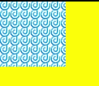

# OffscreenCanvasRenderingConxt2D对象<a name="ZH-CN_TOPIC_0000001192595178"></a>

> **说明：** 
>从 API Version 8 开始支持。后续版本如有新增内容，则采用上角标单独标记该内容的起始版本。

使用OffscreenCanvasRenderingContext2D在Canvas上进行离屏绘制，绘制对象可以是矩形、文本、图片等。离屏绘制是指将需要绘制的内容先绘制在缓存区，然后将其转换成图片，一次性绘制绘制到canvas上，加快了绘制速度。

## 接口<a name="section15647101282420"></a>

OffscreenCanvasRenderingContext2D\(width: number, height: number, setting: RenderingContextSettings\)

-   参数

    <table><thead align="left"><tr><th class="cellrowborder" valign="top" width="12.540000000000001%" id="mcps1.1.6.1.1"><p>参数名</p>
    </th>
    <th class="cellrowborder" valign="top" width="20.150000000000002%" id="mcps1.1.6.1.2"><p>参数类型</p>
    </th>
    <th class="cellrowborder" valign="top" width="12.49%" id="mcps1.1.6.1.3"><p>必填</p>
    </th>
    <th class="cellrowborder" valign="top" width="18.6%" id="mcps1.1.6.1.4"><p>默认值</p>
    </th>
    <th class="cellrowborder" valign="top" width="36.22%" id="mcps1.1.6.1.5"><p>参数描述</p>
    </th>
    </tr>
    </thead>
    <tbody><tr><td class="cellrowborder" valign="top" width="12.540000000000001%" headers="mcps1.1.6.1.1 "><p>width</p>
    </td>
    <td class="cellrowborder" valign="top" width="20.150000000000002%" headers="mcps1.1.6.1.2 "><p>number</p>
    </td>
    <td class="cellrowborder" valign="top" width="12.49%" headers="mcps1.1.6.1.3 "><p>是</p>
    </td>
    <td class="cellrowborder" valign="top" width="18.6%" headers="mcps1.1.6.1.4 "><p>-</p>
    </td>
    <td class="cellrowborder" valign="top" width="36.22%" headers="mcps1.1.6.1.5 "><p>离屏画布的宽度</p>
    </td>
    </tr>
    <tr><td class="cellrowborder" valign="top" width="12.540000000000001%" headers="mcps1.1.6.1.1 "><p>height</p>
    </td>
    <td class="cellrowborder" valign="top" width="20.150000000000002%" headers="mcps1.1.6.1.2 "><p>number</p>
    </td>
    <td class="cellrowborder" valign="top" width="12.49%" headers="mcps1.1.6.1.3 "><p>是</p>
    </td>
    <td class="cellrowborder" valign="top" width="18.6%" headers="mcps1.1.6.1.4 "><p>-</p>
    </td>
    <td class="cellrowborder" valign="top" width="36.22%" headers="mcps1.1.6.1.5 "><p>离屏画布的高度</p>
    </td>
    </tr>
    <tr><td class="cellrowborder" valign="top" width="12.540000000000001%" headers="mcps1.1.6.1.1 "><p>setting</p>
    </td>
    <td class="cellrowborder" valign="top" width="20.150000000000002%" headers="mcps1.1.6.1.2 "><p><a href="ts-canvasrenderingcontext2d.md#section189411348141711">RenderingContextSettings</a></p>
    </td>
    <td class="cellrowborder" valign="top" width="12.49%" headers="mcps1.1.6.1.3 "><p>是</p>
    </td>
    <td class="cellrowborder" valign="top" width="18.6%" headers="mcps1.1.6.1.4 "><p>-</p>
    </td>
    <td class="cellrowborder" valign="top" width="36.22%" headers="mcps1.1.6.1.5 "><p>见<a href="ts-canvasrenderingcontext2d.md#section189411348141711">RenderingContextSettings</a>接口描述。</p>
    </td>
    </tr>
    </tbody>
    </table>


## 属性<a name="section122871125229"></a>

<table><thead align="left"><tr><th class="cellrowborder" valign="top" width="13.951395139513952%" id="mcps1.1.5.1.1"><p>名称</p>
</th>
<th class="cellrowborder" valign="top" width="26.732673267326728%" id="mcps1.1.5.1.2"><p>类型</p>
</th>
<th class="cellrowborder" valign="top" width="9.68096809680968%" id="mcps1.1.5.1.3"><p>默认值</p>
</th>
<th class="cellrowborder" valign="top" width="49.63496349634964%" id="mcps1.1.5.1.4"><p>描述</p>
</th>
</tr>
</thead>
<tbody><tr><td class="cellrowborder" valign="top" width="13.951395139513952%" headers="mcps1.1.5.1.1 "><p><a href="ts-canvasrenderingcontext2d.md#section14391838151316">fillStyle</a></p>
</td>
<td class="cellrowborder" valign="top" width="26.732673267326728%" headers="mcps1.1.5.1.2 "><p>&lt;color&gt; | <a href="ts-components-canvas-canvasgradient.md">CanvasGradient</a> | <a href="#section146853345417">CanvasPattern</a></p>
</td>
<td class="cellrowborder" valign="top" width="9.68096809680968%" headers="mcps1.1.5.1.3 "><p>-</p>
</td>
<td class="cellrowborder" valign="top" width="49.63496349634964%" headers="mcps1.1.5.1.4 "><p>指定绘制的填充色。</p>
<ul><li>类型为&lt;color&gt;时，表示设置填充区域的颜色。</li><li>类型为CanvasGradient时，表示渐变对象，使用 <a href="#section14582213497">createLinearGradient</a>方法创建。</li><li>类型为CanvasPattern时，使用<a href="#section660873113512">createPattern</a>方法创建。</li></ul>
</td>
</tr>
<tr><td class="cellrowborder" valign="top" width="13.951395139513952%" headers="mcps1.1.5.1.1 "><p><a href="ts-canvasrenderingcontext2d.md#section104861220181415">lineWidth</a></p>
</td>
<td class="cellrowborder" valign="top" width="26.732673267326728%" headers="mcps1.1.5.1.2 "><p>number</p>
</td>
<td class="cellrowborder" valign="top" width="9.68096809680968%" headers="mcps1.1.5.1.3 "><p>-</p>
</td>
<td class="cellrowborder" valign="top" width="49.63496349634964%" headers="mcps1.1.5.1.4 "><p>设置绘制线条的宽度。</p>
</td>
</tr>
<tr><td class="cellrowborder" valign="top" width="13.951395139513952%" headers="mcps1.1.5.1.1 "><p><a href="ts-canvasrenderingcontext2d.md#section1216741261620">strokeStyle</a></p>
</td>
<td class="cellrowborder" valign="top" width="26.732673267326728%" headers="mcps1.1.5.1.2 "><p>&lt;color&gt; | <a href="ts-components-canvas-canvasgradient.md">CanvasGradient</a> | <a href="#section146853345417">CanvasPattern</a></p>
</td>
<td class="cellrowborder" valign="top" width="9.68096809680968%" headers="mcps1.1.5.1.3 "><p>-</p>
</td>
<td class="cellrowborder" valign="top" width="49.63496349634964%" headers="mcps1.1.5.1.4 "><p>设置描边的颜色。</p>
<ul><li>类型为&lt;color&gt;时，表示设置描边使用的颜色。</li><li>类型为CanvasGradient时，表示渐变对象，使用<a href="#section14582213497">createLinearGradient</a>方法创建。</li><li>类型为CanvasPattern时，使用<a href="#section660873113512">createPattern</a>方法创建。</li></ul>
</td>
</tr>
<tr><td class="cellrowborder" valign="top" width="13.951395139513952%" headers="mcps1.1.5.1.1 "><p><a href="ts-canvasrenderingcontext2d.md#section887817337173">lineCap</a></p>
</td>
<td class="cellrowborder" valign="top" width="26.732673267326728%" headers="mcps1.1.5.1.2 "><p>string</p>
</td>
<td class="cellrowborder" valign="top" width="9.68096809680968%" headers="mcps1.1.5.1.3 "><p>'butt'</p>
</td>
<td class="cellrowborder" valign="top" width="49.63496349634964%" headers="mcps1.1.5.1.4 "><p>指定线端点的样式，可选值为：</p>
<ul><li>'butt'：线端点以方形结束。</li><li>'round'：线端点以圆形结束。</li><li>'square'：线端点以方形结束，该样式下会增加一个长度和线段厚度相同，宽度是线段厚度一半的矩形。</li></ul>
</td>
</tr>
<tr><td class="cellrowborder" valign="top" width="13.951395139513952%" headers="mcps1.1.5.1.1 "><p><a href="ts-canvasrenderingcontext2d.md#section77593271919">lineJoin</a></p>
</td>
<td class="cellrowborder" valign="top" width="26.732673267326728%" headers="mcps1.1.5.1.2 "><p>string</p>
</td>
<td class="cellrowborder" valign="top" width="9.68096809680968%" headers="mcps1.1.5.1.3 "><p>'miter'</p>
</td>
<td class="cellrowborder" valign="top" width="49.63496349634964%" headers="mcps1.1.5.1.4 "><p>指定线段间相交的交点样式，可选值为：</p>
<ul><li>'round'：在线段相连处绘制一个扇形，扇形的圆角半径是线段的宽度。</li><li>'bevel'：在线段相连处使用三角形为底填充， 每个部分矩形拐角独立。</li><li>'miter'：在相连部分的外边缘处进行延伸，使其相交于一点，形成一个菱形区域，该属性可以通过设置miterLimit属性展现效果。</li></ul>
</td>
</tr>
<tr><td class="cellrowborder" valign="top" width="13.951395139513952%" headers="mcps1.1.5.1.1 "><p><a href="ts-canvasrenderingcontext2d.md#section177441243427">miterLimit</a></p>
</td>
<td class="cellrowborder" valign="top" width="26.732673267326728%" headers="mcps1.1.5.1.2 "><p>number</p>
</td>
<td class="cellrowborder" valign="top" width="9.68096809680968%" headers="mcps1.1.5.1.3 "><p>10</p>
</td>
<td class="cellrowborder" valign="top" width="49.63496349634964%" headers="mcps1.1.5.1.4 "><p>设置斜接面限制值，该值指定了线条相交处内角和外角的距离。</p>
</td>
</tr>
<tr><td class="cellrowborder" valign="top" width="13.951395139513952%" headers="mcps1.1.5.1.1 "><p><a href="ts-canvasrenderingcontext2d.md#section185699365434">font</a></p>
</td>
<td class="cellrowborder" valign="top" width="26.732673267326728%" headers="mcps1.1.5.1.2 "><p>string</p>
</td>
<td class="cellrowborder" valign="top" width="9.68096809680968%" headers="mcps1.1.5.1.3 "><p>'normal normal 14px sans-serif'</p>
</td>
<td class="cellrowborder" valign="top" width="49.63496349634964%" headers="mcps1.1.5.1.4 "><p>设置文本绘制中的字体样式。</p>
<p>语法：ctx.font='font-size font-family'</p>
<ul><li>font-size(可选)，指定字号和行高，单位只支持px。</li><li>font-family(可选)，指定字体系列。</li></ul>
<p>语法：ctx.font='font-style font-weight font-size font-family'</p>
<ul><li>font-style(可选)，用于指定字体样式，支持如下几种样式：'normal', 'italic'。</li><li>font-weight(可选)，用于指定字体的粗细，支持如下几种类型：'normal', 'bold', 'bolder', 'lighter', 100, 200, 300, 400, 500, 600, 700, 800, 900。</li><li>font-size(可选)，指定字号和行高，单位只支持px。</li><li>font-family(可选)，指定字体系列，支持如下几种类型：'sans-serif', 'serif', 'monospace'。</li></ul>
</td>
</tr>
<tr><td class="cellrowborder" valign="top" width="13.951395139513952%" headers="mcps1.1.5.1.1 "><p><a href="ts-canvasrenderingcontext2d.md#section41621415164419">textAlign</a></p>
</td>
<td class="cellrowborder" valign="top" width="26.732673267326728%" headers="mcps1.1.5.1.2 "><p>string</p>
</td>
<td class="cellrowborder" valign="top" width="9.68096809680968%" headers="mcps1.1.5.1.3 "><p>'left'</p>
</td>
<td class="cellrowborder" valign="top" width="49.63496349634964%" headers="mcps1.1.5.1.4 "><p>设置文本绘制中的文本对齐方式，可选值为：</p>
<ul><li>'left'：文本左对齐。</li><li>'right'：文本右对齐。</li><li>'center'：文本居中对齐。</li><li>'start'：文本对齐界线开始的地方。</li><li>'end'：文本对齐界线结束的地方。</li></ul>
<div class="note"><span class="notetitle"> 说明： </span><div class="notebody"><p>ltr布局模式下start和left一致，rtl布局模式下start和right一致&middot;。</p>
</div></div>
</td>
</tr>
<tr><td class="cellrowborder" valign="top" width="13.951395139513952%" headers="mcps1.1.5.1.1 "><p><a href="ts-canvasrenderingcontext2d.md#section0497195924412">textBaseline</a></p>
</td>
<td class="cellrowborder" valign="top" width="26.732673267326728%" headers="mcps1.1.5.1.2 "><p>string</p>
</td>
<td class="cellrowborder" valign="top" width="9.68096809680968%" headers="mcps1.1.5.1.3 "><p>'alphabetic'</p>
</td>
<td class="cellrowborder" valign="top" width="49.63496349634964%" headers="mcps1.1.5.1.4 "><p>设置文本绘制中的水平对齐方式，可选值为：</p>
<ul><li>'alphabetic'：文本基线是标准的字母基线。</li><li>'top'：文本基线在文本块的顶部。</li><li>'hanging'：文本基线是悬挂基线。</li><li>'middle'：文本基线在文本块的中间。</li><li>'ideographic'：文字基线是表意字基线；如果字符本身超出了alphabetic基线，那么ideograhpic基线位置在字符本身的底部。</li><li>'bottom'：文本基线在文本块的底部。 与ideographic基线的区别在于ideographic 基线不需要考虑下行字母。</li></ul>
</td>
</tr>
<tr><td class="cellrowborder" valign="top" width="13.951395139513952%" headers="mcps1.1.5.1.1 "><p><a href="ts-canvasrenderingcontext2d.md#section14962525174510">globalAlpha</a></p>
</td>
<td class="cellrowborder" valign="top" width="26.732673267326728%" headers="mcps1.1.5.1.2 "><p>number</p>
</td>
<td class="cellrowborder" valign="top" width="9.68096809680968%" headers="mcps1.1.5.1.3 "><p>-</p>
</td>
<td class="cellrowborder" valign="top" width="49.63496349634964%" headers="mcps1.1.5.1.4 "><p>设置透明度，0.0为完全透明，1.0为完全不透明。</p>
</td>
</tr>
<tr><td class="cellrowborder" valign="top" width="13.951395139513952%" headers="mcps1.1.5.1.1 "><p><a href="ts-canvasrenderingcontext2d.md#section10163191119469">lineDashOffset</a></p>
</td>
<td class="cellrowborder" valign="top" width="26.732673267326728%" headers="mcps1.1.5.1.2 "><p>number</p>
</td>
<td class="cellrowborder" valign="top" width="9.68096809680968%" headers="mcps1.1.5.1.3 "><p>0.0</p>
</td>
<td class="cellrowborder" valign="top" width="49.63496349634964%" headers="mcps1.1.5.1.4 "><p>设置画布的虚线偏移量，精度为float。</p>
</td>
</tr>
<tr><td class="cellrowborder" valign="top" width="13.951395139513952%" headers="mcps1.1.5.1.1 "><p><a href="ts-canvasrenderingcontext2d.md#section20658135394618">globalCompositeOperation</a></p>
</td>
<td class="cellrowborder" valign="top" width="26.732673267326728%" headers="mcps1.1.5.1.2 "><p>string</p>
</td>
<td class="cellrowborder" valign="top" width="9.68096809680968%" headers="mcps1.1.5.1.3 "><p>'source-over'</p>
</td>
<td class="cellrowborder" valign="top" width="49.63496349634964%" headers="mcps1.1.5.1.4 "><p>设置合成操作的方式。类型字段可选值有'source-over'，'source-atop'，'source-in'，'source-out'，'destination-over'，'destination-atop'，'destination-in'，'destination-out'，'lighter'，'copy'，'xor'。</p>
</td>
</tr>
<tr><td class="cellrowborder" valign="top" width="13.951395139513952%" headers="mcps1.1.5.1.1 "><p><a href="ts-canvasrenderingcontext2d.md#section962555815501">shadowBlur</a></p>
</td>
<td class="cellrowborder" valign="top" width="26.732673267326728%" headers="mcps1.1.5.1.2 "><p>number</p>
</td>
<td class="cellrowborder" valign="top" width="9.68096809680968%" headers="mcps1.1.5.1.3 "><p>0.0</p>
</td>
<td class="cellrowborder" valign="top" width="49.63496349634964%" headers="mcps1.1.5.1.4 "><p>设置绘制阴影时的模糊级别，值越大越模糊，精度为float。</p>
</td>
</tr>
<tr><td class="cellrowborder" valign="top" width="13.951395139513952%" headers="mcps1.1.5.1.1 "><p><a href="ts-canvasrenderingcontext2d.md#section1380963318510">shadowColor</a></p>
</td>
<td class="cellrowborder" valign="top" width="26.732673267326728%" headers="mcps1.1.5.1.2 "><p>&lt;color&gt;</p>
</td>
<td class="cellrowborder" valign="top" width="9.68096809680968%" headers="mcps1.1.5.1.3 "><p>-</p>
</td>
<td class="cellrowborder" valign="top" width="49.63496349634964%" headers="mcps1.1.5.1.4 "><p>设置绘制阴影时的阴影颜色。</p>
</td>
</tr>
<tr><td class="cellrowborder" valign="top" width="13.951395139513952%" headers="mcps1.1.5.1.1 "><p><a href="ts-canvasrenderingcontext2d.md#section83601599526">shadowOffsetX</a></p>
</td>
<td class="cellrowborder" valign="top" width="26.732673267326728%" headers="mcps1.1.5.1.2 "><p>number</p>
</td>
<td class="cellrowborder" valign="top" width="9.68096809680968%" headers="mcps1.1.5.1.3 "><p>-</p>
</td>
<td class="cellrowborder" valign="top" width="49.63496349634964%" headers="mcps1.1.5.1.4 "><p>设置绘制阴影时和原有对象的水平偏移值。</p>
</td>
</tr>
<tr><td class="cellrowborder" valign="top" width="13.951395139513952%" headers="mcps1.1.5.1.1 "><p><a href="ts-canvasrenderingcontext2d.md#section10859152455314">shadowOffsetY</a></p>
</td>
<td class="cellrowborder" valign="top" width="26.732673267326728%" headers="mcps1.1.5.1.2 "><p>number</p>
</td>
<td class="cellrowborder" valign="top" width="9.68096809680968%" headers="mcps1.1.5.1.3 "><p>-</p>
</td>
<td class="cellrowborder" valign="top" width="49.63496349634964%" headers="mcps1.1.5.1.4 "><p>设置绘制阴影时和原有对象的垂直偏移值。</p>
</td>
</tr>
<tr><td class="cellrowborder" valign="top" width="13.951395139513952%" headers="mcps1.1.5.1.1 "><p><a href="ts-canvasrenderingcontext2d.md#section132528555535">imageSmoothingEnabled</a></p>
</td>
<td class="cellrowborder" valign="top" width="26.732673267326728%" headers="mcps1.1.5.1.2 "><p>boolean</p>
</td>
<td class="cellrowborder" valign="top" width="9.68096809680968%" headers="mcps1.1.5.1.3 "><p>true</p>
</td>
<td class="cellrowborder" valign="top" width="49.63496349634964%" headers="mcps1.1.5.1.4 "><p>用于设置绘制图片时是否进行图像平滑度调整，true为启用，false为不启用。</p>
</td>
</tr>
<tr><td class="cellrowborder" valign="top" width="13.951395139513952%" headers="mcps1.1.5.1.1 "><p>imageSmoothingQuality</p>
</td>
<td class="cellrowborder" valign="top" width="26.732673267326728%" headers="mcps1.1.5.1.2 "><p>string</p>
</td>
<td class="cellrowborder" valign="top" width="9.68096809680968%" headers="mcps1.1.5.1.3 "><p>'low'</p>
</td>
<td class="cellrowborder" valign="top" width="49.63496349634964%" headers="mcps1.1.5.1.4 "><p>用于设置图像平滑度，支持如下三种类型：'low', 'medium', 'high'。</p>
</td>
</tr>
</tbody>
</table>

> **说明：** 
><color\>类型格式为 'rgb\(255, 255, 255\)'，'rgba\(255, 255, 255, 1.0\)'，'\#FFFFFF'。

### fillStyle<a name="section14391838151316"></a>

```
@Entry
@Component
struct FillStyleExample {
  private settings: RenderingContextSettings = new RenderingContextSettings(true,true)
  private context: CanvasRenderingContext2D = new CanvasRenderingContext2D(this.settings)
  private offContext: OffscreenCanvasRenderingContext2D = new OffscreenCanvasRenderingContext2D(600, 600, this.settings)

  build() {
    Flex({ direction: FlexDirection.Column, alignItems: ItemAlign.Center, justifyContent: FlexAlign.Center }) {
      Canvas(this.context)
        .width('100%')
        .height('100%')
        .backgroundColor('#ffff00')
        .onReady(() =>{
          this.offContext.fillStyle = '#0000ff'
          this.offContext.fillRect(20, 160, 150, 100)
          var image = this.offContext.transferToImageBitmap();
          this.context.transferFromImageBitmap(image);
        })
    }
    .width('100%')
    .height('100%')
  }
}
```


### lineWidth<a name="section104861220181415"></a>

```
@Entry
@Component
struct LineWidthExample {
  private settings: RenderingContextSettings = new RenderingContextSettings(true,true)
  private context: CanvasRenderingContext2D = new CanvasRenderingContext2D(this.settings)
  private offContext: OffscreenCanvasRenderingContext2D = new OffscreenCanvasRenderingContext2D(600, 600, this.settings)

  build() {
    Flex({ direction: FlexDirection.Column, alignItems: ItemAlign.Center, justifyContent: FlexAlign.Center }) {
      Canvas(this.context)
        .width('100%')
        .height('100%')
        .backgroundColor('#ffff00')
        .onReady(() =>{
          this.offContext.lineWidth = 5
          this.offContext.strokeRect(25, 25, 85, 105)
          var image = this.offContext.transferToImageBitmap()
          this.context.transferFromImageBitmap(image)
      })
    }
    .width('100%')
    .height('100%')
  }
}
```


### strokeStyle<a name="section1216741261620"></a>

```
@Entry
@Component
struct StrokeStyleExample {
  private settings: RenderingContextSettings = new RenderingContextSettings(true,true)
  private context: CanvasRenderingContext2D = new CanvasRenderingContext2D(this.settings)
  private offContext: OffscreenCanvasRenderingContext2D = new OffscreenCanvasRenderingContext2D(600, 600, this.settings)

  build() {
    Flex({ direction: FlexDirection.Column, alignItems: ItemAlign.Center, justifyContent: FlexAlign.Center }) {
      Canvas(this.context)
        .width('100%')
        .height('100%')
        .backgroundColor('#ffff00')
        .onReady(() =>{
          this.offContext.lineWidth = 10
          this.offContext.strokeStyle = '#0000ff'
          this.offContext.strokeRect(25, 25, 155, 105)
          var image = this.offContext.transferToImageBitmap()
          this.context.transferFromImageBitmap(image)
        })
    }
    .width('100%')
    .height('100%')
  }
}
```


### lineCap<a name="section887817337173"></a>

```
@Entry
@Component
struct LineCapExample {
  private settings: RenderingContextSettings = new RenderingContextSettings(true,true)
  private context: CanvasRenderingContext2D = new CanvasRenderingContext2D(this.settings)
  private offContext: OffscreenCanvasRenderingContext2D = new OffscreenCanvasRenderingContext2D(600, 600, this.settings)

  build() {
    Flex({ direction: FlexDirection.Column, alignItems: ItemAlign.Center, justifyContent: FlexAlign.Center }) {
      Canvas(this.context)
        .width('100%')
        .height('100%')
        .backgroundColor('#ffff00')
        .onReady(() =>{
          this.offContext.lineWidth = 8
          this.offContext.beginPath()
          this.offContext.lineCap = 'round'
          this.offContext.moveTo(30, 50)
          this.offContext.lineTo(220, 50)
          this.offContext.stroke()
          var image = this.offContext.transferToImageBitmap()
          this.context.transferFromImageBitmap(image)
        })
    }
    .width('100%')
    .height('100%')
  }
}
```


### lineJoin<a name="section77593271919"></a>

```
@Entry
@Component
struct LineJoinExample {
  private settings: RenderingContextSettings = new RenderingContextSettings(true,true)
  private context: CanvasRenderingContext2D = new CanvasRenderingContext2D(this.settings)
  private offContext: OffscreenCanvasRenderingContext2D = new OffscreenCanvasRenderingContext2D(600, 600, this.settings)

  build() {
    Flex({ direction: FlexDirection.Column, alignItems: ItemAlign.Center, justifyContent: FlexAlign.Center }) {
      Canvas(this.context)
        .width('100%')
        .height('100%')
        .backgroundColor('#ffff00')
        .onReady(() =>{
          this.offContext.beginPath()
          this.offContext.lineWidth = 8
          this.offContext.lineJoin = 'miter'
          this.offContext.moveTo(30, 30)
          this.offContext.lineTo(120, 60)
          this.offContext.lineTo(30, 110)
          this.offContext.stroke()
          var image = this.offContext.transferToImageBitmap()
          this.context.transferFromImageBitmap(image)
      })
    }
    .width('100%')
    .height('100%')
  }
}
```


### miterLimit<a name="section177441243427"></a>

```
@Entry
@Component
struct MiterLimit {
  private settings: RenderingContextSettings = new RenderingContextSettings(true,true)
  private context: CanvasRenderingContext2D = new CanvasRenderingContext2D(this.settings)
  private offContext: OffscreenCanvasRenderingContext2D = new OffscreenCanvasRenderingContext2D(600, 600, this.settings)
  
  build() {
    Flex({ direction: FlexDirection.Column, alignItems: ItemAlign.Center, justifyContent: FlexAlign.Center }) {
      Canvas(this.context)
        .width('100%')
        .height('100%')
        .backgroundColor('#ffff00')
        .onReady(() =>{
          this.offContext.lineWidth = 8
          this.offContext.lineJoin = 'miter'
          this.offContext.miterLimit = 3
          this.offContext.moveTo(30, 30)
          this.offContext.lineTo(60, 35)
          this.offContext.lineTo(30, 37)
          this.offContext.stroke()
          var image = this.offContext.transferToImageBitmap()
          this.context.transferFromImageBitmap(image)
      })
    }
    .width('100%')
    .height('100%')
  }
}
```


### font<a name="section185699365434"></a>

```
@Entry
@Component
struct Font {
  private settings: RenderingContextSettings = new RenderingContextSettings(true,true)
  private context: CanvasRenderingContext2D = new CanvasRenderingContext2D(this.settings)
  private offContext: OffscreenCanvasRenderingContext2D = new OffscreenCanvasRenderingContext2D(600, 600, this.settings)
  
  build() {
    Flex({ direction: FlexDirection.Column, alignItems: ItemAlign.Center, justifyContent: FlexAlign.Center }) {
      Canvas(this.context)
        .width('100%')
        .height('100%')
        .backgroundColor('#ffff00')
        .onReady(() =>{
          this.offContext.font = '30px sans-serif'
          this.offContext.fillText("Hello World", 20, 60)
          var image = this.offContext.transferToImageBitmap()
          this.context.transferFromImageBitmap(image)
      })
    }
    .width('100%')
    .height('100%')
  }
}
```


### textAlign<a name="section41621415164419"></a>

```
@Entry
@Component
struct TextAlign {
  private settings: RenderingContextSettings = new RenderingContextSettings(true,true)
  private context: CanvasRenderingContext2D = new CanvasRenderingContext2D(this.settings)
  private offContext: OffscreenCanvasRenderingContext2D = new OffscreenCanvasRenderingContext2D(600, 600, this.settings)
  
  build() {
    Flex({ direction: FlexDirection.Column, alignItems: ItemAlign.Center, justifyContent: FlexAlign.Center }) {
      Canvas(this.context)
        .width('100%')
        .height('100%')
        .backgroundColor('#ffff00')
        .onReady(() =>{
        this.offContext.strokeStyle = '#0000ff'
        this.offContext.moveTo(140, 10)
        this.offContext.lineTo(140, 160)
        this.offContext.stroke()

        this.offContext.font = '18px sans-serif'

        this.offContext.textAlign = 'start'
        this.offContext.fillText('textAlign=start', 140, 60)
        this.offContext.textAlign = 'end'
        this.offContext.fillText('textAlign=end', 140, 80)
        this.offContext.textAlign = 'left'
        this.offContext.fillText('textAlign=left', 140, 100)
        this.offContext.textAlign = 'center'
        this.offContext.fillText('textAlign=center',140, 120)
        this.offContext.textAlign = 'right'
        this.offContext.fillText('textAlign=right',140, 140)
        var image = this.offContext.transferToImageBitmap()
        this.context.transferFromImageBitmap(image)
      })
    }
    .width('100%')
    .height('100%')
  }
}
```


### textBaseline<a name="section0497195924412"></a>

```
@Entry
@Component
struct TextBaseline {
  private settings: RenderingContextSettings = new RenderingContextSettings(true,true)
  private context: CanvasRenderingContext2D = new CanvasRenderingContext2D(this.settings)
  private offContext: OffscreenCanvasRenderingContext2D = new OffscreenCanvasRenderingContext2D(600, 600, this.settings)
  
  build() {
    Flex({ direction: FlexDirection.Column, alignItems: ItemAlign.Center, justifyContent: FlexAlign.Center }) {
      Canvas(this.context)
        .width('100%')
        .height('100%')
        .backgroundColor('#ffff00')
        .onReady(() =>{
          this.offContext.strokeStyle = '#0000ff'
          this.offContext.moveTo(0, 120)
          this.offContext.lineTo(400, 120)
          this.offContext.stroke()

          this.offContext.font = '20px sans-serif'

          this.offContext.textBaseline = 'top'
          this.offContext.fillText('Top', 10, 120)
          this.offContext.textBaseline = 'bottom'
          this.offContext.fillText('Bottom', 55, 120)
          this.offContext.textBaseline = 'middle'
          this.offContext.fillText('Middle', 125, 120)
          this.offContext.textBaseline = 'alphabetic'
          this.offContext.fillText('Alphabetic', 195, 120)
          this.offContext.textBaseline = 'hanging'
          this.offContext.fillText('Hanging', 295, 120)
          var image = this.offContext.transferToImageBitmap()
          this.context.transferFromImageBitmap(image)
      })
    }
    .width('100%')
    .height('100%')
  }
}
```


### globalAlpha<a name="section14962525174510"></a>

```
@Entry
@Component
struct GlobalAlpha {
  private settings: RenderingContextSettings = new RenderingContextSettings(true,true)
  private context: CanvasRenderingContext2D = new CanvasRenderingContext2D(this.settings)
  private offContext: OffscreenCanvasRenderingContext2D = new OffscreenCanvasRenderingContext2D(600, 600, this.settings)
  
  build() {
    Flex({ direction: FlexDirection.Column, alignItems: ItemAlign.Center, justifyContent: FlexAlign.Center }) {
      Canvas(this.context)
        .width('100%')
        .height('100%')
        .backgroundColor('#ffff00')
        .onReady(() =>{
          this.offContext.fillStyle = 'rgb(255,0,0)'
          this.offContext.fillRect(0, 0, 50, 50)
          this.offContext.globalAlpha = 0.4
          this.offContext.fillStyle = 'rgb(0,0,255)'
          this.offContext.fillRect(50, 50, 50, 50)
          var image = this.offContext.transferToImageBitmap()
          this.context.transferFromImageBitmap(image)
      })
    }
    .width('100%')
    .height('100%')
  }
}
```


### lineDashOffset<a name="section10163191119469"></a>

```
@Entry
@Component
struct LineDashOffset {
  private settings: RenderingContextSettings = new RenderingContextSettings(true,true)
  private context: CanvasRenderingContext2D = new CanvasRenderingContext2D(this.settings)
  private offContext: OffscreenCanvasRenderingContext2D = new OffscreenCanvasRenderingContext2D(600, 600, this.settings)
  
  build() {
    Flex({ direction: FlexDirection.Column, alignItems: ItemAlign.Center, justifyContent: FlexAlign.Center }) {
      Canvas(this.context)
        .width('100%')
        .height('100%')
        .backgroundColor('#ffff00')
        .onReady(() =>{
          this.offContext.arc(100, 75, 50, 0, 6.28)
          this.offContext.setLineDash([10,20])
          this.offContext.stroke();
          var image = this.offContext.transferToImageBitmap()
          this.context.transferFromImageBitmap(image)
      })
    }
    .width('100%')
    .height('100%')
  }
}
```


### globalCompositeOperation<a name="section20658135394618"></a>

<table><thead align="left"><tr><th class="cellrowborder" valign="top" width="50%" id="mcps1.1.3.1.1"><p>名称</p>
</th>
<th class="cellrowborder" valign="top" width="50%" id="mcps1.1.3.1.2"><p>描述</p>
</th>
</tr>
</thead>
<tbody><tr><td class="cellrowborder" valign="top" width="50%" headers="mcps1.1.3.1.1 "><p>source-over</p>
</td>
<td class="cellrowborder" valign="top" width="50%" headers="mcps1.1.3.1.2 "><p>在现有绘制内容上显示新绘制内容，属于默认值。</p>
</td>
</tr>
<tr><td class="cellrowborder" valign="top" width="50%" headers="mcps1.1.3.1.1 "><p>source-atop</p>
</td>
<td class="cellrowborder" valign="top" width="50%" headers="mcps1.1.3.1.2 "><p>在现有绘制内容顶部显示新绘制内容。</p>
</td>
</tr>
<tr><td class="cellrowborder" valign="top" width="50%" headers="mcps1.1.3.1.1 "><p>source-in</p>
</td>
<td class="cellrowborder" valign="top" width="50%" headers="mcps1.1.3.1.2 "><p>在现有绘制内容中显示新绘制内容。</p>
</td>
</tr>
<tr><td class="cellrowborder" valign="top" width="50%" headers="mcps1.1.3.1.1 "><p>source-out</p>
</td>
<td class="cellrowborder" valign="top" width="50%" headers="mcps1.1.3.1.2 "><p>在现有绘制内容之外显示新绘制内容。</p>
</td>
</tr>
<tr><td class="cellrowborder" valign="top" width="50%" headers="mcps1.1.3.1.1 "><p>destination-over</p>
</td>
<td class="cellrowborder" valign="top" width="50%" headers="mcps1.1.3.1.2 "><p>在新绘制内容上方显示现有绘制内容。</p>
</td>
</tr>
<tr><td class="cellrowborder" valign="top" width="50%" headers="mcps1.1.3.1.1 "><p>destination-atop</p>
</td>
<td class="cellrowborder" valign="top" width="50%" headers="mcps1.1.3.1.2 "><p>在新绘制内容顶部显示现有绘制内容。</p>
</td>
</tr>
<tr><td class="cellrowborder" valign="top" width="50%" headers="mcps1.1.3.1.1 "><p>destination-in</p>
</td>
<td class="cellrowborder" valign="top" width="50%" headers="mcps1.1.3.1.2 "><p>在新绘制内容中显示现有绘制内容。</p>
</td>
</tr>
<tr><td class="cellrowborder" valign="top" width="50%" headers="mcps1.1.3.1.1 "><p>destination-out</p>
</td>
<td class="cellrowborder" valign="top" width="50%" headers="mcps1.1.3.1.2 "><p>在新绘制内容外显示现有绘制内容。</p>
</td>
</tr>
<tr><td class="cellrowborder" valign="top" width="50%" headers="mcps1.1.3.1.1 "><p>lighter</p>
</td>
<td class="cellrowborder" valign="top" width="50%" headers="mcps1.1.3.1.2 "><p>显示新绘制内容和现有绘制内容。</p>
</td>
</tr>
<tr><td class="cellrowborder" valign="top" width="50%" headers="mcps1.1.3.1.1 "><p>copy</p>
</td>
<td class="cellrowborder" valign="top" width="50%" headers="mcps1.1.3.1.2 "><p>显示新绘制内容而忽略现有绘制内容。</p>
</td>
</tr>
<tr><td class="cellrowborder" valign="top" width="50%" headers="mcps1.1.3.1.1 "><p>xor</p>
</td>
<td class="cellrowborder" valign="top" width="50%" headers="mcps1.1.3.1.2 "><p>使用异或操作对新绘制内容与现有绘制内容进行融合。</p>
</td>
</tr>
</tbody>
</table>

```
@Entry
@Component
struct GlobalCompositeOperation {
  private settings: RenderingContextSettings = new RenderingContextSettings(true,true)
  private context: CanvasRenderingContext2D = new CanvasRenderingContext2D(this.settings)
  private offContext: OffscreenCanvasRenderingContext2D = new OffscreenCanvasRenderingContext2D(600, 600, this.settings)
  
  build() {
    Flex({ direction: FlexDirection.Column, alignItems: ItemAlign.Center, justifyContent: FlexAlign.Center }) {
      Canvas(this.context)
        .width('100%')
        .height('100%')
        .backgroundColor('#ffff00')
        .onReady(() =>{
          this.offContext.fillStyle = 'rgb(255,0,0)'
          this.offContext.fillRect(20, 20, 50, 50)
          this.offContext.globalCompositeOperation = 'source-over'
          this.offContext.fillStyle = 'rgb(0,0,255)'
          this.offContext.fillRect(50, 50, 50, 50)
          this.offContext.fillStyle = 'rgb(255,0,0)'
          this.offContext.fillRect(120, 20, 50, 50)
          this.offContext.globalCompositeOperation = 'destination-over'
          this.offContext.fillStyle = 'rgb(0,0,255)'
          this.offContext.fillRect(150, 50, 50, 50)
          var image = this.offContext.transferToImageBitmap()
          this.context.transferFromImageBitmap(image)
      })
    }
    .width('100%')
    .height('100%')
  }
}
```


### shadowBlur<a name="section962555815501"></a>

```
@Entry
@Component
struct ShadowBlur {
  private settings: RenderingContextSettings = new RenderingContextSettings(true,true)
  private context: CanvasRenderingContext2D = new CanvasRenderingContext2D(this.settings)
  private offContext: OffscreenCanvasRenderingContext2D = new OffscreenCanvasRenderingContext2D(600, 600, this.settings)
  
  build() {
    Flex({ direction: FlexDirection.Column, alignItems: ItemAlign.Center, justifyContent: FlexAlign.Center }) {
      Canvas(this.context)
        .width('100%')
        .height('100%')
        .backgroundColor('#ffff00')
        .onReady(() =>{
          this.offContext.shadowBlur = 30
          this.offContext.shadowColor = 'rgb(0,0,0)'
          this.offContext.fillStyle = 'rgb(255,0,0)'
          this.offContext.fillRect(20, 20, 100, 80)
          var image = this.offContext.transferToImageBitmap()
          this.context.transferFromImageBitmap(image)
      })
    }
    .width('100%')
    .height('100%')
  }
}
```


### shadowColor<a name="section1380963318510"></a>

```
@Entry
@Component
struct ShadowColor {
  private settings: RenderingContextSettings = new RenderingContextSettings(true,true)
  private context: CanvasRenderingContext2D = new CanvasRenderingContext2D(this.settings)
  private offContext: OffscreenCanvasRenderingContext2D = new OffscreenCanvasRenderingContext2D(600, 600, this.settings)
  
  build() {
    Flex({ direction: FlexDirection.Column, alignItems: ItemAlign.Center, justifyContent: FlexAlign.Center }) {
      Canvas(this.context)
        .width('100%')
        .height('100%')
        .backgroundColor('#ffff00')
        .onReady(() =>{
          this.offContext.shadowBlur = 30
          this.offContext.shadowColor = 'rgb(0,0,255)'
          this.offContext.fillStyle = 'rgb(255,0,0)'
          this.offContext.fillRect(30, 30, 100, 100)
          var image = this.offContext.transferToImageBitmap
()
          this.context.transferFromImageBitmap(image)
      })
    }
    .width('100%')
    .height('100%')
  }
}
```


### shadowOffsetX<a name="section83601599526"></a>

```
@Entry
@Component
struct ShadowOffsetX {
  private settings: RenderingContextSettings = new RenderingContextSettings(true,true)
  private context: CanvasRenderingContext2D = new CanvasRenderingContext2D(this.settings)
  private offContext: OffscreenCanvasRenderingContext2D = new OffscreenCanvasRenderingContext2D(600, 600, this.settings)
  
  build() {
    Flex({ direction: FlexDirection.Column, alignItems: ItemAlign.Center, justifyContent: FlexAlign.Center }) {
      Canvas(this.context)
        .width('100%')
        .height('100%')
        .backgroundColor('#ffff00')
        .onReady(() =>{
          this.offContext.shadowBlur = 10
          this.offContext.shadowOffsetX = 20
          this.offContext.shadowColor = 'rgb(0,0,0)'
          this.offContext.fillStyle = 'rgb(255,0,0)'
          this.offContext.fillRect(20, 20, 100, 80)
          var image = this.offContext.transferToImageBitmap()
          this.context.transferFromImageBitmap(image)
      })
    }
    .width('100%')
    .height('100%')
  }
}
```


### shadowOffsetY<a name="section10859152455314"></a>

```
@Entry
@Component
struct ShadowOffsetY {
  private settings: RenderingContextSettings = new RenderingContextSettings(true,true)
  private context: CanvasRenderingContext2D = new CanvasRenderingContext2D(this.settings)
  private offContext: OffscreenCanvasRenderingContext2D = new OffscreenCanvasRenderingContext2D(600, 600, this.settings)

  build() {
    Flex({ direction: FlexDirection.Column, alignItems: ItemAlign.Center, justifyContent: FlexAlign.Center }) {
      Canvas(this.context)
        .width('100%')
        .height('100%')
        .backgroundColor('#ffff00')
        .onReady(() =>{
          this.offContext.shadowBlur = 10
          this.offContext.shadowOffsetY = 20
          this.offContext.shadowColor = 'rgb(0,0,0)'
          this.offContext.fillStyle = 'rgb(255,0,0)'
          this.offContext.fillRect(30, 30, 100, 100)
          var image = this.offContext.transferToImageBitmap()
          this.context.transferFromImageBitmap(image)
      })
    }
    .width('100%')
    .height('100%')
  }
}
```


### imageSmoothingEnabled<a name="section132528555535"></a>

```
@Entry
@Component
struct ImageSmoothingEnabled {
  private settings: RenderingContextSettings = new RenderingContextSettings(true,true)
  private context: CanvasRenderingContext2D = new CanvasRenderingContext2D(this.settings)
  private img:ImageBitmap = new ImageBitmap("common/images/icon.jpg")
  private offContext: OffscreenCanvasRenderingContext2D = new OffscreenCanvasRenderingContext2D(600, 600, this.settings)
  
  build() {
    Flex({ direction: FlexDirection.Column, alignItems: ItemAlign.Center, justifyContent: FlexAlign.Center }) {
      Canvas(this.context)
        .width('100%')
        .height('100%')
        .backgroundColor('#ffff00')
        .onReady(() =>{
          this.offContext.imageSmoothingEnabled = false
          this.offContext.drawImage( this.img,0,0,400,200)
          var image = this.offContext.transferToImageBitmap()
          this.context.transferFromImageBitmap(image)
      })
    }
    .width('100%')
    .height('100%')
  }
}
```


## 方法<a name="section176019704517"></a>

### fillRect<a name="section6249718104518"></a>

fillRect\(x: number, y: number, w: number, h: number\): void

填充一个矩形。

-   参数

    <table><thead align="left"><tr><th class="cellrowborder" valign="top" width="23.67236723672367%" id="mcps1.1.6.1.1"><p>参数</p>
    </th>
    <th class="cellrowborder" valign="top" width="20.742074207420742%" id="mcps1.1.6.1.2"><p>类型</p>
    </th>
    <th class="cellrowborder" valign="top" width="14.291429142914291%" id="mcps1.1.6.1.3"><p>必填</p>
    </th>
    <th class="cellrowborder" valign="top" width="12.781278127812781%" id="mcps1.1.6.1.4"><p>默认值</p>
    </th>
    <th class="cellrowborder" valign="top" width="28.512851285128516%" id="mcps1.1.6.1.5"><p>说明</p>
    </th>
    </tr>
    </thead>
    <tbody><tr><td class="cellrowborder" valign="top" width="23.67236723672367%" headers="mcps1.1.6.1.1 "><p>x</p>
    </td>
    <td class="cellrowborder" valign="top" width="20.742074207420742%" headers="mcps1.1.6.1.2 "><p>number</p>
    </td>
    <td class="cellrowborder" valign="top" width="14.291429142914291%" headers="mcps1.1.6.1.3 "><p>是</p>
    </td>
    <td class="cellrowborder" valign="top" width="12.781278127812781%" headers="mcps1.1.6.1.4 "><p>0</p>
    </td>
    <td class="cellrowborder" valign="top" width="28.512851285128516%" headers="mcps1.1.6.1.5 "><p>指定矩形左上角点的x坐标。</p>
    </td>
    </tr>
    <tr><td class="cellrowborder" valign="top" width="23.67236723672367%" headers="mcps1.1.6.1.1 "><p>y</p>
    </td>
    <td class="cellrowborder" valign="top" width="20.742074207420742%" headers="mcps1.1.6.1.2 "><p>number</p>
    </td>
    <td class="cellrowborder" valign="top" width="14.291429142914291%" headers="mcps1.1.6.1.3 "><p>是</p>
    </td>
    <td class="cellrowborder" valign="top" width="12.781278127812781%" headers="mcps1.1.6.1.4 "><p>0</p>
    </td>
    <td class="cellrowborder" valign="top" width="28.512851285128516%" headers="mcps1.1.6.1.5 "><p>指定矩形左上角点的y坐标。</p>
    </td>
    </tr>
    <tr><td class="cellrowborder" valign="top" width="23.67236723672367%" headers="mcps1.1.6.1.1 "><p>width</p>
    </td>
    <td class="cellrowborder" valign="top" width="20.742074207420742%" headers="mcps1.1.6.1.2 "><p>number</p>
    </td>
    <td class="cellrowborder" valign="top" width="14.291429142914291%" headers="mcps1.1.6.1.3 "><p>是</p>
    </td>
    <td class="cellrowborder" valign="top" width="12.781278127812781%" headers="mcps1.1.6.1.4 "><p>0</p>
    </td>
    <td class="cellrowborder" valign="top" width="28.512851285128516%" headers="mcps1.1.6.1.5 "><p>指定矩形的宽度。</p>
    </td>
    </tr>
    <tr><td class="cellrowborder" valign="top" width="23.67236723672367%" headers="mcps1.1.6.1.1 "><p>height</p>
    </td>
    <td class="cellrowborder" valign="top" width="20.742074207420742%" headers="mcps1.1.6.1.2 "><p>number</p>
    </td>
    <td class="cellrowborder" valign="top" width="14.291429142914291%" headers="mcps1.1.6.1.3 "><p>是</p>
    </td>
    <td class="cellrowborder" valign="top" width="12.781278127812781%" headers="mcps1.1.6.1.4 "><p>0</p>
    </td>
    <td class="cellrowborder" valign="top" width="28.512851285128516%" headers="mcps1.1.6.1.5 "><p>指定矩形的高度。</p>
    </td>
    </tr>
    </tbody>
    </table>

-   示例

    ```
    @Entry
    @Component
    struct FillRect {
      private settings: RenderingContextSettings = new RenderingContextSettings(true,true)
      private context: CanvasRenderingContext2D = new CanvasRenderingContext2D(this.settings)
      private offContext: OffscreenCanvasRenderingContext2D = new OffscreenCanvasRenderingContext2D(600, 600, this.settings)
      
      build() {
        Flex({ direction: FlexDirection.Column, alignItems: ItemAlign.Center, justifyContent: FlexAlign.Center }) {
          Canvas(this.context)
            .width('100%')
            .height('100%')
            .backgroundColor('#ffff00')
            .onReady(() =>{
              this.offContext.fillRect(0,30,100,100)
              var image = this.offContext.transferToImageBitmap()
              this.context.transferFromImageBitmap(image)
           })
          }
        .width('100%')
        .height('100%')
      }
    }
    ```

    


### strokeRect<a name="section4486103344615"></a>

strokeRect\(x: number, y: number, w: number, h: number\): void

绘制具有边框的矩形，矩形内部不填充。

-   参数

    <table><thead align="left"><tr><th class="cellrowborder" valign="top" width="20.45%" id="mcps1.1.6.1.1"><p>参数</p>
    </th>
    <th class="cellrowborder" valign="top" width="23.97%" id="mcps1.1.6.1.2"><p>类型</p>
    </th>
    <th class="cellrowborder" valign="top" width="16.72%" id="mcps1.1.6.1.3"><p>必填</p>
    </th>
    <th class="cellrowborder" valign="top" width="10.35%" id="mcps1.1.6.1.4"><p>默认值</p>
    </th>
    <th class="cellrowborder" valign="top" width="28.51%" id="mcps1.1.6.1.5"><p>说明</p>
    </th>
    </tr>
    </thead>
    <tbody><tr><td class="cellrowborder" valign="top" width="20.45%" headers="mcps1.1.6.1.1 "><p>x</p>
    </td>
    <td class="cellrowborder" valign="top" width="23.97%" headers="mcps1.1.6.1.2 "><p>number</p>
    </td>
    <td class="cellrowborder" valign="top" width="16.72%" headers="mcps1.1.6.1.3 "><p>是</p>
    </td>
    <td class="cellrowborder" valign="top" width="10.35%" headers="mcps1.1.6.1.4 "><p>0</p>
    </td>
    <td class="cellrowborder" valign="top" width="28.51%" headers="mcps1.1.6.1.5 "><p>指定矩形的左上角x坐标。</p>
    </td>
    </tr>
    <tr><td class="cellrowborder" valign="top" width="20.45%" headers="mcps1.1.6.1.1 "><p>y</p>
    </td>
    <td class="cellrowborder" valign="top" width="23.97%" headers="mcps1.1.6.1.2 "><p>number</p>
    </td>
    <td class="cellrowborder" valign="top" width="16.72%" headers="mcps1.1.6.1.3 "><p>是</p>
    </td>
    <td class="cellrowborder" valign="top" width="10.35%" headers="mcps1.1.6.1.4 "><p>0</p>
    </td>
    <td class="cellrowborder" valign="top" width="28.51%" headers="mcps1.1.6.1.5 "><p>指定矩形的左上角y坐标。</p>
    </td>
    </tr>
    <tr><td class="cellrowborder" valign="top" width="20.45%" headers="mcps1.1.6.1.1 "><p>width</p>
    </td>
    <td class="cellrowborder" valign="top" width="23.97%" headers="mcps1.1.6.1.2 "><p>number</p>
    </td>
    <td class="cellrowborder" valign="top" width="16.72%" headers="mcps1.1.6.1.3 "><p>是</p>
    </td>
    <td class="cellrowborder" valign="top" width="10.35%" headers="mcps1.1.6.1.4 "><p>0</p>
    </td>
    <td class="cellrowborder" valign="top" width="28.51%" headers="mcps1.1.6.1.5 "><p>指定矩形的宽度。</p>
    </td>
    </tr>
    <tr><td class="cellrowborder" valign="top" width="20.45%" headers="mcps1.1.6.1.1 "><p>height</p>
    </td>
    <td class="cellrowborder" valign="top" width="23.97%" headers="mcps1.1.6.1.2 "><p>number</p>
    </td>
    <td class="cellrowborder" valign="top" width="16.72%" headers="mcps1.1.6.1.3 "><p>是</p>
    </td>
    <td class="cellrowborder" valign="top" width="10.35%" headers="mcps1.1.6.1.4 "><p>0</p>
    </td>
    <td class="cellrowborder" valign="top" width="28.51%" headers="mcps1.1.6.1.5 "><p>指定矩形的高度。</p>
    </td>
    </tr>
    </tbody>
    </table>


-   示例

    ```
    @Entry
    @Component
    struct StrokeRect {
      private settings: RenderingContextSettings = new RenderingContextSettings(true,true)
      private context: CanvasRenderingContext2D = new CanvasRenderingContext2D(this.settings)
      private offContext: OffscreenCanvasRenderingContext2D = new OffscreenCanvasRenderingContext2D(600, 600, this.settings)
      build() {
        Flex({ direction: FlexDirection.Column, alignItems: ItemAlign.Center, justifyContent: FlexAlign.Center }) {
          Canvas(this.context)
            .width('100%')
            .height('100%')
            .backgroundColor('#ffff00')
            .onReady(() =>{
              this.offContext.strokeRect(30, 30, 200, 150)
              var image = this.offContext.transferToImageBitmap()
              this.context.transferFromImageBitmap(image)
          })
        }
        .width('100%')
        .height('100%')
      }
    }
    ```

    


### clearRect<a name="section1912011017475"></a>

clearRect\(x: number, y: number, w: number, h: number\): void

删除指定区域内的绘制内容。

-   参数

    <table><thead align="left"><tr><th class="cellrowborder" valign="top" width="17.54%" id="mcps1.1.6.1.1"><p>参数</p>
    </th>
    <th class="cellrowborder" valign="top" width="18.12%" id="mcps1.1.6.1.2"><p>类型</p>
    </th>
    <th class="cellrowborder" valign="top" width="15.229999999999999%" id="mcps1.1.6.1.3"><p>必填</p>
    </th>
    <th class="cellrowborder" valign="top" width="20.599999999999998%" id="mcps1.1.6.1.4"><p>默认值</p>
    </th>
    <th class="cellrowborder" valign="top" width="28.51%" id="mcps1.1.6.1.5"><p>描述</p>
    </th>
    </tr>
    </thead>
    <tbody><tr><td class="cellrowborder" valign="top" width="17.54%" headers="mcps1.1.6.1.1 "><p>x</p>
    </td>
    <td class="cellrowborder" valign="top" width="18.12%" headers="mcps1.1.6.1.2 "><p>number</p>
    </td>
    <td class="cellrowborder" valign="top" width="15.229999999999999%" headers="mcps1.1.6.1.3 "><p>是</p>
    </td>
    <td class="cellrowborder" valign="top" width="20.599999999999998%" headers="mcps1.1.6.1.4 "><p>0</p>
    </td>
    <td class="cellrowborder" valign="top" width="28.51%" headers="mcps1.1.6.1.5 "><p>指定矩形上的左上角x坐标。</p>
    </td>
    </tr>
    <tr><td class="cellrowborder" valign="top" width="17.54%" headers="mcps1.1.6.1.1 "><p>y</p>
    </td>
    <td class="cellrowborder" valign="top" width="18.12%" headers="mcps1.1.6.1.2 "><p>number</p>
    </td>
    <td class="cellrowborder" valign="top" width="15.229999999999999%" headers="mcps1.1.6.1.3 "><p>是</p>
    </td>
    <td class="cellrowborder" valign="top" width="20.599999999999998%" headers="mcps1.1.6.1.4 "><p>0</p>
    </td>
    <td class="cellrowborder" valign="top" width="28.51%" headers="mcps1.1.6.1.5 "><p>指定矩形上的左上角y坐标。</p>
    </td>
    </tr>
    <tr><td class="cellrowborder" valign="top" width="17.54%" headers="mcps1.1.6.1.1 "><p>width</p>
    </td>
    <td class="cellrowborder" valign="top" width="18.12%" headers="mcps1.1.6.1.2 "><p>number</p>
    </td>
    <td class="cellrowborder" valign="top" width="15.229999999999999%" headers="mcps1.1.6.1.3 "><p>是</p>
    </td>
    <td class="cellrowborder" valign="top" width="20.599999999999998%" headers="mcps1.1.6.1.4 "><p>0</p>
    </td>
    <td class="cellrowborder" valign="top" width="28.51%" headers="mcps1.1.6.1.5 "><p>指定矩形的宽度。</p>
    </td>
    </tr>
    <tr><td class="cellrowborder" valign="top" width="17.54%" headers="mcps1.1.6.1.1 "><p>height</p>
    </td>
    <td class="cellrowborder" valign="top" width="18.12%" headers="mcps1.1.6.1.2 "><p>number</p>
    </td>
    <td class="cellrowborder" valign="top" width="15.229999999999999%" headers="mcps1.1.6.1.3 "><p>是</p>
    </td>
    <td class="cellrowborder" valign="top" width="20.599999999999998%" headers="mcps1.1.6.1.4 "><p>0</p>
    </td>
    <td class="cellrowborder" valign="top" width="28.51%" headers="mcps1.1.6.1.5 "><p>指定矩形的高度。</p>
    </td>
    </tr>
    </tbody>
    </table>


-   示例

    ```
    @Entry
    @Component
    struct ClearRect {
      private settings: RenderingContextSettings = new RenderingContextSettings(true,true)
      private context: CanvasRenderingContext2D = new CanvasRenderingContext2D(this.settings)
      private offContext: OffscreenCanvasRenderingContext2D = new OffscreenCanvasRenderingContext2D(600, 600, this.settings)
      build() {
        Flex({ direction: FlexDirection.Column, alignItems: ItemAlign.Center, justifyContent: FlexAlign.Center }) {
          Canvas(this.context)
            .width('100%')
            .height('100%')
            .backgroundColor('#ffff00')
            .onReady(() =>{
              this.offContext.fillStyle = 'rgb(0,0,255)'
              this.offContext.fillRect(0,0,500,500)
              this.offContext.clearRect(20,20,150,100)
              var image = this.offContext.transferToImageBitmap()
              this.context.transferFromImageBitmap(image)
          })
        }
        .width('100%')
        .height('100%')
      }
    }
    ```

    


### fillText<a name="section1730050184811"></a>

fillText\(text: string, x: number, y: number\): void

绘制填充类文本。

-   参数

    <table><thead align="left"><tr><th class="cellrowborder" valign="top" width="19.52%" id="mcps1.1.6.1.1"><p>参数</p>
    </th>
    <th class="cellrowborder" valign="top" width="23.03%" id="mcps1.1.6.1.2"><p>类型</p>
    </th>
    <th class="cellrowborder" valign="top" width="16.96%" id="mcps1.1.6.1.3"><p>必填</p>
    </th>
    <th class="cellrowborder" valign="top" width="11.98%" id="mcps1.1.6.1.4"><p>默认值</p>
    </th>
    <th class="cellrowborder" valign="top" width="28.51%" id="mcps1.1.6.1.5"><p>说明</p>
    </th>
    </tr>
    </thead>
    <tbody><tr><td class="cellrowborder" valign="top" width="19.52%" headers="mcps1.1.6.1.1 "><p>text</p>
    </td>
    <td class="cellrowborder" valign="top" width="23.03%" headers="mcps1.1.6.1.2 "><p>string</p>
    </td>
    <td class="cellrowborder" valign="top" width="16.96%" headers="mcps1.1.6.1.3 "><p>是</p>
    </td>
    <td class="cellrowborder" valign="top" width="11.98%" headers="mcps1.1.6.1.4 "><p>“”</p>
    </td>
    <td class="cellrowborder" valign="top" width="28.51%" headers="mcps1.1.6.1.5 "><p>需要绘制的文本内容。</p>
    </td>
    </tr>
    <tr><td class="cellrowborder" valign="top" width="19.52%" headers="mcps1.1.6.1.1 "><p>x</p>
    </td>
    <td class="cellrowborder" valign="top" width="23.03%" headers="mcps1.1.6.1.2 "><p>number</p>
    </td>
    <td class="cellrowborder" valign="top" width="16.96%" headers="mcps1.1.6.1.3 "><p>是</p>
    </td>
    <td class="cellrowborder" valign="top" width="11.98%" headers="mcps1.1.6.1.4 "><p>0</p>
    </td>
    <td class="cellrowborder" valign="top" width="28.51%" headers="mcps1.1.6.1.5 "><p>需要绘制的文本的左下角x坐标。</p>
    </td>
    </tr>
    <tr><td class="cellrowborder" valign="top" width="19.52%" headers="mcps1.1.6.1.1 "><p>y</p>
    </td>
    <td class="cellrowborder" valign="top" width="23.03%" headers="mcps1.1.6.1.2 "><p>number</p>
    </td>
    <td class="cellrowborder" valign="top" width="16.96%" headers="mcps1.1.6.1.3 "><p>是</p>
    </td>
    <td class="cellrowborder" valign="top" width="11.98%" headers="mcps1.1.6.1.4 "><p>0</p>
    </td>
    <td class="cellrowborder" valign="top" width="28.51%" headers="mcps1.1.6.1.5 "><p>需要绘制的文本的左下角y坐标。</p>
    </td>
    </tr>
    </tbody>
    </table>


-   示例

    ```
    @Entry
    @Component
    struct FillText {
      private settings: RenderingContextSettings = new RenderingContextSettings(true,true)
      private context: CanvasRenderingContext2D = new CanvasRenderingContext2D(this.settings)
      private offContext: OffscreenCanvasRenderingContext2D = new OffscreenCanvasRenderingContext2D(600, 600, this.settings)
      build() {
        Flex({ direction: FlexDirection.Column, alignItems: ItemAlign.Center, justifyContent: FlexAlign.Center }) {
          Canvas(this.context)
            .width('100%')
            .height('100%')
            .backgroundColor('#ffff00')
            .onReady(() =>{
              this.offContext.font = '30px sans-serif'
              this.offContext.fillText("Hello World!", 20, 100)
              var image = this.offContext.transferToImageBitmap()
              this.context.transferFromImageBitmap(image)
          })
        }
        .width('100%')
        .height('100%')
      }
    }
    ```

    


### strokeText<a name="section1777264110485"></a>

strokeText\(text: string, x: number, y: number\): void

绘制描边类文本。

-   参数

    <table><thead align="left"><tr><th class="cellrowborder" valign="top" width="19.75%" id="mcps1.1.6.1.1"><p>参数</p>
    </th>
    <th class="cellrowborder" valign="top" width="24.55%" id="mcps1.1.6.1.2"><p>类型</p>
    </th>
    <th class="cellrowborder" valign="top" width="14.41%" id="mcps1.1.6.1.3"><p>必填</p>
    </th>
    <th class="cellrowborder" valign="top" width="12.78%" id="mcps1.1.6.1.4"><p>默认值</p>
    </th>
    <th class="cellrowborder" valign="top" width="28.51%" id="mcps1.1.6.1.5"><p>描述</p>
    </th>
    </tr>
    </thead>
    <tbody><tr><td class="cellrowborder" valign="top" width="19.75%" headers="mcps1.1.6.1.1 "><p>text</p>
    </td>
    <td class="cellrowborder" valign="top" width="24.55%" headers="mcps1.1.6.1.2 "><p>string</p>
    </td>
    <td class="cellrowborder" valign="top" width="14.41%" headers="mcps1.1.6.1.3 "><p>是</p>
    </td>
    <td class="cellrowborder" valign="top" width="12.78%" headers="mcps1.1.6.1.4 "><p>“”</p>
    </td>
    <td class="cellrowborder" valign="top" width="28.51%" headers="mcps1.1.6.1.5 "><p>需要绘制的文本内容。</p>
    </td>
    </tr>
    <tr><td class="cellrowborder" valign="top" width="19.75%" headers="mcps1.1.6.1.1 "><p>x</p>
    </td>
    <td class="cellrowborder" valign="top" width="24.55%" headers="mcps1.1.6.1.2 "><p>number</p>
    </td>
    <td class="cellrowborder" valign="top" width="14.41%" headers="mcps1.1.6.1.3 "><p>是</p>
    </td>
    <td class="cellrowborder" valign="top" width="12.78%" headers="mcps1.1.6.1.4 "><p>0</p>
    </td>
    <td class="cellrowborder" valign="top" width="28.51%" headers="mcps1.1.6.1.5 "><p>需要绘制的文本的左下角x坐标。</p>
    </td>
    </tr>
    <tr><td class="cellrowborder" valign="top" width="19.75%" headers="mcps1.1.6.1.1 "><p>y</p>
    </td>
    <td class="cellrowborder" valign="top" width="24.55%" headers="mcps1.1.6.1.2 "><p>number</p>
    </td>
    <td class="cellrowborder" valign="top" width="14.41%" headers="mcps1.1.6.1.3 "><p>是</p>
    </td>
    <td class="cellrowborder" valign="top" width="12.78%" headers="mcps1.1.6.1.4 "><p>0</p>
    </td>
    <td class="cellrowborder" valign="top" width="28.51%" headers="mcps1.1.6.1.5 "><p>需要绘制的文本的左下角y坐标。</p>
    </td>
    </tr>
    </tbody>
    </table>


-   示例

    ```
    @Entry
    @Component
    struct StrokeText {
      private settings: RenderingContextSettings = new RenderingContextSettings(true,true)
      private context: CanvasRenderingContext2D = new CanvasRenderingContext2D(this.settings)
      private offContext: OffscreenCanvasRenderingContext2D = new OffscreenCanvasRenderingContext2D(600, 600, this.settings)
      build() {
        Flex({ direction: FlexDirection.Column, alignItems: ItemAlign.Center, justifyContent: FlexAlign.Center }) {
          Canvas(this.context)
            .width('100%')
            .height('100%')
            .backgroundColor('#ffff00')
            .onReady(() =>{
              this.offContext.font = '55px sans-serif'
              this.offContext.strokeText("Hello World!", 20, 60)
              var image = this.offContext.transferToImageBitmap()
              this.context.transferFromImageBitmap(image)
          })
        }
        .width('100%')
        .height('100%')
      }
    }
    ```

    


### measureText<a name="section1945701213289"></a>

measureText\(text: string\): TextMetrics

该方法返回一个文本测算的对象，通过该对象可以获取指定文本的宽度值。

-   参数

    <table><thead align="left"><tr><th class="cellrowborder" valign="top" width="21.73%" id="mcps1.1.6.1.1"><p>参数</p>
    </th>
    <th class="cellrowborder" valign="top" width="15.329999999999998%" id="mcps1.1.6.1.2"><p>类型</p>
    </th>
    <th class="cellrowborder" valign="top" width="18.15%" id="mcps1.1.6.1.3"><p>必填</p>
    </th>
    <th class="cellrowborder" valign="top" width="16.28%" id="mcps1.1.6.1.4"><p>默认值</p>
    </th>
    <th class="cellrowborder" valign="top" width="28.51%" id="mcps1.1.6.1.5"><p>说明</p>
    </th>
    </tr>
    </thead>
    <tbody><tr><td class="cellrowborder" valign="top" width="21.73%" headers="mcps1.1.6.1.1 "><p>text</p>
    </td>
    <td class="cellrowborder" valign="top" width="15.329999999999998%" headers="mcps1.1.6.1.2 "><p>string</p>
    </td>
    <td class="cellrowborder" valign="top" width="18.15%" headers="mcps1.1.6.1.3 "><p>是</p>
    </td>
    <td class="cellrowborder" valign="top" width="16.28%" headers="mcps1.1.6.1.4 "><p>""</p>
    </td>
    <td class="cellrowborder" valign="top" width="28.51%" headers="mcps1.1.6.1.5 "><p>需要进行测量的文本。</p>
    </td>
    </tr>
    </tbody>
    </table>

-   返回值

    <table><thead align="left"><tr><th class="cellrowborder" valign="top" width="17.380000000000003%" id="mcps1.1.3.1.1"><p>类型</p>
    </th>
    <th class="cellrowborder" valign="top" width="82.62%" id="mcps1.1.3.1.2"><p>说明</p>
    </th>
    </tr>
    </thead>
    <tbody><tr><td class="cellrowborder" valign="top" width="17.380000000000003%" headers="mcps1.1.3.1.1 "><p><a href="#li0376175812415">TextMetrics</a></p>
    </td>
    <td class="cellrowborder" valign="top" width="82.62%" headers="mcps1.1.3.1.2 "><p>文本的尺寸信息</p>
    </td>
    </tr>
    </tbody>
    </table>

-   <a name="li0376175812415"></a>TextMetrics类型描述

    <table><thead align="left"><tr><th class="cellrowborder" valign="top" width="22.872287228722872%" id="mcps1.1.4.1.1"><p>属性</p>
    </th>
    <th class="cellrowborder" valign="top" width="29.352935293529352%" id="mcps1.1.4.1.2"><p>类型</p>
    </th>
    <th class="cellrowborder" valign="top" width="47.774777477747776%" id="mcps1.1.4.1.3"><p>描述</p>
    </th>
    </tr>
    </thead>
    <tbody><tr><td class="cellrowborder" valign="top" width="22.872287228722872%" headers="mcps1.1.4.1.1 "><p>width</p>
    </td>
    <td class="cellrowborder" valign="top" width="29.352935293529352%" headers="mcps1.1.4.1.2 "><p>number</p>
    </td>
    <td class="cellrowborder" valign="top" width="47.774777477747776%" headers="mcps1.1.4.1.3 "><p>字符串的宽度。</p>
    </td>
    </tr>
    </tbody>
    </table>


-   示例

    ```
    @Entry
    @Component
    struct MeasureText {
      private settings: RenderingContextSettings = new RenderingContextSettings(true,true)
      private context: CanvasRenderingContext2D = new CanvasRenderingContext2D(this.settings)
      private offContext: OffscreenCanvasRenderingContext2D = new OffscreenCanvasRenderingContext2D(600, 600, this.settings)
      build() {
        Flex({ direction: FlexDirection.Column, alignItems: ItemAlign.Center, justifyContent: FlexAlign.Center }) {
          Canvas(this.context)
            .width('100%')
            .height('100%')
            .backgroundColor('#ffff00')
            .onReady(() =>{
              this.offContext.font = '50px sans-serif'
              this.offContext.fillText("Hello World!", 20, 100)
              this.offContext.fillText("width:" + this.context.measureText("Hello World!").width, 20, 200)
              var image = this.offContext.transferToImageBitmap()
              this.context.transferFromImageBitmap(image)
          })
        }
        .width('100%')
        .height('100%')
      }
    }
    ```

    


### stroke<a name="section1843806192911"></a>

stroke\(path?: Path2D\): void

进行边框绘制操作。

-   参数

    <table><thead align="left"><tr><th class="cellrowborder" valign="top" width="19.75%" id="mcps1.1.6.1.1"><p>参数</p>
    </th>
    <th class="cellrowborder" valign="top" width="24.55%" id="mcps1.1.6.1.2"><p>类型</p>
    </th>
    <th class="cellrowborder" valign="top" width="14.41%" id="mcps1.1.6.1.3"><p>必填</p>
    </th>
    <th class="cellrowborder" valign="top" width="12.78%" id="mcps1.1.6.1.4"><p>默认值</p>
    </th>
    <th class="cellrowborder" valign="top" width="28.51%" id="mcps1.1.6.1.5"><p>描述</p>
    </th>
    </tr>
    </thead>
    <tbody><tr><td class="cellrowborder" valign="top" width="19.75%" headers="mcps1.1.6.1.1 "><p>path</p>
    </td>
    <td class="cellrowborder" valign="top" width="24.55%" headers="mcps1.1.6.1.2 "><p><a href="ts-components-canvas-path2d.md">Path2D</a></p>
    </td>
    <td class="cellrowborder" valign="top" width="14.41%" headers="mcps1.1.6.1.3 "><p>否</p>
    </td>
    <td class="cellrowborder" valign="top" width="12.78%" headers="mcps1.1.6.1.4 "><p>null</p>
    </td>
    <td class="cellrowborder" valign="top" width="28.51%" headers="mcps1.1.6.1.5 "><p>需要绘制的Path2D。</p>
    </td>
    </tr>
    </tbody>
    </table>


-   示例

    ```
    @Entry
    @Component
    struct Stroke {
      private settings: RenderingContextSettings = new RenderingContextSettings(true,true)
      private context: CanvasRenderingContext2D = new CanvasRenderingContext2D(this.settings)
      private offContext: OffscreenCanvasRenderingContext2D = new OffscreenRenderingContext(600, 600, this.settings)
      build() {
        Flex({ direction: FlexDirection.Column, alignItems: ItemAlign.Center, justifyContent: FlexAlign.Center }) {
          Canvas(this.context)
            .width('100%')
            .height('100%')
            .backgroundColor('#ffff00')
            .onReady(() =>{
              this.offContext.moveTo(25, 25)
              this.offContext.lineTo(25, 105)
              this.offContext.strokeStyle = 'rgb(0,0,255)'
              this.offContext.stroke()
              var image = this.offContext.transferToImageBitmap()
              this.context.transferFromImageBitmap(image)
            })
        }
        .width('100%')
        .height('100%')
      }
    }
    ```

    


### beginPath<a name="section11464112911322"></a>

beginPath\(\): void

创建一个新的绘制路径。

-   示例

    ```
    @Entry
    @Component
    struct BeginPath {
      private settings: RenderingContextSettings = new RenderingContextSettings(true,true)
      private context: CanvasRenderingContext2D = new CanvasRenderingContext2D(this.settings)
      private offContext: OffscreenCanvasRenderingContext2D = new OffscreenCanvasRenderingContext2D(600, 600, this.settings)
      build() {
        Flex({ direction: FlexDirection.Column, alignItems: ItemAlign.Center, justifyContent: FlexAlign.Center }) {
          Canvas(this.context)
            .width('100%')
            .height('100%')
            .backgroundColor('#ffff00')
            .onReady(() =>{
              this.offContext.beginPath()
              this.offContext.lineWidth = 6
              this.offContext.strokeStyle = '#0000ff'
              this.offContext.moveTo(15, 80)
              this.offContext.lineTo(280, 160)
              this.offContext.stroke()
              var image = this.offContext.transferToImageBitmap()
              this.context.transferFromImageBitmap(image)
            })
        }
        .width('100%')
        .height('100%')
      }
    }
    ```

    


### moveTo<a name="section960915210337"></a>

moveTo\(x: number, y: number\): void

路径从当前点移动到指定点。

-   参数

    <table><thead align="left"><tr><th class="cellrowborder" valign="top" width="16.6%" id="mcps1.1.6.1.1"><p>参数</p>
    </th>
    <th class="cellrowborder" valign="top" width="20.979999999999997%" id="mcps1.1.6.1.2"><p>类型</p>
    </th>
    <th class="cellrowborder" valign="top" width="12.78%" id="mcps1.1.6.1.3"><p>必填</p>
    </th>
    <th class="cellrowborder" valign="top" width="21.13%" id="mcps1.1.6.1.4"><p>默认值</p>
    </th>
    <th class="cellrowborder" valign="top" width="28.51%" id="mcps1.1.6.1.5"><p>说明</p>
    </th>
    </tr>
    </thead>
    <tbody><tr><td class="cellrowborder" valign="top" width="16.6%" headers="mcps1.1.6.1.1 "><p>x</p>
    </td>
    <td class="cellrowborder" valign="top" width="20.979999999999997%" headers="mcps1.1.6.1.2 "><p>number</p>
    </td>
    <td class="cellrowborder" valign="top" width="12.78%" headers="mcps1.1.6.1.3 "><p>是</p>
    </td>
    <td class="cellrowborder" valign="top" width="21.13%" headers="mcps1.1.6.1.4 "><p>0</p>
    </td>
    <td class="cellrowborder" valign="top" width="28.51%" headers="mcps1.1.6.1.5 "><p>指定位置的x坐标。</p>
    </td>
    </tr>
    <tr><td class="cellrowborder" valign="top" width="16.6%" headers="mcps1.1.6.1.1 "><p>y</p>
    </td>
    <td class="cellrowborder" valign="top" width="20.979999999999997%" headers="mcps1.1.6.1.2 "><p>number</p>
    </td>
    <td class="cellrowborder" valign="top" width="12.78%" headers="mcps1.1.6.1.3 "><p>是</p>
    </td>
    <td class="cellrowborder" valign="top" width="21.13%" headers="mcps1.1.6.1.4 "><p>0</p>
    </td>
    <td class="cellrowborder" valign="top" width="28.51%" headers="mcps1.1.6.1.5 "><p>指定位置的y坐标。</p>
    </td>
    </tr>
    </tbody>
    </table>


-   示例

    ```
    @Entry
    @Component
    struct MoveTo {
      private settings: RenderingContextSettings = new RenderingContextSettings(true,true)
      private context: CanvasRenderingContext2D = new CanvasRenderingContext2D(this.settings)
      private offContext: OffscreenCanvasRenderingContext2D = new OffscreenCanvasRenderingContext2D(600, 600, this.settings)
      build() {
        Flex({ direction: FlexDirection.Column, alignItems: ItemAlign.Center, justifyContent: FlexAlign.Center }) {
          Canvas(this.context)
            .width('100%')
            .height('100%')
            .backgroundColor('#ffff00')
            .onReady(() =>{
              this.offContext.beginPath()
              this.offContext.moveTo(10, 10)
              this.offContext.lineTo(280, 160)
              this.offContext.stroke()
              var image = this.offContext.transferToImageBitmap()
              this.context.transferFromImageBitmap(image)
            })
        }
        .width('100%')
        .height('100%')
      }
    }
    ```

    


### lineTo<a name="section62318408338"></a>

lineTo\(x: number, y: number\): void

从当前点到指定点进行路径连接。

-   参数

    <table><thead align="left"><tr><th class="cellrowborder" valign="top" width="28.51%" id="mcps1.1.6.1.1"><p>参数</p>
    </th>
    <th class="cellrowborder" valign="top" width="18.78%" id="mcps1.1.6.1.2"><p>类型</p>
    </th>
    <th class="cellrowborder" valign="top" width="11.21%" id="mcps1.1.6.1.3"><p>必填</p>
    </th>
    <th class="cellrowborder" valign="top" width="12.989999999999998%" id="mcps1.1.6.1.4"><p>默认值</p>
    </th>
    <th class="cellrowborder" valign="top" width="28.51%" id="mcps1.1.6.1.5"><p>描述</p>
    </th>
    </tr>
    </thead>
    <tbody><tr><td class="cellrowborder" valign="top" width="28.51%" headers="mcps1.1.6.1.1 "><p>x</p>
    </td>
    <td class="cellrowborder" valign="top" width="18.78%" headers="mcps1.1.6.1.2 "><p>number</p>
    </td>
    <td class="cellrowborder" valign="top" width="11.21%" headers="mcps1.1.6.1.3 "><p>是</p>
    </td>
    <td class="cellrowborder" valign="top" width="12.989999999999998%" headers="mcps1.1.6.1.4 "><p>0</p>
    </td>
    <td class="cellrowborder" valign="top" width="28.51%" headers="mcps1.1.6.1.5 "><p>指定位置的x坐标。</p>
    </td>
    </tr>
    <tr><td class="cellrowborder" valign="top" width="28.51%" headers="mcps1.1.6.1.1 "><p>y</p>
    </td>
    <td class="cellrowborder" valign="top" width="18.78%" headers="mcps1.1.6.1.2 "><p>number</p>
    </td>
    <td class="cellrowborder" valign="top" width="11.21%" headers="mcps1.1.6.1.3 "><p>是</p>
    </td>
    <td class="cellrowborder" valign="top" width="12.989999999999998%" headers="mcps1.1.6.1.4 "><p>0</p>
    </td>
    <td class="cellrowborder" valign="top" width="28.51%" headers="mcps1.1.6.1.5 "><p>指定位置的y坐标。</p>
    </td>
    </tr>
    </tbody>
    </table>


-   示例

    ```
    @Entry
    @Component
    struct LineTo {
      private settings: RenderingContextSettings = new RenderingContextSettings(true,true)
      private context: CanvasRenderingContext2D = new CanvasRenderingContext2D(this.settings)
      private offContext: OffscreenCanvasRenderingContext2D = new OffscreenCanvasRenderingContext2D(600, 600, this.settings)
      build() {
        Flex({ direction: FlexDirection.Column, alignItems: ItemAlign.Center, justifyContent: FlexAlign.Center }) {
          Canvas(this.context)
            .width('100%')
            .height('100%')
            .backgroundColor('#ffff00')
            .onReady(() =>{
              this.offContext.beginPath()
              this.offContext.moveTo(10, 10)
              this.offContext.lineTo(280, 160)
              this.offContext.stroke()
              var image = this.offContext.transferToImageBitmap()
              this.context.transferFromImageBitmap(image)
            })
        }
        .width('100%')
        .height('100%')
      }
    }
    ```

    


### closePath<a name="section18507165183416"></a>

closePath\(\): void

结束当前路径形成一个封闭路径。

-   示例

    ```
    @Entry
    @Component
    struct ClosePath {
      private settings: RenderingContextSettings = new RenderingContextSettings(true,true)
      private context: CanvasRenderingContext2D = new CanvasRenderingContext2D(this.settings)
      private offContext: OffscreenCanvasRenderingContext2D = new OffscreenCanvasRenderingContext2D(600, 600, this.settings)
      build() {
        Flex({ direction: FlexDirection.Column, alignItems: ItemAlign.Center, justifyContent: FlexAlign.Center }) {
          Canvas(this.context)
            .width('100%')
            .height('100%')
            .backgroundColor('#ffff00')
            .onReady(() =>{
                this.offContext.beginPath()
                this.offContext.moveTo(30, 30)
                this.offContext.lineTo(110, 30)
                this.offContext.lineTo(70, 90)
                this.offContext.closePath()
                this.offContext.stroke()
                var image = this.offContext.transferToImageBitmap()
                this.context.transferFromImageBitmap(image)
            })
        }
        .width('100%')
        .height('100%')
      }
    }
    ```

    


### createPattern<a name="section660873113512"></a>

createPattern\(image: ImageBitmap, repetition: string\): CanvasPattern

通过指定图像和重复方式创建图片填充的模板。

-   参数

    <table><thead align="left"><tr><th class="cellrowborder" valign="top" width="28.51%" id="mcps1.1.6.1.1"><p>参数</p>
    </th>
    <th class="cellrowborder" valign="top" width="17.330000000000002%" id="mcps1.1.6.1.2"><p>类型</p>
    </th>
    <th class="cellrowborder" valign="top" width="11.44%" id="mcps1.1.6.1.3"><p>必填</p>
    </th>
    <th class="cellrowborder" valign="top" width="14.21%" id="mcps1.1.6.1.4"><p>默认值</p>
    </th>
    <th class="cellrowborder" valign="top" width="28.51%" id="mcps1.1.6.1.5"><p>描述</p>
    </th>
    </tr>
    </thead>
    <tbody><tr><td class="cellrowborder" valign="top" width="28.51%" headers="mcps1.1.6.1.1 "><p>image</p>
    </td>
    <td class="cellrowborder" valign="top" width="17.330000000000002%" headers="mcps1.1.6.1.2 "><p><a href="ts-components-canvas-imagebitmap.md">ImageBitmap</a></p>
    </td>
    <td class="cellrowborder" valign="top" width="11.44%" headers="mcps1.1.6.1.3 "><p>是</p>
    </td>
    <td class="cellrowborder" valign="top" width="14.21%" headers="mcps1.1.6.1.4 "><p>null</p>
    </td>
    <td class="cellrowborder" valign="top" width="28.51%" headers="mcps1.1.6.1.5 "><p>图源对象，具体参考 <a href="ts-components-canvas-imagebitmap.md">ImageBitmap</a>对象。</p>
    </td>
    </tr>
    <tr><td class="cellrowborder" valign="top" width="28.51%" headers="mcps1.1.6.1.1 "><p>repetition</p>
    </td>
    <td class="cellrowborder" valign="top" width="17.330000000000002%" headers="mcps1.1.6.1.2 "><p>string</p>
    </td>
    <td class="cellrowborder" valign="top" width="11.44%" headers="mcps1.1.6.1.3 "><p>是</p>
    </td>
    <td class="cellrowborder" valign="top" width="14.21%" headers="mcps1.1.6.1.4 "><p>“”</p>
    </td>
    <td class="cellrowborder" valign="top" width="28.51%" headers="mcps1.1.6.1.5 "><p>设置图像重复的方式，取值为：'repeat'、'repeat-x'、 'repeat-y'、'no-repeat'。</p>
    </td>
    </tr>
    </tbody>
    </table>

-   示例

    ```
    @Entry
    @Component
    struct CreatePattern {
      private settings: RenderingContextSettings = new RenderingContextSettings(true,true)
      private context: CanvasRenderingContext2D = new CanvasRenderingContext2D(this.settings)
      private img:ImageBitmap = new ImageBitmap("common/images/icon.jpg")
      private offContext: OffscreenCanvasRenderingContext2D = new OffscreenCanvasRenderingContext2D(600, 600, this.settings)
      build() {
        Flex({ direction: FlexDirection.Column, alignItems: ItemAlign.Center, justifyContent: FlexAlign.Center }) {
          Canvas(this.context)
            .width('100%')
            .height('100%')
            .backgroundColor('#ffff00')
            .onReady(() =>{
              var pattern = this.offContext.createPattern(this.img, 'repeat')
              this.offContext.fillStyle = pattern
              this.offContext.fillRect(0, 0, 200, 200)
              var image = this.offContext.transferToImageBitmap()
              this.context.transferFromImageBitmap(image)
            })
        }
        .width('100%')
        .height('100%')
      }
    }
    ```

    


### bezierCurveTo<a name="section1682477193618"></a>

bezierCurveTo\(cp1x: number, cp1y: number, cp2x: number, cp2y: number, x: number, y: number\): void

创建三次贝赛尔曲线的路径。

-   参数

    <table><thead align="left"><tr><th class="cellrowborder" valign="top" width="28.51%" id="mcps1.1.6.1.1"><p>参数</p>
    </th>
    <th class="cellrowborder" valign="top" width="18.42%" id="mcps1.1.6.1.2"><p>类型</p>
    </th>
    <th class="cellrowborder" valign="top" width="12.65%" id="mcps1.1.6.1.3"><p>必填</p>
    </th>
    <th class="cellrowborder" valign="top" width="11.91%" id="mcps1.1.6.1.4"><p>默认值</p>
    </th>
    <th class="cellrowborder" valign="top" width="28.51%" id="mcps1.1.6.1.5"><p>描述</p>
    </th>
    </tr>
    </thead>
    <tbody><tr><td class="cellrowborder" valign="top" width="28.51%" headers="mcps1.1.6.1.1 "><p>cp1x</p>
    </td>
    <td class="cellrowborder" valign="top" width="18.42%" headers="mcps1.1.6.1.2 "><p>number</p>
    </td>
    <td class="cellrowborder" valign="top" width="12.65%" headers="mcps1.1.6.1.3 "><p>是</p>
    </td>
    <td class="cellrowborder" valign="top" width="11.91%" headers="mcps1.1.6.1.4 "><p>0</p>
    </td>
    <td class="cellrowborder" valign="top" width="28.51%" headers="mcps1.1.6.1.5 "><p>第一个贝塞尔参数的x坐标值。</p>
    </td>
    </tr>
    <tr><td class="cellrowborder" valign="top" width="28.51%" headers="mcps1.1.6.1.1 "><p>cp1y</p>
    </td>
    <td class="cellrowborder" valign="top" width="18.42%" headers="mcps1.1.6.1.2 "><p>number</p>
    </td>
    <td class="cellrowborder" valign="top" width="12.65%" headers="mcps1.1.6.1.3 "><p>是</p>
    </td>
    <td class="cellrowborder" valign="top" width="11.91%" headers="mcps1.1.6.1.4 "><p>0</p>
    </td>
    <td class="cellrowborder" valign="top" width="28.51%" headers="mcps1.1.6.1.5 "><p>第一个贝塞尔参数的y坐标值。</p>
    </td>
    </tr>
    <tr><td class="cellrowborder" valign="top" width="28.51%" headers="mcps1.1.6.1.1 "><p>cp2x</p>
    </td>
    <td class="cellrowborder" valign="top" width="18.42%" headers="mcps1.1.6.1.2 "><p>number</p>
    </td>
    <td class="cellrowborder" valign="top" width="12.65%" headers="mcps1.1.6.1.3 "><p>是</p>
    </td>
    <td class="cellrowborder" valign="top" width="11.91%" headers="mcps1.1.6.1.4 "><p>0</p>
    </td>
    <td class="cellrowborder" valign="top" width="28.51%" headers="mcps1.1.6.1.5 "><p>第二个贝塞尔参数的x坐标值。</p>
    </td>
    </tr>
    <tr><td class="cellrowborder" valign="top" width="28.51%" headers="mcps1.1.6.1.1 "><p>cp2y</p>
    </td>
    <td class="cellrowborder" valign="top" width="18.42%" headers="mcps1.1.6.1.2 "><p>number</p>
    </td>
    <td class="cellrowborder" valign="top" width="12.65%" headers="mcps1.1.6.1.3 "><p>是</p>
    </td>
    <td class="cellrowborder" valign="top" width="11.91%" headers="mcps1.1.6.1.4 "><p>0</p>
    </td>
    <td class="cellrowborder" valign="top" width="28.51%" headers="mcps1.1.6.1.5 "><p>第二个贝塞尔参数的y坐标值。</p>
    </td>
    </tr>
    <tr><td class="cellrowborder" valign="top" width="28.51%" headers="mcps1.1.6.1.1 "><p>x</p>
    </td>
    <td class="cellrowborder" valign="top" width="18.42%" headers="mcps1.1.6.1.2 "><p>number</p>
    </td>
    <td class="cellrowborder" valign="top" width="12.65%" headers="mcps1.1.6.1.3 "><p>是</p>
    </td>
    <td class="cellrowborder" valign="top" width="11.91%" headers="mcps1.1.6.1.4 "><p>0</p>
    </td>
    <td class="cellrowborder" valign="top" width="28.51%" headers="mcps1.1.6.1.5 "><p>路径结束时的x坐标值。</p>
    </td>
    </tr>
    <tr><td class="cellrowborder" valign="top" width="28.51%" headers="mcps1.1.6.1.1 "><p>y</p>
    </td>
    <td class="cellrowborder" valign="top" width="18.42%" headers="mcps1.1.6.1.2 "><p>number</p>
    </td>
    <td class="cellrowborder" valign="top" width="12.65%" headers="mcps1.1.6.1.3 "><p>是</p>
    </td>
    <td class="cellrowborder" valign="top" width="11.91%" headers="mcps1.1.6.1.4 "><p>0</p>
    </td>
    <td class="cellrowborder" valign="top" width="28.51%" headers="mcps1.1.6.1.5 "><p>路径结束时的y坐标值。</p>
    </td>
    </tr>
    </tbody>
    </table>


-   示例

    ```
    @Entry
    @Component
    struct BezierCurveTo {
      private settings: RenderingContextSettings = new RenderingContextSettings(true,true)
      private context: CanvasRenderingContext2D = new CanvasRenderingContext2D(this.settings)
      private offContext: OffscreenCanvasRenderingContext2D = new OffscreenCanvasRenderingContext2D(600, 600, this.settings)
      build() {
        Flex({ direction: FlexDirection.Column, alignItems: ItemAlign.Center, justifyContent: FlexAlign.Center }) {
          Canvas(this.context)
            .width('100%')
            .height('100%')
            .backgroundColor('#ffff00')
            .onReady(() =>{
              this.offContext.beginPath()
              this.offContext.moveTo(10, 10)
              this.offContext.bezierCurveTo(20, 100, 200, 100, 200, 20)
              this.offContext.stroke()
              var image = this.offContext.transferToImageBitmap()
              this.context.transferFromImageBitmap(image)
            })
        }
        .width('100%')
        .height('100%')
      }
    }
    ```

    


### quadraticCurveTo<a name="section18227355123619"></a>

quadraticCurveTo\(cpx: number, cpy: number, x: number, y: number\): void

创建二次贝赛尔曲线的路径。

-   参数

    <table><thead align="left"><tr><th class="cellrowborder" valign="top" width="28.51000000000001%" id="mcps1.1.6.1.1"><p>参数</p>
    </th>
    <th class="cellrowborder" valign="top" width="15.750000000000004%" id="mcps1.1.6.1.2"><p>类型</p>
    </th>
    <th class="cellrowborder" valign="top" width="13.260000000000002%" id="mcps1.1.6.1.3"><p>必填</p>
    </th>
    <th class="cellrowborder" valign="top" width="13.970000000000002%" id="mcps1.1.6.1.4"><p>默认值</p>
    </th>
    <th class="cellrowborder" valign="top" width="28.51000000000001%" id="mcps1.1.6.1.5"><p>描述</p>
    </th>
    </tr>
    </thead>
    <tbody><tr><td class="cellrowborder" valign="top" width="28.51000000000001%" headers="mcps1.1.6.1.1 "><p>cpx</p>
    </td>
    <td class="cellrowborder" valign="top" width="15.750000000000004%" headers="mcps1.1.6.1.2 "><p>number</p>
    </td>
    <td class="cellrowborder" valign="top" width="13.260000000000002%" headers="mcps1.1.6.1.3 "><p>是</p>
    </td>
    <td class="cellrowborder" valign="top" width="13.970000000000002%" headers="mcps1.1.6.1.4 "><p>0</p>
    </td>
    <td class="cellrowborder" valign="top" width="28.51000000000001%" headers="mcps1.1.6.1.5 "><p>贝塞尔参数的x坐标值。</p>
    </td>
    </tr>
    <tr><td class="cellrowborder" valign="top" width="28.51000000000001%" headers="mcps1.1.6.1.1 "><p>cpy</p>
    </td>
    <td class="cellrowborder" valign="top" width="15.750000000000004%" headers="mcps1.1.6.1.2 "><p>number</p>
    </td>
    <td class="cellrowborder" valign="top" width="13.260000000000002%" headers="mcps1.1.6.1.3 "><p>是</p>
    </td>
    <td class="cellrowborder" valign="top" width="13.970000000000002%" headers="mcps1.1.6.1.4 "><p>0</p>
    </td>
    <td class="cellrowborder" valign="top" width="28.51000000000001%" headers="mcps1.1.6.1.5 "><p>贝塞尔参数的y坐标值。</p>
    </td>
    </tr>
    <tr><td class="cellrowborder" valign="top" width="28.51000000000001%" headers="mcps1.1.6.1.1 "><p>x</p>
    </td>
    <td class="cellrowborder" valign="top" width="15.750000000000004%" headers="mcps1.1.6.1.2 "><p>number</p>
    </td>
    <td class="cellrowborder" valign="top" width="13.260000000000002%" headers="mcps1.1.6.1.3 "><p>是</p>
    </td>
    <td class="cellrowborder" valign="top" width="13.970000000000002%" headers="mcps1.1.6.1.4 "><p>0</p>
    </td>
    <td class="cellrowborder" valign="top" width="28.51000000000001%" headers="mcps1.1.6.1.5 "><p>路径结束时的x坐标值。</p>
    </td>
    </tr>
    <tr><td class="cellrowborder" valign="top" width="28.51000000000001%" headers="mcps1.1.6.1.1 "><p>y</p>
    </td>
    <td class="cellrowborder" valign="top" width="15.750000000000004%" headers="mcps1.1.6.1.2 "><p>number</p>
    </td>
    <td class="cellrowborder" valign="top" width="13.260000000000002%" headers="mcps1.1.6.1.3 "><p>是</p>
    </td>
    <td class="cellrowborder" valign="top" width="13.970000000000002%" headers="mcps1.1.6.1.4 "><p>0</p>
    </td>
    <td class="cellrowborder" valign="top" width="28.51000000000001%" headers="mcps1.1.6.1.5 "><p>路径结束时的y坐标值。</p>
    </td>
    </tr>
    </tbody>
    </table>


-   示例

    ```
    @Entry
    @Component
    struct QuadraticCurveTo {
      private settings: RenderingContextSettings = new RenderingContextSettings(true,true)
      private context: CanvasRenderingContext2D = new CanvasRenderingContext2D(this.settings)
      private offContext: OffscreenCanvasRenderingContext2D = new OffscreenCanvasRenderingContext2D(600, 600, this.settings)
      build() {
        Flex({ direction: FlexDirection.Column, alignItems: ItemAlign.Center, justifyContent: FlexAlign.Center }) {
          Canvas(this.context)
            .width('100%')
            .height('100%')
            .backgroundColor('#ffff00')
            .onReady(() =>{
              this.offContext.beginPath();
              this.offContext.moveTo(20, 20);
              this.offContext.quadraticCurveTo(100, 100, 200, 20);
              this.offContext.stroke();
              var image = this.offContext.transferToImageBitmap()
              this.context.transferFromImageBitmap(image)
          })
        }
        .width('100%')
        .height('100%')
      }
    }
    ```

    


### arc<a name="section3984132853718"></a>

arc\(x: number, y: number, radius: number, startAngle: number, endAngle: number, anticlockwise?: boolean\): void

绘制弧线路径。

-   参数

    <table><thead align="left"><tr><th class="cellrowborder" valign="top" width="28.51%" id="mcps1.1.6.1.1"><p>参数</p>
    </th>
    <th class="cellrowborder" valign="top" width="19.139999999999997%" id="mcps1.1.6.1.2"><p>类型</p>
    </th>
    <th class="cellrowborder" valign="top" width="13.15%" id="mcps1.1.6.1.3"><p>必填</p>
    </th>
    <th class="cellrowborder" valign="top" width="10.69%" id="mcps1.1.6.1.4"><p>默认值</p>
    </th>
    <th class="cellrowborder" valign="top" width="28.51%" id="mcps1.1.6.1.5"><p>描述</p>
    </th>
    </tr>
    </thead>
    <tbody><tr><td class="cellrowborder" valign="top" width="28.51%" headers="mcps1.1.6.1.1 "><p>x</p>
    </td>
    <td class="cellrowborder" valign="top" width="19.139999999999997%" headers="mcps1.1.6.1.2 "><p>number</p>
    </td>
    <td class="cellrowborder" valign="top" width="13.15%" headers="mcps1.1.6.1.3 "><p>是</p>
    </td>
    <td class="cellrowborder" valign="top" width="10.69%" headers="mcps1.1.6.1.4 "><p>0</p>
    </td>
    <td class="cellrowborder" valign="top" width="28.51%" headers="mcps1.1.6.1.5 "><p>弧线圆心的x坐标值。</p>
    </td>
    </tr>
    <tr><td class="cellrowborder" valign="top" width="28.51%" headers="mcps1.1.6.1.1 "><p>y</p>
    </td>
    <td class="cellrowborder" valign="top" width="19.139999999999997%" headers="mcps1.1.6.1.2 "><p>number</p>
    </td>
    <td class="cellrowborder" valign="top" width="13.15%" headers="mcps1.1.6.1.3 "><p>是</p>
    </td>
    <td class="cellrowborder" valign="top" width="10.69%" headers="mcps1.1.6.1.4 "><p>0</p>
    </td>
    <td class="cellrowborder" valign="top" width="28.51%" headers="mcps1.1.6.1.5 "><p>弧线圆心的y坐标值。</p>
    </td>
    </tr>
    <tr><td class="cellrowborder" valign="top" width="28.51%" headers="mcps1.1.6.1.1 "><p>radius</p>
    </td>
    <td class="cellrowborder" valign="top" width="19.139999999999997%" headers="mcps1.1.6.1.2 "><p>number</p>
    </td>
    <td class="cellrowborder" valign="top" width="13.15%" headers="mcps1.1.6.1.3 "><p>是</p>
    </td>
    <td class="cellrowborder" valign="top" width="10.69%" headers="mcps1.1.6.1.4 "><p>0</p>
    </td>
    <td class="cellrowborder" valign="top" width="28.51%" headers="mcps1.1.6.1.5 "><p>弧线的圆半径。</p>
    </td>
    </tr>
    <tr><td class="cellrowborder" valign="top" width="28.51%" headers="mcps1.1.6.1.1 "><p>startAngle</p>
    </td>
    <td class="cellrowborder" valign="top" width="19.139999999999997%" headers="mcps1.1.6.1.2 "><p>number</p>
    </td>
    <td class="cellrowborder" valign="top" width="13.15%" headers="mcps1.1.6.1.3 "><p>是</p>
    </td>
    <td class="cellrowborder" valign="top" width="10.69%" headers="mcps1.1.6.1.4 "><p>0</p>
    </td>
    <td class="cellrowborder" valign="top" width="28.51%" headers="mcps1.1.6.1.5 "><p>弧线的起始弧度。</p>
    </td>
    </tr>
    <tr><td class="cellrowborder" valign="top" width="28.51%" headers="mcps1.1.6.1.1 "><p>endAngle</p>
    </td>
    <td class="cellrowborder" valign="top" width="19.139999999999997%" headers="mcps1.1.6.1.2 "><p>number</p>
    </td>
    <td class="cellrowborder" valign="top" width="13.15%" headers="mcps1.1.6.1.3 "><p>是</p>
    </td>
    <td class="cellrowborder" valign="top" width="10.69%" headers="mcps1.1.6.1.4 "><p>0</p>
    </td>
    <td class="cellrowborder" valign="top" width="28.51%" headers="mcps1.1.6.1.5 "><p>弧线的终止弧度。</p>
    </td>
    </tr>
    <tr><td class="cellrowborder" valign="top" width="28.51%" headers="mcps1.1.6.1.1 "><p>anticlockwise</p>
    </td>
    <td class="cellrowborder" valign="top" width="19.139999999999997%" headers="mcps1.1.6.1.2 "><p>boolean</p>
    </td>
    <td class="cellrowborder" valign="top" width="13.15%" headers="mcps1.1.6.1.3 "><p>否</p>
    </td>
    <td class="cellrowborder" valign="top" width="10.69%" headers="mcps1.1.6.1.4 "><p>false</p>
    </td>
    <td class="cellrowborder" valign="top" width="28.51%" headers="mcps1.1.6.1.5 "><p>是否逆时针绘制圆弧。</p>
    </td>
    </tr>
    </tbody>
    </table>

-   示例

    ```
    @Entry
    @Component
    struct Arc {
      private settings: RenderingContextSettings = new RenderingContextSettings(true,true)
      private context: CanvasRenderingContext2D = new CanvasRenderingContext2D(this.settings)
      private offContext: OffscreenCanvasRenderingContext2D = new OffscreenCanvasRenderingContext2D(600, 600, this.settings)
      build() {
        Flex({ direction: FlexDirection.Column, alignItems: ItemAlign.Center, justifyContent: FlexAlign.Center }) {
          Canvas(this.context)
            .width('100%')
            .height('100%')
            .backgroundColor('#ffff00')
            .onReady(() =>{
              this.offContext.beginPath()
              this.offContext.arc(100, 75, 50, 0, 6.28)
              this.offContext.stroke()
              var image = this.offContext.transferToImageBitmap()
              this.context.transferFromImageBitmap(image)
            })
        }
        .width('100%')
        .height('100%')
      }
    }
    ```

    


### arcTo<a name="section119216819381"></a>

arcTo\(x1: number, y1: number, x2: number, y2: number, radius: number\): void

依据圆弧经过的点和圆弧半径创建圆弧路径。

-   参数

    <table><thead align="left"><tr><th class="cellrowborder" valign="top" width="28.51%" id="mcps1.1.6.1.1"><p>参数</p>
    </th>
    <th class="cellrowborder" valign="top" width="18.17%" id="mcps1.1.6.1.2"><p>类型</p>
    </th>
    <th class="cellrowborder" valign="top" width="10.48%" id="mcps1.1.6.1.3"><p>必填</p>
    </th>
    <th class="cellrowborder" valign="top" width="14.330000000000002%" id="mcps1.1.6.1.4"><p>默认值</p>
    </th>
    <th class="cellrowborder" valign="top" width="28.51%" id="mcps1.1.6.1.5"><p>描述</p>
    </th>
    </tr>
    </thead>
    <tbody><tr><td class="cellrowborder" valign="top" width="28.51%" headers="mcps1.1.6.1.1 "><p>x1</p>
    </td>
    <td class="cellrowborder" valign="top" width="18.17%" headers="mcps1.1.6.1.2 "><p>number</p>
    </td>
    <td class="cellrowborder" valign="top" width="10.48%" headers="mcps1.1.6.1.3 "><p>是</p>
    </td>
    <td class="cellrowborder" valign="top" width="14.330000000000002%" headers="mcps1.1.6.1.4 "><p>0</p>
    </td>
    <td class="cellrowborder" valign="top" width="28.51%" headers="mcps1.1.6.1.5 "><p>圆弧经过的第一个点的x坐标值。</p>
    </td>
    </tr>
    <tr><td class="cellrowborder" valign="top" width="28.51%" headers="mcps1.1.6.1.1 "><p>y1</p>
    </td>
    <td class="cellrowborder" valign="top" width="18.17%" headers="mcps1.1.6.1.2 "><p>number</p>
    </td>
    <td class="cellrowborder" valign="top" width="10.48%" headers="mcps1.1.6.1.3 "><p>是</p>
    </td>
    <td class="cellrowborder" valign="top" width="14.330000000000002%" headers="mcps1.1.6.1.4 "><p>0</p>
    </td>
    <td class="cellrowborder" valign="top" width="28.51%" headers="mcps1.1.6.1.5 "><p>圆弧经过的第一个点的y坐标值。</p>
    </td>
    </tr>
    <tr><td class="cellrowborder" valign="top" width="28.51%" headers="mcps1.1.6.1.1 "><p>x2</p>
    </td>
    <td class="cellrowborder" valign="top" width="18.17%" headers="mcps1.1.6.1.2 "><p>number</p>
    </td>
    <td class="cellrowborder" valign="top" width="10.48%" headers="mcps1.1.6.1.3 "><p>是</p>
    </td>
    <td class="cellrowborder" valign="top" width="14.330000000000002%" headers="mcps1.1.6.1.4 "><p>0</p>
    </td>
    <td class="cellrowborder" valign="top" width="28.51%" headers="mcps1.1.6.1.5 "><p>圆弧经过的第二个点的x坐标值。</p>
    </td>
    </tr>
    <tr><td class="cellrowborder" valign="top" width="28.51%" headers="mcps1.1.6.1.1 "><p>y2</p>
    </td>
    <td class="cellrowborder" valign="top" width="18.17%" headers="mcps1.1.6.1.2 "><p>number</p>
    </td>
    <td class="cellrowborder" valign="top" width="10.48%" headers="mcps1.1.6.1.3 "><p>是</p>
    </td>
    <td class="cellrowborder" valign="top" width="14.330000000000002%" headers="mcps1.1.6.1.4 "><p>0</p>
    </td>
    <td class="cellrowborder" valign="top" width="28.51%" headers="mcps1.1.6.1.5 "><p>圆弧经过的第二个点的y坐标值。</p>
    </td>
    </tr>
    <tr><td class="cellrowborder" valign="top" width="28.51%" headers="mcps1.1.6.1.1 "><p>radius</p>
    </td>
    <td class="cellrowborder" valign="top" width="18.17%" headers="mcps1.1.6.1.2 "><p>number</p>
    </td>
    <td class="cellrowborder" valign="top" width="10.48%" headers="mcps1.1.6.1.3 "><p>是</p>
    </td>
    <td class="cellrowborder" valign="top" width="14.330000000000002%" headers="mcps1.1.6.1.4 "><p>0</p>
    </td>
    <td class="cellrowborder" valign="top" width="28.51%" headers="mcps1.1.6.1.5 "><p>圆弧的圆半径值。</p>
    </td>
    </tr>
    </tbody>
    </table>


-   示例

    ```
    @Entry
    @Component
    struct ArcTo {
      private settings: RenderingContextSettings = new RenderingContextSettings(true,true)
      private context: CanvasRenderingContext2D = new CanvasRenderingContext2D(this.settings)
      private offContext: OffscreenCanvasRenderingContext2D = new OffscreenCanvasRenderingContext2D(600, 600, this.settings)
      build() {
        Flex({ direction: FlexDirection.Column, alignItems: ItemAlign.Center, justifyContent: FlexAlign.Center }) {
          Canvas(this.context)
            .width('100%')
            .height('100%')
            .backgroundColor('#ffff00')
            .onReady(() =>{
              this.offContext.moveTo(100, 20);
              this.offContext.arcTo(150, 20, 150, 70, 50);
              this.offContext.stroke();
              var image = this.offContext.transferToImageBitmap()
              this.context.transferFromImageBitmap(image)
            })
        }
        .width('100%')
        .height('100%')
      }
    }
    ```

    


### ellipse<a name="section1167873913385"></a>

ellipse\(x: number, y: number, radiusX: number, radiusY: number, rotation: number, startAngle: number, endAngle: number, anticlockwise?: boolean\): void

在规定的矩形区域绘制一个椭圆。

-   参数

    <table><thead align="left"><tr><th class="cellrowborder" valign="top" width="19.75%" id="mcps1.1.6.1.1"><p>参数</p>
    </th>
    <th class="cellrowborder" valign="top" width="20.14%" id="mcps1.1.6.1.2"><p>类型</p>
    </th>
    <th class="cellrowborder" valign="top" width="13.87%" id="mcps1.1.6.1.3"><p>必填</p>
    </th>
    <th class="cellrowborder" valign="top" width="16.03%" id="mcps1.1.6.1.4"><p>默认值</p>
    </th>
    <th class="cellrowborder" valign="top" width="30.209999999999997%" id="mcps1.1.6.1.5"><p>说明</p>
    </th>
    </tr>
    </thead>
    <tbody><tr><td class="cellrowborder" valign="top" width="19.75%" headers="mcps1.1.6.1.1 "><p>x</p>
    </td>
    <td class="cellrowborder" valign="top" width="20.14%" headers="mcps1.1.6.1.2 "><p>number</p>
    </td>
    <td class="cellrowborder" valign="top" width="13.87%" headers="mcps1.1.6.1.3 "><p>是</p>
    </td>
    <td class="cellrowborder" valign="top" width="16.03%" headers="mcps1.1.6.1.4 "><p>0</p>
    </td>
    <td class="cellrowborder" valign="top" width="30.209999999999997%" headers="mcps1.1.6.1.5 "><p>椭圆圆心的x轴坐标。</p>
    </td>
    </tr>
    <tr><td class="cellrowborder" valign="top" width="19.75%" headers="mcps1.1.6.1.1 "><p>y</p>
    </td>
    <td class="cellrowborder" valign="top" width="20.14%" headers="mcps1.1.6.1.2 "><p>number</p>
    </td>
    <td class="cellrowborder" valign="top" width="13.87%" headers="mcps1.1.6.1.3 "><p>是</p>
    </td>
    <td class="cellrowborder" valign="top" width="16.03%" headers="mcps1.1.6.1.4 "><p>0</p>
    </td>
    <td class="cellrowborder" valign="top" width="30.209999999999997%" headers="mcps1.1.6.1.5 "><p>椭圆圆心的y轴坐标。</p>
    </td>
    </tr>
    <tr><td class="cellrowborder" valign="top" width="19.75%" headers="mcps1.1.6.1.1 "><p>radiusX</p>
    </td>
    <td class="cellrowborder" valign="top" width="20.14%" headers="mcps1.1.6.1.2 "><p>number</p>
    </td>
    <td class="cellrowborder" valign="top" width="13.87%" headers="mcps1.1.6.1.3 "><p>是</p>
    </td>
    <td class="cellrowborder" valign="top" width="16.03%" headers="mcps1.1.6.1.4 "><p>0</p>
    </td>
    <td class="cellrowborder" valign="top" width="30.209999999999997%" headers="mcps1.1.6.1.5 "><p>椭圆x轴的半径长度。</p>
    </td>
    </tr>
    <tr><td class="cellrowborder" valign="top" width="19.75%" headers="mcps1.1.6.1.1 "><p>radiusY</p>
    </td>
    <td class="cellrowborder" valign="top" width="20.14%" headers="mcps1.1.6.1.2 "><p>number</p>
    </td>
    <td class="cellrowborder" valign="top" width="13.87%" headers="mcps1.1.6.1.3 "><p>是</p>
    </td>
    <td class="cellrowborder" valign="top" width="16.03%" headers="mcps1.1.6.1.4 "><p>0</p>
    </td>
    <td class="cellrowborder" valign="top" width="30.209999999999997%" headers="mcps1.1.6.1.5 "><p>椭圆y轴的半径长度。</p>
    </td>
    </tr>
    <tr><td class="cellrowborder" valign="top" width="19.75%" headers="mcps1.1.6.1.1 "><p>rotation</p>
    </td>
    <td class="cellrowborder" valign="top" width="20.14%" headers="mcps1.1.6.1.2 "><p>number</p>
    </td>
    <td class="cellrowborder" valign="top" width="13.87%" headers="mcps1.1.6.1.3 "><p>是</p>
    </td>
    <td class="cellrowborder" valign="top" width="16.03%" headers="mcps1.1.6.1.4 "><p>0</p>
    </td>
    <td class="cellrowborder" valign="top" width="30.209999999999997%" headers="mcps1.1.6.1.5 "><p>椭圆的旋转角度，单位为弧度。</p>
    </td>
    </tr>
    <tr><td class="cellrowborder" valign="top" width="19.75%" headers="mcps1.1.6.1.1 "><p>startAngle</p>
    </td>
    <td class="cellrowborder" valign="top" width="20.14%" headers="mcps1.1.6.1.2 "><p>number</p>
    </td>
    <td class="cellrowborder" valign="top" width="13.87%" headers="mcps1.1.6.1.3 "><p>是</p>
    </td>
    <td class="cellrowborder" valign="top" width="16.03%" headers="mcps1.1.6.1.4 "><p>0</p>
    </td>
    <td class="cellrowborder" valign="top" width="30.209999999999997%" headers="mcps1.1.6.1.5 "><p>椭圆绘制的起始点角度，以弧度表示。</p>
    </td>
    </tr>
    <tr><td class="cellrowborder" valign="top" width="19.75%" headers="mcps1.1.6.1.1 "><p>endAngle</p>
    </td>
    <td class="cellrowborder" valign="top" width="20.14%" headers="mcps1.1.6.1.2 "><p>number</p>
    </td>
    <td class="cellrowborder" valign="top" width="13.87%" headers="mcps1.1.6.1.3 "><p>是</p>
    </td>
    <td class="cellrowborder" valign="top" width="16.03%" headers="mcps1.1.6.1.4 "><p>0</p>
    </td>
    <td class="cellrowborder" valign="top" width="30.209999999999997%" headers="mcps1.1.6.1.5 "><p>椭圆绘制的结束点角度，以弧度表示。</p>
    </td>
    </tr>
    <tr><td class="cellrowborder" valign="top" width="19.75%" headers="mcps1.1.6.1.1 "><p>anticlockwise</p>
    </td>
    <td class="cellrowborder" valign="top" width="20.14%" headers="mcps1.1.6.1.2 "><p>boolean</p>
    </td>
    <td class="cellrowborder" valign="top" width="13.87%" headers="mcps1.1.6.1.3 "><p>否</p>
    </td>
    <td class="cellrowborder" valign="top" width="16.03%" headers="mcps1.1.6.1.4 "><p>false</p>
    </td>
    <td class="cellrowborder" valign="top" width="30.209999999999997%" headers="mcps1.1.6.1.5 "><p>是否以逆时针方向绘制椭圆，0为顺时针，1为逆时针。(可选参数，默认为0)</p>
    </td>
    </tr>
    </tbody>
    </table>


-   示例

    ```
    @Entry
    @Component
    struct Ellipse {
      private settings: RenderingContextSettings = new RenderingContextSettings(true,true)
      private context: CanvasRenderingContext2D = new CanvasRenderingContext2D(this.settings)
      private offContext: OffscreenCanvasRenderingContext2D = new OffscreenCanvasRenderingContext2D(600, 600, this.settings)
      build() {
        Flex({ direction: FlexDirection.Column, alignItems: ItemAlign.Center, justifyContent: FlexAlign.Center }) {
          Canvas(this.context)
            .width('100%')
            .height('100%')
            .backgroundColor('#ffff00')
            .onReady(() =>{
              this.offContext.beginPath()
              this.offContext.ellipse(200, 200, 50, 100, Math.PI * 0.25, Math.PI * 0.5, Math.PI, true)
              this.offContext.stroke()
              var image = this.offContext.transferToImageBitmap()
              this.context.transferFromImageBitmap(image)
            })
        }
        .width('100%')
        .height('100%')
      }
    }
    ```

    


### rect<a name="section1868942618396"></a>

rect\(x: number, y: number, width: number, height: number\): void

创建矩形路径。

-   参数

    <table><thead align="left"><tr><th class="cellrowborder" valign="top" width="28.51%" id="mcps1.1.6.1.1"><p>参数</p>
    </th>
    <th class="cellrowborder" valign="top" width="16.11%" id="mcps1.1.6.1.2"><p>类型</p>
    </th>
    <th class="cellrowborder" valign="top" width="12.9%" id="mcps1.1.6.1.3"><p>必填</p>
    </th>
    <th class="cellrowborder" valign="top" width="13.969999999999999%" id="mcps1.1.6.1.4"><p>默认值</p>
    </th>
    <th class="cellrowborder" valign="top" width="28.51%" id="mcps1.1.6.1.5"><p>描述</p>
    </th>
    </tr>
    </thead>
    <tbody><tr><td class="cellrowborder" valign="top" width="28.51%" headers="mcps1.1.6.1.1 "><p>x</p>
    </td>
    <td class="cellrowborder" valign="top" width="16.11%" headers="mcps1.1.6.1.2 "><p>number</p>
    </td>
    <td class="cellrowborder" valign="top" width="12.9%" headers="mcps1.1.6.1.3 "><p>是</p>
    </td>
    <td class="cellrowborder" valign="top" width="13.969999999999999%" headers="mcps1.1.6.1.4 "><p>0</p>
    </td>
    <td class="cellrowborder" valign="top" width="28.51%" headers="mcps1.1.6.1.5 "><p>指定矩形的左上角x坐标值。</p>
    </td>
    </tr>
    <tr><td class="cellrowborder" valign="top" width="28.51%" headers="mcps1.1.6.1.1 "><p>y</p>
    </td>
    <td class="cellrowborder" valign="top" width="16.11%" headers="mcps1.1.6.1.2 "><p>number</p>
    </td>
    <td class="cellrowborder" valign="top" width="12.9%" headers="mcps1.1.6.1.3 "><p>是</p>
    </td>
    <td class="cellrowborder" valign="top" width="13.969999999999999%" headers="mcps1.1.6.1.4 "><p>0</p>
    </td>
    <td class="cellrowborder" valign="top" width="28.51%" headers="mcps1.1.6.1.5 "><p>指定矩形的左上角y坐标值。</p>
    </td>
    </tr>
    <tr><td class="cellrowborder" valign="top" width="28.51%" headers="mcps1.1.6.1.1 "><p>width</p>
    </td>
    <td class="cellrowborder" valign="top" width="16.11%" headers="mcps1.1.6.1.2 "><p>number</p>
    </td>
    <td class="cellrowborder" valign="top" width="12.9%" headers="mcps1.1.6.1.3 "><p>是</p>
    </td>
    <td class="cellrowborder" valign="top" width="13.969999999999999%" headers="mcps1.1.6.1.4 "><p>0</p>
    </td>
    <td class="cellrowborder" valign="top" width="28.51%" headers="mcps1.1.6.1.5 "><p>指定矩形的宽度。</p>
    </td>
    </tr>
    <tr><td class="cellrowborder" valign="top" width="28.51%" headers="mcps1.1.6.1.1 "><p>height</p>
    </td>
    <td class="cellrowborder" valign="top" width="16.11%" headers="mcps1.1.6.1.2 "><p>number</p>
    </td>
    <td class="cellrowborder" valign="top" width="12.9%" headers="mcps1.1.6.1.3 "><p>是</p>
    </td>
    <td class="cellrowborder" valign="top" width="13.969999999999999%" headers="mcps1.1.6.1.4 "><p>0</p>
    </td>
    <td class="cellrowborder" valign="top" width="28.51%" headers="mcps1.1.6.1.5 "><p>指定矩形的高度。</p>
    </td>
    </tr>
    </tbody>
    </table>


-   示例

    ```
    @Entry
    @Component
    struct Rect {
      private settings: RenderingContextSettings = new RenderingContextSettings(true,true)
      private context: CanvasRenderingContext2D = new CanvasRenderingContext2D(this.settings)
      private offContext: OffscreenCanvasRenderingContext2D = new OffscreenCanvasRenderingContext2D(600, 600, this.settings)
      build() {
        Flex({ direction: FlexDirection.Column, alignItems: ItemAlign.Center, justifyContent: FlexAlign.Center }) {
          Canvas(this.context)
            .width('100%')
            .height('100%')
            .backgroundColor('#ffff00')
            .onReady(() =>{
              this.offContext.rect(20, 20, 100, 100) // Create a 100*100 rectangle at (20, 20)
              this.offContext.stroke()
              var image = this.offContext.transferToImageBitmap()
              this.context.transferFromImageBitmap(image)
            })
        }
        .width('100%')
        .height('100%')
      }
    }
    ```

    


### fill<a name="section4620115915396"></a>

fill\(\): void

对封闭路径进行填充。

-   示例

    ```
    @Entry
    @Component
    struct Fill {
      private settings: RenderingContextSettings = new RenderingContextSettings(true,true)
      private context: CanvasRenderingContext2D = new CanvasRenderingContext2D(this.settings)
      private offContext: OffscreenCanvasRenderingContext2D = new OffscreenCanvasRenderingContext2D(600, 600, this.settings)
      build() {
        Flex({ direction: FlexDirection.Column, alignItems: ItemAlign.Center, justifyContent: FlexAlign.Center }) {
          Canvas(this.context)
            .width('100%')
            .height('100%')
            .backgroundColor('#ffff00')
            .onReady(() =>{
              this.offContext.rect(20, 20, 100, 100) // Create a 100*100 rectangle at (20, 20)
              this.offContext.fill()
              var image = this.offContext.transferToImageBitmap()
              this.context.transferFromImageBitmap(image)
            })
        }
        .width('100%')
        .height('100%')
      }
    }
    ```

    


### clip<a name="section6761132716402"></a>

clip\(\): void

设置当前路径为剪切路径。

-   示例

    ```
    @Entry
    @Component
    struct Clip {
      private settings: RenderingContextSettings = new RenderingContextSettings(true,true)
      private context: CanvasRenderingContext2D = new CanvasRenderingContext2D(this.settings)
      private offContext: OffscreenCanvasRenderingContext2D = new OffscreenCanvasRenderingContext2D(600, 600, this.settings)
      build() {
        Flex({ direction: FlexDirection.Column, alignItems: ItemAlign.Center, justifyContent: FlexAlign.Center }) {
          Canvas(this.context)
            .width('100%')
            .height('100%')
            .backgroundColor('#ffff00')
            .onReady(() =>{
              this.offContext.rect(0, 0, 200, 200)
              this.offContext.stroke()
              this.offContext.clip()
              this.offContext.fillStyle = "rgb(255,0,0)"
              this.offContext.fillRect(0, 0, 150, 150)
              var image = this.offContext.transferToImageBitmap()
              this.context.transferFromImageBitmap(image)
            })
        }
        .width('100%')
        .height('100%')
      }
    }
    ```

    


### rotate<a name="section2763756204013"></a>

rotate\(rotate: number\): void

针对当前坐标轴进行顺时针旋转。

-   参数

    <table><thead align="left"><tr><th class="cellrowborder" valign="top" width="14.729999999999999%" id="mcps1.1.6.1.1"><p>参数</p>
    </th>
    <th class="cellrowborder" valign="top" width="13.26%" id="mcps1.1.6.1.2"><p>类型</p>
    </th>
    <th class="cellrowborder" valign="top" width="12.030000000000001%" id="mcps1.1.6.1.3"><p>必填</p>
    </th>
    <th class="cellrowborder" valign="top" width="19.02%" id="mcps1.1.6.1.4"><p>默认值</p>
    </th>
    <th class="cellrowborder" valign="top" width="40.96%" id="mcps1.1.6.1.5"><p>描述</p>
    </th>
    </tr>
    </thead>
    <tbody><tr><td class="cellrowborder" valign="top" width="14.729999999999999%" headers="mcps1.1.6.1.1 "><p>rotate</p>
    </td>
    <td class="cellrowborder" valign="top" width="13.26%" headers="mcps1.1.6.1.2 "><p>number</p>
    </td>
    <td class="cellrowborder" valign="top" width="12.030000000000001%" headers="mcps1.1.6.1.3 "><p>是</p>
    </td>
    <td class="cellrowborder" valign="top" width="19.02%" headers="mcps1.1.6.1.4 "><p>0</p>
    </td>
    <td class="cellrowborder" valign="top" width="40.96%" headers="mcps1.1.6.1.5 "><p>设置顺时针旋转的弧度值，可以通过Math.PI / 180将角度转换为弧度值。</p>
    </td>
    </tr>
    </tbody>
    </table>


-   示例

    ```
    @Entry
    @Component
    struct Rotate {
      private settings: RenderingContextSettings = new RenderingContextSettings(true,true)
      private context: CanvasRenderingContext2D = new CanvasRenderingContext2D(this.settings)
      private offContext: OffscreenCanvasRenderingContext2D = new OffscreenCanvasRenderingContext2D(600, 600, this.settings)
      build() {
        Flex({ direction: FlexDirection.Column, alignItems: ItemAlign.Center, justifyContent: FlexAlign.Center }) {
          Canvas(this.context)
            .width('100%')
            .height('100%')
            .backgroundColor('#ffff00')
            .onReady(() =>{
              this.offContext.rotate(45 * Math.PI / 180) // Rotate the rectangle 45 degrees
              this.offContext.fillRect(70, 20, 50, 50)
              var image = this.offContext.transferToImageBitmap()
              this.context.transferFromImageBitmap(image)
            })
        }
        .width('100%')
        .height('100%')
      }
    }
    ```

    


### scale<a name="section915124934112"></a>

scale\(x: number, y: number\): void

设置canvas画布的缩放变换属性，后续的绘制操作将按照缩放比例进行缩放。

-   参数

    <table><thead align="left"><tr><th class="cellrowborder" valign="top" width="17.330000000000002%" id="mcps1.1.6.1.1"><p>参数</p>
    </th>
    <th class="cellrowborder" valign="top" width="28.860000000000003%" id="mcps1.1.6.1.2"><p>类型</p>
    </th>
    <th class="cellrowborder" valign="top" width="12.27%" id="mcps1.1.6.1.3"><p>必填</p>
    </th>
    <th class="cellrowborder" valign="top" width="13.03%" id="mcps1.1.6.1.4"><p>默认值</p>
    </th>
    <th class="cellrowborder" valign="top" width="28.51%" id="mcps1.1.6.1.5"><p>描述</p>
    </th>
    </tr>
    </thead>
    <tbody><tr><td class="cellrowborder" valign="top" width="17.330000000000002%" headers="mcps1.1.6.1.1 "><p>x</p>
    </td>
    <td class="cellrowborder" valign="top" width="28.860000000000003%" headers="mcps1.1.6.1.2 "><p>number</p>
    </td>
    <td class="cellrowborder" valign="top" width="12.27%" headers="mcps1.1.6.1.3 "><p>是</p>
    </td>
    <td class="cellrowborder" valign="top" width="13.03%" headers="mcps1.1.6.1.4 "><p>0</p>
    </td>
    <td class="cellrowborder" valign="top" width="28.51%" headers="mcps1.1.6.1.5 "><p>设置水平方向的缩放值。</p>
    </td>
    </tr>
    <tr><td class="cellrowborder" valign="top" width="17.330000000000002%" headers="mcps1.1.6.1.1 "><p>y</p>
    </td>
    <td class="cellrowborder" valign="top" width="28.860000000000003%" headers="mcps1.1.6.1.2 "><p>number</p>
    </td>
    <td class="cellrowborder" valign="top" width="12.27%" headers="mcps1.1.6.1.3 "><p>是</p>
    </td>
    <td class="cellrowborder" valign="top" width="13.03%" headers="mcps1.1.6.1.4 "><p>0</p>
    </td>
    <td class="cellrowborder" valign="top" width="28.51%" headers="mcps1.1.6.1.5 "><p>设置垂直方向的缩放值。</p>
    </td>
    </tr>
    </tbody>
    </table>


-   示例

    ```
    @Entry
    @Component
    struct Scale {
      private settings: RenderingContextSettings = new RenderingContextSettings(true,true)
      private context: CanvasRenderingContext2D = new CanvasRenderingContext2D(this.settings)
      private offContext: OffscreenCanvasRenderingContext2D = new OffscreenCanvasRenderingContext2D(600, 600, this.settings)
      build() {
        Flex({ direction: FlexDirection.Column, alignItems: ItemAlign.Center, justifyContent: FlexAlign.Center }) {
          Canvas(this.context)
            .width('100%')
            .height('100%')
            .backgroundColor('#ffff00')
            .onReady(() =>{
              this.offContext.strokeRect(10, 10, 25, 25)
              this.offContext.scale(2, 2) // Scale to 200%
              this.offContext.strokeRect(10, 10, 25, 25)
              var image = this.offContext.transferToImageBitmap()
              this.context.transferFromImageBitmap(image)
            })
        }
        .width('100%')
        .height('100%')
      }
    }
    ```

    


### transform<a name="section20379142884219"></a>

transform\(scaleX: number, skewX: number, skewY: number, scaleY: number, translateX: number, translateY: number\): void

transform方法对应一个变换矩阵，想对一个图形进行变化的时候，只要设置此变换矩阵相应的参数，对图形的各个定点的坐标分别乘以这个矩阵，就能得到新的定点的坐标。矩阵变换效果可叠加。

> **说明：** 
>变换后的坐标计算方式（x和y为变换前坐标，x'和y'为变换后坐标）：
>-   x' = scaleX \* x + skewY \* y + translateX
>-   y' = skewX \* x + scaleY \* y + translateY

-   参数

    <table><thead align="left"><tr><th class="cellrowborder" valign="top" width="22.05%" id="mcps1.1.6.1.1"><p>参数</p>
    </th>
    <th class="cellrowborder" valign="top" width="20.14%" id="mcps1.1.6.1.2"><p>类型</p>
    </th>
    <th class="cellrowborder" valign="top" width="16.78%" id="mcps1.1.6.1.3"><p>必填</p>
    </th>
    <th class="cellrowborder" valign="top" width="12.520000000000001%" id="mcps1.1.6.1.4"><p>默认值</p>
    </th>
    <th class="cellrowborder" valign="top" width="28.51%" id="mcps1.1.6.1.5"><p>描述</p>
    </th>
    </tr>
    </thead>
    <tbody><tr><td class="cellrowborder" valign="top" width="22.05%" headers="mcps1.1.6.1.1 "><p>scaleX</p>
    </td>
    <td class="cellrowborder" valign="top" width="20.14%" headers="mcps1.1.6.1.2 "><p>number</p>
    </td>
    <td class="cellrowborder" valign="top" width="16.78%" headers="mcps1.1.6.1.3 "><p>是</p>
    </td>
    <td class="cellrowborder" valign="top" width="12.520000000000001%" headers="mcps1.1.6.1.4 "><p>0</p>
    </td>
    <td class="cellrowborder" valign="top" width="28.51%" headers="mcps1.1.6.1.5 "><p>指定水平缩放值。</p>
    </td>
    </tr>
    <tr><td class="cellrowborder" valign="top" width="22.05%" headers="mcps1.1.6.1.1 "><p>skewX</p>
    </td>
    <td class="cellrowborder" valign="top" width="20.14%" headers="mcps1.1.6.1.2 "><p>number</p>
    </td>
    <td class="cellrowborder" valign="top" width="16.78%" headers="mcps1.1.6.1.3 "><p>是</p>
    </td>
    <td class="cellrowborder" valign="top" width="12.520000000000001%" headers="mcps1.1.6.1.4 "><p>0</p>
    </td>
    <td class="cellrowborder" valign="top" width="28.51%" headers="mcps1.1.6.1.5 "><p>指定水平倾斜值。</p>
    </td>
    </tr>
    <tr><td class="cellrowborder" valign="top" width="22.05%" headers="mcps1.1.6.1.1 "><p>skewY</p>
    </td>
    <td class="cellrowborder" valign="top" width="20.14%" headers="mcps1.1.6.1.2 "><p>number</p>
    </td>
    <td class="cellrowborder" valign="top" width="16.78%" headers="mcps1.1.6.1.3 "><p>是</p>
    </td>
    <td class="cellrowborder" valign="top" width="12.520000000000001%" headers="mcps1.1.6.1.4 "><p>0</p>
    </td>
    <td class="cellrowborder" valign="top" width="28.51%" headers="mcps1.1.6.1.5 "><p>指定垂直倾斜值。</p>
    </td>
    </tr>
    <tr><td class="cellrowborder" valign="top" width="22.05%" headers="mcps1.1.6.1.1 "><p>scaleY</p>
    </td>
    <td class="cellrowborder" valign="top" width="20.14%" headers="mcps1.1.6.1.2 "><p>number</p>
    </td>
    <td class="cellrowborder" valign="top" width="16.78%" headers="mcps1.1.6.1.3 "><p>是</p>
    </td>
    <td class="cellrowborder" valign="top" width="12.520000000000001%" headers="mcps1.1.6.1.4 "><p>0</p>
    </td>
    <td class="cellrowborder" valign="top" width="28.51%" headers="mcps1.1.6.1.5 "><p>指定垂直缩放值。</p>
    </td>
    </tr>
    <tr><td class="cellrowborder" valign="top" width="22.05%" headers="mcps1.1.6.1.1 "><p>translateX</p>
    </td>
    <td class="cellrowborder" valign="top" width="20.14%" headers="mcps1.1.6.1.2 "><p>number</p>
    </td>
    <td class="cellrowborder" valign="top" width="16.78%" headers="mcps1.1.6.1.3 "><p>是</p>
    </td>
    <td class="cellrowborder" valign="top" width="12.520000000000001%" headers="mcps1.1.6.1.4 "><p>0</p>
    </td>
    <td class="cellrowborder" valign="top" width="28.51%" headers="mcps1.1.6.1.5 "><p>指定水平移动值。</p>
    </td>
    </tr>
    <tr><td class="cellrowborder" valign="top" width="22.05%" headers="mcps1.1.6.1.1 "><p>translateY</p>
    </td>
    <td class="cellrowborder" valign="top" width="20.14%" headers="mcps1.1.6.1.2 "><p>number</p>
    </td>
    <td class="cellrowborder" valign="top" width="16.78%" headers="mcps1.1.6.1.3 "><p>是</p>
    </td>
    <td class="cellrowborder" valign="top" width="12.520000000000001%" headers="mcps1.1.6.1.4 "><p>0</p>
    </td>
    <td class="cellrowborder" valign="top" width="28.51%" headers="mcps1.1.6.1.5 "><p>指定垂直移动值。</p>
    </td>
    </tr>
    </tbody>
    </table>

-   示例

    ```
    @Entry
    @Component
    struct Transform {
      private settings: RenderingContextSettings = new RenderingContextSettings(true,true)
      private context: CanvasRenderingContext2D = new CanvasRenderingContext2D(this.settings)
      private offContext: OffscreenCanvasRenderingContext2D = new OffscreenCanvasRenderingContext2D(600, 600, this.settings)
      build() {
        Flex({ direction: FlexDirection.Column, alignItems: ItemAlign.Center, justifyContent: FlexAlign.Center }) {
          Canvas(this.context)
            .width('100%')
            .height('100%')
            .backgroundColor('#ffff00')
            .onReady(() =>{
              this.offContext.fillStyle = 'rgb(0,0,0)'
              this.offContext.fillRect(0, 0, 100, 100)
              this.offContext.transform(1, 0.5, -0.5, 1, 10, 10)
              this.offContext.fillStyle = 'rgb(255,0,0)'
              this.offContext.fillRect(0, 0, 100, 100)
              this.offContext.transform(1, 0.5, -0.5, 1, 10, 10)
              this.offContext.fillStyle = 'rgb(0,0,255)'
              this.offContext.fillRect(0, 0, 100, 100)
              var image = this.offContext.transferToImageBitmap()
              this.context.transferFromImageBitmap(image)
            })
        }
        .width('100%')
        .height('100%')
      }
    }
    ```

    


### setTransform<a name="section56207711434"></a>

setTransform\(scaleX: number, skewX: number, skewY: number, scale: number, translateX: number, translateY: number\): void

setTransfrom方法使用的参数和transform\(\)方法相同，但setTransform\(\)方法会重置现有的变换矩阵并创建新的变换矩阵。

-   参数

    <table><thead align="left"><tr><th class="cellrowborder" valign="top" width="23.14%" id="mcps1.1.6.1.1"><p>参数</p>
    </th>
    <th class="cellrowborder" valign="top" width="20.27%" id="mcps1.1.6.1.2"><p>类型</p>
    </th>
    <th class="cellrowborder" valign="top" width="14.96%" id="mcps1.1.6.1.3"><p>必填</p>
    </th>
    <th class="cellrowborder" valign="top" width="13.120000000000001%" id="mcps1.1.6.1.4"><p>默认值</p>
    </th>
    <th class="cellrowborder" valign="top" width="28.51%" id="mcps1.1.6.1.5"><p>描述</p>
    </th>
    </tr>
    </thead>
    <tbody><tr><td class="cellrowborder" valign="top" width="23.14%" headers="mcps1.1.6.1.1 "><p>scaleX</p>
    </td>
    <td class="cellrowborder" valign="top" width="20.27%" headers="mcps1.1.6.1.2 "><p>number</p>
    </td>
    <td class="cellrowborder" valign="top" width="14.96%" headers="mcps1.1.6.1.3 "><p>是</p>
    </td>
    <td class="cellrowborder" valign="top" width="13.120000000000001%" headers="mcps1.1.6.1.4 "><p>0</p>
    </td>
    <td class="cellrowborder" valign="top" width="28.51%" headers="mcps1.1.6.1.5 "><p>指定水平缩放值。</p>
    </td>
    </tr>
    <tr><td class="cellrowborder" valign="top" width="23.14%" headers="mcps1.1.6.1.1 "><p>skewX</p>
    </td>
    <td class="cellrowborder" valign="top" width="20.27%" headers="mcps1.1.6.1.2 "><p>number</p>
    </td>
    <td class="cellrowborder" valign="top" width="14.96%" headers="mcps1.1.6.1.3 "><p>是</p>
    </td>
    <td class="cellrowborder" valign="top" width="13.120000000000001%" headers="mcps1.1.6.1.4 "><p>0</p>
    </td>
    <td class="cellrowborder" valign="top" width="28.51%" headers="mcps1.1.6.1.5 "><p>指定水平倾斜值。</p>
    </td>
    </tr>
    <tr><td class="cellrowborder" valign="top" width="23.14%" headers="mcps1.1.6.1.1 "><p>skewY</p>
    </td>
    <td class="cellrowborder" valign="top" width="20.27%" headers="mcps1.1.6.1.2 "><p>number</p>
    </td>
    <td class="cellrowborder" valign="top" width="14.96%" headers="mcps1.1.6.1.3 "><p>是</p>
    </td>
    <td class="cellrowborder" valign="top" width="13.120000000000001%" headers="mcps1.1.6.1.4 "><p>0</p>
    </td>
    <td class="cellrowborder" valign="top" width="28.51%" headers="mcps1.1.6.1.5 "><p>指定垂直倾斜值。</p>
    </td>
    </tr>
    <tr><td class="cellrowborder" valign="top" width="23.14%" headers="mcps1.1.6.1.1 "><p>scaleY</p>
    </td>
    <td class="cellrowborder" valign="top" width="20.27%" headers="mcps1.1.6.1.2 "><p>number</p>
    </td>
    <td class="cellrowborder" valign="top" width="14.96%" headers="mcps1.1.6.1.3 "><p>是</p>
    </td>
    <td class="cellrowborder" valign="top" width="13.120000000000001%" headers="mcps1.1.6.1.4 "><p>0</p>
    </td>
    <td class="cellrowborder" valign="top" width="28.51%" headers="mcps1.1.6.1.5 "><p>指定垂直缩放值。</p>
    </td>
    </tr>
    <tr><td class="cellrowborder" valign="top" width="23.14%" headers="mcps1.1.6.1.1 "><p>translateX</p>
    </td>
    <td class="cellrowborder" valign="top" width="20.27%" headers="mcps1.1.6.1.2 "><p>number</p>
    </td>
    <td class="cellrowborder" valign="top" width="14.96%" headers="mcps1.1.6.1.3 "><p>是</p>
    </td>
    <td class="cellrowborder" valign="top" width="13.120000000000001%" headers="mcps1.1.6.1.4 "><p>0</p>
    </td>
    <td class="cellrowborder" valign="top" width="28.51%" headers="mcps1.1.6.1.5 "><p>指定水平移动值。</p>
    </td>
    </tr>
    <tr><td class="cellrowborder" valign="top" width="23.14%" headers="mcps1.1.6.1.1 "><p>translateY</p>
    </td>
    <td class="cellrowborder" valign="top" width="20.27%" headers="mcps1.1.6.1.2 "><p>number</p>
    </td>
    <td class="cellrowborder" valign="top" width="14.96%" headers="mcps1.1.6.1.3 "><p>是</p>
    </td>
    <td class="cellrowborder" valign="top" width="13.120000000000001%" headers="mcps1.1.6.1.4 "><p>0</p>
    </td>
    <td class="cellrowborder" valign="top" width="28.51%" headers="mcps1.1.6.1.5 "><p>指定垂直移动值。</p>
    </td>
    </tr>
    </tbody>
    </table>

-   示例

    ```
    @Entry
    @Component
    struct SetTransform {
      private settings: RenderingContextSettings = new RenderingContextSettings(true,true)
      private context: CanvasRenderingContext2D = new CanvasRenderingContext2D(this.settings)
      private offContext: OffscreenCanvasRenderingContext2D = new OffscreenCanvasRenderingContext2D(600, 600, this.settings)
      build() {
        Flex({ direction: FlexDirection.Column, alignItems: ItemAlign.Center, justifyContent: FlexAlign.Center }) {
          Canvas(this.context)
            .width('100%')
            .height('100%')
            .backgroundColor('#ffff00')
            .onReady(() =>{
              this.offContext.fillStyle = 'rgb(255,0,0)'
              this.offContext.fillRect(0, 0, 100, 100)
              this.offContext.setTransform(1,0.5, -0.5, 1, 10, 10)
              this.offContext.fillStyle = 'rgb(0,0,255)'
              this.offContext.fillRect(0, 0, 100, 100)
              var image = this.offContext.transferToImageBitmap()
              this.context.transferFromImageBitmap(image)
            })
        }
        .width('100%')
        .height('100%')
      }
    }
    ```

    


### translate<a name="section104793395437"></a>

translate\(x: number, y: number\): void

移动当前坐标系的原点。

-   参数

    <table><thead align="left"><tr><th class="cellrowborder" valign="top" width="23.26%" id="mcps1.1.6.1.1"><p>参数</p>
    </th>
    <th class="cellrowborder" valign="top" width="21.12%" id="mcps1.1.6.1.2"><p>类型</p>
    </th>
    <th class="cellrowborder" valign="top" width="14.6%" id="mcps1.1.6.1.3"><p>必填</p>
    </th>
    <th class="cellrowborder" valign="top" width="12.509999999999998%" id="mcps1.1.6.1.4"><p>默认值</p>
    </th>
    <th class="cellrowborder" valign="top" width="28.51%" id="mcps1.1.6.1.5"><p>描述</p>
    </th>
    </tr>
    </thead>
    <tbody><tr><td class="cellrowborder" valign="top" width="23.26%" headers="mcps1.1.6.1.1 "><p>x</p>
    </td>
    <td class="cellrowborder" valign="top" width="21.12%" headers="mcps1.1.6.1.2 "><p>number</p>
    </td>
    <td class="cellrowborder" valign="top" width="14.6%" headers="mcps1.1.6.1.3 "><p>是</p>
    </td>
    <td class="cellrowborder" valign="top" width="12.509999999999998%" headers="mcps1.1.6.1.4 "><p>0</p>
    </td>
    <td class="cellrowborder" valign="top" width="28.51%" headers="mcps1.1.6.1.5 "><p>设置水平平移量。</p>
    </td>
    </tr>
    <tr><td class="cellrowborder" valign="top" width="23.26%" headers="mcps1.1.6.1.1 "><p>y</p>
    </td>
    <td class="cellrowborder" valign="top" width="21.12%" headers="mcps1.1.6.1.2 "><p>number</p>
    </td>
    <td class="cellrowborder" valign="top" width="14.6%" headers="mcps1.1.6.1.3 "><p>是</p>
    </td>
    <td class="cellrowborder" valign="top" width="12.509999999999998%" headers="mcps1.1.6.1.4 "><p>0</p>
    </td>
    <td class="cellrowborder" valign="top" width="28.51%" headers="mcps1.1.6.1.5 "><p>设置竖直平移量。</p>
    </td>
    </tr>
    </tbody>
    </table>

-   示例

    ```
    @Entry
    @Component
    struct Translate {
      private settings: RenderingContextSettings = new RenderingContextSettings(true,true)
      private context: CanvasRenderingContext2D = new CanvasRenderingContext2D(this.settings)
      private offContext: OffscreenCanvasRenderingContext2D = new OffscreenCanvasRenderingContext2D(600, 600, this.settings)
      build() {
        Flex({ direction: FlexDirection.Column, alignItems: ItemAlign.Center, justifyContent: FlexAlign.Center }) {
          Canvas(this.context)
            .width('100%')
            .height('100%')
            .backgroundColor('#ffff00')
            .onReady(() =>{
              this.offContext.fillRect(10, 10, 50, 50)
              this.offContext.translate(70, 70)
              this.offContext.fillRect(10, 10, 50, 50)
              var image = this.offContext.transferToImageBitmap()
              this.context.transferFromImageBitmap(image)
            })
        }
        .width('100%')
        .height('100%')
      }
    }
    ```

    


### drawImage<a name="section1089821044417"></a>

drawImage\(image: ImageBitmap, dx: number, dy: number\): void

drawImage\(image: ImageBitmap, dx: number, dy: number, dWidth: number, dHeight: number\): void

drawImage\(image: ImageBitmap, sx: number, sy: number, sWidth: number, sHeight: number, dx: number, dy: number, dWidth: number, dHeight: number\):void

进行图像绘制。

-   参数

    <table><thead align="left"><tr><th class="cellrowborder" valign="top" width="18.47%" id="mcps1.1.6.1.1"><p>参数</p>
    </th>
    <th class="cellrowborder" valign="top" width="23.73%" id="mcps1.1.6.1.2"><p>类型</p>
    </th>
    <th class="cellrowborder" valign="top" width="14.879999999999999%" id="mcps1.1.6.1.3"><p>必填</p>
    </th>
    <th class="cellrowborder" valign="top" width="14.41%" id="mcps1.1.6.1.4"><p>默认值</p>
    </th>
    <th class="cellrowborder" valign="top" width="28.51%" id="mcps1.1.6.1.5"><p>描述</p>
    </th>
    </tr>
    </thead>
    <tbody><tr><td class="cellrowborder" valign="top" width="18.47%" headers="mcps1.1.6.1.1 "><p>image</p>
    </td>
    <td class="cellrowborder" valign="top" width="23.73%" headers="mcps1.1.6.1.2 "><p><a href="ts-components-canvas-imagebitmap.md">ImageBitmap</a></p>
    </td>
    <td class="cellrowborder" valign="top" width="14.879999999999999%" headers="mcps1.1.6.1.3 "><p>是</p>
    </td>
    <td class="cellrowborder" valign="top" width="14.41%" headers="mcps1.1.6.1.4 "><p>null</p>
    </td>
    <td class="cellrowborder" valign="top" width="28.51%" headers="mcps1.1.6.1.5 "><p>图片资源，请参考<a href="ts-components-canvas-imagebitmap.md">ImageBitmap</a>。</p>
    </td>
    </tr>
    <tr><td class="cellrowborder" valign="top" width="18.47%" headers="mcps1.1.6.1.1 "><p>sx</p>
    </td>
    <td class="cellrowborder" valign="top" width="23.73%" headers="mcps1.1.6.1.2 "><p>number</p>
    </td>
    <td class="cellrowborder" valign="top" width="14.879999999999999%" headers="mcps1.1.6.1.3 "><p>否</p>
    </td>
    <td class="cellrowborder" valign="top" width="14.41%" headers="mcps1.1.6.1.4 "><p>0</p>
    </td>
    <td class="cellrowborder" valign="top" width="28.51%" headers="mcps1.1.6.1.5 "><p>裁切源图像时距离源图像左上角的x坐标值。</p>
    </td>
    </tr>
    <tr><td class="cellrowborder" valign="top" width="18.47%" headers="mcps1.1.6.1.1 "><p>sy</p>
    </td>
    <td class="cellrowborder" valign="top" width="23.73%" headers="mcps1.1.6.1.2 "><p>number</p>
    </td>
    <td class="cellrowborder" valign="top" width="14.879999999999999%" headers="mcps1.1.6.1.3 "><p>否</p>
    </td>
    <td class="cellrowborder" valign="top" width="14.41%" headers="mcps1.1.6.1.4 "><p>0</p>
    </td>
    <td class="cellrowborder" valign="top" width="28.51%" headers="mcps1.1.6.1.5 "><p>裁切源图像时距离源图像左上角的y坐标值。</p>
    </td>
    </tr>
    <tr><td class="cellrowborder" valign="top" width="18.47%" headers="mcps1.1.6.1.1 "><p>sWidth</p>
    </td>
    <td class="cellrowborder" valign="top" width="23.73%" headers="mcps1.1.6.1.2 "><p>number</p>
    </td>
    <td class="cellrowborder" valign="top" width="14.879999999999999%" headers="mcps1.1.6.1.3 "><p>否</p>
    </td>
    <td class="cellrowborder" valign="top" width="14.41%" headers="mcps1.1.6.1.4 "><p>0</p>
    </td>
    <td class="cellrowborder" valign="top" width="28.51%" headers="mcps1.1.6.1.5 "><p>裁切源图像时需要裁切的宽度。</p>
    </td>
    </tr>
    <tr><td class="cellrowborder" valign="top" width="18.47%" headers="mcps1.1.6.1.1 "><p>sHeight</p>
    </td>
    <td class="cellrowborder" valign="top" width="23.73%" headers="mcps1.1.6.1.2 "><p>number</p>
    </td>
    <td class="cellrowborder" valign="top" width="14.879999999999999%" headers="mcps1.1.6.1.3 "><p>否</p>
    </td>
    <td class="cellrowborder" valign="top" width="14.41%" headers="mcps1.1.6.1.4 "><p>0</p>
    </td>
    <td class="cellrowborder" valign="top" width="28.51%" headers="mcps1.1.6.1.5 "><p>裁切源图像时需要裁切的高度。</p>
    </td>
    </tr>
    <tr><td class="cellrowborder" valign="top" width="18.47%" headers="mcps1.1.6.1.1 "><p>dx</p>
    </td>
    <td class="cellrowborder" valign="top" width="23.73%" headers="mcps1.1.6.1.2 "><p>number</p>
    </td>
    <td class="cellrowborder" valign="top" width="14.879999999999999%" headers="mcps1.1.6.1.3 "><p>是</p>
    </td>
    <td class="cellrowborder" valign="top" width="14.41%" headers="mcps1.1.6.1.4 "><p>0</p>
    </td>
    <td class="cellrowborder" valign="top" width="28.51%" headers="mcps1.1.6.1.5 "><p>绘制区域左上角在x轴的位置。</p>
    </td>
    </tr>
    <tr><td class="cellrowborder" valign="top" width="18.47%" headers="mcps1.1.6.1.1 "><p>dy</p>
    </td>
    <td class="cellrowborder" valign="top" width="23.73%" headers="mcps1.1.6.1.2 "><p>number</p>
    </td>
    <td class="cellrowborder" valign="top" width="14.879999999999999%" headers="mcps1.1.6.1.3 "><p>是</p>
    </td>
    <td class="cellrowborder" valign="top" width="14.41%" headers="mcps1.1.6.1.4 "><p>0</p>
    </td>
    <td class="cellrowborder" valign="top" width="28.51%" headers="mcps1.1.6.1.5 "><p>绘制区域左上角在y 轴的位置。</p>
    </td>
    </tr>
    <tr><td class="cellrowborder" valign="top" width="18.47%" headers="mcps1.1.6.1.1 "><p>dWidth</p>
    </td>
    <td class="cellrowborder" valign="top" width="23.73%" headers="mcps1.1.6.1.2 "><p>number</p>
    </td>
    <td class="cellrowborder" valign="top" width="14.879999999999999%" headers="mcps1.1.6.1.3 "><p>否</p>
    </td>
    <td class="cellrowborder" valign="top" width="14.41%" headers="mcps1.1.6.1.4 "><p>0</p>
    </td>
    <td class="cellrowborder" valign="top" width="28.51%" headers="mcps1.1.6.1.5 "><p>绘制区域的宽度。</p>
    </td>
    </tr>
    <tr><td class="cellrowborder" valign="top" width="18.47%" headers="mcps1.1.6.1.1 "><p>dHeight</p>
    </td>
    <td class="cellrowborder" valign="top" width="23.73%" headers="mcps1.1.6.1.2 "><p>number</p>
    </td>
    <td class="cellrowborder" valign="top" width="14.879999999999999%" headers="mcps1.1.6.1.3 "><p>否</p>
    </td>
    <td class="cellrowborder" valign="top" width="14.41%" headers="mcps1.1.6.1.4 "><p>0</p>
    </td>
    <td class="cellrowborder" valign="top" width="28.51%" headers="mcps1.1.6.1.5 "><p>绘制区域的高度。</p>
    </td>
    </tr>
    </tbody>
    </table>


-   示例

    ```
    @Entry
    @Component
    struct Index {
      private settings: RenderingContextSettings = new RenderingContextSettings(true,true)
      private context: CanvasRenderingContext2D = new CanvasRenderingContext2D(this.settings)
      private img:ImageBitmap = new ImageBitmap("common/images/icon.jpg")
      private offContext: OffscreenCanvasRenderingContext2D = new OffscreenCanvasRenderingContext2D(600, 600, this.settings)
      build() {
        Flex({ direction: FlexDirection.Column, alignItems: ItemAlign.Center, justifyContent: FlexAlign.Center }) {
          Canvas(this.context)
          .width('100%')
          .height('100%')
          .backgroundColor('#ffff00')
          .onReady(() => {
              this.offContext.drawImage( this.img,0,0,400,200)
              var image = this.offContext.transferToImageBitmap()
              this.context.transferFromImageBitmap(image)
          })
        }
        .width('100%')
        .height('100%')
      }
    }
    ```

    


### createImageData<a name="section678933317459"></a>

createImageData\(width: number, height: number\): Object

根据宽高创建ImageData对象，请参考[ImageData](ts-components-canvas-imagedata.md)。

-   参数

    <table><thead align="left"><tr><th class="cellrowborder" valign="top" width="28.512851285128516%" id="mcps1.1.6.1.1"><p>参数</p>
    </th>
    <th class="cellrowborder" valign="top" width="16.521652165216523%" id="mcps1.1.6.1.2"><p>类型</p>
    </th>
    <th class="cellrowborder" valign="top" width="9.49094909490949%" id="mcps1.1.6.1.3"><p>必填</p>
    </th>
    <th class="cellrowborder" valign="top" width="16.16161616161616%" id="mcps1.1.6.1.4"><p>默认</p>
    </th>
    <th class="cellrowborder" valign="top" width="29.312931293129314%" id="mcps1.1.6.1.5"><p>描述</p>
    </th>
    </tr>
    </thead>
    <tbody><tr><td class="cellrowborder" valign="top" width="28.512851285128516%" headers="mcps1.1.6.1.1 "><p>width</p>
    </td>
    <td class="cellrowborder" valign="top" width="16.521652165216523%" headers="mcps1.1.6.1.2 "><p>number</p>
    </td>
    <td class="cellrowborder" valign="top" width="9.49094909490949%" headers="mcps1.1.6.1.3 "><p>是</p>
    </td>
    <td class="cellrowborder" valign="top" width="16.16161616161616%" headers="mcps1.1.6.1.4 "><p>0</p>
    </td>
    <td class="cellrowborder" valign="top" width="29.312931293129314%" headers="mcps1.1.6.1.5 "><p>ImageData的宽度。</p>
    </td>
    </tr>
    <tr><td class="cellrowborder" valign="top" width="28.512851285128516%" headers="mcps1.1.6.1.1 "><p>height</p>
    </td>
    <td class="cellrowborder" valign="top" width="16.521652165216523%" headers="mcps1.1.6.1.2 "><p>number</p>
    </td>
    <td class="cellrowborder" valign="top" width="9.49094909490949%" headers="mcps1.1.6.1.3 "><p>是</p>
    </td>
    <td class="cellrowborder" valign="top" width="16.16161616161616%" headers="mcps1.1.6.1.4 "><p>0</p>
    </td>
    <td class="cellrowborder" valign="top" width="29.312931293129314%" headers="mcps1.1.6.1.5 "><p>ImageData的高度。</p>
    </td>
    </tr>
    </tbody>
    </table>


### createImageData<a name="section4401128204610"></a>

createImageData\(imageData: ImageData\): Object

根据已创建的ImageData对象创建新的ImageData对象，请参考[ImageData](ts-components-canvas-imagedata.md)。

-   参数

    <table><thead align="left"><tr><th class="cellrowborder" valign="top" width="28.512851285128516%" id="mcps1.1.6.1.1"><p>参数</p>
    </th>
    <th class="cellrowborder" valign="top" width="16.521652165216523%" id="mcps1.1.6.1.2"><p>类型</p>
    </th>
    <th class="cellrowborder" valign="top" width="9.49094909490949%" id="mcps1.1.6.1.3"><p>必填</p>
    </th>
    <th class="cellrowborder" valign="top" width="16.16161616161616%" id="mcps1.1.6.1.4"><p>默认</p>
    </th>
    <th class="cellrowborder" valign="top" width="29.312931293129314%" id="mcps1.1.6.1.5"><p>描述</p>
    </th>
    </tr>
    </thead>
    <tbody><tr><td class="cellrowborder" valign="top" width="28.512851285128516%" headers="mcps1.1.6.1.1 "><p>imagedata</p>
    </td>
    <td class="cellrowborder" valign="top" width="16.521652165216523%" headers="mcps1.1.6.1.2 "><p><a href="ts-components-canvas-imagedata.md">ImageData</a></p>
    </td>
    <td class="cellrowborder" valign="top" width="9.49094909490949%" headers="mcps1.1.6.1.3 "><p>是</p>
    </td>
    <td class="cellrowborder" valign="top" width="16.16161616161616%" headers="mcps1.1.6.1.4 "><p>null</p>
    </td>
    <td class="cellrowborder" valign="top" width="29.312931293129314%" headers="mcps1.1.6.1.5 "><p>被复制的ImageData对象。</p>
    </td>
    </tr>
    </tbody>
    </table>


### getImageData<a name="section2513124310460"></a>

getImageData\(sx: number, sy: number, sw: number, sh: number\): Object

以当前canvas指定区域内的像素创建[ImageData](ts-components-canvas-imagedata.md)对象。

-   参数

    <table><thead align="left"><tr><th class="cellrowborder" valign="top" width="28.51000000000001%" id="mcps1.1.6.1.1"><p>参数</p>
    </th>
    <th class="cellrowborder" valign="top" width="16.960000000000004%" id="mcps1.1.6.1.2"><p>类型</p>
    </th>
    <th class="cellrowborder" valign="top" width="9.63%" id="mcps1.1.6.1.3"><p>必填</p>
    </th>
    <th class="cellrowborder" valign="top" width="16.39%" id="mcps1.1.6.1.4"><p>默认值</p>
    </th>
    <th class="cellrowborder" valign="top" width="28.51000000000001%" id="mcps1.1.6.1.5"><p>描述</p>
    </th>
    </tr>
    </thead>
    <tbody><tr><td class="cellrowborder" valign="top" width="28.51000000000001%" headers="mcps1.1.6.1.1 "><p>sx</p>
    </td>
    <td class="cellrowborder" valign="top" width="16.960000000000004%" headers="mcps1.1.6.1.2 "><p>number</p>
    </td>
    <td class="cellrowborder" valign="top" width="9.63%" headers="mcps1.1.6.1.3 "><p>是</p>
    </td>
    <td class="cellrowborder" valign="top" width="16.39%" headers="mcps1.1.6.1.4 "><p>0</p>
    </td>
    <td class="cellrowborder" valign="top" width="28.51000000000001%" headers="mcps1.1.6.1.5 "><p>需要输出的区域的左上角x坐标。</p>
    </td>
    </tr>
    <tr><td class="cellrowborder" valign="top" width="28.51000000000001%" headers="mcps1.1.6.1.1 "><p>sy</p>
    </td>
    <td class="cellrowborder" valign="top" width="16.960000000000004%" headers="mcps1.1.6.1.2 "><p>number</p>
    </td>
    <td class="cellrowborder" valign="top" width="9.63%" headers="mcps1.1.6.1.3 "><p>是</p>
    </td>
    <td class="cellrowborder" valign="top" width="16.39%" headers="mcps1.1.6.1.4 "><p>0</p>
    </td>
    <td class="cellrowborder" valign="top" width="28.51000000000001%" headers="mcps1.1.6.1.5 "><p>需要输出的区域的左上角y坐标。</p>
    </td>
    </tr>
    <tr><td class="cellrowborder" valign="top" width="28.51000000000001%" headers="mcps1.1.6.1.1 "><p>sw</p>
    </td>
    <td class="cellrowborder" valign="top" width="16.960000000000004%" headers="mcps1.1.6.1.2 "><p>number</p>
    </td>
    <td class="cellrowborder" valign="top" width="9.63%" headers="mcps1.1.6.1.3 "><p>是</p>
    </td>
    <td class="cellrowborder" valign="top" width="16.39%" headers="mcps1.1.6.1.4 "><p>0</p>
    </td>
    <td class="cellrowborder" valign="top" width="28.51000000000001%" headers="mcps1.1.6.1.5 "><p>需要输出的区域的宽度。</p>
    </td>
    </tr>
    <tr><td class="cellrowborder" valign="top" width="28.51000000000001%" headers="mcps1.1.6.1.1 "><p>sh</p>
    </td>
    <td class="cellrowborder" valign="top" width="16.960000000000004%" headers="mcps1.1.6.1.2 "><p>number</p>
    </td>
    <td class="cellrowborder" valign="top" width="9.63%" headers="mcps1.1.6.1.3 "><p>是</p>
    </td>
    <td class="cellrowborder" valign="top" width="16.39%" headers="mcps1.1.6.1.4 "><p>0</p>
    </td>
    <td class="cellrowborder" valign="top" width="28.51000000000001%" headers="mcps1.1.6.1.5 "><p>需要输出的区域的高度。</p>
    </td>
    </tr>
    </tbody>
    </table>


### putImageData<a name="section510051774711"></a>

putImageData\(imageData: Object, dx: number, dy: number, dirtyX?: number, dirtyY?: number, dirtyWidth?: number, dirtyHeight?: number\): void

使用[ImageData](ts-components-canvas-imagedata.md)数据填充新的矩形区域。

-   参数

    <table><thead align="left"><tr><th class="cellrowborder" valign="top" width="28.51%" id="mcps1.1.6.1.1"><p>参数</p>
    </th>
    <th class="cellrowborder" valign="top" width="16.96%" id="mcps1.1.6.1.2"><p>类型</p>
    </th>
    <th class="cellrowborder" valign="top" width="10.24%" id="mcps1.1.6.1.3"><p>必填</p>
    </th>
    <th class="cellrowborder" valign="top" width="15.78%" id="mcps1.1.6.1.4"><p>默认值</p>
    </th>
    <th class="cellrowborder" valign="top" width="28.51%" id="mcps1.1.6.1.5"><p>描述</p>
    </th>
    </tr>
    </thead>
    <tbody><tr><td class="cellrowborder" valign="top" width="28.51%" headers="mcps1.1.6.1.1 "><p>imagedata</p>
    </td>
    <td class="cellrowborder" valign="top" width="16.96%" headers="mcps1.1.6.1.2 "><p>Object</p>
    </td>
    <td class="cellrowborder" valign="top" width="10.24%" headers="mcps1.1.6.1.3 "><p>是</p>
    </td>
    <td class="cellrowborder" valign="top" width="15.78%" headers="mcps1.1.6.1.4 "><p>null</p>
    </td>
    <td class="cellrowborder" valign="top" width="28.51%" headers="mcps1.1.6.1.5 "><p>包含像素值的ImageData对象。</p>
    </td>
    </tr>
    <tr><td class="cellrowborder" valign="top" width="28.51%" headers="mcps1.1.6.1.1 "><p>dx</p>
    </td>
    <td class="cellrowborder" valign="top" width="16.96%" headers="mcps1.1.6.1.2 "><p>number</p>
    </td>
    <td class="cellrowborder" valign="top" width="10.24%" headers="mcps1.1.6.1.3 "><p>是</p>
    </td>
    <td class="cellrowborder" valign="top" width="15.78%" headers="mcps1.1.6.1.4 "><p>0</p>
    </td>
    <td class="cellrowborder" valign="top" width="28.51%" headers="mcps1.1.6.1.5 "><p>填充区域在x轴方向的偏移量。</p>
    </td>
    </tr>
    <tr><td class="cellrowborder" valign="top" width="28.51%" headers="mcps1.1.6.1.1 "><p>dy</p>
    </td>
    <td class="cellrowborder" valign="top" width="16.96%" headers="mcps1.1.6.1.2 "><p>number</p>
    </td>
    <td class="cellrowborder" valign="top" width="10.24%" headers="mcps1.1.6.1.3 "><p>是</p>
    </td>
    <td class="cellrowborder" valign="top" width="15.78%" headers="mcps1.1.6.1.4 "><p>0</p>
    </td>
    <td class="cellrowborder" valign="top" width="28.51%" headers="mcps1.1.6.1.5 "><p>填充区域在y轴方向的偏移量。</p>
    </td>
    </tr>
    <tr><td class="cellrowborder" valign="top" width="28.51%" headers="mcps1.1.6.1.1 "><p>dirtyX</p>
    </td>
    <td class="cellrowborder" valign="top" width="16.96%" headers="mcps1.1.6.1.2 "><p>number</p>
    </td>
    <td class="cellrowborder" valign="top" width="10.24%" headers="mcps1.1.6.1.3 "><p>否</p>
    </td>
    <td class="cellrowborder" valign="top" width="15.78%" headers="mcps1.1.6.1.4 "><p>0</p>
    </td>
    <td class="cellrowborder" valign="top" width="28.51%" headers="mcps1.1.6.1.5 "><p>源图像数据矩形裁切范围左上角距离源图像左上角的x轴偏移量。</p>
    </td>
    </tr>
    <tr><td class="cellrowborder" valign="top" width="28.51%" headers="mcps1.1.6.1.1 "><p>dirtyY</p>
    </td>
    <td class="cellrowborder" valign="top" width="16.96%" headers="mcps1.1.6.1.2 "><p>number</p>
    </td>
    <td class="cellrowborder" valign="top" width="10.24%" headers="mcps1.1.6.1.3 "><p>否</p>
    </td>
    <td class="cellrowborder" valign="top" width="15.78%" headers="mcps1.1.6.1.4 "><p>0</p>
    </td>
    <td class="cellrowborder" valign="top" width="28.51%" headers="mcps1.1.6.1.5 "><p>源图像数据矩形裁切范围左上角距离源图像左上角的y轴偏移量。</p>
    </td>
    </tr>
    <tr><td class="cellrowborder" valign="top" width="28.51%" headers="mcps1.1.6.1.1 "><p>dirtyWidth</p>
    </td>
    <td class="cellrowborder" valign="top" width="16.96%" headers="mcps1.1.6.1.2 "><p>number</p>
    </td>
    <td class="cellrowborder" valign="top" width="10.24%" headers="mcps1.1.6.1.3 "><p>否</p>
    </td>
    <td class="cellrowborder" valign="top" width="15.78%" headers="mcps1.1.6.1.4 "><p>imagedata的宽度</p>
    </td>
    <td class="cellrowborder" valign="top" width="28.51%" headers="mcps1.1.6.1.5 "><p>源图像数据矩形裁切范围的宽度。</p>
    </td>
    </tr>
    <tr><td class="cellrowborder" valign="top" width="28.51%" headers="mcps1.1.6.1.1 "><p>dirtyHeight</p>
    </td>
    <td class="cellrowborder" valign="top" width="16.96%" headers="mcps1.1.6.1.2 "><p>number</p>
    </td>
    <td class="cellrowborder" valign="top" width="10.24%" headers="mcps1.1.6.1.3 "><p>否</p>
    </td>
    <td class="cellrowborder" valign="top" width="15.78%" headers="mcps1.1.6.1.4 "><p>imagedata的高度</p>
    </td>
    <td class="cellrowborder" valign="top" width="28.51%" headers="mcps1.1.6.1.5 "><p>源图像数据矩形裁切范围的高度。</p>
    </td>
    </tr>
    </tbody>
    </table>

-   示例

    ```
    @Entry
    @Component
    struct PutImageData {
      private settings: RenderingContextSettings = new RenderingContextSettings(true,true)
      private context: CanvasRenderingContext2D = new CanvasRenderingContext2D(this.settings)
      private offContext: OffscreenCanvasRenderingContext2D = new OffscreenCanvasRenderingContext2D(600, 600, this.settings)
      build() {
        Flex({ direction: FlexDirection.Column, alignItems: ItemAlign.Center, justifyContent: FlexAlign.Center }) {
          Canvas(this.context)
            .width('100%')
            .height('100%')
            .backgroundColor('#ffff00')
            .onReady(() =>{
              var imageData = this.offContext.createImageData(100, 100)
              for (var i = 0; i < imageData.data.length; i += 4) {
                imageData.data[i + 0] = 255
                imageData.data[i + 1] = 0
                imageData.data[i + 2] = 255
                imageData.data[i + 3] = 255
              }
              this.offContext.putImageData(imageData, 10, 10)
              var image = this.offContext.transferToImageBitmap()
              this.context.transferFromImageBitmap(image)
            })
        }
        .width('100%')
        .height('100%')
      }
    }
    ```

    


### restore<a name="section101561815489"></a>

restore\(\): void

对保存的绘图上下文进行恢复。

-   示例

    ```
    @Entry
    @Component
    struct Restore {
      private settings: RenderingContextSettings = new RenderingContextSettings(true,true)
      private context: CanvasRenderingContext2D = new CanvasRenderingContext2D(this.settings)
      private offContext: OffscreenCanvasRenderingContext2D = new OffscreenCanvasRenderingContext2D(600, 600, this.settings)
      build() {
        Flex({ direction: FlexDirection.Column, alignItems: ItemAlign.Center, justifyContent: FlexAlign.Center }) {
          Canvas(this.context)
            .width('100%')
            .height('100%')
            .backgroundColor('#ffff00')
            .onReady(() =>{
              this.offContext.restore()
              var image = this.offContext.transferToImageBitmap()
              this.context.transferFromImageBitmap(image)
            })
        }
        .width('100%')
        .height('100%')
      }
    }
    ```


### save<a name="section122921438154815"></a>

save\(\): void

对当前的绘图上下文进行保存。

-   示例

    ```
    @Entry
    @Component
    struct Restore {
      private settings: RenderingContextSettings = new RenderingContextSettings(true,true)
      private context: CanvasRenderingContext2D = new CanvasRenderingContext2D(this.settings)
      private offContext: OffscreenCanvasRenderingContext2D = new OffscreenCanvasRenderingContext2D(600, 600, this.settings)
      build() {
        Flex({ direction: FlexDirection.Column, alignItems: ItemAlign.Center, justifyContent: FlexAlign.Center }) {
          Canvas(this.context)
            .width('100%')
            .height('100%')
            .backgroundColor('#ffff00')
            .onReady(() =>{
              this.offContext.save()
              var image = this.offContext.transferToImageBitmap()
              this.context.transferFromImageBitmap(image)
          })
        }
        .width('100%')
        .height('100%')
      }
    }
    ```


### createLinearGradient<a name="section14582213497"></a>

createLinearGradient\(x0: number, y0: number, x1: number, y1: number\): void

创建一个线性渐变色。

-   参数

    <table><thead align="left"><tr><th class="cellrowborder" valign="top" width="28.512851285128516%" id="mcps1.1.6.1.1"><p>参数</p>
    </th>
    <th class="cellrowborder" valign="top" width="16.641664166416643%" id="mcps1.1.6.1.2"><p>类型</p>
    </th>
    <th class="cellrowborder" valign="top" width="12.02120212021202%" id="mcps1.1.6.1.3"><p>必填</p>
    </th>
    <th class="cellrowborder" valign="top" width="13.511351135113511%" id="mcps1.1.6.1.4"><p>默认值</p>
    </th>
    <th class="cellrowborder" valign="top" width="29.312931293129314%" id="mcps1.1.6.1.5"><p>描述</p>
    </th>
    </tr>
    </thead>
    <tbody><tr><td class="cellrowborder" valign="top" width="28.512851285128516%" headers="mcps1.1.6.1.1 "><p>x0</p>
    </td>
    <td class="cellrowborder" valign="top" width="16.641664166416643%" headers="mcps1.1.6.1.2 "><p>number</p>
    </td>
    <td class="cellrowborder" valign="top" width="12.02120212021202%" headers="mcps1.1.6.1.3 "><p>是</p>
    </td>
    <td class="cellrowborder" valign="top" width="13.511351135113511%" headers="mcps1.1.6.1.4 "><p>0</p>
    </td>
    <td class="cellrowborder" valign="top" width="29.312931293129314%" headers="mcps1.1.6.1.5 "><p>起点的x轴坐标。</p>
    </td>
    </tr>
    <tr><td class="cellrowborder" valign="top" width="28.512851285128516%" headers="mcps1.1.6.1.1 "><p>y0</p>
    </td>
    <td class="cellrowborder" valign="top" width="16.641664166416643%" headers="mcps1.1.6.1.2 "><p>number</p>
    </td>
    <td class="cellrowborder" valign="top" width="12.02120212021202%" headers="mcps1.1.6.1.3 "><p>是</p>
    </td>
    <td class="cellrowborder" valign="top" width="13.511351135113511%" headers="mcps1.1.6.1.4 "><p>0</p>
    </td>
    <td class="cellrowborder" valign="top" width="29.312931293129314%" headers="mcps1.1.6.1.5 "><p>起点的y轴坐标。</p>
    </td>
    </tr>
    <tr><td class="cellrowborder" valign="top" width="28.512851285128516%" headers="mcps1.1.6.1.1 "><p>x1</p>
    </td>
    <td class="cellrowborder" valign="top" width="16.641664166416643%" headers="mcps1.1.6.1.2 "><p>number</p>
    </td>
    <td class="cellrowborder" valign="top" width="12.02120212021202%" headers="mcps1.1.6.1.3 "><p>是</p>
    </td>
    <td class="cellrowborder" valign="top" width="13.511351135113511%" headers="mcps1.1.6.1.4 "><p>0</p>
    </td>
    <td class="cellrowborder" valign="top" width="29.312931293129314%" headers="mcps1.1.6.1.5 "><p>终点的x轴坐标。</p>
    </td>
    </tr>
    <tr><td class="cellrowborder" valign="top" width="28.512851285128516%" headers="mcps1.1.6.1.1 "><p>y1</p>
    </td>
    <td class="cellrowborder" valign="top" width="16.641664166416643%" headers="mcps1.1.6.1.2 "><p>number</p>
    </td>
    <td class="cellrowborder" valign="top" width="12.02120212021202%" headers="mcps1.1.6.1.3 "><p>是</p>
    </td>
    <td class="cellrowborder" valign="top" width="13.511351135113511%" headers="mcps1.1.6.1.4 "><p>0</p>
    </td>
    <td class="cellrowborder" valign="top" width="29.312931293129314%" headers="mcps1.1.6.1.5 "><p>终点的y轴坐标。</p>
    </td>
    </tr>
    </tbody>
    </table>

-   示例

    ```
    @Entry
    @Component
    struct CreateLinearGradient {
      private settings: RenderingContextSettings = new RenderingContextSettings(true,true)
      private context: CanvasRenderingContext2D = new CanvasRenderingContext2D(this.settings)
      private gra:CanvasGradient = new CanvasGradient()
      private offContext: OffscreenCanvasRenderingContext2D = new OffscreenCanvasRenderingContext2D(600, 600, this.settings)
      build() {
        Flex({ direction: FlexDirection.Column, alignItems: ItemAlign.Center, justifyContent: FlexAlign.Center }) {
          Canvas(this.context)
            .width('100%')
            .height('100%')
            .backgroundColor('#ffff00')
            .onReady(() =>{
              var grad = this.offContext.createLinearGradient(50,0, 300,100)
              this.gra.addColorStop(0.0, 'red')
              this.gra.addColorStop(0.5, 'white')
              this.gra.addColorStop(1.0, 'green')
              this.offContext.fillStyle = grad
              this.offContext.fillRect(0, 0, 500, 500)
              var image = this.offContext.transferToImageBitmap()
              this.context.transferFromImageBitmap(image)
            })
        }
        .width('100%')
        .height('100%')
      }
    }
    ```

    


### createRadialGradient<a name="section136731637204919"></a>

createRadialGradient\(x0: number, y0: number, r0: number, x1: number, y1: number, r1: number\): void

创建一个径向渐变色。

-   参数

    <table><thead align="left"><tr><th class="cellrowborder" valign="top" width="28.512851285128516%" id="mcps1.1.6.1.1"><p>参数</p>
    </th>
    <th class="cellrowborder" valign="top" width="17.25172517251725%" id="mcps1.1.6.1.2"><p>类型</p>
    </th>
    <th class="cellrowborder" valign="top" width="11.931193119311931%" id="mcps1.1.6.1.3"><p>必填</p>
    </th>
    <th class="cellrowborder" valign="top" width="12.991299129912989%" id="mcps1.1.6.1.4"><p>默认值</p>
    </th>
    <th class="cellrowborder" valign="top" width="29.312931293129314%" id="mcps1.1.6.1.5"><p>描述</p>
    </th>
    </tr>
    </thead>
    <tbody><tr><td class="cellrowborder" valign="top" width="28.512851285128516%" headers="mcps1.1.6.1.1 "><p>x0</p>
    </td>
    <td class="cellrowborder" valign="top" width="17.25172517251725%" headers="mcps1.1.6.1.2 "><p>number</p>
    </td>
    <td class="cellrowborder" valign="top" width="11.931193119311931%" headers="mcps1.1.6.1.3 "><p>是</p>
    </td>
    <td class="cellrowborder" valign="top" width="12.991299129912989%" headers="mcps1.1.6.1.4 "><p>0</p>
    </td>
    <td class="cellrowborder" valign="top" width="29.312931293129314%" headers="mcps1.1.6.1.5 "><p>起始圆的x轴坐标。</p>
    </td>
    </tr>
    <tr><td class="cellrowborder" valign="top" width="28.512851285128516%" headers="mcps1.1.6.1.1 "><p>y0</p>
    </td>
    <td class="cellrowborder" valign="top" width="17.25172517251725%" headers="mcps1.1.6.1.2 "><p>number</p>
    </td>
    <td class="cellrowborder" valign="top" width="11.931193119311931%" headers="mcps1.1.6.1.3 "><p>是</p>
    </td>
    <td class="cellrowborder" valign="top" width="12.991299129912989%" headers="mcps1.1.6.1.4 "><p>0</p>
    </td>
    <td class="cellrowborder" valign="top" width="29.312931293129314%" headers="mcps1.1.6.1.5 "><p>起始圆的y轴坐标。</p>
    </td>
    </tr>
    <tr><td class="cellrowborder" valign="top" width="28.512851285128516%" headers="mcps1.1.6.1.1 "><p>r0</p>
    </td>
    <td class="cellrowborder" valign="top" width="17.25172517251725%" headers="mcps1.1.6.1.2 "><p>number</p>
    </td>
    <td class="cellrowborder" valign="top" width="11.931193119311931%" headers="mcps1.1.6.1.3 "><p>是</p>
    </td>
    <td class="cellrowborder" valign="top" width="12.991299129912989%" headers="mcps1.1.6.1.4 "><p>0</p>
    </td>
    <td class="cellrowborder" valign="top" width="29.312931293129314%" headers="mcps1.1.6.1.5 "><p>起始圆的半径。必须是非负且有限的。</p>
    </td>
    </tr>
    <tr><td class="cellrowborder" valign="top" width="28.512851285128516%" headers="mcps1.1.6.1.1 "><p>x1</p>
    </td>
    <td class="cellrowborder" valign="top" width="17.25172517251725%" headers="mcps1.1.6.1.2 "><p>number</p>
    </td>
    <td class="cellrowborder" valign="top" width="11.931193119311931%" headers="mcps1.1.6.1.3 "><p>是</p>
    </td>
    <td class="cellrowborder" valign="top" width="12.991299129912989%" headers="mcps1.1.6.1.4 "><p>0</p>
    </td>
    <td class="cellrowborder" valign="top" width="29.312931293129314%" headers="mcps1.1.6.1.5 "><p>终点圆的x轴坐标。</p>
    </td>
    </tr>
    <tr><td class="cellrowborder" valign="top" width="28.512851285128516%" headers="mcps1.1.6.1.1 "><p>y1</p>
    </td>
    <td class="cellrowborder" valign="top" width="17.25172517251725%" headers="mcps1.1.6.1.2 "><p>number</p>
    </td>
    <td class="cellrowborder" valign="top" width="11.931193119311931%" headers="mcps1.1.6.1.3 "><p>是</p>
    </td>
    <td class="cellrowborder" valign="top" width="12.991299129912989%" headers="mcps1.1.6.1.4 "><p>0</p>
    </td>
    <td class="cellrowborder" valign="top" width="29.312931293129314%" headers="mcps1.1.6.1.5 "><p>终点圆的y轴坐标。</p>
    </td>
    </tr>
    <tr><td class="cellrowborder" valign="top" width="28.512851285128516%" headers="mcps1.1.6.1.1 "><p>r1</p>
    </td>
    <td class="cellrowborder" valign="top" width="17.25172517251725%" headers="mcps1.1.6.1.2 "><p>number</p>
    </td>
    <td class="cellrowborder" valign="top" width="11.931193119311931%" headers="mcps1.1.6.1.3 "><p>是</p>
    </td>
    <td class="cellrowborder" valign="top" width="12.991299129912989%" headers="mcps1.1.6.1.4 "><p>0</p>
    </td>
    <td class="cellrowborder" valign="top" width="29.312931293129314%" headers="mcps1.1.6.1.5 "><p>终点圆的半径。必须为非负且有限的。</p>
    </td>
    </tr>
    </tbody>
    </table>

-   示例

    ```
    @Entry
    @Component
    struct CreateRadialGradient {
      private settings: RenderingContextSettings = new RenderingContextSettings(true,true)
      private context: CanvasRenderingContext2D = new CanvasRenderingContext2D(this.settings)
      private gra:CanvasGradient = new CanvasGradient()
      private offContext: OffscreenCanvasRenderingContext2D = new OffscreenCanvasRenderingContext2D(600, 600, this.settings)
      build() {
        Flex({ direction: FlexDirection.Column, alignItems: ItemAlign.Center, justifyContent: FlexAlign.Center }) {
          Canvas(this.context)
            .width('100%')
            .height('100%')
            .backgroundColor('#ffff00')
            .onReady(() =>{
              var grad = this.offContext.createRadialGradient(200,200,50, 200,200,200)
              this.gra.addColorStop(0.0, 'red')
              this.gra.addColorStop(0.5, 'white')
              this.gra.addColorStop(1.0, 'green')
              this.offContext.fillStyle = grad
              this.offContext.fillRect(0, 0, 500, 500)
              var image = this.offContext.transferToImageBitmap()
              this.context.transferFromImageBitmap(image)
            })
        }
        .width('100%')
        .height('100%')
      }
    }
    ```

    


## CanvasPattern<a name="section146853345417"></a>

一个Object对象, 通过[createPattern](#section660873113512)方法创建。

