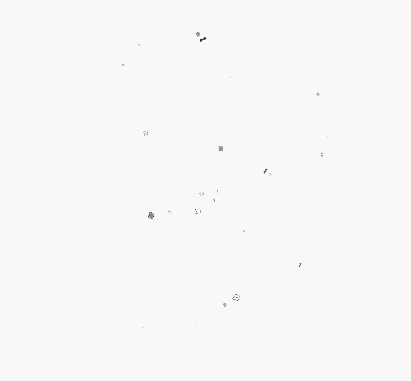

# 粒子动画（Particle）

粒子动画是在一定范围内随机生成的大量粒子产生运动而组成的动画。动画元素是一个个粒子，这些粒子可以是圆点、图片。通过对粒子在颜色、透明度、大小、速度、加速度、自旋角度等维度变化做动画，来营造一种氛围感，比如下雪的动效，雪花飘舞就相当于一个个雪花粒子在做动画。

粒子动画的效果通过Particle组件展现。


>  **说明：**
>
>  该组件从API Version 10开始支持。后续版本如有新增内容，则采用上角标单独标记该内容的起始版本。


## 子组件

无


## 接口

```typescript
function Particle
<
  PARTICLE extends ParticleType,
  COLOR_UPDATER extends ParticleUpdater,
  OPACITY_UPDATER extends ParticleUpdater,
  SCALE_UPDATER extends ParticleUpdater,
  ACC_SPEED_UPDATER extends ParticleUpdater,
  ACC_ANGLE_UPDATER extends ParticleUpdater,
  SPIN_UPDATER extends ParticleUpdater
>(value: {
  particles: Array<
    ParticleOptions<
      PARTICLE, 
      COLOR_UPDATER, 
      OPACITY_UPDATER, 
      SCALE_UPDATER, 
      ACC_SPEED_UPDATER, 
      ACC_ANGLE_UPDATER, 
      SPIN_UPDATER
    >
  >
})

```

**参数：**

| 参数名 | 类型 | 必填 | 描述 |
| -------- | -------- | -------- | -------- |
| value | {<br/>particles:Array&lt;[ParticleOptions](#particleoptions)&lt;<br/>[PARTICLE](#particletype), <br/>[COLOR_UPDATER](#particleupdater),<br/>[OPACITY_UPDATER](#particleupdater),<br/>[SCALE_UPDATER](#particleupdater),<br/>[ACC_SPEED_UPDATER](#particleupdater),<br/> [ACC_ANGLE_UPDATER](#particleupdater),<br/>[SPIN_UPDATER](#particleupdater)<br/>&gt;&gt;<br/>} | 是 | 粒子动画的集合。每一个的粒子动画（ParticleOptions）包含粒子发射，同时可配置粒子的颜色、透明度、大小、速度、加速度与旋转速度，旋转速度，详见[ParticleOptions](#particleoptions)属性说明。

## 属性
支持通用属性

## 事件
支持通用事件

## ParticleOptions

```typescript
interface ParticleOptions<
  PARTICLE extends ParticleType,
  COLOR_UPDATER extends ParticleUpdater,
  OPACITY_UPDATER extends ParticleUpdater,
  SCALE_UPDATER extends ParticleUpdater,
  ACC_SPEED_UPDATER extends ParticleUpdater,
  ACC_ANGLE_UPDATER extends ParticleUpdater,
  SPIN_UPDATER extends ParticleUpdater
> {
  emitter: EmitterOptions<PARTICLE>;
  color?: ParticleColorPropertyOptions<COLOR_UPDATER>;
  opacity?: ParticlePropertyOptions<number, OPACITY_UPDATER>;
  scale?: ParticlePropertyOptions<number, SCALE_UPDATER>;
  velocity?: {
    speed: [number, number];
    angle: [number, number];
  };
  acceleration?: {
    speed?: ParticlePropertyOptions<number, ACC_SPEED_UPDATER>;
    angle?: ParticlePropertyOptions<number, ACC_ANGLE_UPDATER>;
  };
  spin?: ParticlePropertyOptions<number, SPIN_UPDATER>;
}
```

| 参数名 | 类型 | 必填 | 描述 |
| -------- | -------- | -------- | -------- |
| emitter | [EmitterOptions](#emitteroptions)<[PARTICLE](#particletype)> | 是 | 粒子发射器配置。 |
| color | [ParticleColorPropertyOptions](#particlecolorpropertyoptions)<[COLOR_UPDATER](#particleupdater)> | 否 | 粒子颜色配置。<br/>**说明**：<br/>默认值：{ range:[Color.White,Color.White] } 。图片粒子不支持设置颜色。|
| opacity | [ParticlePropertyOptions](#particlepropertyoptions)\<number, [OPACITY_UPDATER](#particleupdater)> | 否 | 粒子透明度配置。<br/>默认值：{ range:[1.0,1.0] } |
| scale | [ParticlePropertyOptions](#particlepropertyoptions)\<number, [SCALE_UPDATER](#particleupdater)> | 否 | 粒子大小配置。<br/>默认值：{ range:[1.0,1.0] } |
| velocity | {<br/>speed: [number, number];<br/>angle: [number, number];<br/>} |否 | 粒子速度配置。<br/>**说明**：<br/>speed表示速度大小。angle表示速度的方向（单位为角度），以元素几何中心为坐标原点，水平方向为X轴，正数表示顺时针方向旋转角度。|<br/>默认值：{ speed:[0.0,0.0],angle:[0.0,0.0] } |
| acceleration | {<br/>speed?: [ParticlePropertyOptions](#particlepropertyoptions)<number, [ACC_SPEED_UPDATER](#particleupdater)>;<br/>angle?:  [ParticlePropertyOptions](#particlepropertyoptions)<number, [ACC_ANGLE_UPDATER](#particleupdater)>;<br/>} | 否 | 粒子加速度配置。 <br/>**说明**：<br/>speed表示加速度大小，angle表示加速度方向（单位为角度）。<br/>默认值：{ speed:{range:[0.0,0.0]},angle:{range:[0.0,0.0]} }|
| spin | [ParticlePropertyOptions](#particlepropertyoptions)<number, [SPIN_UPDATER](#particleupdater)> | 否 | 粒子自旋角度配置。 <br/>默认值：{range:[0.0,0.0]}<br/>方向：正数表示顺时针旋转，负数表示逆时针旋转。|


## EmitterOptions
粒子发射器的配置

```typescript
interface EmitterOptions<PARTICLE extends ParticleType> {   
  particle: {
    type: PARTICLE;
    config: ParticleConfigs[PARTICLE];
    count: number;
    lifetime?: number;
  };
  emitRate?: number;
  shape?: ParticleEmitterShape;
  position?: [Dimension, Dimension];
  size?: [Dimension, Dimension];
}
```
| 参数名 | 类型 | 必填 | 描述 |
| -------- | -------- | -------- | -------- |
| particle | {<br>type: [PARTICLE](#particletype),<br>config: [ParticleConfigs](#particleconfigs),<br>count: number,<br>lifetime?: number<br>} | 是 | 粒子配置。<br>-type表示粒子类型，可以选择图片或者是点。<br>-config表示对应类型的配置。<br>-config类型和type值有关联：<br>1、如果type为ParticleType.POINT，则config类型为[PointParticleParameters](#pointparticleparameters) 。<br>2、如果type为ParticleType.IMAGE，则config类型为[ImageParticleParameters](#imageparticleparameters) 。<br>-count表示发射的粒子总数，count取值>=-1,当count为-1表示粒子总数无限大。默认值：0<br>-lifetime表示单个粒子的生命周期，默认值1000（即1000ms，1s）,lifetime>=-1,当lifetime为-1表示粒子生命周期无限大。当lifetime<-1，取默认值。|
| emitRate | number | 否 | 发射器发射速率（即每秒发射粒子数）。 默认值：5。|
| shape | [ParticleEmitterShape](#particleemittershape) | 否 | 发射器形状。默认值：ParticleEmitterShape.RECTANGLE。 |
| position | [Dimension, Dimension] | 否 | 发射器位置（距离组件左上角的位置）。 <br>默认值：`[0.0, 0.0]`。|
| size | [Dimension, Dimension] |否 | 发射窗口的大小。<br>默认值\['100%','100%'\](即发射窗口占满Particle组件)。 |

## ParticleConfigs

```typescript
interface ParticleConfigs { 
  [ParticleType.POINT]: PointParticleParameters;
  [ParticleType.IMAGE]: ImageParticleParameters;
}
```


| 参数名称   | 类型   | 必填 | 描述 |
| -------- | -------------- | -------- | -------- |
| [ParticleType.POINT]      | [PointParticleParameters](#pointparticleparameters) | 是    | 点状粒子配置。 |
| [ParticleType.IMAGE]      | [ImageParticleParameters](#imageparticleparameters) | 是    | 图片粒子配置。 |

## PointParticleParameters
```typescript
interface PointParticleParameters {
  radius: VP;
}
```
| 参数名称   | 类型   | 必填 | 描述 |
| -------- | -------------- | -------- | -------- |
| radius      | [VP](ts-types.md#vp)| 是    | 粒子半径。 |

## ImageParticleParameters
```typescript
interface ImageParticleParameters {
  src: ResourceStr;
  size: [Dimension, Dimension];
  objectFit?: ImageFit;
}
```
| 参数名称   | 类型   | 必填 | 描述 |
| -------- | -------------- | -------- | -------- |
| src      | [ResourceStr](ts-types.md#resourcestr) | 是    | 图片路径。暂不支持svg图片类型。 |
| size     | \[[Dimension](ts-types.md#dimension10), [Dimension](ts-types.md#dimension10)\]| 是    | 图像尺寸。 |
| objectFit| [ImageFit](ts-appendix-enums.md#imagefit)| 否    | 图片显示模式。 |

## ParticleColorPropertyOptions

```typescript
interface ParticleColorPropertyOptions<UPDATER extends ParticleUpdater> {
  range: [ResourceColor, ResourceColor]; 
  updater?: {
    type: UPDATER;
    config: ParticleColorPropertyUpdaterConfigs[UPDATER];
  };
}
```
| 参数名 | 类型 | 必填 | 描述 |
| -------- | -------- | -------- | -------- |
| range | \[[ResourceColor](ts-types.md#resourcecolor), [ResourceColor](ts-types.md#resourcecolor)\] | 是 | 粒子初始颜色区间，粒子发射器生成粒子的初始颜色在range区间随机取值。<br>默认值：range:[Color.White,Color.White]
| updater | {<br>type: [UPDATER](#particleupdater);<br>config: [ParticleColorPropertyUpdaterConfigs](#particlecolorpropertyupdaterconfigs)[UPDATER];<br>} | 否 | 颜色属性变化配置。颜色属性变化类型type有三类：<br>1、当type为ParticleUpdater.NONE，表示无变化，则config类型为[ParticleColorPropertyUpdaterConfigs](#particlecolorpropertyupdaterconfigs)[ParticleUpdater.NONE]。 <br>2、type为ParticleUpdater.RANDOM，表示随机变化，则config类型为[ParticleColorPropertyUpdaterConfigs](#particlecolorpropertyupdaterconfigs)[ParticleUpdater.RANDOM]。 <br>3、type为ParticleUpdater.CURVE,表示按动画曲线变化，则config类型为[ParticleColorPropertyUpdaterConfigs](#particlecolorpropertyupdaterconfigs)[ParticleUpdater.CURVE]。|


## ParticleColorPropertyUpdaterConfigs
```typescript
interface ParticleColorPropertyUpdaterConfigs {
  [ParticleUpdater.NONE]: void;
  [ParticleUpdater.RANDOM]: {
    r: [number, number];
    g: [number, number];
    b: [number, number];
    a: [number, number];
  };
  [ParticleUpdater.CURVE]: Array<ParticlePropertyAnimation<ResourceColor>>;
}
```
| 参数名 | 类型 | 必填 | 描述 |
| -------- | -------- | -------- | -------- |
|[ParticleUpdater.NONE]|void | 是 | 无变化，默认值undefined。|
| [ParticleUpdater.RANDOM] | {<br>  r: [number, number];<br>  g: [number, number];<br>  b: [number, number];<br>  a: [number, number];<br>} | 是 | 表示变化方式为均匀变化的时候，在区间内随机生成一个差值。r、g、b、a四个颜色通道每秒分别使用差值叠加当前颜色值，生成目标颜色值。实现颜色随机变化的效果。|
[ParticleUpdater.CURVE]|Array<[ParticlePropertyAnimation](#particlepropertyanimation)\<[ResourceColor](ts-types.md#resourcecolor)\>> | 是 | 表示变化方式为曲线变化时，颜色变化的配置。数组类型表示当前属性可以设置多段动画，如0ms-3000ms，3000ms-5000ms，5000ms-8000ms分别设置动画。|

## ParticlePropertyOptions
```typescript
interface ParticlePropertyOptions<TYPE, UPDATER extends ParticleUpdater> {
  range: [TYPE, TYPE];
  updater?: {
    type: UPDATER;
    config: ParticlePropertyUpdaterConfigs<TYPE>[UPDATER];
  };
}
```
| 参数名 | 类型 | 必填 | 描述 |
| -------- | -------- | -------- | -------- |
| range | [number, number] | 是 | 粒子初始属性值区间，粒子发射器生成粒子的属性值在range区间随机取值。<br/>**说明**<br/>各项属性的非法输入取默认值，当最大值小于最小值的时候取默认区间。<br/>不同属性的默认值不同：<br>1、opacity属性：range:[1.0,1.0]，取值范围0到1，默认值为0.0。<br/>2、scale属性：range:[1.0,1.0]，取值范围大于等于0，默认值为1.0。<br/>3、acceleration加速度speed属性：range:[0.0,0.0]，取值范围大于等于0，默认值为0.0。<br/>4、acceleration加速度angle属性：range:[0.0,0.0]，取值范围大于等于0，默认值为0.0。<br/>5、spin属性：range:[0.0,0.0]，默认值为0.0。
| updater | {type: [UPDATER](#particleupdater);config: [ParticlePropertyUpdaterConfigs](#particlepropertyupdaterconfigs)[UPDATER];} | 否 | 属性变化配置。属性变化类型type有三类：<br/>1、当type为ParticleUpdater.NONE，表示无变化，则config类型为[ParticlePropertyUpdaterConfigs](#particlepropertyupdaterconfigs)[ParticleUpdater.NONE]。<br>2、当type为ParticleUpdater.RANDOM，表示变化类型为随机变化，则config类型为[ParticlePropertyUpdaterConfigs](#particlepropertyupdaterconfigs)[ParticleUpdater.RANDOM]。<br>3、当type为ParticleUpdater.CURVE，表示变化类型为曲线变化，则config类型为[ParticlePropertyUpdaterConfigs](#particlepropertyupdaterconfigs)[ParticleUpdater.CURVE]。


## ParticlePropertyUpdaterConfigs
```typescript
interface ParticlePropertyUpdaterConfigs<T> {
    [ParticleUpdater.NONE]: void;
    [ParticleUpdater.RANDOM]: [T, T];
    [ParticleUpdater.CURVE]: Array<ParticlePropertyAnimation<T>>;
}
```
| 参数名 | 类型 | 必填 | 描述 |
| -------- | -------- | -------- | -------- |
[[ParticleUpdater.NONE]|void | 是 | 无变化，默认值undefined。|
| [ParticleUpdater.RANDOM] | [number, number] | 是 | 表示变化方式为匀速变化时，每秒的变化差值为设置区间随机生成的值。<br/>目标属性值为当前属性值叠加变化差值。如当前属性值为0.2，config取[0.1,1.0]:<br/>1、如果变化差值在区间[0.1,1.0]取随机值0.5，则目标属性值为0.2+0.5 = 0.7；<br/>2、变化差值也可以取负值。如当前属性值为0.2，config为 [-3.0,2.0],如果变化差值在区间[-3.0,2.0]取随机值-2.0，则目标属性值为0.2-2.0 = -1.8。<br>**说明：**<br>config配置的是变化差值的取值范围，差值的最大最小值没有约束。但是如果当前属性值叠加差值大于属性最大值，目标属性值取属性最大值；如果当前属性值叠加差值小于属性最小值，目标属性值取属性最小值。<br>例如：opacity的取值范围[0.0,1.0]则当当前属性值叠加差值超过1.0，则取1.0。|
|[ParticleUpdater.CURVE]|Array<[ParticlePropertyAnimation](#particlepropertyanimation)\<number\>> | 是 | 表示变化方式为曲线变化时，属性变化的配置。数组类型表示当前属性可以设置多段动画，如0ms-3000ms，3000ms-5000ms，5000ms-8000ms分别设置动画。|


## ParticlePropertyAnimation
```typescript
interface ParticlePropertyAnimation<T> {
  from: T;
  to: T;
  startMillis: number;
  endMillis: number;
  curve?: Curve | ICurve;
}
```
| 参数名 | 类型 | 必填 | 描述 |
| -------- | -------- | -------- | -------- |
|from| T | 是 | 属性起始值。非法输入取对应属性的默认值。|
| to | T | 是 | 属性目标值。非法输入取对应属性的默认值。|
|startMillis|number | 是 | 动画开始时间。|
|endMillis|number | 是 | 动画结束时间。|
|curve|[Curve](ts-appendix-enums.md#curve)&nbsp;\|&nbsp;[ICurve](../apis/js-apis-curve.md#icurve)| 否 | 设置动画曲线。<br>默认值：Curve.Linear|


## ParticleType
```typescript
enum ParticleType {
  POINT = 'point',
  IMAGE = 'image',
}
```
| 名称  | 描述 |
| -------- |  -------- | 
POINT |点状粒子|
IMAGE | 图片粒子|


## ParticleEmitterShape
```typescript
enum ParticleEmitterShape {
  RECTANGLE = 'rectangle',
  CIRCLE = 'circle',
  ELLIPSE = 'ellipse',
}
```
| 名称  | 描述 |
| -------- |  -------- | 
RECTANGLE |粒子发射器为矩形|
CIRCLE | 粒子发射器为圆形|
ELLIPSE |粒子发射器为椭圆形|


## ParticleUpdater
```typescript
enum ParticleUpdater {
  NONE = 'none',
  RANDOM = 'random',
  CURVE = 'curve',
}
```
| 名称  | 描述 |
| -------- |  -------- | 
|NONE |无变化|
|RANDOM | 随机变化|
|CURVE |动画曲线变化|

## 示例

### 示例1
```ts
// xxx.ets
// xxx.ets
@Entry
@Component
struct ParticleExample {
  build() {
    Stack() {
      Text()
        .width(300).height(300).backgroundColor(Color.Black)
      Particle({particles:[
        {
          emitter:{
            particle:{
              type:ParticleType.POINT,//粒子类型
              config:{
                radius:10//圆点半径
              },
              count: 500,//粒子总数
              lifetime:10000//粒子生命周期，单位ms
            },
            emitRate:10,//每秒发射粒子数
            position:[0,0],
            shape:ParticleEmitterShape.RECTANGLE//发射器形状
          },
          color:{
            range:[Color.Red,Color.Yellow],//初始颜色范围
            updater:{
              type:ParticleUpdater.CURVE,//变化方式为曲线变化
              config:[
                {
                  from:Color.White,//变化起始值
                  to:Color.Pink,//变化终点值
                  startMillis:0,//开始时间
                  endMillis:3000,//结束时间
                  curve:Curve.EaseIn//变化曲线
                },
                {
                  from:Color.Pink,
                  to:Color.Orange,
                  startMillis:3000,
                  endMillis:5000,
                  curve:Curve.EaseIn
                },
                {
                  from:Color.Orange,
                  to:Color.Pink,
                  startMillis:5000,
                  endMillis:8000,
                  curve:Curve.EaseIn
                },
              ]
            }
          },
          opacity:{
            range:[0.0,1.0],//粒子透明度的初始值从【0.0到1.0】随机产生
            updater:{
              type:ParticleUpdater.CURVE,//透明度的变化方式是随机变化
              config:[
                {
                  from:0.0,
                  to:1.0,
                  startMillis:0,
                  endMillis:3000,
                  curve:Curve.EaseIn
                },
                {
                  from:1.0,
                  to:0.0,
                  startMillis:5000,
                  endMillis:10000,
                  curve:Curve.EaseIn
                }
              ]
            }
          },
          scale:{
            range:[0.0,0.0],
            updater:{
              type:ParticleUpdater.CURVE,
              config:[
                {
                  from:0.0,
                  to:0.5,
                  startMillis:0,
                  endMillis:3000,
                  curve: Curve.EaseIn
                }
              ]
            }
          },
          acceleration:{//加速度的配置，从大小和方向两个维度变化，speed表示加速度大小，angle表示加速度方向
            speed:{
              range:[3,9],
              updater:{
                type:ParticleUpdater.RANDOM,
                config:[1,20]
              }
            },
            angle:{
              range:[90,90]
            }
          }

        }
      ]
      }).width(300).height(300)
    }.width("100%").height("100%").align(Alignment.Center)
  }
}
```


### 示例2
```ts
@Entry
@Component
struct ParticleExample {
  @State
  myCount : number = 100
  flag : boolean = false;
  build() {
    Column(){
      Stack() {
        Particle({particles:[
          {
            emitter:{
              particle:{
                type:ParticleType.IMAGE,
                config:{
                  src:$r("app.media.glass"),
                  size:[10,10]
                },
                count: this.myCount,
                lifetime:10000
              },
              emitRate:3,
              shape:ParticleEmitterShape.CIRCLE
            },
            color:{
              range:[Color.White,Color.White]
            },
            opacity:{
              range:[1.0,1.0],
              updater:{
                type:ParticleUpdater.CURVE,
                config:[
                  {
                    from:0,
                    to:1.0,
                    startMillis:0,
                    endMillis:6000
                  },
                  {
                    from:1.0,
                    to:.0,
                    startMillis:6000,
                    endMillis:10000
                  }
                ]
              }
            },
            scale:{
              range:[0.1,1.0],
              updater:{
                type:ParticleUpdater.CURVE,
                config:[
                  {
                    from: 0,
                    to: 1.5,
                    startMillis: 0,
                    endMillis: 8000,
                    curve: Curve.EaseIn
                  }

                ]
              }
            },
            acceleration:{
              speed:{
                range:[3,9],
                updater:{
                  type: ParticleUpdater.CURVE,
                  config:[
                    {
                      from:10,
                      to:20,
                      startMillis:0,
                      endMillis:3000,
                      curve:Curve.EaseIn
                    },
                    {
                      from:10,
                      to:2,
                      startMillis:3000,
                      endMillis:8000,
                      curve:Curve.EaseIn
                    }
                  ]
                }
              },
              angle:{
                range:[0,180],
                updater:{
                  type:ParticleUpdater.CURVE,
                  config:[{
                    from:1,
                    to:2,
                    startMillis:0,
                    endMillis:1000,
                    curve:Curve.EaseIn
                  },
                    {
                      from:50,
                      to:-50,
                      startMillis:1000,
                      endMillis:3000,
                      curve:Curve.EaseIn
                    },
                    {
                      from:3,
                      to:5,
                      startMillis:3000,
                      endMillis:8000,
                      curve:Curve.EaseIn
                    }
                  ]
                }
              }
            },
            spin:{
              range:[0.1,1.0],
              updater:{
                type:ParticleUpdater.CURVE,
                config:[
                {
                  from: 0,
                  to: 360,
                  startMillis: 0,
                  endMillis: 8000,
                  curve: Curve.EaseIn
                }
                ]
              }
            },
          }
          ,{
          emitter:{
            particle:{
              type:ParticleType.IMAGE,
              config:{
                src:$r('app.media.book'),
                size:[10,10]
              },
              count: this.myCount,
              lifetime:10000
            },
            emitRate:3,
            shape:ParticleEmitterShape.CIRCLE
          },
          color:{
            range:[Color.White,Color.White]
          },
          opacity:{
            range:[1.0,1.0],
            updater:{
              type:ParticleUpdater.CURVE,
              config:[
                {
                  from:0,
                  to:1.0,
                  startMillis:0,
                  endMillis:6000
                },
                {
                  from:1.0,
                  to:.0,
                  startMillis:6000,
                  endMillis:10000
                }
              ]
            }
          },
          scale:{
            range:[0.1,1.0],
            updater:{
              type:ParticleUpdater.CURVE,
              config:[
                {
                  from: 0,
                  to: 2.0,
                  startMillis: 0,
                  endMillis: 10000,
                  curve: Curve.EaseIn
                }

              ]
            }
          },
          acceleration:{
            speed:{
              range:[3,9],
              updater:{
                type: ParticleUpdater.CURVE,
                config:[
                  {
                    from:10,
                    to:20,
                    startMillis:0,
                    endMillis:3000,
                    curve:Curve.EaseIn
                  },
                  {
                    from:10,
                    to:2,
                    startMillis:3000,
                    endMillis:8000,
                    curve:Curve.EaseIn
                  }
                ]
              }
            },
            angle:{
              range:[0,180],
              updater:{
                type:ParticleUpdater.CURVE,
                config:[{
                  from:1,
                  to:2,
                  startMillis:0,
                  endMillis:1000,
                  curve:Curve.EaseIn
                },
                  {
                    from:50,
                    to:-50,
                    startMillis:0,
                    endMillis:3000,
                    curve:Curve.EaseIn
                  },
                  {
                    from:3,
                    to:5,
                    startMillis:3000,
                    endMillis:10000,
                    curve:Curve.EaseIn
                  }
                ]
              }
            }
          },
          spin:{
            range:[0.1,1.0],
            updater:{
              type:ParticleUpdater.CURVE,
              config:[
                {
                  from: 0,
                  to: 360,
                  startMillis: 0,
                  endMillis: 10000,
                  curve: Curve.EaseIn
                }
              ]
            }
          },
        },{
          emitter:{
            particle:{
              type:ParticleType.IMAGE,
              config:{
                src:$r('app.media.squares'),
                size:[10,10]
              },
              count: this.myCount,
              lifetime:10000
            },
            emitRate:3,
            shape:ParticleEmitterShape.CIRCLE
          },
          color:{
            range:[Color.White,Color.White]
          },
          opacity:{
            range:[1.0,1.0],
            updater:{
              type:ParticleUpdater.CURVE,
              config:[
                {
                  from:0,
                  to:1.0,
                  startMillis:0,
                  endMillis:6000
                },
                {
                  from:1.0,
                  to:.0,
                  startMillis:6000,
                  endMillis:10000
                }
              ]
            }
          },
          scale:{
            range:[0.1,1.0],
            updater:{
              type:ParticleUpdater.CURVE,
              config:[
                {
                  from: 0,
                  to: 2.0,
                  startMillis: 0,
                  endMillis: 10000,
                  curve: Curve.EaseIn
                }

              ]
            }
          },
          acceleration:{
            speed:{
              range:[3,9],
              updater:{
                type: ParticleUpdater.CURVE,
                config:[
                  {
                    from:10,
                    to:20,
                    startMillis:0,
                    endMillis:3000,
                    curve:Curve.EaseIn
                  },
                  {
                    from:10,
                    to:2,
                    startMillis:3000,
                    endMillis:8000,
                    curve:Curve.EaseIn
                  }
                ]
              }
            },
            angle:{
              range:[0,180],
              updater:{
                type:ParticleUpdater.CURVE,
                config:[{
                  from:1,
                  to:2,
                  startMillis:0,
                  endMillis:1000,
                  curve:Curve.EaseIn
                },
                  {
                    from:50,
                    to:-50,
                    startMillis:1000,
                    endMillis:3000,
                    curve:Curve.EaseIn
                  },
                  {
                    from:3,
                    to:5,
                    startMillis:3000,
                    endMillis:8000,
                    curve:Curve.EaseIn
                  }
                ]
              }
            }
          },
          spin:{
            range:[0.1,1.0],
            updater:{
              type:ParticleUpdater.CURVE,
              config:[
                {
                  from: 0,
                  to: 360,
                  startMillis: 0,
                  endMillis: 10000,
                  curve: Curve.EaseIn
                }
              ]
            }
          },
        }
        ]
        }).width(300).height(300)

      }.width(500).height(500).align(Alignment.Center)
    }.width("100%").height("100%")

  }
}
```
