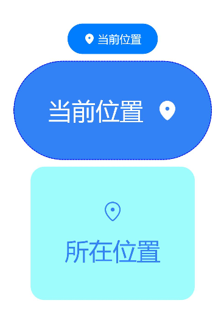

# LocationButton


安全控件的位置控件，用户通过点击该位置按钮，可以临时获取精准定位权限，而不需要权限弹框授权确认。


> **说明：**
>
> 该组件从API Version 10开始支持。后续版本如有新增内容，则采用上角标单独标记该内容的起始版本。


## 子组件

不支持。


## 接口
### LocationButton
LocationButton()

默认创建带有图标、文本、背景的位置按钮。

### LocationButton
LocationButton(option:{icon?: LocationIconStyle, text?: LocationDescription, buttonType?: ButtonType})

创建包含指定元素的位置按钮。

**参数：**

| 参数名 | 参数类型 | 必填 | 参数描述 |
| -------- | -------- | -------- | -------- |
| icon | [LocationIconStyle](#locationiconstyle枚举说明) | 否 | 设置位置按钮的图标风格<br/>不传入该参数表示没有图标，icon和text至少存在一个。 |
| text | [LocationDescription](#locationdescription枚举说明) | 否 | 设置位置按钮的文本描述<br/>不传入该参数表示没有文字描述，icon和text至少存在一个。 |
| buttonType | [ButtonType](ts-basic-components-button.md#buttontype枚举说明) | 否 | 设置位置按钮的背景样式<br/>不传入该参数表示没有背景。 |


## LocationIconStyle枚举说明

| 名称 | 枚举值 | 描述 |
| -------- | -------- | -------- |
| FULL_FILLED |  0 | 位置按钮展示填充样式图标。 |
| LINES | 1 | 位置按钮展示线条样式图标。 |


## LocationDescription枚举说明

| 名称 | 枚举值 | 描述 |
| -------- | -------- | -------- |
| CURRENT_LOCATION | 0 | 位置按钮的文字描述为“当前位置”。 |
| ADD_LOCATION | 1 | 位置按钮的文字描述为“添加位置”。 |
| SELECT_LOCATION | 2 | 位置按钮的文字描述为“选择位置”。 |
| SHARE_LOCATION | 3 | 位置按钮的文字描述为“共享位置”。 |
| SEND_LOCATION | 4 | 位置按钮的文字描述为“发送位置”。 |
| LOCATING | 5 | 位置按钮的文字描述为“定位”。 |
| LOCATION | 6 | 位置按钮的文字描述为“位置”。 |
| SEND_CURRENT_LOCATION | 7 | 位置按钮的文字描述为“发送实时位置”。 |
| RELOCATION | 8 | 位置按钮的文字描述为“重定位”。 |
| PUNCH_IN | 9 | 位置按钮的文字描述为“打卡定位”。 |
| CURRENT_POSITION | 10 | 位置按钮的文字描述为“所在位置”。 |


## LocationButtonOnClickResult枚举说明

| 名称 | 枚举值 | 描述 |
| -------- | -------- | -------- |
| SUCCESS | 0 | 位置按钮点击成功。 |
| TEMPORARY_AUTHORIZATION_FAILED | 1 | 位置按钮点击后位置权限授权失败。 |


## 属性

不支持通用属性，仅继承[安全控件通用属性](ts-securitycomponent-attributes.md#属性)。


## 事件

不支持通用事件，仅支持以下事件：

| 名称 | 功能描述 |
| -------- | -------- |
| onClick(event: (event: [ClickEvent](ts-universal-events-click.md#clickevent对象说明), result: [LocationButtonOnClickResult](#locationbuttononclickresult枚举说明)) =&gt; void) | 点击动作触发该回调。<br/>result：位置权限的授权结果。<br/>event：见ClickEvent对象说明。 |


## 示例

```
// xxx.ets
@Entry
@Component
struct Index {
  build() {
    Row() {
      Column({space:10}) {
        // 默认参数下，图标、文字、背景都存在
        LocationButton().onClick((event: ClickEvent, result: LocationButtonOnClickResult)=>{
          console.info("result " + result)
        })
        // 传入参数即表示元素存在，不传入的参数表示元素不存在，例如：只显示图标
        LocationButton({icon:LocationIconStyle.LINES})
        // 只显示图标+背景
        LocationButton({icon:LocationIconStyle.LINES, buttonType:ButtonType.Capsule})
        // 图标、文字、背景都存在
        LocationButton({icon:LocationIconStyle.LINES, text:LocationDescription.CURRENT_LOCATION, buttonType:ButtonType.Capsule})
      }.width('100%')
    }.height('100%')
  }
}
```


