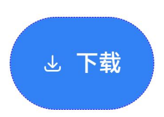

# 安全控件通用属性


安全控件的基础属性，用于设置安全控件通用的属性。


> **说明：**
>
> 该组件从API Version 10开始支持。后续版本如有新增内容，则采用上角标单独标记该内容的起始版本。


## 属性

| 名称 | 参数类型 | 必填 | 描述 |
| -------- | -------- | -------- | -------- |
| iconSize | [Dimension](ts-types.md#dimension10) | 否 | 设置安全控件上图标的尺寸。<br/>默认值：16vp |
| layoutDirection | [SecurityComponentLayoutDirection](#securitycomponentlayoutdirection枚举说明) | 否 | 设置安全控件上图标和文字分布的方向。<br/>默认值：SecurityComponentLayoutDirection.HORIZONTAL |
| position | [Position](ts-types.md#position8) | 否 | 设置绝对定位，设置安全控件的左上角相对于父容器左上角的偏移位置。<br/>默认值：<br/>{<br/>x: 0,<br/>y: 0<br/>} |
| markAnchor | [Position](ts-types.md#position8) | 否 | 设置安全控件在位置定位时的锚点，以控件左上角作为基准点进行偏移。通常配合position和offset属性使用，单独使用时，效果类似offset<br/>默认值：<br/>{<br/>x: 0,<br/>y: 0<br/>} |
| offset | [Position](ts-types.md#position8) | 否 | 设置相对定位，安全控件相对于自身的偏移量。<br/>默认值：<br/>{<br/>x: 0,<br/>y: 0<br/>} |
| fontSize | [Dimension](ts-types.md#dimension10) | 否 | 设置安全控件上文字的尺寸。<br/>默认值：16fp |
| fontStyle | [FontStyle](ts-appendix-enums.md#fontstyle) | 否 | 设置安全控件上文字的样式。<br/>默认值：FontStyle.Normal |
| fontWeight | number \| [FontWeight](ts-appendix-enums.md#fontweight) \| string | 否 | 设置安全控件上文字粗细。<br/>默认值：FontWeight.Medium |
| fontFamily | string \| [Resource](ts-types.md#resource) | 否 | 设置安全控件上文字的字体。<br/>默认字体：'HarmonyOS Sans' |
| fontColor | [ResourceColor](ts-types.md#resourcecolor) | 否 | 设置安全控件上文字的颜色。<br/>默认值：\#ffffffff |
| iconColor | [ResourceColor](ts-types.md#resourcecolor) | 否 | 设置安全控件上图标的颜色。<br/>默认值：\#ffffffff |
| backgroundColor | [ResourceColor](ts-types.md#resourcecolor) | 否 | 设置安全控件的背景颜色。<br/>默认值：\#007dff |
| borderStyle | [BorderStyle](ts-appendix-enums.md#borderstyle) | 否 | 设置安全控件的边框的样式。<br/>默认不设置边框样式 |
| borderWidth | [Dimension](ts-types.md#dimension10) | 否 | 设置安全控件的边框的宽度。<br/>默认不设置边框宽度 |
| borderColor | [ResourceColor](ts-types.md#resourcecolor) | 否 | 设置安全控件的边框的颜色。<br/>默认不设置边框颜色 |
| borderRadius | [Dimension](ts-types.md#dimension10) | 否 | 设置安全控件的边框圆角半径。|
| padding | [Padding](ts-types.md#padding) \| [Dimension](ts-types.md#dimension10) | 否 | 设置安全控件的内边距。<br/>默认值：上下12vp, 左右24vp |
| textIconSpace | [Dimension](ts-types.md#dimension10) | 否 | 设置安全控件中图标和文字的间距。<br/>默认值：4vp |
| width<sup>11+</sup> | [Length](ts-types.md#length) | 否 | 设置安全控件自身的宽度，缺省时将根据元素内容自适配宽度。若设置宽度小于当前属性组合下允许的最小宽度时，宽度不会缩减到设置值，此时宽度会大于设置宽度，以保证安全控件显示的完整性。 |
| height<sup>11+</sup> | [Length](ts-types.md#length) | 否 | 设置安全控件自身的高度，缺省时将根据元素内容自适配高度。若设置高度小于当前属性组合下允许的最小高度时，高度不会缩减到设置值，此时高度会大于设置高度，以保证安全控件显示的完整性。 |
| size<sup>11+</sup> | {<br/>width?:&nbsp;[Length](ts-types.md#length),<br/>height?:&nbsp;[Length](ts-types.md#length)<br/>} | 否 | 设置高宽尺寸，缺省时将根据元素内容自适配高宽尺寸。若设置尺寸小于当前属性组合下允许的最小尺寸时，尺寸不会缩减到设置值，此时尺寸会大于设置尺寸，以保证安全控件显示的完整性|
| constraintSize<sup>11+</sup> | {<br/>minWidth?:&nbsp;[Length](ts-types.md#length),<br/>maxWidth?:&nbsp;[Length](ts-types.md#length),<br/>minHeight?:&nbsp;[Length](ts-types.md#length),<br/>maxHeight?:&nbsp;[Length](ts-types.md#length)<br/>} | 否 | 设置约束尺寸，安全控件布局时，进行尺寸范围限制，constraintSize的优先级高于Width和Height。取值结果参考[constraintSize取值对width/height影响](ts-universal-attributes-size.md#constraintsize取值对widthheight影响)。<br> 同width/height一样，控件尺寸无法小于当前属性组合下的最小值，以保证安全控件显示的完整性。<br>默认值：<br>{<br/>minWidth:&nbsp;0,<br/>maxWidth:&nbsp;Infinity,<br/>minHeight:&nbsp;0,<br/>maxHeight:&nbsp;Infinity<br/>} |


## SecurityComponentLayoutDirection枚举说明

| 名称 | 描述 |
| -------- | -------- |
| HORIZONTAL | 安全控件上图标和文字分布的方向为水平排列。 |
| VERTICAL | 安全控件上图标和文字分布的方向为垂直排列。 |


## 示例

```ts
// xxx.ets
@Entry
@Component
struct Index {
  build() {
    Row() {
      Column({space:5}) {
        // 生成一个保存按钮，并设置它的SecurityComponent属性
        SaveButton()
          .fontSize(35)
          .fontColor(Color.White)
          .iconSize(30)
          .layoutDirection(SecurityComponentLayoutDirection.HORIZONTAL)
          .borderWidth(1)
          .borderStyle(BorderStyle.Dashed)
          .borderColor(Color.Blue)
          .borderRadius(20)
          .fontWeight(100)
          .iconColor(Color.White)
          .padding({left:50, top:50, bottom:50, right:50})
          .textIconSpace(20)
          .backgroundColor(0x3282f6)
        SaveButton().size({width:200, height:100})
        SaveButton().constraintSize({maxWidth:60})
      }.width('100%')
    }.height('100%')
  }
}
```


