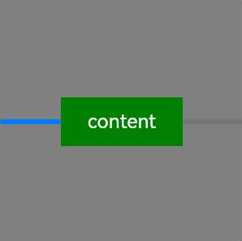
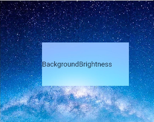
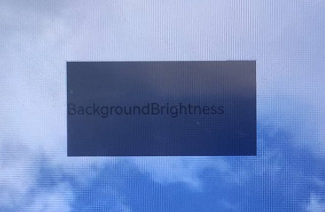
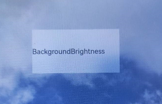

# 背景设置

设置组件的背景样式。

>  **说明：**
>
>  从API Version 7开始支持。后续版本如有新增内容，则采用上角标单独标记该内容的起始版本。

## background<sup>10+</sup>

background(builder: CustomBuilder, options?: { align?: Alignment })

设置组件背景。

**系统能力：** SystemCapability.ArkUI.ArkUI.Full

**参数：** 

| 参数名  | 类型                                                 | 必填 | 说明                                                         |
| ------- | ---------------------------------------------------- | ---- | ------------------------------------------------------------ |
| builder | [CustomBuilder](ts-types.md#custombuilder8)          | 是   | 自定义背景。                                                 |
| options | {align?:[Alignment](ts-appendix-enums.md#alignment)} | 否   | 设置自定义背景与组件的对齐方式。<br/>同时设置了background，backgroundColor，backgroundImage时，叠加显示，background在最上层。 |

>  **说明：**
>
>  自定义背景渲染会有一定延迟，不能响应事件，不能进行动态更新。该属性不支持嵌套使用，不支持预览器预览。

## backgroundColor

backgroundColor(value: ResourceColor)

设置组件背景色。

**卡片能力：** 从API version 9开始，该接口支持在ArkTS卡片中使用。

**系统能力：** SystemCapability.ArkUI.ArkUI.Full

**参数：** 

| 参数名 | 类型                                       | 必填 | 说明               |
| ------ | ------------------------------------------ | ---- | ------------------ |
| value  | [ResourceColor](ts-types.md#resourcecolor) | 是   | 设置组件的背景色。 |

## backgroundImage

backgroundImage(src: ResourceStr, repeat?: ImageRepeat)

设置组件的背景图片。

**卡片能力：** 从API version 9开始，该接口支持在ArkTS卡片中使用。

**系统能力：** SystemCapability.ArkUI.ArkUI.Full

**参数：** 

| 参数名 | 类型                                            | 必填 | 说明                                                         |
| ------ | ----------------------------------------------- | ---- | ------------------------------------------------------------ |
| src    | [ResourceStr](ts-types.md#resourcestr)          | 是   | 图片地址，支持网络图片资源地址和本地图片资源地址和Base64，不支持svg类型的图片。 |
| repeat | [ImageRepeat](ts-appendix-enums.md#imagerepeat) | 否   | 设置背景图片的重复样式，默认不重复。当设置的背景图片为透明底色图片，且同时设置了backgroundColor时，二者叠加显示，背景颜色在最底部。 |

## backgroundImageSize

backgroundImageSize(value: SizeOptions | ImageSize)

设置组件背景图片的宽高。

**卡片能力：** 从API version 9开始，该接口支持在ArkTS卡片中使用。

**系统能力：** SystemCapability.ArkUI.ArkUI.Full

**参数：** 

| 参数名 | 类型                                                         | 必填 | 说明                                                         |
| ------ | ------------------------------------------------------------ | ---- | ------------------------------------------------------------ |
| value  | [SizeOptions](ts-universal-attributes-size.md#sizeoptions对象说明)&nbsp;\|&nbsp;[ImageSize](ts-appendix-enums.md#imagesize) | 是   | 设置背景图像的高度和宽度。当输入为{width:&nbsp;Length,&nbsp;height:&nbsp;Length}对象时，如果只设置一个属性，则第二个属性保持图片原始宽高比进行调整。默认保持原图的比例不变。<br/>width和height取值范围： [0, +∞)<br/>默认值：ImageSize.Auto<br/>从API version 9开始，该接口支持在ArkTS卡片中使用。<br/>**说明：** <br/>设置为小于0的值时，按值为0显示。当设置了height未设置width时，width根据图片原始宽高比进行调整。 |

## backgroundImagePosition

backgroundImagePosition(value: Position | Alignment)

设置背景图的位置。

**卡片能力：** 从API version 9开始，该接口支持在ArkTS卡片中使用。

**系统能力：** SystemCapability.ArkUI.ArkUI.Full

**参数：** 

| 参数名 | 类型                                                         | 必填 | 说明                                                         |
| ------ | ------------------------------------------------------------ | ---- | ------------------------------------------------------------ |
| value  | [Position](ts-types.md#position8)&nbsp;\|&nbsp;[Alignment](ts-appendix-enums.md#alignment) | 是   | 设置背景图在组件中显示位置，即相对于组件左上角的坐标。<br/>默认值：<br/>{<br/>x:&nbsp;0,<br/>y:&nbsp;0<br/>} <br/> x和y值设置百分比时，偏移量是相对组件自身宽高计算的。<br/>从API version 9开始，该接口支持在ArkTS卡片中使用。 |

## backgroundBlurStyle<sup>9+</sup>

backgroundBlurStyle(value: BlurStyle, options?: BackgroundBlurStyleOptions)

为当前组件提供一种在背景和内容之间的模糊能力。

**卡片能力：** 从API version 9开始，该接口支持在ArkTS卡片中使用。

**系统能力：** SystemCapability.ArkUI.ArkUI.Full

**参数：** 

| 参数名                | 类型                                                         | 必填 | 说明                                                         |
| --------------------- | ------------------------------------------------------------ | ---- | ------------------------------------------------------------ |
| value                 | [BlurStyle](ts-appendix-enums.md#blurstyle9)                 | 是   | 背景模糊样式。模糊样式中封装了模糊半径、蒙版颜色、蒙版透明度、饱和度、亮度五个参数。 |
| options<sup>10+</sup> | [BackgroundBlurStyleOptions](#backgroundblurstyleoptions10对象说明) | 否   | 背景模糊选项。                                               |

## backgroundEffect<sup>11+</sup> 

backgroundEffect(options: BackgroundEffectOptions)

设置组件背景属性。

**系统能力：** SystemCapability.ArkUI.ArkUI.Full

**参数：** 

| 参数名  | 类型                                                         | 必填 | 说明                                       |
| ------- | ------------------------------------------------------------ | ---- | ------------------------------------------ |
| options | [BackgroundEffectOptions](ts-appendix-enums.md#backgroundeffectoptions11) | 否   | 设置组件背景属性包括：饱和度，亮度，颜色。 |

## backgroundBrightness<sup>11+</sup> 

backgroundBrightness({rate:number,lightUpDegree:number})

设置组件背景动态提亮。

**系统能力：** SystemCapability.ArkUI.ArkUI.Full

**系统API：** 此接口为系统接口

**参数：** 

| 名称            | 参数类型                                     | 必填   | 描述                                       |
| ------------- | ---------------------------------------- | ---- | ---------------------------------------- |
| rate          | number | 是    | lightUpDegree的速率，随着像素亮度的增加而降低。此参数为系统接口。<br/>默认值：0.0 <br/>取值范围：(0.0, +∞)<br/> |
| lightUpDegree | number | 是    | 亮度的程度，其亮度变化时rgb值的变化为0。此参数为系统接口。<br/> 默认值：0.0 <br/>取值范围：[-1.0, 1.0]<br/> |

## BackgroundBlurStyleOptions<sup>10+</sup>对象说明

| 名称            | 参数类型                                     | 必填   | 描述                                       |
| ------------- | ---------------------------------------- | ---- | ---------------------------------------- |
| colorMode     | [ThemeColorMode](ts-appendix-enums.md#themecolormode10) | 否    | 背景模糊效果使用的深浅色模式。<br/>默认值：ThemeColorMode.System |
| adaptiveColor | [AdaptiveColor](ts-appendix-enums.md#adaptivecolor10) | 否    | 背景模糊效果使用的取色模式。<br/ > 默认值：AdaptiveColor.Default |
| scale         | number                                   | 否    | 背景材质模糊效果程度。此参数为系统接口。<br/>默认值：1.0 <br/>取值范围：[0.0, 1.0]<br/> |
| blurOptions<sup>11+</sup> | [BlurOptions](ts-appendix-enums.md#bluroptions11)         | 否    | 灰阶模糊参数。           |

## 示例

### 示例1

```ts
// xxx.ets
@Entry
@Component
struct BackgroundExample {

  build() {
    Column({ space: 5 }) {
      Text('background color').fontSize(9).width('90%').fontColor(0xCCCCCC)
      Row().width('90%').height(50).backgroundColor(0xE5E5E5).border({ width: 1 })

      Text('background image repeat along X').fontSize(9).width('90%').fontColor(0xCCCCCC)
      Row()
        .backgroundImage('/comment/bg.jpg', ImageRepeat.X)
        .backgroundImageSize({ width: '250px', height: '140px' })
        .width('90%')
        .height(70)
        .border({ width: 1 })

      Text('background image repeat along Y').fontSize(9).width('90%').fontColor(0xCCCCCC)
      Row()
        .backgroundImage('/comment/bg.jpg', ImageRepeat.Y)
        .backgroundImageSize({ width: '500px', height: '120px' })
        .width('90%')
        .height(100)
        .border({ width: 1 })

      Text('background image size').fontSize(9).width('90%').fontColor(0xCCCCCC)
      Row()
        .width('90%').height(150)
        .backgroundImage('/comment/bg.jpg', ImageRepeat.NoRepeat)
        .backgroundImageSize({ width: 1000, height: 500 })
        .border({ width: 1 })

      Text('background fill the box(Cover)').fontSize(9).width('90%').fontColor(0xCCCCCC)
      // 不保证图片完整的情况下占满盒子
      Row()
        .width(200)
        .height(50)
        .backgroundImage('/comment/bg.jpg', ImageRepeat.NoRepeat)
        .backgroundImageSize(ImageSize.Cover)
        .border({ width: 1 })

      Text('background fill the box(Contain)').fontSize(9).width('90%').fontColor(0xCCCCCC)
      // 保证图片完整的情况下放到最大
      Row()
        .width(200)
        .height(50)
        .backgroundImage('/comment/bg.jpg', ImageRepeat.NoRepeat)
        .backgroundImageSize(ImageSize.Contain)
        .border({ width: 1 })

      Text('background image position').fontSize(9).width('90%').fontColor(0xCCCCCC)
      Row()
        .width(100)
        .height(50)
        .backgroundImage('/comment/bg.jpg', ImageRepeat.NoRepeat)
        .backgroundImageSize({ width: 1000, height: 560 })
        .backgroundImagePosition({ x: -500, y: -300 })
        .border({ width: 1 })
    }
    .width('100%').height('100%').padding({ top: 5 })
  }
}
```


### 示例2

```ts
// xxx.ets
@Entry
@Component
struct BackgroundBlurStyleDemo {
  build() {
    Column() {
      Row() {
        Text("Thin Material")
      }
      .width('50%')
      .height('50%')
      .backgroundBlurStyle(BlurStyle.Thin, { colorMode: ThemeColorMode.LIGHT, adaptiveColor: AdaptiveColor.DEFAULT, scale: 1.0 })
      .position({ x: '15%', y: '30%' })
    }
    .height('100%')
    .width('100%')
    .backgroundImage($r('app.media.bg'))
    .backgroundImageSize(ImageSize.Cover)
  }
}
```


### 示例3

```ts
// xxx.ets
@Entry
@Component
struct BackgroundExample {
  @Builder renderBackground() {
    Column() {
      Progress({value : 50})
    }
  }

  build() {
    Column() {
      Text("content")
        .width(100)
        .height(40)
        .fontColor("#FFF")
        .position({x:50, y:80})
        .textAlign(TextAlign.Center)
        .backgroundColor(Color.Green)
    }
    .width(200).height(200)
    .background(this.renderBackground)
    .backgroundColor(Color.Gray)
  }
}
```



### 示例4

设置组件背景动态提亮效果

```ts
// xxx.ets
@Entry
@Component
struct BackgroundBrightnessDemo {
  build() {
    Column() {
      Row() {
        Text("BackgroundBrightness")
      }
      .width(200)
      .height(100)
      .position({ x: 100, y: 100 })
      .backgroundBlurStyle(BlurStyle.Thin, { colorMode: ThemeColorMode.LIGHT, adaptiveColor: AdaptiveColor.DEFAULT, scale: 1.0 })
      .backgroundBrightness({rate:0.5,lightUpDegree:0.5}) // 背景动态提亮
    }
    .width('100%')
    .height('100%')
    .backgroundImage($r('app.media.image'))
    .backgroundImageSize(ImageSize.Cover)
  }
}
```

效果图如下：



修改rate和lightUpDegree参数值为0.5,-0.1：



去掉backgroundBrightness的设置，效果如下：

