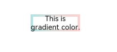
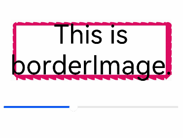

# 图片边框设置

设置容器组件的图片边框样式。

>  **说明：**
>
>  从API Version 9开始支持。后续版本如有新增内容，则采用上角标单独标记该内容的起始版本。

## 属性

| 名称         | 参数类型                                     | 描述                                      |
| ---------- | ---------------------------------------- | --------------------------------------- |
| borderImage     | [BorderImageOption](#borderimageoption对象说明) | 图片边框或者渐变色边框设置接口。<br/>该接口支持在ArkTS卡片中使用。 |

## BorderImageOption对象说明

该接口支持在ArkTS卡片中使用。

| 名称         | 类型                                     | 描述                                      |
| ---------- | ---------------------------------------- | --------------------------------------- |
| source     | string \| [Resource](ts-types.md#resource) \| [linearGradient](ts-universal-attributes-gradient-color.md) | 边框图源或者渐变色设置。<br/>**说明：** 边框图源仅适用于容器组件，如Row、Column、Flex，在非容器组件上使用会失效。 |
| slice      | [Length](ts-types.md#length) \| [EdgeWidths](ts-types.md#edgewidths9) | 设置图片边框切割宽度。<br/>默认值：0                   |
| width      | [Length](ts-types.md#length) \| [EdgeWidths](ts-types.md#edgewidths9) | 设置图片边框宽度。<br/>默认值：0                     |
| outset     | [Length](ts-types.md#length) \| [EdgeWidths](ts-types.md#edgewidths9) | 设置边框图片向外延伸距离。<br/>默认值：0                 |
| repeat | [RepeatMode](#repeatmode枚举说明)                               | 设置边框图片的重复方式。<br/>默认值：RepeatMode.Stretch |
| fill       | boolean                                  | 设置边框图片中心填充。<br/>默认值：false               |

## RepeatMode枚举说明

该接口支持在ArkTS卡片中使用。

| 名称      | 描述                                  |
| ------- | ----------------------------------- |
| Repeat  | 被切割图片重复铺平在图片边框上，超出的部分会被剪裁。          |
| Stretch | 被切割图片以拉伸填充的方式铺满图片边框。                |
| Round   | 被切割图片以整数次平铺在图片边框上，无法以整数次平铺时压缩被切割图片。 |
| Space   | 被切割图片以整数次平铺在图片边框上，无法以整数次平铺时以空白填充。   |

## 示例

### 示例1


```ts
// xxx.ets
@Entry
@Component
struct Index {
  build() {
    Row() {
      Column() {
        Text('This is gradient color.').textAlign(TextAlign.Center).height(50).width(200)
          .borderImage({
            source: {
              angle: 90,
              direction: GradientDirection.Left,
              colors: [[0xAEE1E1, 0.0], [0xD3E0DC, 0.3], [0xFCD1D1, 1.0]]
            },
            slice: { top: 10, bottom: 10, left: 10, right: 10 },
            width: { top: "10px", bottom: "10px", left: "10px", right: "10px" },
            repeat: RepeatMode.Stretch,
            fill: false
          })
      }
      .width('100%')
    }
    .height('100%')
  }
}
```



### 示例2

```ts
// xxx.ets
@Entry
@Component
struct Index {
  @State outSetValue: number = 40

  build() {
    Row() {
      Column() {
        Row() {
          Text('This is borderImage.').textAlign(TextAlign.Center).fontSize(50)
        }
        .borderImage({
          source: $r('app.media.icon'),
          slice: `${this.outSetValue}%`,
          width: `${this.outSetValue}px`,
          outset: '5px',
          repeat: RepeatMode.Repeat,
          fill: false
        })

        Slider({
          value: this.outSetValue,
          min: 0,
          max: 100,
          style: SliderStyle.OutSet
        })
          .margin({ top: 30 })
          .onChange((value: number, mode: SliderChangeMode) => {
            this.outSetValue = value
            console.info('value:' + value + 'mode:' + mode.toString())
          })
      }
      .width('100%')
    }
    .height('100%')
  }
}
```

