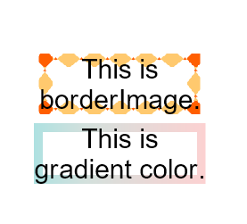

# 图片边框设置
设置组件图片边框样式。
>  **说明：**
>
> 从API Version 9开始支持。后续版本如有新增内容，则采用上角标单独标记该内容的起始版本。
## 权限列表

无


## 属性


| 名称 | 参数类型 | 默认值 | 描述 |
| -------- | -------- | -------- | -------- |
| borderSource | string \| [Resource](../../ui/ts-types.md) \| [linearGradient](ts-universal-attributes-gradient-color.md) | - | 边框图源或者渐变色设置。 |
| borderSlice | Length \| 图像切割四个方向宽度 | 0 | 设置图片边框切割宽度。 |
| borderWidth | Length \| 图像边框四个方向宽度 | 0 | 设置图片边框宽度。 |
| borderOutset | Length \| 图像边框四个方向外延距离 | 0 | 设置边框图片向外延伸距离。 |
| RepeatMode  | RepeatMode | RepeatMode.Stretch | 设置边框图片的重复方式。 |

- RepeatMode枚举说明
  | 名称 | 描述 | 
  | -------- | -------- |
  | Repeat | 被切割图片重复铺平在图片边框上，超出的部分会被剪裁。| 
  | Stretch | 被切割图片以拉伸填充的方式铺满图片边框。 | 
  | Round | 被切割图片以整数次平铺在图片边框上，无法以整数次平铺时压缩被切割图片。 | 
  | Space | 被切割图片以整数次平铺在图片边框上，无法以整数次平铺时以空白填充。 | 


## 示例

```ts
// xxx.ets
@Entry
@Component
struct Index {
  @State message: string = 'This is\nborderImage.'
  @State message2: string = 'This is\ngradient color.'

  build() {
    Row() {
      Column() {
        Text(this.message).textAlign(TextAlign.Center)
          .borderImage({
            source: "borderOrigin.png",
            slice: {top:"31%", bottom:"31%", left:"31%", right:"31%"},
            width: {top:"20px", bottom:"20px", left:"20px", right:"20px"},
            outset: {top:"5px", bottom:"5px", left:"5px", right:"5px"},
            repeat: RepeatMode.Repeat,
            fill: false
          });
        Text(this.message2).textAlign(TextAlign.Center)
          .margin(10)
          .borderImage({
            source: {angle:90,
              direction: GradientDirection.Left,
              colors: [[0xAEE1E1, 0.0], [0xD3E0DC, 0.3], [0xFCD1D1, 1.0]]},
            slice: {top:10, bottom:10, left:10, right:10},
            width: {top:"10px", bottom:"10px", left: "10px", right:"10px"},
            repeat: RepeatMode.Stretch,
            fill: false
          });
      }
      .width('100%')
    }
    .height('100%')
  }
}
```


