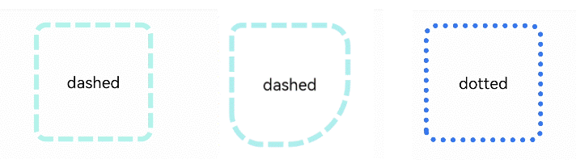

# 边框设置

设置组件边框样式。

>  **说明：**
>
>  从API Version 7开始支持。后续版本如有新增内容，则采用上角标单独标记该内容的起始版本。
>
>  从API Version 9开始，父节点的border显示在子节点内容之上。


## 属性

| 名称         | 参数类型                                                     | 描述                                                         |
| ------------ | ------------------------------------------------------------ | ------------------------------------------------------------ |
| border       | {<br/>width?:&nbsp;[Length](ts-types.md#length)&nbsp;\|&nbsp;[EdgeWidths](#edgewidths9对象说明)<sup>9+</sup>,<br/>color?: &nbsp;[ResourceColor](ts-types.md#resourcecolor)&nbsp;\|&nbsp;[EdgeColors](#edgecolors9对象说明)<sup>9+</sup>,<br/>radius?: &nbsp;[Length](ts-types.md#length)&nbsp;\|&nbsp;[BorderRadiuses](#borderradiuses9对象说明)<sup>9+</sup>,<br/>style?:&nbsp;[BorderStyle](ts-appendix-enums.md#borderstyle)&nbsp;\|&nbsp;[EdgeStyles](#edgestyles9对象说明)<sup>9+</sup><br/>} | 统一边框样式设置接口。<br/>-&nbsp;width：设置边框宽度。<br/>-&nbsp;color：设置边框颜色。<br/>-&nbsp;radius：设置边框圆角半径。<br/>-&nbsp;style：设置边框样式。<br/>从API version 9开始，该接口支持在ArkTS卡片中使用。 |
| borderStyle  | [BorderStyle](ts-appendix-enums.md#borderstyle) \| [EdgeStyles](#edgestyles9对象说明)<sup>9+</sup> | 设置元素的边框样式。<br/>默认值：BorderStyle.Solid<br/>从API version 9开始，该接口支持在ArkTS卡片中使用。 |
| borderWidth  | [Length](ts-types.md#length) \| [EdgeWidths](#edgewidths9对象说明)<sup>9+</sup> | 设置元素的边框宽度，不支持百分比。<br/>从API version 9开始，该接口支持在ArkTS卡片中使用。 |
| borderColor  | [ResourceColor](ts-types.md#resourcecolor) \| [EdgeColors](#edgecolors9对象说明)<sup>9+</sup> | 设置元素的边框颜色。<br/>默认值：Color.Black<br/>从API version 9开始，该接口支持在ArkTS卡片中使用。 |
| borderRadius | [Length](ts-types.md#length) \| [BorderRadiuses](#borderradiuses9对象说明)<sup>9+</sup> | 设置元素的边框圆角半径，不支持百分比。<br/>从API version 9开始，该接口支持在ArkTS卡片中使用。 |

## EdgeWidths<sup>9+</sup>对象说明

引入该对象时，至少传入一个参数。

| 名称     | 参数类型                         | 必填   | 描述      |
| ------ | ---------------------------- | ---- | ------- |
| left   | [Length](ts-types.md#length) | 否    | 左侧边框宽度。 |
| right  | [Length](ts-types.md#length) | 否    | 右侧边框宽度。 |
| top    | [Length](ts-types.md#length) | 否    | 上侧边框宽度。 |
| bottom | [Length](ts-types.md#length) | 否    | 下侧边框宽度。 |

## EdgeColors<sup>9+</sup>对象说明

引入该对象时，至少传入一个参数。

| 名称     | 参数类型                                     | 必填   | 描述      |
| ------ | ---------------------------------------- | ---- | ------- |
| left   | [ResourceColor](ts-types.md#resourcecolor) | 否    | 左侧边框颜色。 |
| right  | [ResourceColor](ts-types.md#resourcecolor) | 否    | 右侧边框颜色。 |
| top    | [ResourceColor](ts-types.md#resourcecolor) | 否    | 上侧边框颜色。 |
| bottom | [ResourceColor](ts-types.md#resourcecolor) | 否    | 下侧边框颜色。 |

## BorderRadiuses<sup>9+</sup>对象说明

引用该对象时，至少传入一个参数。

| 名称          | 参数类型                         | 必填   | 描述       |
| ----------- | ---------------------------- | ---- | -------- |
| topLeft     | [Length](ts-types.md#length) | 否    | 左上角圆角半径。 |
| topRight    | [Length](ts-types.md#length) | 否    | 右上角圆角半径。 |
| bottomLeft  | [Length](ts-types.md#length) | 否    | 左下角圆角半径。 |
| bottomRight | [Length](ts-types.md#length) | 否    | 右下角圆角半径。 |

## EdgeStyles<sup>9+</sup>对象说明

引入该对象时，至少传入一个参数。

| 名称     | 参数类型                                     | 必填   | 描述      |
| ------ | ---------------------------------------- | ---- | ------- |
| left   | [BorderStyle](ts-appendix-enums.md#borderstyle) | 否    | 左侧边框样式。 |
| right  | [BorderStyle](ts-appendix-enums.md#borderstyle) | 否    | 右侧边框样式。 |
| top    | [BorderStyle](ts-appendix-enums.md#borderstyle) | 否    | 上侧边框样式。 |
| bottom | [BorderStyle](ts-appendix-enums.md#borderstyle) | 否    | 下侧边框样式。 |

## 示例

```ts
// xxx.ets
@Entry
@Component
struct BorderExample {
  build() {
    Column() {
      Flex({ justifyContent: FlexAlign.SpaceAround, alignItems: ItemAlign.Center }) {
        // 线段
        Text('dashed')
          .borderStyle(BorderStyle.Dashed).borderWidth(5).borderColor(0xAFEEEE).borderRadius(10)
          .width(120).height(120).textAlign(TextAlign.Center).fontSize(16)
        // 点线
        Text('dotted')
          .border({ width: 5, color: 0x317AF7, radius: 10, style: BorderStyle.Dotted })
          .width(120).height(120).textAlign(TextAlign.Center).fontSize(16)
      }.width('100%').height(150)

      Text('.border')
        .fontSize(50)
        .width(300)
        .height(300)
        .border({
          width: { left: 3, right: 6, top: 10, bottom: 15 },
          color: { left: '#e3bbbb', right: Color.Blue, top: Color.Red, bottom: Color.Green },
          radius: { topLeft: 10, topRight: 20, bottomLeft: 40, bottomRight: 80 },
          style: {
            left: BorderStyle.Dotted,
            right: BorderStyle.Dotted,
            top: BorderStyle.Solid,
            bottom: BorderStyle.Dashed
          }
        }).textAlign(TextAlign.Center)
    }
  }
}
```

