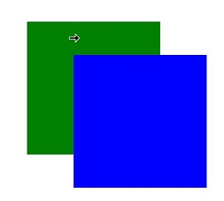

# 鼠标光标控制

控制鼠标光标的显示样式。

>  **说明：**
>
>  从API Version 11开始支持。后续版本如有新增内容，则采用上角标单独标记该内容的起始版本。


## cursorControl

### setCursor

setCursor(value: PointerStyle): void

方法语句中可使用的全局接口，调用此接口可以更改当前的鼠标光标样式。

**参数：**

| 名称 | 类型 | 必填 | 描述 |
| ----- | ------ | ---- | ---- |
| value | [PointerStyle](../apis/js-apis-pointer.md#pointerstyle) | 是   | 设置的鼠标样式。 |


### restoreDefault

restoreDefault(): void

方法语句中可使用的全局接口，调用此接口可以将鼠标光标恢复成默认的箭头光标样式。


## 示例


```ts
// cursorControlTest.ets
import pointer from '@ohos.multimodalInput.pointer';

@Entry
@Component
struct CursorControlExample {
  @State text: string = ''
  controller: TextInputController = new TextInputController()

  build() {
    Column() {
      Row().height(200).width(200).backgroundColor(Color.Green).position({x: 150 ,y:70})
        .onHover((flag) => {
          if (flag) {
            cursorControl.setCursor(pointer.PointerStyle.EAST)
          } else {
            cursorControl.restoreDefault()
          }
        })
      Row().height(200).width(200).backgroundColor(Color.Blue).position({x: 220 ,y:120})
        .onHover((flag) => {
          if (flag) {
            cursorControl.setCursor(pointer.PointerStyle.WEST)
          } else {
            cursorControl.restoreDefault()
          }
        })
    }.width('100%')
  }
}
```
示意图：

当鼠标悬浮在蓝色区域时，显示：向西箭头光标


当鼠标悬浮在绿色区域时，显示：向东箭头光标

