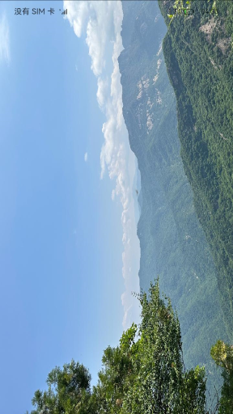

# 安全区域

通过expandSafeArea属性支持组件扩展其安全区域。

> **说明：**
>
> 从API Version 10开始支持。后续版本如有新增内容，则采用上角标单独标记该内容的起始版本。

## 属性

| 名称           | 参数                           | 参数描述                                |
| -------------- | ----------------------------- | --------------------------------------- |
| expandSafeArea | type?: Array <[SafeAreaType](ts-types.md#safeareatype10)>,<br />edges?: Array <[SafeAreaEdge](ts-types.md#safeareaedge10)> | 控制组件扩展其安全区域。<br />默认值: <br />type: [SafeAreaType.SYSTEM, SafeAreaType.CUTOUT, SafeAreaType.KEYBOARD],<br />edges: [SafeAreaEdge.TOP, SafeAreaEdge.BOTTOM, SafeAreaEdge.START, SafeAreaEdge.END]<br />扩展至所有非安全区域。<br />type: 非必填，配置扩展安全区域的类型。<br />edges: 非必填，配置扩展安全区域的方向。 |

## 示例

### 示例1

```
// xxx.ets
@Entry
@Component
struct SafeAreaExample1 {
  @State text: string = ''
  controller: TextInputController = new TextInputController()

  build() {
    Row() {
        Column()
          .height('100%').width('100%')
          .backgroundImage($r('app.media.bg')).backgroundImageSize(ImageSize.Cover)
          .expandSafeArea([SafeAreaType.SYSTEM], [SafeAreaEdge.TOP, SafeAreaEdge.BOTTOM])
    }.height('100%')
  }
}
```



### 示例2

```
@Entry
@Component
struct SafeAreaExample {
  @State text: string = ''
  controller: TextInputController = new TextInputController()

  build() {
    Row() {
      Stack() {
        Column()
          .height('100%').width('100%')
          .backgroundImage($r('app.media.bg')).backgroundImageSize(ImageSize.Cover)
          .expandSafeArea([SafeAreaType.KEYBOARD, SafeAreaType.SYSTEM])
        Column() {
          Button('Set caretPosition 1')
            .onClick(() => {
              this.controller.caretPosition(1)
            })
          TextInput({ text: this.text, placeholder: 'input your word...', controller: this.controller })
            .placeholderFont({ size: 14, weight: 400 })
            .width(320).height(40).offset({y: 120})
            .fontSize(14).fontColor(Color.Black)
            .backgroundColor(Color.White)
        }.width('100%').alignItems(HorizontalAlign.Center)
      }
    }.height('100%')
  }
}
```


