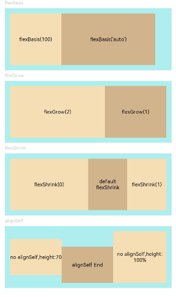

# Flex布局

>  **说明：**
>  - 从API Version 7开始支持。后续版本如有新增内容，则采用上角标单独标记该内容的起始版本。
>
>  - 仅当父组件是 Flex、Column、Row 、GridRow时生效。


## 属性

| 名称       | 参数说明                                    | 描述                                                         |
| ---------- | ------------------------------------------- | ------------------------------------------------------------ |
| flexBasis  | number \| string                            | 设置组件在父容器主轴方向上的基准尺寸。<br/>默认值：'auto'（表示组件在主轴方向上的基准尺寸为组件原本的大小）。<br/>不支持百分比设置。<br/>从API version 9开始，该接口支持在ArkTS卡片中使用。 |
| flexGrow   | number                                      | 设置父容器的剩余空间分配给此属性所在组件的比例。<br/>默认值：0<br/>从API version 9开始，该接口支持在ArkTS卡片中使用。 |
| flexShrink | number                                      | 设置父容器压缩尺寸分配给此属性所在组件的比例。<br/>父容器为Row、Column时，默认值：0<br/> 父容器为flex时，默认值：1<br/>从API version 9开始，该接口支持在ArkTS卡片中使用。 |
| alignSelf  | [ItemAlign](ts-appendix-enums.md#itemalign) | 子组件在父容器交叉轴的对齐格式，会覆盖Flex、Column、Row、GridRow布局容器中的alignItems设置。<br/>GridCol可以绑定alignsSelf属性来改变它自身在交叉轴方向上的布局。<br/>默认值：ItemAlign.Auto<br/>从API version 9开始，该接口支持在ArkTS卡片中使用。 |
| layoutWeight   | number&nbsp;\|&nbsp;string                                   | 父容器尺寸确定时，设置了layoutWeight属性的子元素与兄弟元素占主轴尺寸按照权重进行分配，忽略元素本身尺寸设置，表示自适应占满剩余空间。<br>默认值：0<br/>从API version 9开始，该接口支持在ArkTS卡片中使用。<br/>**说明：**<br/>仅在Row/Column/Flex布局中生效。<br/>可选值为大于等于0的数字，或者可以转换为数字的字符串。 |


## 示例

```ts
// xxx.ets
@Entry
@Component
struct FlexExample {
  build() {
    Column({ space: 5 }) {
      Text('flexBasis').fontSize(9).fontColor(0xCCCCCC).width('90%')
      // 基于主轴的基准尺寸
      // flexBasis()值可以是字符串'auto',表示基准尺寸是元素本来的大小,也可以是长度设置，相当于.width()/.height()
      Flex() {
        Text('flexBasis(100)')
          .flexBasis(100) // 这里表示宽度为100vp
          .height(100)
          .backgroundColor(0xF5DEB3)
          .textAlign(TextAlign.Center)
        Text(`flexBasis('auto')`)
          .flexBasis('auto') // 这里表示宽度保持原本设置的60%的宽度
          .width('60%')
          .height(100)
          .backgroundColor(0xD2B48C)
          .textAlign(TextAlign.Center)
      }.width('90%').height(120).padding(10).backgroundColor(0xAFEEEE)

      Text('flexGrow').fontSize(9).fontColor(0xCCCCCC).width('90%')
      // flexGrow()表示剩余空间分配给该元素的比例
      Flex() {
        Text('flexGrow(2)')
          .flexGrow(2) // 父容器分配给该Text的宽度为剩余宽度的2/3
          .height(100)
          .backgroundColor(0xF5DEB3)
          .textAlign(TextAlign.Center)
        Text('flexGrow(1)')
          .flexGrow(1) // 父容器分配给该Text的宽度为剩余宽度的1/3
          .height(100)
          .backgroundColor(0xD2B48C)
          .textAlign(TextAlign.Center)
      }.width('90%').height(120).padding(10).backgroundColor(0xAFEEEE)

      Text('flexShrink').fontSize(9).fontColor(0xCCCCCC).width('90%')
      // flexShrink()表示该元素的压缩比例，基于超出的总尺寸进行计算
      // 第一个text压缩比例是0,另外两个都是1,因此放不下时等比例压缩后两个,第一个不压缩
      Flex({ direction: FlexDirection.Row }) {
        Text('flexShrink(0)')
          .flexShrink(0)
          .width('50%')
          .height(100)
          .backgroundColor(0xF5DEB3)
          .textAlign(TextAlign.Center)
        Text('default flexShrink') // 默认值为1
          .width('40%')
          .height(100)
          .backgroundColor(0xD2B48C)
          .textAlign(TextAlign.Center)
        Text('flexShrink(1)')
          .flexShrink(1)
          .width('40%')
          .height(100)
          .backgroundColor(0xF5DEB3)
          .textAlign(TextAlign.Center)
      }.width('90%').height(120).padding(10).backgroundColor(0xAFEEEE)

      Text('alignSelf').fontSize(9).fontColor(0xCCCCCC).width('90%')
      // alignSelf会覆盖Flex布局容器中的alignItems设置
      Flex({ direction: FlexDirection.Row, alignItems: ItemAlign.Center }) {
        Text('no alignSelf,height:70')
          .width('33%')
          .height(70)
          .backgroundColor(0xF5DEB3)
          .textAlign(TextAlign.Center)
        Text('alignSelf End')
          .alignSelf(ItemAlign.End)
          .width('33%')
          .height(70)
          .backgroundColor(0xD2B48C)
          .textAlign(TextAlign.Center)
        Text('no alignSelf,height:100%')
          .width('34%')
          .height('100%')
          .backgroundColor(0xF5DEB3)
          .textAlign(TextAlign.Center)
      }.width('90%').height(120).padding(10).backgroundColor(0xAFEEEE)
    }.width('100%').margin({ top: 5 })
  }
}
```


