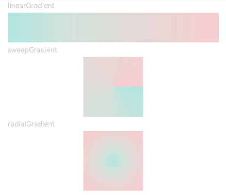

# 颜色渐变

>  **说明：**
> 从API Version 7开始支持。后续版本如有新增内容，则采用上角标单独标记该内容的起始版本。


## 权限列表

无


## 属性


| 名称 | 参数类型 | 默认值 | 描述 |
| -------- | -------- | -------- | -------- |
| linearGradient | {<br/>angle?:&nbsp;[Angle](../../ui/ts-types.md),<br/>direction?:&nbsp;GradientDirection,<br/>colors:&nbsp;Array&lt;[ColorStop](../../ui/ts-types.md)&gt;<br/>repeating?:&nbsp;boolean<br/>} | - | 线性渐变。<br/>angle:&nbsp;线性渐变的角度。<br/>direction:&nbsp;线性渐变的方向。<br/>colors:&nbsp;为渐变的颜色描述。<br/>repeating:&nbsp;为渐变的颜色重复着色。 |
| sweepGradient | {<br/>center:&nbsp;Point,<br/>start?:&nbsp;angle,<br/>end?:&nbsp;angle,<br/>colors:&nbsp;Array&lt;[ColorStop](../../ui/ts-types.md)&gt;<br/>repeating?:&nbsp;boolean<br/>} | - | 角度渐变。<br/>center：为角度渐变的中心点。<br/>start：角度渐变的起点。<br/>end：角度渐变的终点。<br/>colors:&nbsp;为渐变的颜色描述。<br/>repeating:&nbsp;为渐变的颜色重复着色。 |
| radialGradient | {<br/>center:&nbsp;Point,<br/>radius:&nbsp;Length,<br/>colors:&nbsp;Array&lt;[ColorStop](../../ui/ts-types.md)&gt;<br/>repeating:&nbsp;boolean<br/>} | - | 径向渐变。<br/>center：径向渐变的中心点。<br/>radius：径向渐变的半径。<br/>colors:&nbsp;为渐变的颜色描述。<br/>repeating:&nbsp;为渐变的颜色重复着色。 |


- GradientDirection枚举说明<br>
  GradientDirection用于描述渐变方向。

  | 名称 | 描述 | 
  | -------- | -------- |
  | Left | 从右向左。 | 
  | Top | 从下向上。 | 
  | Right | 从左向右。 | 
  | Bottom | 从上向下。 | 
  | LeftTop | 左上。 | 
  | LeftBottom | 左下。 | 
  | RightTop | 右上。 | 
  | RightBottom | 右下。 | 
  | None | 无。 | 


## 示例

```ts
// xxx.ets
@Entry
@Component
struct ColorGradientExample {
  build() {
    Column({ space: 5 }) {
      Text('linearGradient').fontSize(12).width('90%').fontColor(0xCCCCCC)
      Row()
        .width('90%')
        .height(50)
        .linearGradient({
          angle: 90,
          direction: GradientDirection.Left,
          colors: [[0xAEE1E1, 0.0], [0xD3E0DC, 0.3], [0xFCD1D1, 1.0]]
        })
      Text('sweepGradient').fontSize(12).width('90%').fontColor(0xCCCCCC)
      Row()
        .width(100)
        .height(100)
        .sweepGradient({
          center: [50, 50],
          start: 0,
          end: 359,
          colors: [[0xAEE1E1, 0.0], [0xD3E0DC, 0.3], [0xFCD1D1, 1.0]]
        })
      Text('radialGradient').fontSize(12).width('90%').fontColor(0xCCCCCC)
      Row()
        .width(100)
        .height(100)
        .radialGradient({
          center: [50, 50],
          radius: 60,
          colors:[[0xAEE1E1, 0.0], [0xD3E0DC, 0.3], [0xFCD1D1, 1.0]]
        })
    }
    .width('100%')
    .padding({ top: 5 })
  }
}
```


