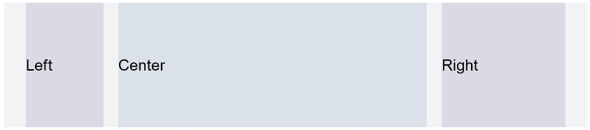

# 栅格设置<a name="ZH-CN_TOPIC_0000001192755130"></a>

> **说明：** 
>-   从API Version 7开始支持。后续版本如有新增内容，则采用上角标单独标记该内容的起始版本。
>-   栅格布局的列宽、列间距由距离最近的GridContainer父组件决定。使用栅格属性的组件树上至少需要有1个GridContainer容器组件。

## 权限列表<a name="section781125411508"></a>

无

## 属性<a name="section6820191711316"></a>

<table><thead align="left"><tr><th class="cellrowborder" valign="top" width="15.42%" id="mcps1.1.5.1.1"><p>名称</p>
</th>
<th class="cellrowborder" valign="top" width="23.880000000000003%" id="mcps1.1.5.1.2"><p>参数类型</p>
</th>
<th class="cellrowborder" valign="top" width="9.55%" id="mcps1.1.5.1.3"><p>默认值</p>
</th>
<th class="cellrowborder" valign="top" width="51.15%" id="mcps1.1.5.1.4"><p>描述</p>
</th>
</tr>
</thead>
<tbody><tr><td class="cellrowborder" valign="top" width="15.42%" headers="mcps1.1.5.1.1 "><p>useSizeType</p>
</td>
<td class="cellrowborder" valign="top" width="23.880000000000003%" headers="mcps1.1.5.1.2 "><p>{</p>
<p>xs?: number | { span: number, offset: number },</p>
<p>sm?: number | { span: number, offset: number },</p>
<p>md?: number | { span: number, offset: number },</p>
<p>lg?: number | { span: number, offset: number }</p>
<p>}</p>
</td>
<td class="cellrowborder" valign="top" width="9.55%" headers="mcps1.1.5.1.3 "><p>-</p>
</td>
<td class="cellrowborder" valign="top" width="51.15%" headers="mcps1.1.5.1.4 "><p>设置在特定设备宽度类型下的占用列数和偏移列数，span: 占用列数; offset: 偏移列数。</p>
<p>当值为number类型时，仅设置列数， 当格式如{"span": 1, "offset": 0}时，指同时设置占用列数与偏移列数。</p>
<ul><li>xs: 指设备宽度类型为SizeType.XS时的占用列数和偏移列数。</li><li>sm: 指设备宽度类型为SizeType.SM时的占用列数和偏移列数。</li></ul>
<ul><li>md: 指设备宽度类型为SizeType.MD时的占用列数和偏移列数。</li><li>lg: 指设备宽度类型为SizeType.LG时的占用列数和偏移列数。</li></ul>
</td>
</tr>
<tr><td class="cellrowborder" valign="top" width="15.42%" headers="mcps1.1.5.1.1 "><p>gridSpan</p>
</td>
<td class="cellrowborder" valign="top" width="23.880000000000003%" headers="mcps1.1.5.1.2 "><p>number</p>
</td>
<td class="cellrowborder" valign="top" width="9.55%" headers="mcps1.1.5.1.3 "><p>1</p>
</td>
<td class="cellrowborder" valign="top" width="51.15%" headers="mcps1.1.5.1.4 "><p>默认占用列数，指useSizeType属性没有设置对应尺寸的列数（span)时，占用的栅格列数。</p>
<div class="note"><span class="notetitle"> 说明： </span><div class="notebody"><p>设置了栅格span属性，组件的宽度由栅格布局决定。</p>
</div></div>
</td>
</tr>
<tr><td class="cellrowborder" valign="top" width="15.42%" headers="mcps1.1.5.1.1 "><p>gridOffset</p>
</td>
<td class="cellrowborder" valign="top" width="23.880000000000003%" headers="mcps1.1.5.1.2 "><p>number</p>
</td>
<td class="cellrowborder" valign="top" width="9.55%" headers="mcps1.1.5.1.3 "><p>0</p>
</td>
<td class="cellrowborder" valign="top" width="51.15%" headers="mcps1.1.5.1.4 "><p>默认偏移列数，指useSizeType属性没有设置对应尺寸的偏移(offset)时， 当前组件沿着父组件Start方向，偏移的列数，也就是当前组件位于第n列。</p>
<div class="note"><span class="notetitle"> 说明： </span><div class="notebody"><p>1.  配置该属性后，当前组件在父组件水平方向的布局不再跟随父组件原有的布局方式，而是沿着父组件的Start方向偏移一定位移。</p>
<p>2.  偏移位移 = （列宽 + 间距）* 列数。</p>
<p>3.  设置了偏移(gridOffset)的组件之后的兄弟组件会根据该组件进行相对布局，类似相对布局。</p>
</div></div>
</td>
</tr>
</tbody>
</table>

## 示例<a name="section1976245813394"></a>

```
@Entry
@Component
struct GridContainerExample1 {
  build(){
    GridContainer() {
      Row({}) {
        Row() {
          Text('Left').fontSize(25)
        }
        .useSizeType({
          xs: { span: 1, offset: 0 }, sm: { span: 1, offset: 0 },
          md: { span: 1, offset: 0 }, lg: { span: 2, offset: 0 }
        })
        .height("100%")
        .backgroundColor(0x66bbb2cb)
        Row() {
          Text('Center').fontSize(25)
        }
        .useSizeType({
          xs: { span: 1, offset: 0 }, sm: { span: 2, offset: 1 },
          md: { span: 5, offset: 1 }, lg: { span: 7, offset: 2 }
        })
        .height("100%")
        .backgroundColor(0x66b6c5d1)
        Row() {
          Text('Right').fontSize(25)
        }
        .useSizeType({
          xs: { span: 1, offset: 0 }, sm: { span: 1, offset: 3 },
          md: { span: 2, offset: 6 }, lg: { span: 3, offset: 9 }
        })
        .height("100%")
        .backgroundColor(0x66bbb2cb)
      }
      .height(200)
    }
    .backgroundColor(0xf1f3f5)
    .margin({ top: 10 })
  }
}
```

**图 1**  设备宽度为SM  


**图 2**  设备宽度为MD  


**图 3**  设备宽度为LG  


