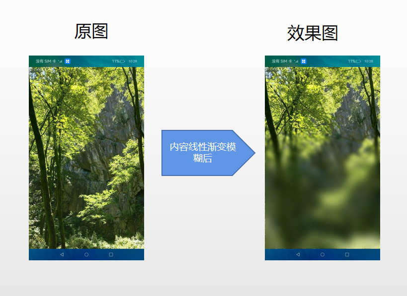
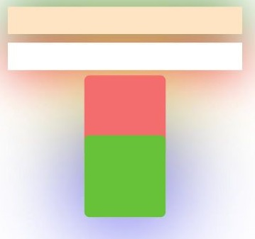

# 图像效果

设置组件的模糊、阴影、球面效果以及设置图片的图像效果。

>  **说明：**
>
>  从API Version 7开始支持。后续版本如有新增内容，则采用上角标单独标记该内容的起始版本。

## blur

blur(value: number, options?: BlurOptions)

为组件添加内容模糊效果。

**卡片能力：** 从API version 9开始，该接口支持在ArkTS卡片中使用。

**系统能力：** SystemCapability.ArkUI.ArkUI.Full

**参数：** 

| 参数名                | 类型                                              | 必填 | 说明                                                         |
| --------------------- | ------------------------------------------------- | ---- | ------------------------------------------------------------ |
| value                 | number                                            | 是   | 当前组件添加内容模糊效果，入参为模糊半径，模糊半径越大越模糊，为0时不模糊。 |
| options<sup>11+</sup> | [BlurOptions](ts-appendix-enums.md#bluroptions11) | 否   | 灰阶梯参数。                                                 |

## backdropBlur

backdropBlur(value: number, options?: BlurOptions)

为组件添加背景模糊效果。

**卡片能力：** 从API version 9开始，该接口支持在ArkTS卡片中使用。

**系统能力：** SystemCapability.ArkUI.ArkUI.Full

**参数：** 

| 参数名                | 类型                                              | 必填 | 说明                                                         |
| --------------------- | ------------------------------------------------- | ---- | ------------------------------------------------------------ |
| value                 | number                                            | 是   | 为当前组件添加背景模糊效果，入参为模糊半径，模糊半径越大越模糊，为0时不模糊。 |
| options<sup>11+</sup> | [BlurOptions](ts-appendix-enums.md#bluroptions11) | 否   | 灰阶梯参数。                                                 |

## shadow

shadow(value: ShadowOptions | ShadowStyle)

为组件添加阴影效果。

**卡片能力：** 从API version 9开始，该接口支持在ArkTS卡片中使用，ArkTS卡片上不支持参数为 [ShadowStyle](https://gitee.com/openharmony/docs/blob/master/zh-cn/application-dev/reference/arkui-ts/ts-universal-attributes-image-effect.md#shadowstyle10枚举说明)类型。

**系统能力：** SystemCapability.ArkUI.ArkUI.Full

**参数：** 

| 参数名 | 类型                                                         | 必填 | 说明                                                         |
| ------ | ------------------------------------------------------------ | ---- | ------------------------------------------------------------ |
| value  | [ShadowOptions](#shadowoptions对象说明)&nbsp;\|&nbsp;[ShadowStyle](#shadowstyle10枚举说明)<sup>10+</sup> | 是   | 为当前组件添加阴影效果。<br/>入参类型为ShadowOptions时，可以指定模糊半径、阴影的颜色、X轴和Y轴的偏移量。<br/>入参类型为ShadowStyle时，可指定不同阴影样式。 |

## grayscale

grayscale(value: number)

为组件添加灰度效果。

**卡片能力：** 从API version 9开始，该接口支持在ArkTS卡片中使用。

**系统能力：** SystemCapability.ArkUI.ArkUI.Full

**参数：** 

| 参数名 | 类型   | 必填 | 说明                                                         |
| ------ | ------ | ---- | ------------------------------------------------------------ |
| value  | number | 是   | 为当前组件添加灰度效果。值定义为灰度转换的比例，入参1.0则完全转为灰度图像，入参则0.0图像无变化，入参在0.0和1.0之间时，效果呈线性变化。（百分比)<br/>默认值：0.0<br/>取值范围：[0, 1]<br/>**说明：**<br/>设置小于0的值时，按值为0处理，设置大于1的值时，按值为1处理。 |

## brightness

brightness(value: number)

为组件添加高光效果。

**卡片能力：** 从API version 9开始，该接口支持在ArkTS卡片中使用。

**系统能力：** SystemCapability.ArkUI.ArkUI.Full

**参数：** 

| 参数名 | 类型   | 必填 | 说明                                                         |
| ------ | ------ | ---- | ------------------------------------------------------------ |
| value  | number | 是   | 为当前组件添加高光效果，入参为高光比例，值为1时没有效果，小于1时亮度变暗，0为全黑，大于1时亮度增加，数值越大亮度越大，但大于2后亮度效果变化不明显。<br/>默认值：1.0<br/>推荐取值范围：[0, 2]<br/>**说明：**<br/>设置小于0的值时，按值为0处理。<br/>从API version 9开始，该接口支持在ArkTS卡片中使用。 |

## saturate

saturate(value: number)

为组件添加饱和度效果。

**卡片能力：** 从API version 9开始，该接口支持在ArkTS卡片中使用。

**系统能力：** SystemCapability.ArkUI.ArkUI.Full

**参数：** 

| 参数名 | 类型   | 必填 | 说明                                                         |
| ------ | ------ | ---- | ------------------------------------------------------------ |
| value  | number | 是   | 为当前组件添加饱和度效果，饱和度为颜色中的含色成分和消色成分(灰)的比例，入参为1时，显示原图像，大于1时含色成分越大，饱和度越大，小于1时消色成分越大，饱和度越小。（百分比）<br/>默认值：1.0<br/>取值范围：[0, +∞)<br/>**说明：**<br/>设置小于0的值时，按值为0处理。 |

## contrast

contrast(value: number)

为组件添加对比度效果。

**卡片能力：** 从API version 9开始，该接口支持在ArkTS卡片中使用。

**系统能力：** SystemCapability.ArkUI.ArkUI.Full

**参数：** 

| 参数名 | 类型   | 必填 | 说明                                                         |
| ------ | ------ | ---- | ------------------------------------------------------------ |
| value  | number | 是   | 为当前组件添加对比度效果，入参为对比度的值。值为1时，显示原图，大于1时，值越大对比度越高，图像越清晰醒目，小于1时，值越小对比度越低，当对比度为0时，图像变为全灰。（百分比）<br/>默认值：1.0<br/>取值范围：[0, +∞)<br/>**说明：**<br/>设置小于0的值时，按值为0处理。 |

## invert

invert(value: number | InvertOptions)

反转输入的图像。

**卡片能力：** 从API version 9开始，该接口支持在ArkTS卡片中使用。

**系统能力：** SystemCapability.ArkUI.ArkUI.Full

**参数：** 

| 参数名 | 类型                                                         | 必填 | 说明                                                         |
| ------ | ------------------------------------------------------------ | ---- | ------------------------------------------------------------ |
| value  | number&nbsp;\|&nbsp;[InvertOptions](#invertoptions11对象说明)<sup>11+</sup> | 是   | 反转输入的图像。<br/>入参对象为number时,入参为图像反转的比例，值为1时完全反转，值为0则图像无变化。（百分比）<br/>取值范围：[0, 1]<br/>设置小于0的值时，按值为0处理。<br/>入参对象为 InvertOptions时 对比背景颜色和threshold，当背景颜色的的灰度值大于threshold时反色取high值，当背景颜色灰度值小于threshold时反色取low值。 |

## sepia

sepia(value: number)

将图像转换为深褐色。

**卡片能力：** 从API version 9开始，该接口支持在ArkTS卡片中使用。

**系统能力：** SystemCapability.ArkUI.ArkUI.Full

**参数：** 

| 参数名 | 类型   | 必填 | 说明                                                         |
| ------ | ------ | ---- | ------------------------------------------------------------ |
| value  | number | 是   | 将图像转换为深褐色。入参为图像反转的比例，值为1则完全是深褐色的，值为0图像无变化。 （百分比） |

## hueRotate

hueRotate(value: number | string)

色相旋转效果。

**卡片能力：** 从API version 9开始，该接口支持在ArkTS卡片中使用。

**系统能力：** SystemCapability.ArkUI.ArkUI.Full

**参数：** 

| 参数名 | 类型                       | 必填 | 说明                                                         |
| ------ | -------------------------- | ---- | ------------------------------------------------------------ |
| value  | number&nbsp;\|&nbsp;string | 是   | 色相旋转效果，输入参数为旋转角度。<br/>默认值：'0deg'<br/>取值范围：(-∞, +∞)<br/>**说明：**<br/>色调旋转360度会显示原始颜色。先将色调旋转180 度，然后再旋转-180度会显示原始颜色。数据类型为number时，值为90和'90deg'效果一致。 |

## colorBlend<sup>8+</sup>

colorBlend(value: Color | string | Resource)

为组件添加颜色叠加效果。

**卡片能力：** 从API version 9开始，该接口支持在ArkTS卡片中使用。

**系统能力：** SystemCapability.ArkUI.ArkUI.Full

**参数：** 

| 参数名 | 类型                                                         | 必填 | 说明                                           |
| ------ | ------------------------------------------------------------ | ---- | ---------------------------------------------- |
| value  | [Color](ts-appendix-enums.md#color)&nbsp;\|&nbsp;string&nbsp;\|&nbsp;[Resource](ts-types.md#resource) | 是   | 为当前组件添加颜色叠加效果，入参为叠加的颜色。 |

## sphericalEffect<sup>10+</sup>

sphericalEffect(value: number)

设置组件的图像球面化程度。

**系统能力：** SystemCapability.ArkUI.ArkUI.Full

**系统API：** 此接口为系统接口

**参数：** 

| 参数名 | 类型   | 必填 | 说明                                                         |
| ------ | ------ | ---- | ------------------------------------------------------------ |
| value  | number | 是   | 设置组件的图像球面化程度。<br/>取值范围：[0,1]。<br/>**说明：**<br/>1. 如果value等于0则图像保持原样，如果value等于1则图像为完全球面化效果。在0和1之间，数值越大，则球面化程度越高。<br/>`value < 0 `或者` value > 1`为异常情况，`value < 0`按0处理，`value > 1`按1处理。<br/>2. 如果组件的图像使用异步加载，则不支持球面效果。例如Image组件默认使用异步加载，如果要使用球面效果，就要设置`syncLoad`为`true`，但是这种做法不推荐。`backgroundImage`也是使用异步加载，所以如果设置了`backgroundImage`，不支持球面效果。<br/>3. 如果组件设置了阴影，不支持球面效果。 |

## lightUpEffect<sup>10+</sup> 

lightUpEffect(value: number)

设置组件图像亮起程度。

**系统能力：** SystemCapability.ArkUI.ArkUI.Full

**系统API：** 此接口为系统接口

**参数：** 

| 参数名 | 类型   | 必填 | 说明                                                         |
| ------ | ------ | ---- | ------------------------------------------------------------ |
| value  | number | 是   | 设置组件图像亮起程度。<br/>取值范围：[0,1]。<br/>如果value等于0则图像为全黑，如果value等于1则图像为全亮效果。0到1之间数值越大，表示图像亮度越高。`value < 0` 或者 `value > 1`为异常情况，`value < 0`按0处理，`value > 1`按1处理。 |

## pixelStretchEffect<sup>10+</sup> 

pixelStretchEffect(options: PixelStretchEffectOptions)

设置组件的图像边缘像素扩展距离。

**系统能力：** SystemCapability.ArkUI.ArkUI.Full

**系统API：** 此接口为系统接口

**参数：** 

| 参数名  | 类型                                                         | 必填 | 说明                                                         |
| ------- | ------------------------------------------------------------ | ---- | ------------------------------------------------------------ |
| options | [PixelStretchEffectOptions](ts-types.md#pixelstretcheffectoptions10) | 是   | 设置组件的图像边缘像素扩展距离。<br/>参数`options`包括上下左右四个方向的边缘像素扩展距离。<br/>**说明：**<br/>\1. 如果距离为正值，表示向外扩展，放大原来图像大小。上下左右四个方向分别用边缘像素填充，填充的距离即为设置的边缘扩展的距离。<br/>\2. 如果距离为负值，表示内缩，但是最终图像大小不变。<br/>内缩方式：<br/>图像根据`options`的设置缩小，缩小大小为四个方向边缘扩展距离的绝对值。<br/>图像用边缘像素扩展到原来大小。<br/>\3. 对`options`的输入约束：<br/>上下左右四个方向的扩展统一为非正值或者非负值。即四个边同时向外扩或者内缩，方向一致。<br/>所有方向的输入均为百分比或者具体值，不支持百分比和具体值混用。<br/>所有异常情况下，显示为{0，0，0，0}效果，即跟原图保持一致。 |

## linearGradientBlur<sup>10+</sup> 

linearGradientBlur(value: number, options: LinearGradientBlurOptions)

为组件添加内容线性渐变模糊效果。

**系统能力：** SystemCapability.ArkUI.ArkUI.Full

**参数：** 

| 参数名  | 类型                                                         | 必填 | 说明                                                         |
| ------- | ------------------------------------------------------------ | ---- | ------------------------------------------------------------ |
| value   | number                                                       | 是   | 为模糊半径，模糊半径越大越模糊，为0时不模糊。<br/>取值范围：[0, 60]<br/>线性梯度模糊包含两个部分fractionStops和direction。 |
| options | [LinearGradientBlurOptions](#lineargradientbluroptions10对象说明) | 是   | 设置线性渐变模糊效果。                                       |

## renderGroup<sup>10+</sup>

renderGroup(value: boolean)

设置当前控件和子控件是否先整体离屏渲染绘制后再与父控件融合绘制。

**系统能力：** SystemCapability.ArkUI.ArkUI.Full

**参数：** 

| 参数名 | 类型    | 必填 | 说明                                                         |
| ------ | ------- | ---- | ------------------------------------------------------------ |
| value  | boolean | 是   | 设置当前控件和子控件是否先整体离屏渲染绘制后再与父控件融合绘制。当前控件的不透明度不为1时绘制效果可能有差异。<br/>默认值：false |

## blendMode<sup>11+</sup> 

blendMode(value: BlendMode, type?: BlendApplyType)

将当前控件背景与子节点内容进行混合。

**卡片能力：** 从API version 11开始，该接口支持在ArkTS卡片中使用。

**系统能力：** SystemCapability.ArkUI.ArkUI.Full

**参数：** 

| 参数名 | 类型                            | 必填 | 说明                                                         |
| ------ | ------------------------------- | ---- | ------------------------------------------------------------ |
| value  | [BlendMode](#blendmode枚举说明) | 是   | 将当前控件背景与子节点内容进行混合。<br/>默认值：BlendMode.NONE<br/>**说明：**<br/>-value为混合模式，不同的模式控制不同的混合方式从而产生不同的效果，默认值为BlendMode.NONE<br/>**注意事项：**<br/>1、需调用BlendApplyType.OFFSCREEN来触发离屏，第一次离屏用来绘制控件背景，第二次离屏用来绘制子节点内容。<br/>2、SRC_IN和DST_IN混合模式只适用于alpha通道存在的图像，即包含透明度信息的图像。如果图像没有alpha通道，则无法使用这两种混合模式。<br/>3、实现效果只需要一层blend，不推荐blendMode嵌套使用，会影响性能且效果可能不正常。 |
| type   |  [BlendApplyType](#blendapplytype对象说明)  |    是    | 混合类型。<br/>默认值：BlendApplyType.FAST<br/>     |

## useShadowBatching<sup>11+</sup> 

useShadowBatching(value: boolean)

控件内部子节点的阴影进行同层绘制，同层元素阴影重叠。

**卡片能力：** 从API version 11开始，该接口支持在ArkTS卡片中使用。

**系统能力：** SystemCapability.ArkUI.ArkUI.Full

**参数：** 

| 参数名 | 类型    | 必填 | 说明                                                         |
| ------ | ------- | ---- | ------------------------------------------------------------ |
| value  | boolean | 是   | 控件内部子节点的阴影进行同层绘制，同层元素阴影重叠。<br/>默认值：false<br/>**说明：**<br/>\1. 默认不开启，如果子节点的阴影半径较大，会对节点的各自阴影会互相重叠。 当开启时，元素的阴影将不会重叠。<br/>\2. 不推荐useShadowBatching嵌套使用，如果嵌套使用，只会对当前的子节点生效，无法递推。 |

## ShadowOptions对象说明

阴影属性集合，用于设置阴影的模糊半径、阴影的颜色、X轴和Y轴的偏移量。

从API version 9开始，该接口支持在ArkTS卡片中使用。

| 名称      | 类型                                       | 必填   | 说明                                       |
| ------- | ---------------------------------------- | ---- | ---------------------------------------- |
| radius  | number \| [Resource](ts-types.md#resource) | 是    | 阴影模糊半径。<br/>取值范围：[0, +∞)<br/>**说明：** <br/>设置小于0的值时，按值为0处理。 |
| type<sup>10+</sup> | [ShadowType<sup>10+</sup>](ts-appendix-enums.md#shadowtype10)  |      否    | 阴影类型。<br/>默认为COLOR。        |
| color   | [Color](ts-appendix-enums.md#color) \| string \| [Resource](ts-types.md#resource)\| [ColoringStrategy<sup>10+</sup> ](ts-types.md#coloringstrategy10) | 否    | 阴影的颜色。<br/>默认为黑色。 <br/>**说明：** <br/>从API version 11开始，该接口支持使用[ColoringStrategy<sup>10+</sup>](ts-types.md#coloringstrategy10)实现智能取色，智能取色功能不支持在ArkTS卡片、[textShadow](ts-basic-components-text.md#属性)中使用。<br/>当前仅支持平均取色和主色取色，智能取色区域为shadow绘制区域。<br/>支持使用'average'字符串触发智能平均取色模式，支持使用'primary'字符串触发智能主色模式。                       |
| offsetX | number \| [Resource](ts-types.md#resource) | 否    | 阴影的X轴偏移量。<br/>默认为0。                      |
| offsetY | number \| [Resource](ts-types.md#resource) | 否    | 阴影的Y轴偏移量。<br/>默认为0。                      |
| fill<sup>11+</sup>     | boolean                                    | 否    | 阴影是否内部填充。<br/>默认为false。<br/>**说明：**<br/>[textShadow](ts-basic-components-text.md#属性)中该字段不生效                 |

## ShadowStyle<sup>10+</sup>枚举说明

| 名称                | 描述     |
| ----------------- | ------ |
| OUTER_DEFAULT_XS  | 超小阴影。  |
| OUTER_DEFAULT_SM  | 小阴影。   |
| OUTER_DEFAULT_MD  | 中阴影。   |
| OUTER_DEFAULT_LG  | 大阴影。   |
| OUTER_FLOATING_SM | 浮动小阴影。 |
| OUTER_FLOATING_MD | 浮动中阴影。 |

## BlendMode枚举说明

| 名称           | 描述                                                             |
| ---------------| ------                                                          |
| NONE = 0          | 将上层图像直接覆盖到下层图像上，不进行任何混合操作。              |
| CLEAR = 1             | 清除混合，将目标像素设置为完全透明。           |
| SRC = 2               | r = s，将源像素直接复制到目标像素上，不做任何混合。                  |
| DST = 3               | r = d，将目标像素直接复制到源像素上，不做任何混合。                  |
| SRC_OVER = 4         | r = s + (1 - sa) * d，将源像素按照透明度进行混合，覆盖在目标像素上。                  |
| DST_OVER = 5         | r = d + (1 - da) * s，将目标像素按照透明度进行混合，覆盖在源像素上。                 |
| SRC_IN = 6           | r = s * da，将源像素与目标像素进行“遮罩”混合，只显示源像素与目标像素重叠的部分。                  |
| DST_IN = 7           | r = d * sa，将目标像素与源像素进行“遮罩”混合，只显示源像素与目标像素重叠的部分。                  |
| SRC_OUT = 8          | r = s * (1 - da)，将源像素与目标像素进行“反向遮罩”混合，只显示源像素与目标像素不重叠的部分。                |
| DST_OUT = 9          | r = d * (1 - sa)，将目标像素与源像素进行“反向遮罩”混合，只显示源像素与目标像素不重叠的部分。                  |
| SRC_ATOP = 10          | r = s * da + d * (1 - sa)，将源像素与目标像素进行“遮罩叠加”混合，只显示源像素与目标像素重叠的部分，并且将源像素的透明度应用到目标像素上。                  |
| DST_ATOP = 11         | r = d * sa + s * (1 - da)，将目标像素与源像素进行“遮罩叠加”混合，只显示源像素与目标像素重叠的部分，并且将目标像素的透明度应用到源像素上。                 |
| XOR = 12              | r = s * (1 - da) + d * (1 - sa)，将源像素与目标像素进行异或混合，只显示源像素与目标像素不重叠的部分。        |
| PLUS = 13             | r = min(s + d, 1)，将源像素值与目标像素值相加，并将结果作为新的像素值。                  |
| MODULATE = 14     | r = s * d，将源图形对象的像素值与目标图形对象的像素值进行乘法运算，并将结果作为新的像素值。                          |
| SCREEN = 15       | r = s + d - s * d，将两个图像的像素值相加，然后减去它们的乘积来实现混合。                  |
| OVERLAY = 16      | 源像素的透明度与目标像素的颜色进行线性混合。也就是说，透明度越低，颜色越深，透明度越高，颜色越浅。                  |
| DARKEN = 17       | rc = s + d - max(s * da, d * sa), ra = kSrcOver   当两个颜色重叠时，较暗的颜色会覆盖较亮的颜色。            |
| LIGHTEN = 18      | rc = s + d - min(s * da, d * sa), ra = kSrcOver   将源图像和目标图像中的像素进行比较，选取两者中较亮的像素作为最终的混合结果。            |
| COLOR_DODGE = 19  | 将源像素的颜色值除以1减去目标像素的颜色值，然后将结果与目标像素的颜色值相加。                  |
| COLOR_BURN = 20   | 将源像素的颜色值除以目标像素的颜色值，然后将结果与1相减，最后将结果与目标像素的颜色值相加。                     |
| HARD_LIGHT = 21   | multiply or screen, depending on source，                  |
| SOFT_LIGHT = 22   | lighten or darken, depending on source，                   |
| DIFFERENCE = 23   | rc = s + d - 2 * (min(s * da, d * sa)), ra = kSrcOver，将目标像素颜色的反色与源像素颜色相混合。    |
| EXCLUSION = 24    | rc = s + d - two(s * d), ra = kSrcOver，将两个图像中相同位置的像素进行异或运算，得到的结果作为混合后的像素值。                   |
| MULTIPLY = 25     | r = s * (1 - da) + d * (1 - sa) + s * d，将源图像与目标图像进行乘法混合，得到一张新的图像。                  |
| HUE = 26          | 保留源图像的亮度和饱和度，但会使用目标图像的色调来替换源图像的色调。                  |
| SATURATION = 27   | 将底层图像的饱和度和顶层图像的亮度进行平均，然后再将这个平均值作为新的饱和度应用到底层图像上。                  |
| COLOR = 28        | 将源图像的颜色乘以它的不透明度，然后将结果与目标图像的颜色进行混合。                  |
| LUMINOSITY = 29   | 将源颜色和目标颜色的亮度值相加，然后除以2，得到一个中间值，再根据这个中间值来计算最终的混合颜色。                  |

## BlendApplyType对象说明

| 名称           | 描述                                                             |
| ---------------| ------                                                          |
| FAST           |   在目标图像上按顺序混合视图的内容                    |
| OFFSCREEN      |   将此视图的内容组合成屏幕外图像，然后混合到目标图像    |

## LinearGradientBlurOptions<sup>10+</sup>对象说明

| 名称          | 类型                                                        | 说明                                                         |
| ------------- | ----------------------------------------------------------- | ------------------------------------------------------------ |
| fractionStops | Array\<FractionStop>                                    | 数组中保存的每一个二元数组（取值0-1，小于0则为0，大于0则为1）表示[模糊程度, 模糊位置]；模糊位置需严格递增，开发者传入的数据不符合规范会记录日志，渐变模糊数组中二元数组个数必须大于等于2，否则渐变模糊不生效。 |
| direction     | [GradientDirection](ts-appendix-enums.md#gradientdirection) | 渐变模糊方向。<br/>默认值：<br/>[GradientDirection](https://gitee.com/openharmony/docs/blob/master/zh-cn/application-dev/reference/arkui-ts/ts-appendix-enums.md#gradientdirection).Bottom |

## InvertOptions<sup>11+</sup>对象说明

前景智能取反色。

| 名称            |  类型  | 必填  | 说明                                       |
| -------------- | ------ | ----- | ------------------------------------------ |
| low            | number | 是    | 背景色小于二分插值时的取值。                  |
| high           | number | 是    | 背景色大于等于二分插值时的取值。              |
| threshold      | number | 是    | 二分插值。                                  |
| thresholdRange | number | 是    | 二分差值智能取色范围。<br/>**说明：**<br/>二分差值上下偏移thresholdRange区间内取均色作为新的threshold。|

## 示例

### 示例1
模糊属性的用法，blur内容模糊，backdropBlur背景模糊。
```ts
// xxx.ets
@Entry
@Component
struct BlurEffectsExample {
  build() {
    Column({ space: 10 }) {
      // 对字体进行模糊
      Text('font blur').fontSize(15).fontColor(0xCCCCCC).width('90%')
      Flex({ alignItems: ItemAlign.Center }) {
        Text('original text').margin(10)
        Text('blur text')
          .blur(1).margin(10)
        Text('blur text')
          .blur(2).margin(10)
        Text('blur text')
          .blur(3).margin(10)
      }.width('90%').height(40)
      .backgroundColor(0xF9CF93)


      // 对背景进行模糊
      Text('backdropBlur').fontSize(15).fontColor(0xCCCCCC).width('90%')
      Text()
        .width('90%')
        .height(40)
        .fontSize(16)
        .backdropBlur(3)
        .backgroundImage('/pages/attrs/image/image.jpg')
        .backgroundImageSize({ width: 1200, height: 160 })
    }.width('100%').margin({ top: 5 })
  }
}
```


### 示例2
设置图片的效果，包括阴影，灰度，高光，饱和度，对比度，图像反转，叠色，色相旋转等。
```ts
// xxx.ets
@Entry
@Component
struct ImageEffectsExample {
  build() {
    Column({ space: 5 }) {
      // 添加阴影效果，图片效果不变
      Text('shadow').fontSize(15).fontColor(0xCCCCCC).width('90%')
      Image($r('app.media.image'))
        .width('90%')
        .height(30)
        .shadow({ radius: 10, color: Color.Green, offsetX: 20, offsetY: 20 })

      // 添加内部阴影效果
      Text('shadow').fontSize(15).fontColor(0xCCCCCC).width('90%')
      Image($r('app.media.image'))
        .width('90%')
        .height(30)
        .shadow({ radius: 5, color: Color.Green, offsetX: 20, offsetY: 20,fill:true }).opacity(0.5)

      // 灰度效果0~1，越接近1，灰度越明显
      Text('grayscale').fontSize(15).fontColor(0xCCCCCC).width('90%')
      Image($r('app.media.image')).width('90%').height(30).grayscale(0.3)
      Image($r('app.media.image')).width('90%').height(30).grayscale(0.8)

      // 高光效果，1为正常图片，<1变暗，>1亮度增大
      Text('brightness').fontSize(15).fontColor(0xCCCCCC).width('90%')
      Image($r('app.media.image')).width('90%').height(30).brightness(1.2)

      // 饱和度，原图为1
      Text('saturate').fontSize(15).fontColor(0xCCCCCC).width('90%')
      Image($r('app.media.image')).width('90%').height(30).saturate(2.0)
      Image($r('app.media.image')).width('90%').height(30).saturate(0.7)

      // 对比度，1为原图，>1值越大越清晰，<1值越小越模糊
      Text('contrast').fontSize(15).fontColor(0xCCCCCC).width('90%')
      Image($r('app.media.image')).width('90%').height(30).contrast(2.0)
      Image($r('app.media.image')).width('90%').height(30).contrast(0.8)

      // 图像反转比例
      Text('invert').fontSize(15).fontColor(0xCCCCCC).width('90%')
      Image($r('app.media.image')).width('90%').height(30).invert(0.2)
      Image($r('app.media.image')).width('90%').height(30).invert(0.8)

      // 叠色添加
      Text('colorBlend').fontSize(15).fontColor(0xCCCCCC).width('90%')
      Image($r('app.media.image')).width('90%').height(30).colorBlend(Color.Green)
      Image($r('app.media.image')).width('90%').height(30).colorBlend(Color.Blue)

      // 深褐色
      Text('sepia').fontSize(15).fontColor(0xCCCCCC).width('90%')
      Image($r('app.media.image')).width('90%').height(30).sepia(0.8)

      // 色相旋转
      Text('hueRotate').fontSize(15).fontColor(0xCCCCCC).width('90%')
      Image($r('app.media.image')).width('90%').height(30).hueRotate(90)
    }.width('100%').margin({ top: 5 })
  }
}
```


### 示例3

设置组件的图像球面效果。

```ts
// xxx.ets
@Entry
@Component
struct SphericalEffectExample {
  build() {
    Stack() {
      TextInput({ placeholder: "请输入变化范围百分比（[0%,100%]）"})
        .width('50%')
        .height(35)
        .type(InputType.Number)
        .enterKeyType(EnterKeyType.Done)
        .caretColor(Color.Red)
        .placeholderColor(Color.Blue)
        .placeholderFont({
          size: 20,
          style: FontStyle.Italic,
          weight: FontWeight.Bold
        })
        .sphericalEffect(0.5)
    }.alignContent(Alignment.Center).width("100%").height("100%")
  }
}

```

效果图如下：


去掉sphericalEffect的设置，效果如下：


### 示例4

设置组件的图像渐亮效果。

```ts
// xxx.ets
@Entry
@Component
struct LightUpExample {
  build() {
    Stack() {
      Text('This is the text content with letterSpacing 0.')
        .letterSpacing(0)
        .fontSize(12)
        .border({ width: 1 })
        .padding(10)
        .width('50%')
        .lightUpEffect(0.6)
    }.alignContent(Alignment.Center).width("100%").height("100%")
  }
}

```

效果图如下：


修改lightUpEffect参数值为0.2：


去掉lightUpEffect的设置，效果如下：


### 示例5

```ts
// xxx.ets
@Entry
@Component
struct LightUpExample {
  @State isLunar: boolean = false
  private selectedDate: Date = new Date('2028-08-08')
  build() {
    Stack() {
      DatePicker({
        start: new Date('1970-1-1'),
        end: new Date('2100-1-1'),
        selected: this.selectedDate
      })
        .lunar(this.isLunar)
        .onDateChange((value: Date) => {
          this.selectedDate = value
          console.info('select current date is: ' + value.toString())
        })
        .lightUpEffect(0.6)

    }.alignContent(Alignment.Center).width("100%").height("100%")
  }
}
```


去掉lightUpEffect的设置，效果如下：


### 示例6

设置组件的图像边缘像素扩展效果。

```ts
// xxx.ets
@Entry
@Component
struct PixelStretchExample {
  build() {
    Stack() {
      Text('This is the text content with letterSpacing 0.')
        .letterSpacing(0)
        .fontSize(12)
        .border({ width: 1 })
        .padding(10)
        .clip(false)
        .width('50%')
        .pixelStretchEffect({top:10,left:10,right:10,bottom:10 })
    }.alignContent(Alignment.Center).width("100%").height("100%")
  }
}

```

效果图如下：


去掉pixelStretchEffect的设置，原图效果如下：


### 示例7

基于示例6，现在把边缘扩展距离改为非正值。

```ts
// xxx.ets
@Entry
@Component
struct PixelStretchExample {
  build() {
    Stack() {
      Text('This is the text content with letterSpacing 0.')
        .letterSpacing(0)
        .fontSize(12)
        .border({ width: 1 })
        .padding(10)
        .width('50%')
        .pixelStretchEffect({top:-10,left:-10,right:-10,bottom:-10 })
    }.alignContent(Alignment.Center).width("100%").height("100%")
  }
}
```

效果图如下:


跟原图对比发现，效果图分两步实现：<br>1、原图大小缩小，缩小后的大小为原图大小减去像素
收缩的距离。例如，原图大小为`100*100`，设置了`pixelStretchEffect({top:-10,left:-10,
right:-10,bottom:-10 })`，则缩小后的大小为`(100-10-10)*(100-10-10)`，即`80*80`。<br>2、使用边缘像素扩展，将图像扩展为原图大小。

### 示例8

设置组件的内容线性渐变模糊效果。

```ts
// xxx.ets
@Entry
@Component
struct ImageExample1 {
  private_resource1:Resource = $r('app.media.testlinearGradientBlurOrigin')
  @State image_src: Resource = this.private_resource1
  build() {
    Column() {
      Flex({ direction: FlexDirection.Column, alignItems: ItemAlign.Start }) {
        Row({ space: 5 }) {
          Image(this.image_src)
            .linearGradientBlur(60, { fractionStops: [[0,0],[0,0.33],[1,0.66],[1,1]], direction: GradientDirection.Bottom })
        }
      }
    }
  }
}

```



### 示例9
renderGroup示例
```ts
// xxx.ets
@Component
struct Component1 {
  @Prop renderGroupValue: boolean;
  build() {
    Row() {
      Row() {
        Row()
          .backgroundColor(Color.Black)
          .width(100)
          .height(100)
          .opacity(1)
      }
      .backgroundColor(Color.White)
      .width(150)
      .height(150)
      .justifyContent(FlexAlign.Center)
      .opacity(0.6)
      .renderGroup(this.renderGroupValue)
    }
    .backgroundColor(Color.Black)
    .width(200)
    .height(200)
    .justifyContent(FlexAlign.Center)
    .opacity(1)
  }
}
@Entry
@Component
struct RenderGroupExample {
  build() {
    Column() {
      Component1({renderGroupValue: true})
        .margin(20)
      Component1({renderGroupValue: false})
        .margin(20)
    }
    .width("100%")
    .height("100%")
    .alignItems(HorizontalAlign.Center)
  }
}
```


### 示例10
单独使用blendMode
```ts
// xxx.ets
@Entry
@Component
struct Index {
  build() {
    Column() {
      Text("blendMode")
        .fontSize(20)
        .fontWeight(FontWeight.Bold)
        .fontColor('#ffff0101')
      Row() {
        Circle()
          .width(200)
          .height(200)
          .fill(Color.Green)
          .position({ x: 50, y: 50 })

        Circle()
          .width(200)
          .height(200)
          .fill(Color.Blue)
          .position({ x: 150, y: 50 })

      }
      .blendMode(BlendMode.NONE)
      .alignItems(VerticalAlign.Center)
      .height(300)
      .width('100%')
    }
    .height('100%')
    .width('100%')
    .backgroundImage($r('app.media.image'))
    .backgroundImageSize(ImageSize.Cover)
  }
}

```
BlendMode.NONE<br/>

<br/>BlendMode.OVERLAY,BlendApplyType.OFFSCREEN<br/>

<br/>BlendMode.COLOR,BlendApplyType.FAST<br/>

<br/>不同的模式控制不同的混合方式从而产生不同的效果。

### 示例11
blendMode搭配backgroundEffect实现文字图形异形渐变效果。

```ts
// xxx.ets
@Entry
@Component
struct Index {
  @State shColor: Color = Color.White;
  @State sizeDate: number = 20;
  @State rVal: number = 255;
  @State gVal: number = 255;
  @State bVal: number = 255;
  @State aVal: number = 0.1;
  @State rad: number = 40;
  @State satVal: number = 0.8;
  @State briVal: number = 1.5;
  build() {
    Stack() {
      Image($r('app.media.4'))
      Column() {
        Column({ space: 0}) {
          Column(){
            Text('11')
              .fontSize(144)
              .fontWeight(FontWeight.Bold)
              .fontColor('rgba(255,255,255,1)')
              .fontFamily('HarmonyOS-Sans-Digit')
              .maxLines(1)
              .lineHeight(120*1.25)
              .height(120*1.25)
              .letterSpacing(4*1.25)
            Text('42')
              .fontSize(144)
              .fontWeight(FontWeight.Bold)
              .fontColor('rgba(255,255,255,1)')
              .fontFamily('HarmonyOS-Sans-Digit')
              .maxLines(1)
              .lineHeight(120*1.25)
              .height(120*1.25)
              .letterSpacing(4*1.25)
              .shadow({
                color: 'rgba(0,0,0,0)',
                radius: 20,
                offsetX: 0,
                offsetY: 0
              })
            Row() {
              Text('10月16日')
                .fontSize(this.sizeDate)
                .height(22)
                .fontWeight('medium')
                .fontColor('rgba(255,255,255,1)')
              Text('星期一')
                .fontSize(this.sizeDate)
                .height(22)
                .fontWeight('medium')
                .fontColor('rgba(255,255,255,1)')
            }
          }
          .blendMode(BlendMode.DST_IN,BlendApplyType.OFFSCREEN)
        }
        .blendMode(BlendMode.SRC_OVER,BlendApplyType.OFFSCREEN)
        .backgroundEffect({
          radius: this.rad,
          saturation: this.satVal,
          brightness: this.briVal,
          color: this.getVolumeDialogWindowColor()
        })
        .justifyContent(FlexAlign.Center)
      }
    }
  }
  getVolumeDialogWindowColor(): ResourceColor|string {
    return `rgba(${this.rVal.toFixed(0)}, ${this.gVal.toFixed(0)}, ${this.bVal.toFixed(0)}, ${this.gVal.toFixed(0)})`;
  }
}

```


### 示例12
通过 InvertOptions 实现反色。
```ts
// xxx.ets
 @Entry
 @Component
 struct Index {
   build() {
    Stack() {
      Column()
        Stack(){
          Image($r('app.media.r')).width('100%')
         Column(){
           Column().width("100%").height(30).invert({
             low:0,
             high:1,
             threshold:0.5,
             thresholdRange:0.2
           })
           Column().width("100%").height(30).invert({
             low:0.2,
             high:0.5,
             threshold:0.3,
             thresholdRange:0.2
           })
         }
        }
        .width('100%')
        .height('100%')
    }
  }
 }

```


### 示例13
useShadowBatching搭配shadow实现同层阴影不重叠效果。
```ts
// xxx.ets
@Entry
@Component
struct UseShadowBatchingExample {
  build() {
    Column() {
      Column({ space: 10 }) {
        Stack() {

        }.width('90%').height(50).margin({ top: 5 }).backgroundColor(0xFFE4C4)
        .shadow({ radius: 120, color: Color.Green, offsetX: 0, offsetY: 0 })
        .align(Alignment.TopStart).shadow({ radius: 120, color: Color.Green, offsetX: 0, offsetY: 0 })

        Stack() {

        }.width('90%').height(50).margin({ top: 5 }).backgroundColor(0xFFE4C4)
        .align(Alignment.TopStart).shadow({ radius: 120, color: Color.Red, offsetX: 0, offsetY: 0 })
        .width('90%')
        .backgroundColor(Color.White)

        Column() {
          Text()
            .fontWeight(FontWeight.Bold)
            .fontSize(20)
            .fontColor(Color.White)
        }
        .justifyContent(FlexAlign.Center)
        .width(150)
        .height(150)
        .borderRadius(10)
        .backgroundColor(0xf56c6c)
        .shadow({ radius: 300, color: Color.Yellow, offsetX: 0, offsetY: 0 })

        Column() {
          Text()
            .fontWeight(FontWeight.Bold)
            .fontSize(20)
            .fontColor(Color.White)
        }
        .justifyContent(FlexAlign.Center)
        .width(150)
        .height(150)
        .backgroundColor(0x67C23A)
        .borderRadius(10)
        .translate({ y: -50})
        .shadow({ radius: 220, color: Color.Blue, offsetX: 0, offsetY: 0 })
      }
      .useShadowBatching(true)
    }
    .width('100%').margin({ top: 5 })
  }
}
```


