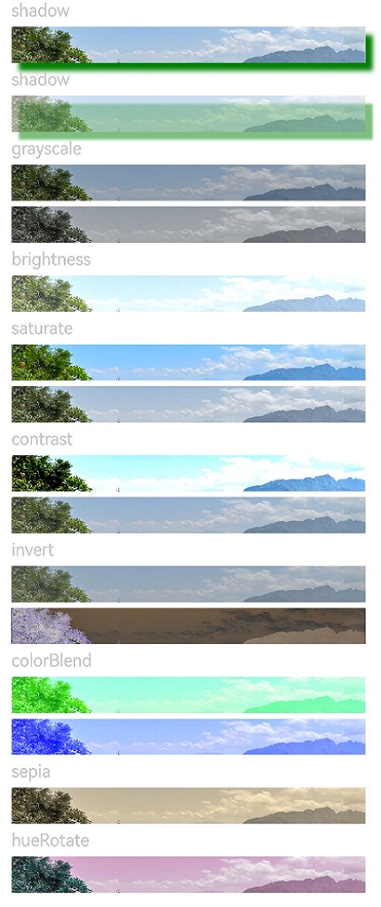
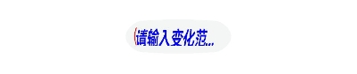
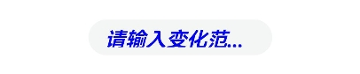

# 图像效果

设置组件的模糊、阴影、球面效果以及设置图片的图像效果。

>  **说明：**
>
>  从API Version 7开始支持。后续版本如有新增内容，则采用上角标单独标记该内容的起始版本。


## 属性


| 名称                             | 参数类型                                                     | 默认值 | 描述                                                         |
| -------------------------------- | ------------------------------------------------------------ | ------ | ------------------------------------------------------------ |
| blur                             | number                                                       | -      | 为当前组件添加内容模糊效果，入参为模糊半径，模糊半径越大越模糊，为0时不模糊。<br/>取值范围：[0, +∞)<br/>从API version 9开始，该接口支持在ArkTS卡片中使用。 |
| backdropBlur                     | number                                                       | -      | 为当前组件添加背景模糊效果，入参为模糊半径，模糊半径越大越模糊，为0时不模糊。<br/>取值范围：[0, +∞)<br/>从API version 9开始，该接口支持在ArkTS卡片中使用。 |
| shadow                           | [ShadowOptions](#shadowoptions对象说明) \| [ShadowStyle](#shadowstyle10枚举说明)<sup>10+</sup> | -      | 为当前组件添加阴影效果。<br/>入参类型为ShadowOptions时，可以指定模糊半径、阴影的颜色、X轴和Y轴的偏移量。<br/>入参类型为ShadowStyle时，可指定不同阴影样式。<br/>从API version 9开始，该接口支持在ArkTS卡片中使用，ArkTS卡片上不支持参数为 [ShadowStyle](#shadowstyle10枚举说明)类型。 |
| grayscale                        | number                                                       | 0.0    | 为当前组件添加灰度效果。值定义为灰度转换的比例，入参1.0则完全转为灰度图像，入参则0.0图像无变化，入参在0.0和1.0之间时，效果呈线性变化。（百分比)<br/>取值范围：[0, 1]<br/>**说明：** <br/>设置小于0的值时，按值为0处理，设置大于1的值时，按值为1处理。<br/>从API version 9开始，该接口支持在ArkTS卡片中使用。 |
| brightness                       | number                                                       | 1.0    | 为当前组件添加高光效果，入参为高光比例，值为1时没有效果，小于1时亮度变暗，0为全黑，大于1时亮度增加，数值越大亮度越大。<br/>取值范围：[0, +∞)<br/>**说明：** <br/>设置小于0的值时，按值为0处理。<br/>从API version 9开始，该接口支持在ArkTS卡片中使用。 |
| saturate                         | number                                                       | 1.0    | 为当前组件添加饱和度效果，饱和度为颜色中的含色成分和消色成分(灰)的比例，入参为1时，显示原图像，大于1时含色成分越大，饱和度越大，小于1时消色成分越大，饱和度越小。（百分比）<br/>取值范围：[0, +∞)<br/>**说明：** <br/>设置小于0的值时，按值为0处理。<br/>从API version 9开始，该接口支持在ArkTS卡片中使用。 |
| contrast                         | number                                                       | 1.0    | 为当前组件添加对比度效果，入参为对比度的值。值为1时，显示原图，大于1时，值越大对比度越高，图像越清晰醒目，小于1时，值越小对比度越低，当对比度为0时，图像变为全灰。（百分比）<br/>取值范围：[0, +∞)<br/>**说明：** <br/>设置小于0的值时，按值为0处理。<br/>从API version 9开始，该接口支持在ArkTS卡片中使用。 |
| invert                           | number                                                       | 0      | 反转输入的图像。入参为图像反转的比例，值为1时完全反转，值为0则图像无变化。（百分比）<br/>取值范围：[0, 1]<br/>**说明：** <br/>设置小于0的值时，按值为0处理。<br/>从API version 9开始，该接口支持在ArkTS卡片中使用。 |
| sepia                            | number                                                       | 0      | 将图像转换为深褐色。入参为图像反转的比例，值为1则完全是深褐色的，值为0图像无变化。&nbsp;（百分比）<br/>从API version 9开始，该接口支持在ArkTS卡片中使用。 |
| hueRotate                        | number&nbsp;\|&nbsp;string                                   | '0deg' | 色相旋转效果，输入参数为旋转角度。<br/>取值范围：(-∞, +∞)<br/>**说明：** <br/>色调旋转360度会显示原始颜色。先将色调旋转180 度，然后再旋转-180度会显示原始颜色。数据类型为number时，值为90和'90deg'效果一致。<br/>从API version 9开始，该接口支持在ArkTS卡片中使用。 |
| colorBlend&nbsp;<sup>8+</sup>    | [Color](ts-appendix-enums.md#color)&nbsp;\|&nbsp;string&nbsp;\|&nbsp;[Resource](ts-types.md#resource) | -      | 为当前组件添加颜色叠加效果，入参为叠加的颜色。<br/>从API version 9开始，该接口支持在ArkTS卡片中使用。 |
| sphericalEffect<sup>10+</sup>    | [number]                                                     | -      | 设置组件的图像球面化程度。<br/>取值范围：[0,1]。<br/>**说明：**<br/>1. 如果value等于0则图像保持原样，如果value等于1则图像为完全球面化效果。在0和1之间，数值越大，则球面化程度越高。<br/>`value < 0 `或者` value > 1`为异常情况，`value < 0`按0处理，`value > 1`按1处理。<br/> 2. 如果组件的图像使用异步加载，则不支持球面效果。例如Image组件默认使用异步加载，如果要使用球面效果，就要设置`syncLoad`为`true`，但是这种做法不推荐。`backgroundImage`也是使用异步加载，所以如果设置了`backgroundImage`，不支持球面效果。<br/>3. 如果组件设置了阴影，不支持球面效果。<br>此接口为系统接口。 |
| lightUpEffect<sup>10+</sup>      | [number]                                                     | -      | 设置组件图像亮起程度。<br/>取值范围：[0,1]。<br/>如果value等于0则图像为全黑，如果value等于1则图像为全亮效果。0到1之间数值越大，表示图像亮度越高。`value < 0` 或者 `value > 1`为异常情况，`value < 0`按0处理，`value > 1`按1处理。 <br>此接口为系统接口。|
| pixelStretchEffect<sup>10+</sup> | [PixelStretchEffectOptions](ts-types.md#PixelStretchEffectOptions) | -      | 设置组件的图像边缘像素扩展距离。<br/>参数`options`包括上下左右四个方向的边缘像素扩展距离。<br/>**说明：**<br/>1. 如果距离为正值，表示向外扩展，放大原来图像大小。上下左右四个方向分别用边缘像素填充，填充的距离即为设置的边缘扩展的距离。<br/>2. 如果距离为负值，表示内缩，但是最终图像大小不变。<br/>内缩方式：<br/>图像根据`options`的设置缩小，缩小大小为四个方向边缘扩展距离的绝对值。<br/>图像用边缘像素扩展到原来大小。<br/>3. 对`options`的输入约束：<br/>上下左右四个方向的扩展统一为非正值或者非负值。即四个边同时向外扩或者内缩，方向一致。<br/>所有方向的输入均为百分比或者具体值，不支持百分比和具体值混用。<br/>所有异常情况下，显示为{0，0，0，0}效果，即跟原图保持一致。<br>此接口为系统接口。 |

## ShadowOptions对象说明

阴影属性集合，用于设置阴影的模糊半径、阴影的颜色、X轴和Y轴的偏移量。

从API version 9开始，该接口支持在ArkTS卡片中使用。

| 名称     | 类型     | 必填   | 说明              |
| ------ | ------ | ---- | --------------- |
| radius    | number \| [Resource](ts-types.md#resource)  | 是    | 阴影模糊半径。<br/>取值范围：[0, +∞)<br/>**说明：** <br/>设置小于0的值时，按值为0处理。 |
| color  | [Color](ts-appendix-enums.md#color) \| string \| [Resource](ts-types.md#resource)  | 否    | 阴影的颜色。<br/>默认为黑色。 |
| offsetX | number \| [Resource](ts-types.md#resource)  | 否    | 阴影的X轴偏移量。<br/>默认为0。  |
| offsetY   | number \| [Resource](ts-types.md#resource)  | 否    | 阴影的Y轴偏移量。<br/>默认为0。 |

## ShadowStyle<sup>10+</sup>枚举说明

| 名称   | 描述                                   |
| ------ | -------------------------------------- |
| OUTER_DEFAULT_XS  | 超小阴影。 |
| OUTER_DEFAULT_SM | 小阴影。 |
| OUTER_DEFAULT_MD    | 中阴影。 |
| OUTER_DEFAULT_LG    | 大阴影。 |
| OUTER_FLOATING_SM    | 浮动小阴影。 |
| OUTER_FLOATING_MD    | 浮动中阴影。 |

## 示例

### 示例1
模糊属性的用法，blur内容模糊，backdropBlur背景模糊。
```ts
// xxx.ets
@Entry
@Component
struct BlurEffectsExample {
  build() {
    Column({ space: 10 }) {
      // 对字体进行模糊
      Text('font blur').fontSize(15).fontColor(0xCCCCCC).width('90%')
      Flex({ alignItems: ItemAlign.Center }) {
        Text('original text').margin(10)
        Text('blur text')
          .blur(1).margin(10)
        Text('blur text')
          .blur(2).margin(10)
        Text('blur text')
          .blur(3).margin(10)
      }.width('90%').height(40)
      .backgroundColor(0xF9CF93)


      // 对背景进行模糊
      Text('backdropBlur').fontSize(15).fontColor(0xCCCCCC).width('90%')
      Text()
        .width('90%')
        .height(40)
        .fontSize(16)
        .backdropBlur(3)
        .backgroundImage('/pages/attrs/image/image.jpg')
        .backgroundImageSize({ width: 1200, height: 160 })
    }.width('100%').margin({ top: 5 })
  }
}
```


### 示例2
设置图片的效果，包括阴影，灰度，高光，饱和度，对比度，图像反转，叠色，色相旋转等。
```ts
// xxx.ets
@Entry
@Component
struct ImageEffectsExample {
  build() {
    Column({ space: 10 }) {
      // 添加阴影效果，图片效果不变
      Text('shadow').fontSize(15).fontColor(0xCCCCCC).width('90%')
      Image($r('app.media.image'))
        .width('90%')
        .height(40)
        .shadow({ radius: 10, color: Color.Green, offsetX: 20, offsetY: 30 })

      // 灰度效果0~1，越接近1，灰度越明显
      Text('grayscale').fontSize(15).fontColor(0xCCCCCC).width('90%')
      Image($r('app.media.image')).width('90%').height(40).grayscale(0.3)
      Image($r('app.media.image')).width('90%').height(40).grayscale(0.8)

      // 高光效果，1为正常图片，<1变暗，>1亮度增大
      Text('brightness').fontSize(15).fontColor(0xCCCCCC).width('90%')
      Image($r('app.media.image')).width('90%').height(40).brightness(1.2)

      // 饱和度，原图为1
      Text('saturate').fontSize(15).fontColor(0xCCCCCC).width('90%')
      Image($r('app.media.image')).width('90%').height(40).saturate(2.0)
      Image($r('app.media.image')).width('90%').height(40).saturate(0.7)

      // 对比度，1为原图，>1值越大越清晰，<1值越小越模糊
      Text('contrast').fontSize(15).fontColor(0xCCCCCC).width('90%')
      Image($r('app.media.image')).width('90%').height(40).contrast(2.0)
      Image($r('app.media.image')).width('90%').height(40).contrast(0.8)

      // 图像反转比例
      Text('invert').fontSize(15).fontColor(0xCCCCCC).width('90%')
      Image($r('app.media.image')).width('90%').height(40).invert(0.2)
      Image($r('app.media.image')).width('90%').height(40).invert(0.8)

      // 叠色添加
      Text('colorBlend').fontSize(15).fontColor(0xCCCCCC).width('90%')
      Image($r('app.media.image')).width('90%').height(40).colorBlend(Color.Green)
      Image($r('app.media.image')).width('90%').height(40).colorBlend(Color.Blue)

      // 深褐色
      Text('sepia').fontSize(15).fontColor(0xCCCCCC).width('90%')
      Image($r('app.media.image')).width('90%').height(40).sepia(0.8)

      // 色相旋转
      Text('hueRotate').fontSize(15).fontColor(0xCCCCCC).width('90%')
      Image($r('app.media.image')).width('90%').height(40).hueRotate(90)
    }.width('100%').margin({ top: 5 })
  }
}
```



### 示例3

设置组件的图像球面效果。

```ts
// xxx.ets
@Entry
@Component
struct SphericalEffectExample {
  build() {
    Stack() {
      TextInput({ placeholder: "请输入变化范围百分比（[0%,100%]）"})
        .width('50%')
        .height(35)
        .type(InputType.Number)
        .enterKeyType(EnterKeyType.Done)
        .caretColor(Color.Red)
        .placeholderColor(Color.Blue)
        .placeholderFont({
          size: 20,
          style: FontStyle.Italic,
          weight: FontWeight.Bold
        })
        .sphericalEffect(0.5)
    }.alignContent(Alignment.Center).width("100%").height("100%")
  }
}

```

效果图如下：



去掉sphericalEffect的设置，效果如下：



### 示例4

设置组件的图像渐亮效果。

```ts
// xxx.ets
@Entry
@Component
struct LightUpExample {
  build() {
    Stack() {
      Text('This is the text content with letterSpacing 0.')
        .letterSpacing(0)
        .fontSize(12)
        .border({ width: 1 })
        .padding(10)
        .width('50%')
        .lightUpEffect(0.6)
    }.alignContent(Alignment.Center).width("100%").height("100%")
  }
}

```

效果图如下：


修改lightUpEffect参数值为0.2：


去掉lightUpEffect的设置，效果如下：


### 示例5

```ts
// xxx.ets
@Entry
@Component
struct LightUpExample {
  @State isLunar: boolean = false
  private selectedDate: Date = new Date('2028-08-08')
  build() {
    Stack() {
      DatePicker({
        start: new Date('1970-1-1'),
        end: new Date('2100-1-1'),
        selected: this.selectedDate
      })
        .lunar(this.isLunar)
        .onChange((value: DatePickerResult) => {
          this.selectedDate.setFullYear(value.year, value.month, value.day)
          console.info('select current date is: ' + JSON.stringify(value))
        })
        .lightUpEffect(0.6)

    }.alignContent(Alignment.Center).width("100%").height("100%")
  }
}
```


去掉lightUpEffect的设置，效果如下：


### 示例6

设置组件的图像边缘像素扩展效果。

```ts
// xxx.ets
@Entry
@Component
struct PixelStretchExample {
  build() {
    Stack() {
      Text('This is the text content with letterSpacing 0.')
        .letterSpacing(0)
        .fontSize(12)
        .border({ width: 1 })
        .padding(10)
        .width('50%')
        .pixelStretchEffect({top:10,left:10,right:10,bottom:10 })
    }.alignContent(Alignment.Center).width("100%").height("100%")
  }
}

```

效果图如下：


去掉pixelStretchEffect的设置，原图效果如下：


### 示例7

基于示例6，现在把边缘扩展距离改为非正值。

```ts
// xxx.ets
@Entry
@Component
struct PixelStretchExample {
  build() {
    Stack() {
      Text('This is the text content with letterSpacing 0.')
        .letterSpacing(0)
        .fontSize(12)
        .border({ width: 1 })
        .padding(10)
        .width('50%')
        .pixelStretchEffect({top:-10,left:-10,right:-10,bottom:-10 })
    }.alignContent(Alignment.Center).width("100%").height("100%")
  }
}
```

效果图如下:


跟原图对比发现，效果图分两步实现：<br>1、原图大小缩小，缩小后的大小为原图大小减去像素
收缩的距离。例如，原图大小为`100*100`，设置了`pixelStretchEffect({top:-10,left:-10,
right:-10,bottom:-10 })`，则缩小后的大小为`(100-10-10)*(100-10-10)`，即`80*80`。<br>2、使用边缘像素扩展，将图像扩展为原图大小。