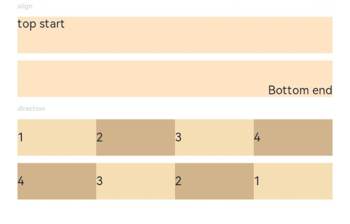

# 位置设置

设置组件的对齐方式、布局方向和显示位置。

>  **说明：**
>
>  从API Version 7开始支持。后续版本如有新增内容，则采用上角标单独标记该内容的起始版本。


## 属性


| 名称 | 参数类型 | 描述 |
| -------- | -------- | -------- |
| align | [Alignment](ts-appendix-enums.md#alignment) | 设置元素内容在元素绘制区域内的对齐方式。<br/>默认值：Alignment.Center<br/>从API version 9开始，该接口支持在ArkTS卡片中使用。 |
| direction | [Direction](ts-appendix-enums.md#direction) | 设置元素水平方向的布局。<br/>默认值：Direction.Auto<br/>从API version 9开始，该接口支持在ArkTS卡片中使用。 |
| position | [Position](ts-types.md#position8) | 绝对定位，设置元素左上角相对于父容器左上角偏移位置。在布局容器中，设置该属性不影响父容器布局，仅在绘制时进行位置调整。<br/>适用于置顶显示、悬浮按钮等组件在父容器中位置固定的场景。<br/>从API version 9开始，该接口支持在ArkTS卡片中使用。 |
| markAnchor | [Position](ts-types.md#position8) | 设置元素在位置定位时的锚点，以元素左上角作为基准点进行偏移。通常配合position和offset属性使用，单独使用时，效果类似offset<br/>API version 9及以前，默认值为：<br/>{<br/>x: 0,<br/>y: 0<br/>}<br/>API version 10：无默认值。<br/>从API version 9开始，该接口支持在ArkTS卡片中使用。 |
| offset | [Position](ts-types.md#position8) | 相对定位，设置元素相对于自身的偏移量。设置该属性，不影响父容器布局，仅在绘制时进行位置调整。<br/>API version 9及以前，默认值为：<br/>{<br/>x: 0,<br/>y: 0<br/>}<br/>API version 10：无默认值。<br/>从API version 9开始，该接口支持在ArkTS卡片中使用。 |
| alignRules<sup>9+</sup> | {<br/>left?: { anchor: string, align: [HorizontalAlign](ts-appendix-enums.md#horizontalalign) };<br/>right?: { anchor: string, align: [HorizontalAlign](ts-appendix-enums.md#horizontalalign) };<br/>middle?: { anchor: string, align: [HorizontalAlign](ts-appendix-enums.md#horizontalalign) };<br/>top?: { anchor: string, align: [VerticalAlign](ts-appendix-enums.md#verticalalign) };<br/>bottom?: { anchor: string, align: [VerticalAlign](ts-appendix-enums.md#verticalalign) };<br/>center?: { anchor: string, align: [VerticalAlign](ts-appendix-enums.md#verticalalign) }<br/>} | 指定相对容器的对齐规则，仅当父容器为[RelativeContainer](ts-container-relativecontainer.md)时生效。<br/>-&nbsp;left：设置左对齐参数。<br/>-&nbsp;right：设置右对齐参数。<br/>-&nbsp;middle：设置中间对齐的参数。<br/>-&nbsp;top：设置顶部对齐的参数。<br/>-&nbsp;bottom：设置底部对齐的参数。<br/>-&nbsp;center：设置中心对齐的参数。<br/>该接口支持在ArkTS卡片中使用。<br/>**说明：**<br/>-&nbsp;anchor：设置作为锚点的组件的id值。<br>-&nbsp;align：设置相对于锚点组件的对齐方式。 |


## 示例
### 示例1
```ts
// xxx.ets
@Entry
@Component
struct PositionExample1 {
  build() {
    Column() {
      Column({ space: 10 }) {
        // 元素内容<元素宽高，设置内容在与元素内的对齐方式
        Text('align').fontSize(9).fontColor(0xCCCCCC).width('90%')
        Stack() {
          Text('First show in bottom end').height('65%').backgroundColor(0xD2B48C)
          Text('Second show in bottom end').backgroundColor(0xF5DEB3).opacity(0.9)
        }.width('90%').height(50).margin({ top: 5 }).backgroundColor(0xFFE4C4)
        .align(Alignment.BottomEnd)
        Stack() {
          Text('top start')
        }.width('90%').height(50).margin({ top: 5 }).backgroundColor(0xFFE4C4)
        .align(Alignment.TopStart)

        // 父容器设置direction为Direction.Ltr，子元素从左到右排列
        Text('direction').fontSize(9).fontColor(0xCCCCCC).width('90%')
        Row() {
          Text('1').height(50).width('25%').fontSize(16).backgroundColor(0xF5DEB3)
          Text('2').height(50).width('25%').fontSize(16).backgroundColor(0xD2B48C)
          Text('3').height(50).width('25%').fontSize(16).backgroundColor(0xF5DEB3)
          Text('4').height(50).width('25%').fontSize(16).backgroundColor(0xD2B48C)
        }
        .width('90%')
        .direction(Direction.Ltr)
        // 父容器设置direction为Direction.Rtl，子元素从右到左排列
        Row() {
          Text('1').height(50).width('25%').fontSize(16).backgroundColor(0xF5DEB3).textAlign(TextAlign.End)
          Text('2').height(50).width('25%').fontSize(16).backgroundColor(0xD2B48C).textAlign(TextAlign.End)
          Text('3').height(50).width('25%').fontSize(16).backgroundColor(0xF5DEB3).textAlign(TextAlign.End)
          Text('4').height(50).width('25%').fontSize(16).backgroundColor(0xD2B48C).textAlign(TextAlign.End)
        }
        .width('90%')
        .direction(Direction.Rtl)
      }
    }
    .width('100%').margin({ top: 5 })
  }
}
```



### 示例2
```ts
// xxx.ets
@Entry
@Component
struct PositionExample2 {
  build() {
    Column({ space: 20 }) {
      // 设置子组件左上角相对于父组件左上角的偏移位置
      Text('position').fontSize(12).fontColor(0xCCCCCC).width('90%')
      Row() {
        Text('1').size({ width: '30%', height: '50' }).backgroundColor(0xdeb887).border({ width: 1 }).fontSize(16)
          .textAlign(TextAlign.Center)
        Text('2 position(30, 10)')
          .size({ width: '60%', height: '30' })
          .backgroundColor(0xbbb2cb)
          .border({ width: 1 })
          .fontSize(16)
          .align(Alignment.Start)
          .position({ x: 30, y: 10 })
        Text('3').size({ width: '45%', height: '50' }).backgroundColor(0xdeb887).border({ width: 1 }).fontSize(16)
          .textAlign(TextAlign.Center)
        Text('4 position(50%, 70%)')
          .size({ width: '50%', height: '50' })
          .backgroundColor(0xbbb2cb)
          .border({ width: 1 })
          .fontSize(16)
          .position({ x: '50%', y: '70%' })
      }.width('90%').height(100).border({ width: 1, style: BorderStyle.Dashed })

      // 相对于起点偏移，其中x为最终定位点距离起点水平方向间距，x>0往左，反之向右。
      // y为最终定位点距离起点垂直方向间距，y>0向上，反之向下
      Text('markAnchor').fontSize(12).fontColor(0xCCCCCC).width('90%')
      Stack({ alignContent: Alignment.TopStart }) {
        Row()
          .size({ width: '100', height: '100' })
          .backgroundColor(0xdeb887)
        Text('text')
          .fontSize('30px')
          .textAlign(TextAlign.Center)
          .size({ width: 25, height: 25 })
          .backgroundColor(Color.Green)
          .markAnchor({ x: 25, y: 25 })
        Text('text')
          .fontSize('30px')
          .textAlign(TextAlign.Center)
          .size({ width: 25, height: 25 })
          .backgroundColor(Color.Green)
          .markAnchor({ x: -100, y: -25 })
        Text('text')
          .fontSize('30px')
          .textAlign(TextAlign.Center)
          .size({ width: 25, height: 25 })
          .backgroundColor(Color.Green)
          .markAnchor({ x: 25, y: -25 })
      }.margin({ top: 25 }).border({ width: 1, style: BorderStyle.Dashed })

      // 相对定位，x>0向右偏移，反之向左，y>0向下偏移，反之向上
      Text('offset').fontSize(12).fontColor(0xCCCCCC).width('90%')
      Row() {
        Text('1').size({ width: '15%', height: '50' }).backgroundColor(0xdeb887).border({ width: 1 }).fontSize(16)
          .textAlign(TextAlign.Center)
        Text('2  offset(15, 30)')
          .size({ width: 120, height: '50' })
          .backgroundColor(0xbbb2cb)
          .border({ width: 1 })
          .fontSize(16)
          .align(Alignment.Start)
          .offset({ x: 15, y: 30 })
        Text('3').size({ width: '15%', height: '50' }).backgroundColor(0xdeb887).border({ width: 1 }).fontSize(16)
          .textAlign(TextAlign.Center)
        Text('4 offset(-10%, 20%)')
          .size({ width: 100, height: '50' })
          .backgroundColor(0xbbb2cb)
          .border({ width: 1 })
          .fontSize(16)
          .offset({ x: '-5%', y: '20%' })
      }.width('90%').height(100).border({ width: 1, style: BorderStyle.Dashed })
    }
    .width('100%').margin({ top: 25 })
  }
}
```


