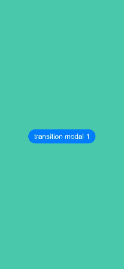

# 全屏模态转场

通过bindContentCover属性为组件绑定全屏模态页面，在组件插入和删除时可通过设置转场参数ModalTransition显示过渡动效。

>  **说明：**
>
>  从API Version 10开始支持。后续版本如有新增内容，则采用上角标单独标记该内容的起始版本。
>  不支持横竖屏切换。

## 属性

| 名称               | 参数                                       | 参数描述                                     |
| ---------------- | ---------------------------------------- | ---------------------------------------- |
| bindContentCover | isShow: boolean,<br>builder: [CustomBuilder](ts-types.md#custombuilder8),<br>type?: [ModalTransition](ts-types.md#modaltransition10) | 给组件绑定全屏模态页面，点击后显示模态页面。模态页面内容自定义，显示方式可设置无动画过渡，上下切换过渡以及透明渐变过渡方式。<br/> isShow: 必填，是否显示全屏模态页面。<br/>builder: 必填，配置全屏模态页面内容。<br/> type: 非必填，配置全屏模态页面的转场方式。 |

## 示例

### 示例1

全屏模态无动画转场模式下，自定义转场动画。

```ts
// xxx.ets
@Entry
@Component
struct ModalTransitionExample {
  @State isShow:boolean = false
  @State isShow2:boolean = false

  @Builder myBuilder2() {
    Column() {
      Button("close modal 2")
        .margin(10)
        .fontSize(20)
        .onClick(()=>{
          this.isShow2 = false;
        })
    }
    .width('100%')
    .height('100%')
    .backgroundColor(Color.Orange)
  }

  @Builder myBuilder() {
    Column() {
      Button("transition modal 2")
        .margin(10)
        .fontSize(20)
        .onClick(()=>{
          this.isShow2 = true;
        }).bindContentCover($$this.isShow2, this.myBuilder2(), ModalTransition.NONE)

      Button("close modal 1")
        .margin(10)
        .fontSize(20)
        .onClick(()=>{
          this.isShow = false;
        })
    }
    .width('100%')
    .height('100%')
    .backgroundColor(Color.Pink)
    .justifyContent(FlexAlign.Center)
  }

  build() {
    Column() {
      Button("transition modal 1")
        .onClick(() => {
          this.isShow = true
        })
        .fontSize(20)
        .margin(10)
        .bindContentCover($$this.isShow, this.myBuilder(), ModalTransition.NONE)
    }
    .justifyContent(FlexAlign.Center)
    .backgroundColor("#ff49c8ab")
    .width('100%')
    .height('100%')
  }
}
```



### 示例2

全屏模态无动画转场模式下，自定义转场动画。

```ts
// xxx.ets
import curves from '@ohos.curves';
@Entry
@Component
struct ModalTransitionExample {
  @State  @Watch("isShow1Change") isShow:boolean = false
  @State  @Watch("isShow2Change") isShow2:boolean = false
  @State isScale1:number = 1;
  @State isScale2:number = 1;
  @State flag: boolean = true
  @State show: string = 'show'

  isShow1Change() {
    this.isShow ? this.isScale1 = 0.95 : this.isScale1 = 1
  }
  isShow2Change() {
    this.isShow2 ? this.isScale2 = 0.95 : this.isScale2 = 1
  }
  @Builder myBuilder2() {
    Column() {
      Button("close modal 2")
        .margin(10)
        .fontSize(20)
        .onClick(()=>{
          this.isShow2 = false;
        })
    }
    .width('100%')
    .height('100%')
    .backgroundColor(Color.Orange)
  }


  @Builder myBuilder() {
    Column() {
      Button("transition modal 2")
        .margin(10)
        .fontSize(20)
        .onClick(()=>{
          this.isShow2 = true;
        }).bindContentCover($$this.isShow2, this.myBuilder2(), ModalTransition.NONE)

      Button("close modal 1")
        .margin(10)
        .fontSize(20)
        .onClick(()=>{
          this.isShow = false;
        })
    }
    .width('100%')
    .height('100%')
    .backgroundColor(Color.Pink)
    .justifyContent(FlexAlign.Center)
    .scale({x: this.isScale2, y: this.isScale2})
    .animation({curve:curves.springMotion()})
  }

  build() {
    Column() {
      Button("transition modal 1")
        .onClick(() => {
          this.isShow = true
        })
        .fontSize(20)
        .margin(10)
        .bindContentCover($$this.isShow, this.myBuilder(), ModalTransition.NONE)
    }
    .justifyContent(FlexAlign.Center)
    .backgroundColor("#ff49c8ab")
    .width('100%')
    .height('100%')
    .scale({ x: this.isScale1, y: this.isScale1 })
    .animation({ curve: curves.springMotion() })
  }
}
```


### 示例3

全屏模态上下切换转场。

```ts
// xxx.ets
@Entry
@Component
struct ModalTransitionExample {
  @State isShow:boolean = false
  @State isShow2:boolean = false

  @Builder myBuilder2() {
    Column() {
      Button("close modal 2")
        .margin(10)
        .fontSize(20)
        .onClick(()=>{
          this.isShow2 = false;
        })
    }
    .width('100%')
    .height('100%')
    .backgroundColor(Color.Gray)
  }

  @Builder myBuilder() {
    Column() {
      Button("transition modal 2")
        .margin(10)
        .fontSize(20)
        .onClick(()=>{
          this.isShow2 = true;
        }).bindContentCover(this.isShow2, this.myBuilder2(), ModalTransition.DEFAULT)

      Button("close modal 1")
        .margin(10)
        .fontSize(20)
        .onClick(()=>{
          this.isShow = false;
        })
    }
    .width('100%')
    .height('100%')
    .backgroundColor(Color.Pink)
    .justifyContent(FlexAlign.Center)
  }

  build() {
    Column() {
      Button("transition modal 1")
        .onClick(() => {
          this.isShow = true
        })
        .fontSize(20)
        .margin(10)
        .bindContentCover($$this.isShow, this.myBuilder(), ModalTransition.DEFAULT)
    }
    .justifyContent(FlexAlign.Center)
    .backgroundColor(Color.White)
    .width('100%')
    .height('100%')
  }
}
```


### 示例4

全屏模态透明度渐变转场。

```ts
// xxx.ets
@Entry
@Component
struct ModalTransitionExample {
  @State isShow:boolean = false
  @State isShow2:boolean = false

  @Builder myBuilder2() {
    Column() {
      Button("close modal 2")
        .margin(10)
        .fontSize(20)
        .onClick(()=>{
          this.isShow2 = false;
        })
    }
    .width('100%')
    .height('100%')
    .backgroundColor(Color.Gray)
    .justifyContent(FlexAlign.Center)
  }


  @Builder myBuilder() {
    Column() {
      Button("transition modal 2")
        .margin(10)
        .fontSize(20)
        .onClick(()=>{
          this.isShow2 = true;
        }).bindContentCover(this.isShow2, this.myBuilder2(), ModalTransition.ALPHA)

      Button("close modal 1")
        .margin(10)
        .fontSize(20)
        .onClick(()=>{
          this.isShow = false;
        })
    }
    .width('100%')
    .height('100%')
    .backgroundColor(Color.Pink)
    .justifyContent(FlexAlign.Center)
  }

  build() {
    Column() {
      Button("transition modal 1")
        .onClick(() => {
          this.isShow = true
        })
        .fontSize(20)
        .margin(10)
        .bindContentCover($$this.isShow, this.myBuilder(), ModalTransition.ALPHA)
    }
    .justifyContent(FlexAlign.Center)
    .backgroundColor(Color.White)
    .width('100%')
    .height('100%')
  }
}
```

