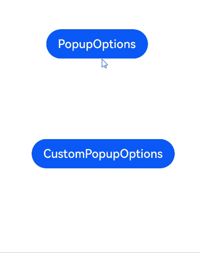
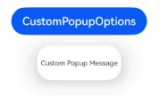
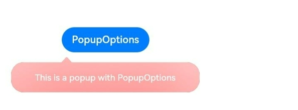
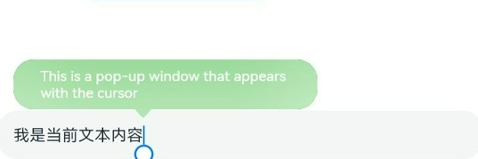

# Popup控制

给组件绑定popup弹窗，并设置弹窗内容，交互逻辑和显示状态。

>  **说明：**
>
> - 从API Version 7开始支持。后续版本如有新增内容，则采用上角标单独标记该内容的起始版本。
>  
> - popup弹窗的显示状态在onStateChange事件回调中反馈，其显隐与组件的创建或销毁无强对应关系。


## 接口


| 名称        | 参数类型                                     | 描述                                       |
| --------- | ---------------------------------------- | ---------------------------------------- |
| bindPopup | show:&nbsp;boolean,<br/>popup:&nbsp;[PopupOptions](#popupoptions类型说明)&nbsp;\|&nbsp;[CustomPopupOptions](#custompopupoptions8类型说明)<sup>8+</sup> | 给组件绑定Popup弹窗，设置参数show为true弹出弹框。<br/>show:&nbsp;弹窗显示状态，默认值为false，隐藏弹窗。popup弹窗必须等待页面全部构建完成才能展示，因此show不能在页面构建中设置为true，否则会导致popup弹窗显示位置及形状错误。<br/>popup:&nbsp;配置当前弹窗提示的参数。 |

## PopupOptions类型说明

| 名称                                  | 类型                                                         | 必填 | 描述                                                         |
| ------------------------------------- | ------------------------------------------------------------ | ---- | ------------------------------------------------------------ |
| message                               | string                                                       | 是   | 弹窗信息内容。                                               |
| placementOnTop<sup>(deprecated)</sup> | boolean                                                      | 否   | 是否在组件上方显示，默认值为false。<br />**说明：**<br />从 API version 10 开始废弃，建议使用`placement`替代。 |
| primaryButton                         | {<br/>value:&nbsp;string,<br/>action:&nbsp;()&nbsp;=&gt;&nbsp;void<br/>} | 否   | 第一个按钮。<br/>value:&nbsp;弹窗里主按钮的文本。<br/>action:&nbsp;点击主按钮的回调函数。 |
| secondaryButton                       | {<br/>value:&nbsp;string,<br/>action:&nbsp;()&nbsp;=&gt;&nbsp;void<br/>} | 否   | 第二个按钮。<br/>value:&nbsp;弹窗里辅助按钮的文本。<br/>action:&nbsp;点击辅助按钮的回调函数。 |
| onStateChange                         | (event:&nbsp;{&nbsp;isVisible:&nbsp;boolean&nbsp;})&nbsp;=&gt;&nbsp;void | 否   | 弹窗状态变化事件回调，参数isVisible为弹窗当前的显示状态。    |
| arrowOffset<sup>9+</sup>              | [Length](ts-types.md#length)                                 | 否   | popup箭头在弹窗处的偏移。箭头在气泡上下方时，数值为0表示箭头居最左侧，偏移量为箭头至最左侧的距离，默认居中。箭头在气泡左右侧时，偏移量为箭头至最上侧的距离，默认居中。如果显示在屏幕边缘，气泡会自动左右偏移，数值为0时箭头始终指向绑定组件。 |
| showInSubWindow<sup>9+</sup>          | boolean                                                      | 否   | 是否在子窗口显示气泡，默认值为false。                        |
| mask<sup>10+</sup>                    | boolean&nbsp;\|&nbsp;[ResourceColor](ts-types.md#resourcecolor) | 否   | 设置气泡是否有遮罩层及遮罩颜色。如果设置为false，则没有遮罩层；如果设置为true，则设置有遮罩层并且颜色为透明色；如果设置为Color，则为遮罩层的颜色。 |
| messageOptions<sup>10+</sup>          | [PopupMessageOptions](#popupmessageoptions10类型说明)        | 否   | 设置弹窗信息文本参数。                                       |
| targetSpace<sup>10+</sup>             | [Length](ts-types.md#length)                                 | 否   | 设置popup与目标的间隙。                                      |
| placement<sup>10+</sup>               | [Placement](ts-appendix-enums.md#placement8)                 | 否   | 设置popup组件相对于目标的显示位置，默认值为Placement.Bottom。<br />如果同时设置了`placementOnTop`和`placement`，则以`placement`的设置生效。 |
| offset<sup>10+</sup>                  | [Position](ts-types.md#position8)                            | 否   | 设置popup组件相对于placement设置的显示位置的偏移。<br />**说明：**<br />不支持设置百分比。 |
| enableArrow<sup>10+</sup>             | boolean                                                      | 否   | 设置是否显示箭头。<br/>默认值：true                          |
| popupColor<sup>11+</sup>              | [Color](ts-appendix-enums.md#color) \|string\|number \| [Resource](ts-types.md#resource) | 否   | 提示气泡的颜色。<br/>默认值：'#4d4d4d'                       |
| autoCancel<sup>11+</sup>              | boolean                                                      | 否   | 页面有操作时，是否自动关闭气泡。<br/>默认值：true            |
| width<sup>11+</sup>                   | [Dimension](ts-types.md#dimension10)                         | 否   | 弹窗宽度。                                                   |
| arrowPointPosition<sup>11+</sup>      | [ArrowPointPosition](ts-appendix-enums.md#arrowpointposition11) | 否   | 气泡尖角相对于父组件显示位置，气泡尖角在垂直和水平方向上有 ”Start“、”Center“、”End“三个位置点可选。以上所有位置点均位于父组件区域的范围内，不会超出父组件的边界范围。 |

## PopupMessageOptions<sup>10+</sup>类型说明

| 名称      | 类型                                       | 必填 | 描述                   |
| --------- | ------------------------------------------ | ---- | ---------------------- |
| textColor | [ResourceColor](ts-types.md#resourcecolor) | 否   | 设置弹窗信息文本颜色。 |
| font      | [Font](ts-types.md#font)                   | 否   | 设置弹窗信息字体属性。 |
## CustomPopupOptions<sup>8+</sup>类型说明

| 名称                           | 类型                                       | 必填   | 描述                                       |
| ---------------------------- | ---------------------------------------- | ---- | ---------------------------------------- |
| builder                      | [CustomBuilder](ts-types.md#custombuilder8) | 是    | 提示气泡内容的构造器。<br />**说明：**<br />popup为通用属性，自定义popup中不支持再次弹出popup。对builder下的第一层容器组件不支持使用position属性，如果使用将导致气泡不显示。builder中若使用自定义组件，自定义组件的aboutToAppear和aboutToDisappear生命周期与popup弹窗的显隐无关，不能使用其生命周期判断popup弹窗的显隐。                              |
| placement                    | [Placement](ts-appendix-enums.md#placement8) | 否    | 气泡组件优先显示的位置，当前位置显示不下时，会自动调整位置。<br/>默认值：Placement.Bottom |
| popupColor                   | [ResourceColor](ts-types.md#resourcecolor) | 否    | 提示气泡的颜色。<br/>默认值：'#4d4d4d' |
| enableArrow                  | boolean                                  | 否    | 是否显示箭头。<br/>从API Version 9开始，如果箭头所在方位侧的气泡长度不足以显示下箭头，则会默认不显示箭头。比如：placement设置为Left，此时如果气泡高度小于箭头的宽度（32vp）与气泡圆角两倍（48vp）之和（80vp），则实际不会显示箭头。<br/>默认值：true |
| autoCancel                   | boolean                                  | 否    | 页面有操作时，是否自动关闭气泡。<br/>默认值：true            |
| onStateChange                | (event:&nbsp;{&nbsp;isVisible:&nbsp;boolean&nbsp;})&nbsp;=&gt;&nbsp;void | 否    | 弹窗状态变化事件回调，参数为弹窗当前的显示状态。                 |
| arrowOffset<sup>9+</sup>     | [Length](ts-types.md#length) | 否    | popup箭头在弹窗处的偏移。箭头在气泡上下方时，数值为0表示箭头居最左侧，偏移量为箭头至最左侧的距离，默认居中。箭头在气泡左右侧时，偏移量为箭头至最上侧的距离，默认居中。如果显示在屏幕边缘，气泡会自动左右偏移，数值为0时箭头始终指向绑定组件。 |
| showInSubWindow<sup>9+</sup> | boolean                                  | 否    | 是否在子窗口显示气泡，默认值为false。                    |
| maskColor<sup>(deprecated)</sup> | [ResourceColor](ts-types.md#resourcecolor)   | 否   | 设置气泡遮罩层颜色。<br />**说明：**<br />从 API version 10 开始废弃，建议使用`mask`替代。 |
| mask<sup>10+</sup>           | boolean&nbsp;\|&nbsp;[ResourceColor](ts-types.md#resourcecolor) | 否    | 设置气泡是否有遮罩层及遮罩颜色。如果设置为false，则没有遮罩层；如果设置为true，则设置有遮罩层并且颜色为透明色；如果设置为Color，则为遮罩层的颜色。 |
| targetSpace<sup>10+</sup>    | [Length](ts-types.md#length)             | 否    | 设置popup与目标的间隙。                           |
| offset<sup>10+</sup>         | [Position](ts-types.md#position8)                            | 否   | 设置popup组件相对于placement设置的显示位置的偏移。<br />**说明：**<br />不支持设置百分比。 |
| width<sup>11+</sup> | [Dimension](ts-types.md#dimension10) | 否 | 弹窗宽度。 |
| arrowPointPosition<sup>11+</sup> | [ArrowPointPosition](ts-appendix-enums.md#ArrowPointPosition11) | 否 | 气泡尖角相对于父组件显示位置，气泡尖角在垂直和水平方向上有 ”Start“、”Center“、”End“三个位置点可选。以上所有位置点均位于父组件区域的范围内，不会超出父组件的边界范围。 |

## 

## 示例

### 示例1

```ts
// xxx.ets
@Entry
@Component
struct PopupExample {
  @State handlePopup: boolean = false
  @State customPopup: boolean = false

  // popup构造器定义弹框内容
  @Builder popupBuilder() {
    Row({ space: 2 }) {
      Image($r("app.media.image")).width(24).height(24).margin({ left: -5 })
      Text('Custom Popup').fontSize(10)
    }.width(100).height(50).padding(5)
  }

  build() {
    Flex({ direction: FlexDirection.Column }) {
      // PopupOptions 类型设置弹框内容
      Button('PopupOptions')
        .onClick(() => {
          this.handlePopup = !this.handlePopup
        })
        .bindPopup(this.handlePopup, {
          message: 'This is a popup with PopupOptions',
          placementOnTop: true,
          showInSubWindow:false,
          primaryButton: {
            value: 'confirm',
            action: () => {
              this.handlePopup = !this.handlePopup
              console.info('confirm Button click')
            }
          },
          // 第二个按钮
          secondaryButton: {
            value: 'cancel',
            action: () => {
              this.handlePopup = !this.handlePopup
              console.info('cancel Button click')
            }
          },
          onStateChange: (e) => {
            console.info(JSON.stringify(e.isVisible))
            if (!e.isVisible) {
              this.handlePopup = false
            }
          }
        })
        .position({ x: 100, y: 50 })


      // CustomPopupOptions 类型设置弹框内容
      Button('CustomPopupOptions')
        .onClick(() => {
          this.customPopup = !this.customPopup
        })
        .bindPopup(this.customPopup, {
          builder: this.popupBuilder,
          placement: Placement.Top,
          mask: {color:'0x33000000'},
          popupColor: Color.Yellow,
          enableArrow: true,
          showInSubWindow: false,
          onStateChange: (e) => {
            if (!e.isVisible) {
              this.customPopup = false
            }
          }
        })
        .position({ x: 80, y: 200 })
    }.width('100%').padding({ top: 5 })
  }
}
```



### 示例2

```ts
// xxx.ets
@Entry
@Component
struct PopupExample {
  @State handlePopup: boolean = false

  build() {
    Column() {
      Button('PopupOptions')
        .onClick(() => {
          this.handlePopup = !this.handlePopup
        })
        .bindPopup(this.handlePopup, {
          message: 'This is a popup with PopupOptions',
          messageOptions: {
            textColor: Color.Red,
            font: {
              size: '14vp',
              style: FontStyle.Italic,
              weight: FontWeight.Bolder
            }
          },
          placement: Placement.Bottom,
          enableArrow: false,
          targetSpace: '15vp',
          onStateChange: (e) => {
            console.info(JSON.stringify(e.isVisible))
            if (!e.isVisible) {
              this.handlePopup = false
            }
          }
        })
    }.margin(20)
  }
}
```


### 示例3

```ts
// xxx.ets
@Entry
@Component
struct PopupExample {
  @State customPopup: boolean = false

  // popup构造器定义弹框内容
  @Builder popupBuilder() {
    Row() {
      Text('Custom Popup Message').fontSize(10)
    }.height(50).padding(5)
  }

  build() {
    Column() {
      // CustomPopupOptions 类型设置弹框内容
      Button('CustomPopupOptions')
        .onClick(() => {
          this.customPopup = !this.customPopup
        })
        .bindPopup(this.customPopup, {
          builder: this.popupBuilder,
          targetSpace: '15vp',
          enableArrow: false,
          onStateChange: (e) => {
            if (!e.isVisible) {
              this.customPopup = false
            }
          }
        })
    }.margin(20)
  }
}
```



### 示例4

```ts
// xxx.ets
@Entry
@Component
struct PopupExample {
  @State handlePopup: boolean = false
    
  build() {
    Column() {
      Button('PopupOptions')
        .position({ x: 100, y: 50 })
        .onClick(() => {
          this.handlePopup = !this.handlePopup
        })
        .bindPopup(this.handlePopup, {
          width: 300,
          message: 'This is a popup with PopupOptions',
          arrowPointPosition: ArrowPointPosition.START,
          popupColor: Color.Red,
          autoCancel: true,
        })
    }
    .width('100%')
    .height('100%')
  }
}
```



### 示例5

```ts
// xxx.ets
import { Popup , PopupOptions,PopupTextOptions, PopupButtonOptions, PopupIconOptions } from '@ohos.arkui.advanced.Popup';

@Entry
@Component
struct PopupExample {
  @State customPopup: boolean = false

  @Builder
  popupBuilder() {
    // popup 自定义高级组件
    Popup({
      //PopupIconOptions 类型设置图标内容
      icon: {
        image: $r('app.media.icon'),
        width:32,
        height:32,
        fillColor:Color.White,
        borderRadius: 16,
      } as PopupIconOptions,
      // PopupTextOptions 类型设置文字内容
      title: {
        text: 'This is a popup with CustomPopupOptions',
        fontSize: 20,
        fontColor: Color.Black,
        fontWeight: FontWeight.Normal,

      } as PopupTextOptions,
      //PopupTextOptions 类型设置文字内容
      message: {
        text: 'This is the message',
        fontSize: 15,
        fontColor: Color.Black,
        fontWeight: FontWeight.Normal,
      } as PopupTextOptions,
      showClose: false,
      onClose: () => {
        console.info('close Button click')
        this.customPopup = false
      },
      // PopupButtonOptions 类型设置按钮内容
      buttons: [{
        text: 'confirm',
        action: () => {
          console.info('confirm button click')
          this.customPopup = false
        },
        fontSize: 15,
        fontColor: Color.Black,

      },
        {
          text: 'cancel',
          action: () => {
            console.info('cancel button click')
            this.customPopup = false
          },
          fontSize: 15,
          fontColor: Color.Black,
        },] as [PopupButtonOptions?, PopupButtonOptions?],
    })
  }

  build() {
    Column() {
      Button('CustomPopupOptions')
        .onClick(() => {
          this.customPopup = !this.customPopup
        })
        .position({ x: 80, y: 200 })
        .bindPopup(this.customPopup, {
          builder: this.popupBuilder,
          width: 300,
          arrowPointPosition: ArrowPointPosition.END,
        })
    }
    .width('100%')
    .height('100%')
  }
}
```


### 示例6

```ts
// xxx.ets

@Entry
@Component
struct PopupExample {
  @State cursorPopup: boolean = false

  build() {
    Column() {
      TextInput({placeholder:'我是提示文本',text:'我是当前文本内容'})
        .position({ x: 0, y: 350 })
        .onFocus(() => {
          this.cursorPopup = !this.cursorPopup
        })
        .selectionMenuHidden(true)
        .bindPopup(this.cursorPopup, {
          width: 300,
          message: 'This is a pop-up window that appears with the cursor',
          arrowPointPosition: ArrowPointPosition.CENTER,
          popupColor: Color.Green,
          autoCancel: true,

        })
    }
    .width('100%')
    .height('100%')
  }
}
```

