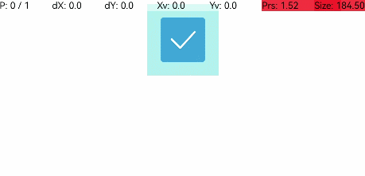

# 触摸热区设置<a name="ZH-CN_TOPIC_0000001192595182"></a>

> **说明：** 
>从API Version 8开始支持。后续版本如有新增内容，则采用上角标单独标记该内容的起始版本。

适用于支持通用点击事件、通用触摸事件、通用手势处理的组件。

## 权限列表<a name="section781125411508"></a>

无

## 属性<a name="section6820191711316"></a>

<table><thead align="left"><tr><th class="cellrowborder" valign="top" width="15.120000000000001%" id="mcps1.1.5.1.1"><p>名称</p>
</th>
<th class="cellrowborder" valign="top" width="18.05%" id="mcps1.1.5.1.2"><p>参数类型</p>
</th>
<th class="cellrowborder" valign="top" width="18.22%" id="mcps1.1.5.1.3"><p>默认值</p>
</th>
<th class="cellrowborder" valign="top" width="48.61%" id="mcps1.1.5.1.4"><p>描述</p>
</th>
</tr>
</thead>
<tbody><tr><td class="cellrowborder" valign="top" width="15.120000000000001%" headers="mcps1.1.5.1.1 "><p>responseRegion</p>
</td>
<td class="cellrowborder" valign="top" width="18.05%" headers="mcps1.1.5.1.2 "><p>Array&lt;Rectangle&gt; | <a href="#li11163114695111">Rectangle</a></p>
</td>
<td class="cellrowborder" valign="top" width="18.22%" headers="mcps1.1.5.1.3 "><p>{</p>
<p>x：0,</p>
<p>y：0,</p>
<p>width：'100%',</p>
<p>height：'100%'</p>
<p>}</p>
</td>
<td class="cellrowborder" valign="top" width="48.61%" headers="mcps1.1.5.1.4 "><p>设置一个或多个触摸热区，包括位置和大小。</p>
<div class="note"><span class="notetitle"> 说明： </span><div class="notebody"><p>百分比是相对于组件本身来度量的。</p>
<p>x和y可以设置正负值百分比。当x设置为'100%'时表示热区往右偏移组件本身宽度大小，当x设置为'-100%'时表示热区往左偏移组件本身宽度大小。当y设置为'100%'时表示热区往下偏移组件本身高度大小，当y设置为'-100%'时表示热区往上偏移组件本身高度大小。</p>
<p>width和height只能设置正值百分比。width：'100%'表示热区宽度设置为该组件本身的宽度。比如组件本身宽度是100vp，那么'100%'表示热区宽度也为100vp。height：'100%'表示热区高度设置为该组件本身的高度。</p>
</div></div>
</td>
</tr>
</tbody>
</table>

-   <a name="li11163114695111"></a>Rectangle对象说明

    <table><thead align="left"><tr><th class="cellrowborder" valign="top" width="12.601260126012601%" id="mcps1.1.6.1.1"><p>名称</p>
    </th>
    <th class="cellrowborder" valign="top" width="15.791579157915791%" id="mcps1.1.6.1.2"><p>类型</p>
    </th>
    <th class="cellrowborder" valign="top" width="6.950695069506951%" id="mcps1.1.6.1.3"><p>必填</p>
    </th>
    <th class="cellrowborder" valign="top" width="7.520752075207521%" id="mcps1.1.6.1.4"><p>默认值</p>
    </th>
    <th class="cellrowborder" valign="top" width="57.13571357135714%" id="mcps1.1.6.1.5"><p>描述</p>
    </th>
    </tr>
    </thead>
    <tbody><tr><td class="cellrowborder" valign="top" width="12.601260126012601%" headers="mcps1.1.6.1.1 "><p>x</p>
    </td>
    <td class="cellrowborder" valign="top" width="15.791579157915791%" headers="mcps1.1.6.1.2 "><p>Length</p>
    </td>
    <td class="cellrowborder" valign="top" width="6.950695069506951%" headers="mcps1.1.6.1.3 "><p>否</p>
    </td>
    <td class="cellrowborder" valign="top" width="7.520752075207521%" headers="mcps1.1.6.1.4 "><p>0vp</p>
    </td>
    <td class="cellrowborder" valign="top" width="57.13571357135714%" headers="mcps1.1.6.1.5 "><p>触摸点相对于组件本身左边沿的X坐标。</p>
    </td>
    </tr>
    <tr><td class="cellrowborder" valign="top" width="12.601260126012601%" headers="mcps1.1.6.1.1 "><p>y</p>
    </td>
    <td class="cellrowborder" valign="top" width="15.791579157915791%" headers="mcps1.1.6.1.2 "><p>Length</p>
    </td>
    <td class="cellrowborder" valign="top" width="6.950695069506951%" headers="mcps1.1.6.1.3 "><p>否</p>
    </td>
    <td class="cellrowborder" valign="top" width="7.520752075207521%" headers="mcps1.1.6.1.4 "><p>0vp</p>
    </td>
    <td class="cellrowborder" valign="top" width="57.13571357135714%" headers="mcps1.1.6.1.5 "><p>触摸点相对于组件本身左边沿的Y坐标。</p>
    </td>
    </tr>
    <tr><td class="cellrowborder" valign="top" width="12.601260126012601%" headers="mcps1.1.6.1.1 "><p>width</p>
    </td>
    <td class="cellrowborder" valign="top" width="15.791579157915791%" headers="mcps1.1.6.1.2 "><p>Length</p>
    </td>
    <td class="cellrowborder" valign="top" width="6.950695069506951%" headers="mcps1.1.6.1.3 "><p>否</p>
    </td>
    <td class="cellrowborder" valign="top" width="7.520752075207521%" headers="mcps1.1.6.1.4 "><p>100%</p>
    </td>
    <td class="cellrowborder" valign="top" width="57.13571357135714%" headers="mcps1.1.6.1.5 "><p>触摸热区范围的宽度。</p>
    </td>
    </tr>
    <tr><td class="cellrowborder" valign="top" width="12.601260126012601%" headers="mcps1.1.6.1.1 "><p>height</p>
    </td>
    <td class="cellrowborder" valign="top" width="15.791579157915791%" headers="mcps1.1.6.1.2 "><p>Length</p>
    </td>
    <td class="cellrowborder" valign="top" width="6.950695069506951%" headers="mcps1.1.6.1.3 "><p>否</p>
    </td>
    <td class="cellrowborder" valign="top" width="7.520752075207521%" headers="mcps1.1.6.1.4 "><p>100%</p>
    </td>
    <td class="cellrowborder" valign="top" width="57.13571357135714%" headers="mcps1.1.6.1.5 "><p>触摸热区范围的高度。</p>
    </td>
    </tr>
    </tbody>
    </table>

    > **说明：** 
    >当x和y都设置为正值时，表示组件的触摸热区的范围整体往组件本身右下角偏移，偏移的大小可通过数值来设置。


## 示例<a name="section18306182803217"></a>

```
@Entry
@Component
struct ResponseRegionExample {
  build() {
    Column() {
        Toggle({ type: ToggleType.Checkbox, isOn: true })
          .selectedColor(0x39a2db)
          .backgroundColor(0xAFEEEE)
          .responseRegion({ x: 1.0, y: 1.0, width: 400, height: 400 })
          .onChange((isOn: boolean) => {
            console.info('Component status:' + isOn)
          })
    }.width('100%').margin({ top: 5 })
  }
}
```



