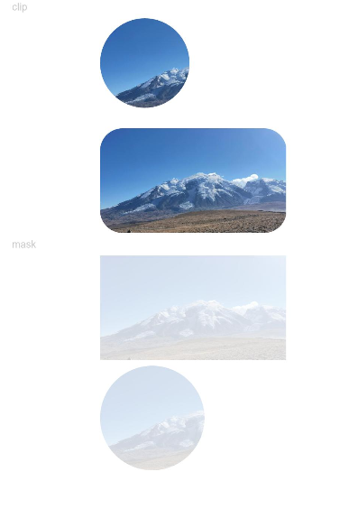

# 形状裁剪

> **说明：**
>
> 从API Version 7开始支持。后续版本如有新增内容，则采用上角标单独标记该内容的起始版本。


## 权限列表

无


## 属性


| 名称 | 参数类型 | 默认值 | 描述 | 
| -------- | -------- | -------- | -------- |
| clip | Shape&nbsp;\|&nbsp;boolean | false | 参数为Shape类型时，按指定的形状对当前组件进行裁剪；参数为boolean类型时，设置是否按照边缘轮廓进行裁剪。 | 
| mask | Shape | - | 在当前组件上加上指定形状的遮罩。 | 


## 示例

```
// xxx.ets
@Entry
@Component
struct ClipAndMaskExample {
  build() {
    Column({ space: 5 }) {
      Text('clip').fontSize(9).width('90%').fontColor(0xCCCCCC)
      // 用一个280px直径的圆对图像进行裁剪
      Image($r('app.media.example'))
        .clip(new Circle({ width: 80, height: 80 }))
        .width('500px').height('280px')

      Row() {
        Image($r('app.media.example')).width('500px').height('280px')
      }
      .clip(true)
      .borderRadius(20)

      Text('mask').fontSize(9).width('90%').fontColor(0xCCCCCC)
      // 给图像添加了一个500px*280px的遮罩
      Image($r('app.media.example'))
        .mask(new Rect({ width: '500px', height: '280px' }).fill(Color.Gray))
        .width('500px').height('280px')

      // 给图像添加了一个280px*280px的圆遮罩
      Image($r('app.media.example'))
        .mask(new Circle({ width: '280px', height: '280px' }).fill(Color.Gray))
        .width('500px').height('281px')
    }
    .width('100%')
    .margin({ top: 5 })
  }
}
```


