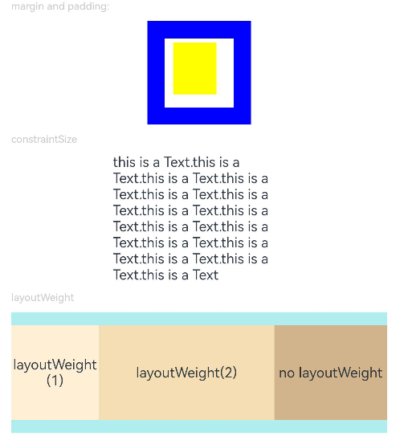

# 尺寸设置

用于设置组件的宽高、边距。

>  **说明：**
>
>  从API Version 7开始支持。后续版本如有新增内容，则采用上角标单独标记该内容的起始版本。


## 属性


| 名称             | 参数说明                                     | 描述                                       |
| -------------- | ---------------------------------------- | ---------------------------------------- |
| width          | [Length](ts-types.md#length)             | 设置组件自身的宽度，缺省时使用元素自身内容需要的宽度。若子组件的宽大于父组件的宽，则会画出父组件的范围。<br/>从API version 9开始，该接口支持在ArkTS卡片中使用。<br />从API version 10开始，该接口支持calc计算特性。 |
| height         | [Length](ts-types.md#length)             | 设置组件自身的高度，缺省时使用元素自身内容需要的高度。若子组件的高大于父组件的高，则会画出父组件的范围。<br/>从API version 9开始，该接口支持在ArkTS卡片中使用。<br />从API version 10开始，该接口支持calc计算特性。 |
| size           | {<br/>width?:&nbsp;[Length](ts-types.md#length),<br/>height?:&nbsp;[Length](ts-types.md#length)<br/>} | 设置高宽尺寸。<br/>从API version 9开始，该接口支持在ArkTS卡片中使用。<br />从API version 10开始，该接口支持calc计算特性。 |
| padding        | [Padding](ts-types.md#padding)&nbsp;\|&nbsp;[Length](ts-types.md#length) | 设置内边距属性。<br/>参数为Length类型时，四个方向内边距同时生效。<br>默认值：0 <br>padding设置百分比时，上下左右内边距均以父容器的width作为基础值。<br/>从API version 9开始，该接口支持在ArkTS卡片中使用。<br />从API version 10开始，该接口支持calc计算特性。 |
| margin         | [Margin](ts-types.md#margin)&nbsp;\|&nbsp;[Length](ts-types.md#length) | 设置外边距属性。<br/>参数为Length类型时，四个方向外边距同时生效。<br>默认值：0 <br>margin设置百分比时，上下左右外边距均以父容器的width作为基础值。在Row、Column、Flex交叉轴上布局时，子组件交叉轴的大小与margin的和为整体。<br/>例如Column容器宽100，其中子组件宽50，margin left为10，right为20，子组件实际的水平方向offset为20。<br/>从API version 9开始，该接口支持在ArkTS卡片中使用。<br />从API version 10开始，该接口支持calc计算特性。 |
| constraintSize | {<br/>minWidth?:&nbsp;[Length](ts-types.md#length),<br/>maxWidth?:&nbsp;[Length](ts-types.md#length),<br/>minHeight?:&nbsp;[Length](ts-types.md#length),<br/>maxHeight?:&nbsp;[Length](ts-types.md#length)<br/>} | 设置约束尺寸，组件布局时，进行尺寸范围限制。constraintSize的优先级高于Width和Height。取值结果参考[constraintSize取值对width/height影响](ts-universal-attributes-size.md#constraintsize取值对widthheight影响)。<br>默认值：<br>{<br/>minWidth:&nbsp;0,<br/>maxWidth:&nbsp;Infinity,<br/>minHeight:&nbsp;0,<br/>maxHeight:&nbsp;Infinity<br/>}<br/>从API version 9开始，该接口支持在ArkTS卡片中使用。<br />从API version 10开始，该接口支持calc计算特性。 |

## constraintSize取值对width/height影响

| 缺省值                                   | 结果                 |
| ---------------------------------------- | ------------------ |
| / | max(minWidth/minHeight, min(maxWidth/maxHeight, width/height))       |
| maxWidth/maxHeight | max(minWidth/minHeight, width/height) |
| minWidth/minHeight | min(maxWidth/maxHeight, width/height)       |
|width/height|maxWidth/maxHeight > minWidth/minHeight时使用组件自身布局逻辑，<br/>结果在maxWidth/maxHeight与minWidth/minHeight之间。<br/> 其他情况结果为max(minWidth/minHeight, maxWidth/maxHeight)。 |
|maxWidth/maxHeight && width/height| minWidth/minHeight |
|minWidth/minHeight && width/height| 使用组件自身布局逻辑，最终结果不超过maxWidth/maxHeight |
|maxWidth/maxHeight && minWidth/minHeight| width/height，根据其他布局属性可能拉伸或者压缩。 |
maxWidth/maxHeight && minWidth/minHeight && width/height|使用父容器传递的布局限制进行布局。|

## 示例

```ts
// xxx.ets
@Entry
@Component
struct SizeExample {
  build() {
    Column({ space: 10 }) {
      Text('margin and padding:').fontSize(12).fontColor(0xCCCCCC).width('90%')
      Row() {
        // 宽度80 ,高度80 ,外边距20(蓝色区域），内边距10（白色区域）
        Row() {
          Row().size({ width: '100%', height: '100%' }).backgroundColor(Color.Yellow)
        }
        .width(80)
        .height(80)
        .padding(10)
        .margin(20)
        .backgroundColor(Color.White)
      }.backgroundColor(Color.Blue)

      Text('constraintSize').fontSize(12).fontColor(0xCCCCCC).width('90%')
      Text('this is a Text.this is a Text.this is a Text.this is a Text.this is a Text.this is a Text.this is a Text.this is a Text.this is a Text.this is a Text.this is a Text.this is a Text.this is a Text.this is a Text.this is a Text')
        .width('90%')
        .constraintSize({ maxWidth: 200 })

      Text('layoutWeight').fontSize(12).fontColor(0xCCCCCC).width('90%')
      // 父容器尺寸确定时，设置了layoutWeight的子元素在主轴布局尺寸按照权重进行分配，忽略本身尺寸设置。
      Row() {
        // 权重1，占主轴剩余空间1/3
        Text('layoutWeight(1)')
          .size({ width: '30%', height: 110 }).backgroundColor(0xFFEFD5).textAlign(TextAlign.Center)
          .layoutWeight(1)
        // 权重2，占主轴剩余空间2/3
        Text('layoutWeight(2)')
          .size({ width: '30%', height: 110 }).backgroundColor(0xF5DEB3).textAlign(TextAlign.Center)
          .layoutWeight(2)
        // 未设置layoutWeight属性，组件按照自身尺寸渲染
        Text('no layoutWeight')
          .size({ width: '30%', height: 110 }).backgroundColor(0xD2B48C).textAlign(TextAlign.Center)
      }.size({ width: '90%', height: 140 }).backgroundColor(0xAFEEEE)
      // calc计算特性
      Text('calc:').fontSize(12).fontColor(0xCCCCCC).width('90%')
      Text('calc test').fontSize(50).fontWeight(FontWeight.Bold).backgroundColor(0xFFFAF0).textAlign(TextAlign.Center)
        .margin('calc(25vp*2)')
        .size({width:'calc(90%)', height:'calc(50vp + 10%)'})
    }.width('100%').margin({ top: 5 })
  }
}
```


