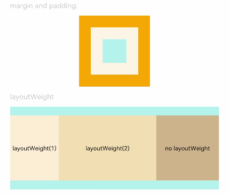

# 尺寸设置

用于设置组件的宽高、边距等显示尺寸进行设置。

>  **说明：**
> 从API Version 7开始支持。后续版本如有新增内容，则采用上角标单独标记该内容的起始版本。


## 权限列表

无


## 属性


| 名称 | 参数说明 | 默认值 | 描述 |
| -------- | -------- | -------- | -------- |
| width | Length | - | 设置组件自身的宽度，缺省时使用元素自身内容需要的宽度。 |
| height | Length | - | 设置组件自身的高度，缺省时使用元素自身内容需要的高度。 |
| size | {<br/>width?:&nbsp;Length,<br/>height?:&nbsp;Length<br/>} | - | 设置高宽尺寸。 |
| padding | {<br/>top?:&nbsp;Length,<br/>right?:&nbsp;Length,<br/>bottom?:&nbsp;Length,<br/>left?:&nbsp;Length<br/>}&nbsp;\|&nbsp;Length | 0 | 设置内边距属性。<br/>参数为Length类型时，四个方向内边距同时生效。 |
| margin | {<br/>top?:&nbsp;Length,<br/>right?:&nbsp;Length,<br/>bottom?:&nbsp;Length,<br/>left?:&nbsp;Length<br/>}<br/>\|&nbsp;Length | 0 | 设置外边距属性。<br/>参数为Length类型时，四个方向外边距同时生效。 |
| constraintSize | {<br/>minWidth?:&nbsp;Length,<br/>maxWidth?:&nbsp;Length,<br/>minHeight?:&nbsp;Length,<br/>maxHeight?:&nbsp;Length<br/>} | {<br/>minWidth:&nbsp;0,<br/>maxWidth:&nbsp;Infinity,<br/>minHeight:&nbsp;0,<br/>maxHeight:&nbsp;Infinity<br/>} | 设置约束尺寸，组件布局时，进行尺寸范围限制。 |
| layoutWeight | number | 0 | 容器尺寸确定时，元素与兄弟节点主轴布局尺寸按照权重进行分配，忽略本身尺寸设置。<br/>>&nbsp;&nbsp;**说明：**<br/>>&nbsp;仅在Row/Column/Flex布局中生效。 |


## 示例

```ts
// xxx.ets
@Entry
@Component
struct SizeExample {
  build() {
    Column({ space: 10 }) {
      Text('margin and padding:').fontSize(12).fontColor(0xCCCCCC).width('90%')
      // 宽度80 ,高度80 ,内外边距20
      Row() {
        Row() {
          Row().size({ width: '100%', height: '100%' }).backgroundColor(0xAFEEEE)
        }.width(80).height(80).padding(20).margin(20).backgroundColor(0xFDF5E6)
      }.backgroundColor(0xFFA500)

      Text('layoutWeight').fontSize(12).fontColor(0xCCCCCC).width('90%')
      // 容器尺寸确定时，元素与兄弟节点主轴布局尺寸按照权重进行分配，忽略本身尺寸设置。
      Row() {
        // 权重1
        Text('layoutWeight(1)')
          .size({ width: '30%', height: 110 }).backgroundColor(0xFFEFD5).textAlign(TextAlign.Center)
          .layoutWeight(1)
        // 权重0
        Text('layoutWeight(2)')
          .size({ width: '30%', height: 110 }).backgroundColor(0xF5DEB3).textAlign(TextAlign.Center)
          .layoutWeight(2)
        // 权重默认0
        Text('no layoutWeight')
          .size({ width: '30%', height: 110 }).backgroundColor(0xD2B48C).textAlign(TextAlign.Center)
      }.size({ width: '90%', height: 140 }).backgroundColor(0xAFEEEE)
    }.width('100%').margin({ top: 5 })
  }}
```


