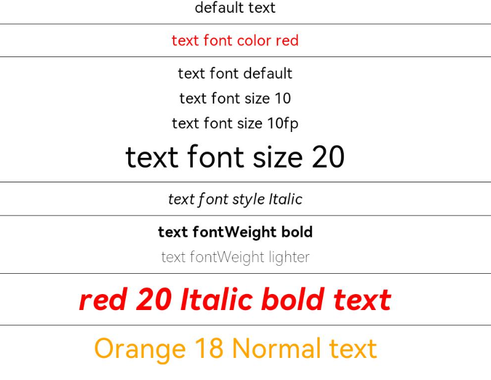

# 文本通用 

文本通用属性目前只针对包含文本元素的组件，设置文本样式。

>  **说明：**
>
>  从API Version 7开始支持。后续版本如有新增内容，则采用上角标单独标记该内容的起始版本。


## 属性


| 名称         | 参数类型                                     | 描述                                       |
| ---------- | ---------------------------------------- | ---------------------------------------- |
| fontColor  | [ResourceColor](ts-types.md#resourcecolor) | 设置字体颜色。<br/>从API version 9开始，该接口支持在ArkTS卡片中使用。 |
| fontSize   | [Length](ts-types.md#length)             | 设置字体大小，Length为number类型时，使用fp单位。字体默认大小16。不支持设置百分比字符串。<br/>从API version 9开始，该接口支持在ArkTS卡片中使用。 |
| fontStyle  | [FontStyle](ts-appendix-enums.md#fontstyle) | 设置字体样式。<br>默认值：FontStyle.Normal<br/>从API version 9开始，该接口支持在ArkTS卡片中使用。 |
| fontWeight | number&nbsp;\|&nbsp;[FontWeight](ts-appendix-enums.md#fontweight)&nbsp;\|&nbsp;string | 设置文本的字体粗细，number类型取值[100,&nbsp;900]，取值间隔为100，默认为400，取值越大，字体越粗。string类型仅支持number类型取值的字符串形式，例如"400"，以及"bold"、"bolder"、"lighter"、"regular"、"medium"，分别对应FontWeight中相应的枚举值。<br/>默认值：FontWeight.Normal<br/>从API version 9开始，该接口支持在ArkTS卡片中使用。 |
| fontFamily | string&nbsp;\|&nbsp;[Resource](ts-types.md#resource) | 设置字体列表。默认字体'HarmonyOS Sans'，且当前只支持这种字体。<br/>从API version 9开始，该接口支持在ArkTS卡片中使用。 |
| lineHeight | string&nbsp;\|&nbsp;number&nbsp;\|&nbsp;[Resource](ts-types.md#resource) | 设置文本的文本行高，设置值不大于0时，不限制文本行高，自适应字体大小，Length为number类型时单位为fp。<br/>从API version 9开始，该接口支持在ArkTS卡片中使用。 |
| decoration | {<br/>type:&nbsp;[TextDecorationType](ts-appendix-enums.md#textdecorationtype),<br/>color?:&nbsp;[ResourceColor](ts-types.md#resourcecolor)<br/>} | 设置文本装饰线样式及其颜色。<br />默认值：{<br/>type:&nbsp;TextDecorationType.None,<br/>color：Color.Black<br/>}<br/>从API version 9开始，该接口支持在ArkTS卡片中使用。 |


## 示例

```ts
// xxx.ets
@Entry
@Component
struct TextStyleExample {
  build() {
    Column({ space: 5 }) {
      Text('default text')
      
      Text('text font color red').fontColor(Color.Red)
      
      Text('text font default')
      Text('text font size 10').fontSize(10)
      Text('text font size 10fp').fontSize('10fp')
      Text('text font size 20').fontSize(20)
      
      Text('text font style Italic').fontStyle(FontStyle.Italic)
      
      Text('text fontWeight bold').fontWeight(700)
      Text('text fontWeight lighter').fontWeight(FontWeight.Lighter)
      
      Text('red 20 Italic bold text')
        .fontColor(Color.Red)
        .fontSize(20)
        .fontStyle(FontStyle.Italic)
        .fontWeight(FontWeight.Bold)
      
      Text('Orange 18 Normal text')
        .fontColor(Color.Orange)
        .fontSize(18)
        .fontStyle(FontStyle.Normal)
    }.width('100%')
  }
}
```


