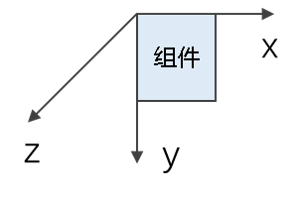

# 图形变换

用于对组件进行旋转、平移、缩放、矩阵变换等操作。

> **说明：**
>
> 从API Version 7开始支持。后续版本如有新增内容，则采用上角标单独标记该内容的起始版本。

## 属性


| 名称        | 参数类型                                     | 描述                                       |
| --------- | ---------------------------------------- | ---------------------------------------- |
| rotate    | {<br/>x?:&nbsp;number,<br/>y?:&nbsp;number,<br/>z?:&nbsp;number,<br/>angle:&nbsp;number&nbsp;\|&nbsp;string,<br/>centerX?:&nbsp;number \| string,<br/>centerY?:&nbsp;number \| string<br/>centerZ<sup>10+</sup>?:&nbsp;number&nbsp;<br/>perspective<sup>10+</sup>?:&nbsp;number<br/>} | 可使组件在以组件左上角为坐标原点的坐标系中进行旋转（坐标系如下图所示）。其中，(x,&nbsp;y,&nbsp;z）指定一个矢量，作为旋转轴。<br>- angle：旋转角度。取值为正时相对于旋转轴方向顺时针转动，取值为负时相对于旋转轴方向逆时针转动。取值可为string类型，如'90deg'。<br>- centerX和centerY用于指定旋转的中心点。<br>- centerZ指z轴锚点，即3D旋转中心点的z轴分量。<br/>- perspective指视距，即视点到z=0平面的距离。<br>旋转轴和旋转中心点都基于坐标系设定，组件发生位移时，坐标系不会随之移动。<br>默认值:<br>{<br/>x:&nbsp;0,<br/>y:&nbsp;0,<br/>z:&nbsp;0,<br/>centerX:&nbsp;'50%',<br/>centerY:&nbsp;'50%'<br/>centerZ:&nbsp;0,<br/>perspective:&nbsp;0<br/>}<br/><br>从API version 9开始，该接口支持在ArkTS卡片中使用。<br>centerZ、perspective从API version 10开始支持在ArkTS卡片中使用。 |
| translate | {<br/>x?:&nbsp;number \| string,<br/>y?:&nbsp;number \| string,<br/>z?&nbsp;:&nbsp;number \| string<br/>} | 可使组件在以组件左上角为坐标原点的坐标系中进行移动（坐标系如下图所示）。其中，x，y，z的值分别表示在对应轴移动的距离，值为正时表示向对应轴的正向移动，值为负时表示向对应轴的反向移动。移动距离支持数字和字符串（比如'10px'，‘10%’）两种类型。<br>默认值:<br>{<br/>x:&nbsp;0,<br/>y:&nbsp;0,<br/>z:&nbsp;0<br/>}<br/><br>从API version 9开始，该接口支持在ArkTS卡片中使用。 |
| scale     | {<br/>x?:&nbsp;number,<br/>y?:&nbsp;number,<br/>z?:&nbsp;number,<br/>centerX?:&nbsp;number \| string,<br/>centerY?:&nbsp;number \| string<br/>} | 可以分别设置X轴、Y轴、Z轴的缩放比例，默认值为1，同时可以通过centerX和centerY设置缩放的中心点。<br>默认值:<br>{<br/>x:&nbsp;1,<br/>y:&nbsp;1,<br/>z:&nbsp;1,<br/>centerX:'50%',<br/>centerY:'50%'<br/>}<br/>从API version 9开始，该接口支持在ArkTS卡片中使用。 |
| transform | [Matrix4Transit](../apis/js-apis-matrix4.md) | 设置当前组件的变换矩阵。                             |

> **说明：**
>
> 当组件同时设置了rotate和scale属性时，centerX和centerY的取值会发生冲突，此时centerX和centerY的值以后设定属性的值为准。

## 示例

```ts
// xxx.ets
import matrix4 from '@ohos.matrix4'

@Entry
@Component
struct TransformExample {
  build() {
    Column() {
      Text('rotate').width('90%').fontColor(0xCCCCCC).padding(15).fontSize(14)
      Row()
        .rotate({
          x: 0,
          y: 0,
          z: 1,
          centerX: '50%',
          centerY: '50%',
          angle: 300
        }) // 组件以矢量(0,0,1)为旋转轴，绕中心点顺时针旋转300度
        .width(100).height(100).backgroundColor(0xAFEEEE)

      Text('translate').width('90%').fontColor(0xCCCCCC).padding(10).fontSize(14)
      Row()
        .translate({ x: 100, y: 10 }) // x轴方向平移100，y轴方向平移10
        .width(100).height(100).backgroundColor(0xAFEEEE).margin({ bottom: 10 })

      Text('scale').width('90%').fontColor(0xCCCCCC).padding(15).fontSize(14)
      Row()
        .scale({ x: 2, y: 0.5 }) // 高度缩小一倍，宽度放大一倍，z轴在2D下无效果
        .width(100).height(100).backgroundColor(0xAFEEEE)

      Text('Matrix4').width('90%').fontColor(0xCCCCCC).padding(15).fontSize(14)
      Row()
        .width(100).height(100).backgroundColor(0xAFEEEE)
        .transform(matrix4.identity().translate({ x: 50, y: 50 }).scale({ x: 1.5, y: 1 }).rotate({
          x: 0,
          y: 0,
          z: 1,
          angle: 60
        }))
    }.width('100%').margin({ top: 5 })
  }
}
```

