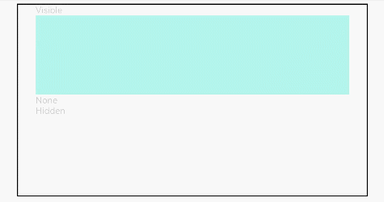

# 显隐控制<a name="ZH-CN_TOPIC_0000001192755134"></a>

> **说明：** 
>从API Version 7开始支持。后续版本如有新增内容，则采用上角标单独标记该内容的起始版本。

## 权限列表<a name="section781125411508"></a>

无

## 属性<a name="section6820191711316"></a>

<table><thead align="left"><tr><th class="cellrowborder" valign="top" width="12.088791120887912%" id="mcps1.1.5.1.1"><p>名称</p>
</th>
<th class="cellrowborder" valign="top" width="13.18868113188681%" id="mcps1.1.5.1.2"><p>参数类型</p>
</th>
<th class="cellrowborder" valign="top" width="10.988901109889012%" id="mcps1.1.5.1.3"><p>默认值</p>
</th>
<th class="cellrowborder" valign="top" width="63.73362663733626%" id="mcps1.1.5.1.4"><p>描述</p>
</th>
</tr>
</thead>
<tbody><tr><td class="cellrowborder" valign="top" width="12.088791120887912%" headers="mcps1.1.5.1.1 "><p>visibility</p>
</td>
<td class="cellrowborder" valign="top" width="13.18868113188681%" headers="mcps1.1.5.1.2 "><p><a href="#li1521155325910">Visibility</a></p>
</td>
<td class="cellrowborder" valign="top" width="10.988901109889012%" headers="mcps1.1.5.1.3 "><p>Visible</p>
</td>
<td class="cellrowborder" valign="top" width="63.73362663733626%" headers="mcps1.1.5.1.4 "><p>控制当前组件显示或隐藏。</p>
</td>
</tr>
</tbody>
</table>

-   <a name="li1521155325910"></a>Visibility枚举说明

    <table><thead align="left"><tr><th class="cellrowborder" valign="top" width="25.2%" id="mcps1.1.3.1.1"><p>名称</p>
    </th>
    <th class="cellrowborder" valign="top" width="74.8%" id="mcps1.1.3.1.2"><p>描述</p>
    </th>
    </tr>
    </thead>
    <tbody><tr><td class="cellrowborder" valign="top" width="25.2%" headers="mcps1.1.3.1.1 "><p>Hidden</p>
    </td>
    <td class="cellrowborder" valign="top" width="74.8%" headers="mcps1.1.3.1.2 "><p>隐藏，但参与布局进行占位。</p>
    </td>
    </tr>
    <tr><td class="cellrowborder" valign="top" width="25.2%" headers="mcps1.1.3.1.1 "><p>Visible</p>
    </td>
    <td class="cellrowborder" valign="top" width="74.8%" headers="mcps1.1.3.1.2 "><p>显示。</p>
    </td>
    </tr>
    <tr><td class="cellrowborder" valign="top" width="25.2%" headers="mcps1.1.3.1.1 "><p>None</p>
    </td>
    <td class="cellrowborder" valign="top" width="74.8%" headers="mcps1.1.3.1.2 "><p>隐藏，但不参与布局，不进行占位。</p>
    </td>
    </tr>
    </tbody>
    </table>


## 示例<a name="section4278134412416"></a>

```
@Entry
@Component
struct VisibilityExample {
  build() {
    Column() {
      Column() {
        Text('Visible').fontSize(9).width('90%').fontColor(0xCCCCCC)
        Row().visibility(Visibility.Visible).width('90%').height(80).backgroundColor(0xAFEEEE)

        Text('None').fontSize(9).width('90%').fontColor(0xCCCCCC)
        // 隐藏不参与占位
        Row().visibility(Visibility.None).width('90%').height(80).backgroundColor(0xAFEEEE)

        Text('Hidden').fontSize(9).width('90%').fontColor(0xCCCCCC)
        // 隐藏参与占位
        Row().visibility(Visibility.Hidden).width('90%').height(80).backgroundColor(0xAFEEEE)
      }.width('90%').border({ width: 1 })
    }.width('100%').margin({ top: 5 })
  }
}
```



