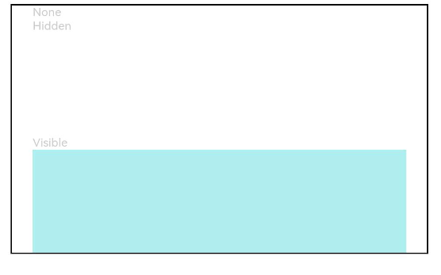

# 显隐控制

控制组件是否可见。

>  **说明：**
>
> 从API Version 7开始支持。后续版本如有新增内容，则采用上角标单独标记该内容的起始版本。

## 属性

| 名称         | 参数类型                        | 描述                                         |
| ---------- | ---------------------------- | ------------------------------------------ |
| visibility | [Visibility](ts-appendix-enums.md#visibility) | 控制当前组件显示或隐藏。注意，即使组件处于隐藏状态，在页面刷新时仍存在重新创建过程，因此当对性能有严格要求时建议使用[条件渲染](../../quick-start/arkts-rendering-control-ifelse.md)代替。<br>默认值：Visibility.Visible<br/>从API version 9开始，该接口支持在ArkTS卡片中使用。 |


## 示例

```ts
// xxx.ets
@Entry
@Component
struct VisibilityExample {
  build() {
    Column() {
      Column() {
        // 隐藏不参与占位
        Text('None').fontSize(9).width('90%').fontColor(0xCCCCCC)
        Row().visibility(Visibility.None).width('90%').height(80).backgroundColor(0xAFEEEE)

        // 隐藏参与占位
        Text('Hidden').fontSize(9).width('90%').fontColor(0xCCCCCC)
        Row().visibility(Visibility.Hidden).width('90%').height(80).backgroundColor(0xAFEEEE)

        // 正常显示，组件默认的显示模式
        Text('Visible').fontSize(9).width('90%').fontColor(0xCCCCCC)
        Row().visibility(Visibility.Visible).width('90%').height(80).backgroundColor(0xAFEEEE)
      }.width('90%').border({ width: 1 })
    }.width('100%').margin({ top: 5 })
  }
}
```


