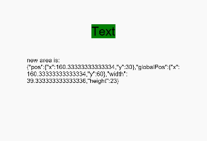

# 组件区域变化事件

组件区域变化事件指组件显示的尺寸、位置等发生变化时触发的事件。

>  **说明：**
>
>  从API Version 8开始支持。后续版本如有新增内容，则采用上角标单独标记该内容的起始版本。


## 事件

| 名称                                       | 支持冒泡 | 功能描述                                     |
| ---------------------------------------- | ---- | ---------------------------------------- |
| onAreaChange(event:&nbsp;(oldValue:&nbsp;[Area](ts-types.md#area8),&nbsp;newValue:&nbsp;[Area](ts-types.md#area8))&nbsp;=&gt;&nbsp;void) | 否    | 组件区域变化时触发该回调。仅会响应由布局变化所导致的组件大小、位置发生变化时的回调。由绘制变化所导致的渲染属性变化不会响应回调，如translate、offset。 |


## 示例

```ts
// xxx.ets
@Entry
@Component
struct AreaExample {
  @State value: string = 'Text'
  @State sizeValue: string = ''

  build() {
    Column() {
      Text(this.value)
        .backgroundColor(Color.Green).margin(30).fontSize(20)
        .onClick(() => {
          this.value = this.value + 'Text'
        })
        .onAreaChange((oldValue: Area, newValue: Area) => {
          console.info(`Ace: on area change, oldValue is ${JSON.stringify(oldValue)} value is ${JSON.stringify(newValue)}`)
          this.sizeValue = JSON.stringify(newValue)
        })
      Text('new area is: \n' + this.sizeValue).margin({ right: 30, left: 30 })
    }
    .width('100%').height('100%').margin({ top: 30 })
  }
}
```

