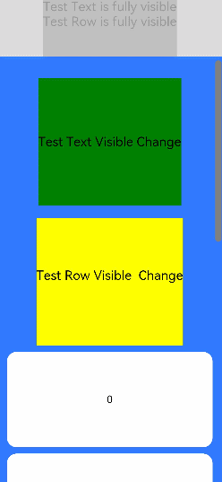

# 组件可见区域变化事件

组件可见区域变化事件是组件在屏幕中的显示区域面积变化时触发的事件，提供了判断组件是否完全或部分显示在屏幕中的能力，适用于广告曝光埋点之类的场景。

> **说明：**
>
>  从API Version 9开始支持。后续版本如有新增内容，则采用上角标单独标记该内容的起始版本。


## 事件

| 名称                                       | 功能描述                                     |
| ---------------------------------------- | ---------------------------------------- |
| onVisibleAreaChange(ratios: Array\<number>, event: (isVisible: boolean, currentRatio: number) => void) | 组件可见区域变化时触发该回调。<br/>-ratios：阈值数组。其中，每个阈值代表组件可见面积（即组件在屏幕显示区的面积）与组件自身面积的比值。当组件可见面积与自身面积的比值大于或小于阈值时，均会触发该回调。每个阈值的取值范围为[0.0, 1.0]，如果开发者设置的阈值超出该范围，则会实际取值0.0或1.0.<br/>-isVisible：表示组件的可见面积与自身面积的比值是否大于阈值，true表示大于，false表示小于。<br/>-currentRatio：触发回调时，组件可见面积与自身面积的比值。 |


## 示例

```ts
// xxx.ets
@Entry
@Component
struct ScrollExample {
  scroller: Scroller = new Scroller()
  private arr: number[] = [0, 1, 2, 3, 4, 5, 6, 7, 8, 9]
  @State testTextStr: string = 'test'
  @State testRowStr: string = 'test'

  build() {
    Column() {
      Column() {
        Text(this.testTextStr)
          .fontSize(20)

        Text(this.testRowStr)
          .fontSize(20)
      }
      .height(100)
      .backgroundColor(Color.Gray)
      .opacity(0.3)

      Scroll(this.scroller) {
        Column() {
          Text("Test Text Visible Change")
            .fontSize(20)
            .height(200)
            .margin({ top: 50, bottom: 20 })
            .backgroundColor(Color.Green)
              // 通过设置ratios为[0.0, 1.0]，实现当组件完全显示或完全消失在屏幕中时触发回调
            .onVisibleAreaChange([0.0, 1.0], (isVisible: boolean, currentRatio: number) => {
              console.info('Test Text isVisible: ' + isVisible + ', currentRatio:' + currentRatio)
              if (isVisible && currentRatio >= 1.0) {
                console.info('Test Text is fully visible. currentRatio:' + currentRatio)
                this.testTextStr = 'Test Text is fully visible'
              }

              if (!isVisible && currentRatio <= 0.0) {
                console.info('Test Text is completely invisible.')
                this.testTextStr = 'Test Text is completely invisible'
              }
            })

          Row() {
            Text('Test Row Visible  Change')
              .fontSize(20)
              .margin({ bottom: 20 })

          }
          .height(200)
          .backgroundColor(Color.Yellow)
          .onVisibleAreaChange([0.0, 1.0], (isVisible: boolean, currentRatio: number) => {
            console.info('Test Row isVisible:' + isVisible + ', currentRatio:' + currentRatio)
            if (isVisible && currentRatio >= 1.0) {
              console.info('Test Row is fully visible.')
              this.testRowStr = 'Test Row is fully visible'
            }

            if (!isVisible && currentRatio <= 0.0) {
              console.info('Test Row is is completely invisible.')
              this.testRowStr = 'Test Row is is completely invisible'
            }
          })

          ForEach(this.arr, (item) => {
            Text(item.toString())
              .width('90%')
              .height(150)
              .backgroundColor(0xFFFFFF)
              .borderRadius(15)
              .fontSize(16)
              .textAlign(TextAlign.Center)
              .margin({ top: 10 })
          }, item => item)

        }.width('100%')
      }
      .backgroundColor(0x317aff)
      .scrollable(ScrollDirection.Vertical)
      .scrollBar(BarState.On)
      .scrollBarColor(Color.Gray)
      .scrollBarWidth(10)
      .onScroll((xOffset: number, yOffset: number) => {
        console.info(xOffset + ' ' + yOffset)
      })
      .onScrollEdge((side: Edge) => {
        console.info('To the edge')
      })
      .onScrollEnd(() => {
        console.info('Scroll Stop')
      })

    }.width('100%').height('100%').backgroundColor(0xDCDCDC)
  }
}
```


