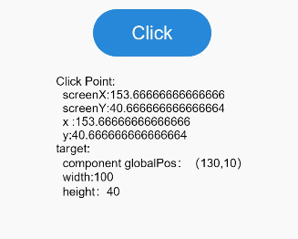

# 点击事件<a name="ZH-CN_TOPIC_0000001192915110"></a>

> **说明：** 
>从API Version 7开始支持。后续版本如有新增内容，则采用上角标单独标记该内容的起始版本。

## 权限列表<a name="section781125411508"></a>

无

## 事件<a name="section1823713918564"></a>

<table><thead align="left"><tr><th class="cellrowborder" colspan="2" valign="top" id="mcps1.1.5.1.1"><p>名称</p>
</th>
<th class="cellrowborder" valign="top" id="mcps1.1.5.1.2"><p>支持冒泡</p>
</th>
<th class="cellrowborder" valign="top" id="mcps1.1.5.1.3"><p>功能描述</p>
</th>
</tr>
</thead>
<tbody><tr><td class="cellrowborder" colspan="2" valign="top" headers="mcps1.1.5.1.1 "><p>onClick(callback: (event?: ClickEvent) =&gt; void)</p>
</td>
<td class="cellrowborder" valign="top" headers="mcps1.1.5.1.2 "><p>否</p>
</td>
<td class="cellrowborder" valign="top" headers="mcps1.1.5.1.3 "><p>点击动作触发该方法调用，event参数见<a href="#li155675712535">ClickEvent</a>介绍。</p>
</td>
</tr>
</tbody>
</table>

-   <a name="li155675712535"></a>ClickEvent对象说明

    <table><thead align="left"><tr><th class="cellrowborder" valign="top" width="33.33333333333333%" id="mcps1.1.4.1.1"><p>属性名称</p>
    </th>
    <th class="cellrowborder" valign="top" width="33.33333333333333%" id="mcps1.1.4.1.2"><p>类型</p>
    </th>
    <th class="cellrowborder" valign="top" width="33.33333333333333%" id="mcps1.1.4.1.3"><p>描述</p>
    </th>
    </tr>
    </thead>
    <tbody><tr><td class="cellrowborder" valign="top" width="33.33333333333333%" headers="mcps1.1.4.1.1 "><p>screenX</p>
    </td>
    <td class="cellrowborder" valign="top" width="33.33333333333333%" headers="mcps1.1.4.1.2 "><p>number</p>
    </td>
    <td class="cellrowborder" valign="top" width="33.33333333333333%" headers="mcps1.1.4.1.3 "><p>点击点相对于设备屏幕左边沿的X坐标。</p>
    </td>
    </tr>
    <tr><td class="cellrowborder" valign="top" width="33.33333333333333%" headers="mcps1.1.4.1.1 "><p>screenY</p>
    </td>
    <td class="cellrowborder" valign="top" width="33.33333333333333%" headers="mcps1.1.4.1.2 "><p>number</p>
    </td>
    <td class="cellrowborder" valign="top" width="33.33333333333333%" headers="mcps1.1.4.1.3 "><p>点击点相对于设备屏幕上边沿的Y坐标。</p>
    </td>
    </tr>
    <tr><td class="cellrowborder" valign="top" width="33.33333333333333%" headers="mcps1.1.4.1.1 "><p>x</p>
    </td>
    <td class="cellrowborder" valign="top" width="33.33333333333333%" headers="mcps1.1.4.1.2 "><p>number</p>
    </td>
    <td class="cellrowborder" valign="top" width="33.33333333333333%" headers="mcps1.1.4.1.3 "><p>点击点相对于被点击元素左边沿的X坐标。</p>
    </td>
    </tr>
    <tr><td class="cellrowborder" valign="top" width="33.33333333333333%" headers="mcps1.1.4.1.1 "><p>y</p>
    </td>
    <td class="cellrowborder" valign="top" width="33.33333333333333%" headers="mcps1.1.4.1.2 "><p>number</p>
    </td>
    <td class="cellrowborder" valign="top" width="33.33333333333333%" headers="mcps1.1.4.1.3 "><p>点击点相对于被点击元素上边沿的Y坐标。</p>
    </td>
    </tr>
    <tr><td class="cellrowborder" valign="top" width="33.33333333333333%" headers="mcps1.1.4.1.1 "><p>target<sup><span>8+</span></sup></p>
    </td>
    <td class="cellrowborder" valign="top" width="33.33333333333333%" headers="mcps1.1.4.1.2 "><p><a href="#li552912253714">EventTarget</a></p>
    </td>
    <td class="cellrowborder" valign="top" width="33.33333333333333%" headers="mcps1.1.4.1.3 "><p>被点击元素对象。</p>
    </td>
    </tr>
    <tr><td class="cellrowborder" valign="top" width="33.33333333333333%" headers="mcps1.1.4.1.1 "><p>timestamp</p>
    </td>
    <td class="cellrowborder" valign="top" width="33.33333333333333%" headers="mcps1.1.4.1.2 "><p>number</p>
    </td>
    <td class="cellrowborder" valign="top" width="33.33333333333333%" headers="mcps1.1.4.1.3 "><p>事件时间戳。</p>
    </td>
    </tr>
    </tbody>
    </table>

-   <a name="li552912253714"></a>EventTarget对象说明<sup>8+</sup>

    <table><thead align="left"><tr><th class="cellrowborder" valign="top" width="33.33333333333333%" id="mcps1.1.4.1.1"><p>名称</p>
    </th>
    <th class="cellrowborder" valign="top" width="33.33333333333333%" id="mcps1.1.4.1.2"><p>参数类型</p>
    </th>
    <th class="cellrowborder" valign="top" width="33.33333333333333%" id="mcps1.1.4.1.3"><p>描述</p>
    </th>
    </tr>
    </thead>
    <tbody><tr><td class="cellrowborder" valign="top" width="33.33333333333333%" headers="mcps1.1.4.1.1 "><p>area</p>
    </td>
    <td class="cellrowborder" valign="top" width="33.33333333333333%" headers="mcps1.1.4.1.2 "><p><a href="#li3196948121214">Area</a></p>
    </td>
    <td class="cellrowborder" valign="top" width="33.33333333333333%" headers="mcps1.1.4.1.3 "><p>目标元素的区域信息。</p>
    </td>
    </tr>
    </tbody>
    </table>

-   <a name="li3196948121214"></a>Area对象说明<sup>8+</sup>

    <table><thead align="left"><tr><th class="cellrowborder" valign="top" width="33.33333333333333%" id="mcps1.1.4.1.1"><p>属性名称</p>
    </th>
    <th class="cellrowborder" valign="top" width="33.33333333333333%" id="mcps1.1.4.1.2"><p>类型</p>
    </th>
    <th class="cellrowborder" valign="top" width="33.33333333333333%" id="mcps1.1.4.1.3"><p>描述</p>
    </th>
    </tr>
    </thead>
    <tbody><tr><td class="cellrowborder" valign="top" width="33.33333333333333%" headers="mcps1.1.4.1.1 "><p>width</p>
    </td>
    <td class="cellrowborder" valign="top" width="33.33333333333333%" headers="mcps1.1.4.1.2 "><p>Length</p>
    </td>
    <td class="cellrowborder" valign="top" width="33.33333333333333%" headers="mcps1.1.4.1.3 "><p>目标元素的宽度。</p>
    </td>
    </tr>
    <tr><td class="cellrowborder" valign="top" width="33.33333333333333%" headers="mcps1.1.4.1.1 "><p>height</p>
    </td>
    <td class="cellrowborder" valign="top" width="33.33333333333333%" headers="mcps1.1.4.1.2 "><p>Length</p>
    </td>
    <td class="cellrowborder" valign="top" width="33.33333333333333%" headers="mcps1.1.4.1.3 "><p>目标元素的高度。</p>
    </td>
    </tr>
    <tr><td class="cellrowborder" valign="top" width="33.33333333333333%" headers="mcps1.1.4.1.1 "><p>pos</p>
    </td>
    <td class="cellrowborder" valign="top" width="33.33333333333333%" headers="mcps1.1.4.1.2 "><p><a href="#li7111244165">Position</a></p>
    </td>
    <td class="cellrowborder" valign="top" width="33.33333333333333%" headers="mcps1.1.4.1.3 "><p>目标元素左上角相对父元素左上角的位置。</p>
    </td>
    </tr>
    <tr><td class="cellrowborder" valign="top" width="33.33333333333333%" headers="mcps1.1.4.1.1 "><p>globalPos</p>
    </td>
    <td class="cellrowborder" valign="top" width="33.33333333333333%" headers="mcps1.1.4.1.2 "><p><a href="#li7111244165">Position</a></p>
    </td>
    <td class="cellrowborder" valign="top" width="33.33333333333333%" headers="mcps1.1.4.1.3 "><p>目标元素左上角相对页面左上角的位置。</p>
    </td>
    </tr>
    </tbody>
    </table>

-   <a name="li7111244165"></a>Position对象说明<sup>8+</sup>

    <table><thead align="left"><tr><th class="cellrowborder" valign="top" width="33.33333333333333%" id="mcps1.1.4.1.1"><p>属性名称</p>
    </th>
    <th class="cellrowborder" valign="top" width="33.33333333333333%" id="mcps1.1.4.1.2"><p>参数类型</p>
    </th>
    <th class="cellrowborder" valign="top" width="33.33333333333333%" id="mcps1.1.4.1.3"><p>描述</p>
    </th>
    </tr>
    </thead>
    <tbody><tr><td class="cellrowborder" valign="top" width="33.33333333333333%" headers="mcps1.1.4.1.1 "><p>x</p>
    </td>
    <td class="cellrowborder" valign="top" width="33.33333333333333%" headers="mcps1.1.4.1.2 "><p>Length</p>
    </td>
    <td class="cellrowborder" valign="top" width="33.33333333333333%" headers="mcps1.1.4.1.3 "><p>x轴坐标。</p>
    </td>
    </tr>
    <tr><td class="cellrowborder" valign="top" width="33.33333333333333%" headers="mcps1.1.4.1.1 "><p>y</p>
    </td>
    <td class="cellrowborder" valign="top" width="33.33333333333333%" headers="mcps1.1.4.1.2 "><p>Length</p>
    </td>
    <td class="cellrowborder" valign="top" width="33.33333333333333%" headers="mcps1.1.4.1.3 "><p>y轴坐标。</p>
    </td>
    </tr>
    </tbody>
    </table>


## 示例<a name="section16900453182718"></a>

```
@Entry
@Component
struct ClickExample {
  @State text: string = ''

  build() {
    Column() {
      Button('Click').backgroundColor(0x2788D9).width(100).height(40)
        .onClick((event: ClickEvent) => {
          console.info(this.text = 'Click Point:' + '\n  screenX:' + event.screenX + '\n  screenY:' + event.screenY
          + '\n  x :' + event.x + '\n  y:' + event.y + '\ntarget:' + '\n  component globalPos：（'
          + event.target.area.globalPos.x + ',' + event.target.area.globalPos.y + '）\n  width:'
          + event.target.area.width + '\n  height：' + event.target.area.height)
        })
      Text(this.text).padding(15)
    }.height(350).width('100%').padding(10)
  }
}
```



