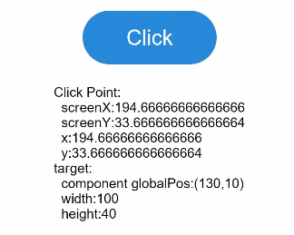

# 点击事件

组件被点击时触发的事件。

>  **说明：**
>
>  从API Version 7开始支持。后续版本如有新增内容，则采用上角标单独标记该内容的起始版本。


## 事件

| 名称                                       | 支持冒泡 | 功能描述                              |
| ---------------------------------------- | ---- | --------------------------------- |
| onClick(event:&nbsp;(event?:&nbsp;ClickEvent)&nbsp;=&gt;&nbsp;void) | 否    | 点击动作触发该回调，event返回值见ClickEvent对象说明。<br/>从API version 9开始，该接口支持在ArkTS卡片中使用。 |

## ClickEvent对象说明

从API version 9开始，该接口支持在ArkTS卡片中使用。

| 名称            | 类型                                 | 描述                                                     |
| ------------------- | ------------------------------------ | -------------------------------------------------------- |
| screenX             | number                               | 点击位置相对于应用窗口左上角的X坐标。                      |
| screenY             | number                               | 点击位置相对于应用窗口左上角的Y坐标。                      |
| x                   | number                               | 点击位置相对于被点击元素左上角的X坐标。                    |
| y                   | number                               | 点击位置相对于被点击元素左上角的Y坐标。                    |
| timestamp<sup>8+</sup> | number | 事件时间戳。触发事件时距离系统启动的时间间隔，单位纳秒。 |
| target<sup>8+</sup> | [EventTarget](#eventtarget8对象说明) | 触发事件的元素对象显示区域。 |
| source<sup>8+</sup> | [SourceType](ts-gesture-settings.md#sourcetype枚举说明) | 事件输入设备。 |

## EventTarget<sup>8+</sup>对象说明

从API version 9开始，该接口支持在ArkTS卡片中使用。

| 名称   | 参数类型                      | 描述         |
| ---- | ------------------------- | ---------- |
| area | [Area](ts-types.md#area8) | 目标元素的区域信息。 |


## 示例

```ts
// xxx.ets
@Entry
@Component
struct ClickExample {
  @State text: string = ''

  build() {
    Column() {
      Row({ space: 20 }) {
        Button('Click').width(100).height(40)
          .onClick((event: ClickEvent) => {
            this.text = 'Click Point:' + '\n  screenX:' + event.screenX + '\n  screenY:' + event.screenY
            + '\n  x:' + event.x + '\n  y:' + event.y + '\ntarget:' + '\n  component globalPos:('
            + event.target.area.globalPosition.x + ',' + event.target.area.globalPosition.y + ')\n  width:'
            + event.target.area.width + '\n  height:' + event.target.area.height + '\ntimestamp' + event.timestamp;
          })
        Button('Click').width(200).height(50)
          .onClick((event: ClickEvent) => {
            this.text = 'Click Point:' + '\n  screenX:' + event.screenX + '\n  screenY:' + event.screenY
            + '\n  x:' + event.x + '\n  y:' + event.y + '\ntarget:' + '\n  component globalPos:('
            + event.target.area.globalPosition.x + ',' + event.target.area.globalPosition.y + ')\n  width:'
            + event.target.area.width + '\n  height:' + event.target.area.height + '\ntimestamp' + event.timestamp;
          })
      }.margin(20)

      Text(this.text).margin(15)
    }.width('100%')
  }
}
```



