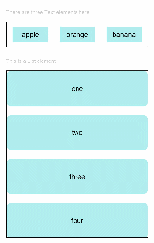

# 拖拽事件

拖拽事件指组件被长按后拖拽时触发的事件。

>  **说明：**
>
>  从API Version 8开始支持。后续版本如有新增内容，则采用上角标单独标记该内容的起始版本。

## 事件

| 名称                                                         | 支持冒泡 | 功能描述                                                     |
| ------------------------------------------------------------ | -------- | ------------------------------------------------------------ |
| onDragStart(event:&nbsp;(event?:&nbsp;[DragEvent](#dragevent说明),&nbsp;extraParams?:&nbsp;string)&nbsp;=&gt;&nbsp;&nbsp;[CustomBuilder](ts-types.md#custombuilder8) \| [DragItemInfo](#dragiteminfo说明)) | 否       | 第一次拖拽此事件绑定的组件时，触发回调。<br/>- event：拖拽事件信息，包括拖拽点坐标。<br/>- extraParams：拖拽事件额外信息，详见[extraParams](#extraparams说明)说明。<br/>返回值：当前跟手效果所拖拽的对象，用于显示拖拽时的提示组件。<br/>长按150ms可触发拖拽事件。优先级：长按手势配置时间小于等于150ms时，长按手势优先触发，否则拖拽事件优先触发。 |
| onDragEnter(event:&nbsp;(event?:&nbsp;[DragEvent](#dragevent说明),&nbsp;extraParams?:&nbsp;string)&nbsp;=&gt;&nbsp;void) | 否       | 拖拽进入组件范围内时，触发回调。<br/>- event：拖拽事件信息，包括拖拽点坐标。<br/>- extraParams：拖拽事件额外信息，详见[extraParams](#extraparams说明)说明。<br/>当监听了onDrop事件时，此事件才有效。 |
| onDragMove(event:&nbsp;(event?:&nbsp;[DragEvent](#dragevent说明),&nbsp;extraParams?:&nbsp;string)&nbsp;=&gt;&nbsp;void) | 否       | 拖拽在组件范围内移动时，触发回调。<br/>- event：拖拽事件信息，包括拖拽点坐标。<br/>- extraParams：拖拽事件额外信息，详见[extraParams](#extraparams说明)说明。<br/>当监听了onDrop事件时，此事件才有效。 |
| onDragLeave(event:&nbsp;(event?:&nbsp;[DragEvent](#dragevent说明),&nbsp;extraParams?:&nbsp;string)&nbsp;=&gt;&nbsp;void) | 否       | 拖拽离开组件范围内时，触发回调。<br/>- event：拖拽事件信息，包括拖拽点坐标。<br/>- extraParams：拖拽事件额外信息，详见[extraParams](#extraparams说明)说明。<br/>当监听了onDrop事件时，此事件才有效。 |
| onDrop(event:&nbsp;(event?:&nbsp;[DragEvent](#dragevent说明),&nbsp;extraParams?:&nbsp;string)&nbsp;=&gt;&nbsp;void) | 否       | 绑定此事件的组件可作为拖拽释放目标，当在本组件范围内停止拖拽行为时，触发回调。<br/>- event：拖拽事件信息，包括拖拽点坐标。<br/>- extraParams：拖拽事件额外信息，详见[extraParams](#extraparams说明)说明。 |

## DragItemInfo说明

| 名称      | 类型                                     | 必填   | 描述                                |
| --------- | ---------------------------------------- | ---- | --------------------------------- |
| pixelMap  | [PixelMap](../apis/js-apis-image.md#pixelmap7) | 否    | 设置拖拽过程中显示的图片。                     |
| builder   | [CustomBuilder](ts-types.md#custombuilder8) | 否    | 拖拽过程中显示自定义组件，如果设置了pixelMap，则忽略此值。 |
| extraInfo | string                                   | 否    | 拖拽项的描述。                           |


## extraParams说明

  用于返回组件在拖拽中需要用到的额外信息。

  extraParams是Json对象转换的string字符串，可以通过Json.parse转换的Json对象获取如下属性。

| 名称          | 类型   | 描述                                       |
| ------------- | ------ | ---------------------------------------- |
| selectedIndex | number | 当拖拽事件设在父容器的子元素时，selectedIndex表示当前被拖拽子元素是父容器第selectedIndex个子元素，selectedIndex从0开始。<br/>仅在ListItem组件的拖拽事件中生效。 |
| insertIndex   | number | 当前拖拽元素在List组件中放下时，insertIndex表示被拖拽元素插入该组件的第insertIndex个位置，insertIndex从0开始。<br/>仅在List组件的拖拽事件中生效。 |

## DragEvent说明

| 名称     | 类型  | 描述             |
| ------ | ------ | ---------------- |
| getX() | number | 当前拖拽点x轴坐标，单位为vp。 |
| getY() | number | 当前拖拽点y轴坐标，单位为vp。 |

## 示例

```ts
// xxx.ets
@Entry
@Component
struct DragExample {
  @State numbers: string[] = ['one', 'two', 'three', 'four', 'five', 'six']
  @State text: string = ''
  @State bool: boolean = false
  @State appleVisible: Visibility = Visibility.Visible
  @State orangeVisible: Visibility = Visibility.Visible
  @State bananaVisible: Visibility = Visibility.Visible

  // 自定义拖拽过程中显示的内容
  @Builder pixelMapBuilder() {
    Column() {
      Text(this.text)
        .width('50%')
        .height(60)
        .fontSize(16)
        .borderRadius(10)
        .textAlign(TextAlign.Center)
        .backgroundColor(Color.Yellow)
    }
  }

  build() {
    Column() {
      Text('There are three Text elements here')
        .fontSize(12)
        .fontColor(0xCCCCCC)
        .width('90%')
        .textAlign(TextAlign.Start)
        .margin(5)
      Row({ space: 15 }) {
        Text('apple')
          .width('25%')
          .height(35)
          .fontSize(16)
          .textAlign(TextAlign.Center)
          .backgroundColor(0xAFEEEE)
          .visibility(this.appleVisible)
          .onDragStart(() => {
            this.bool = true
            this.text = 'apple'
            this.appleVisible = Visibility.None
            return this.pixelMapBuilder
          })
        Text('orange')
          .width('25%')
          .height(35)
          .fontSize(16)
          .textAlign(TextAlign.Center)
          .backgroundColor(0xAFEEEE)
          .visibility(this.orangeVisible)
          .onDragStart(() => {
            this.bool = true
            this.text = 'orange'
            this.orangeVisible = Visibility.None
            return this.pixelMapBuilder
          })
        Text('banana')
          .width('25%')
          .height(35)
          .fontSize(16)
          .textAlign(TextAlign.Center)
          .backgroundColor(0xAFEEEE)
          .visibility(this.bananaVisible)
          .onDragStart((event: DragEvent, extraParams: string) => {
            console.log('Text onDragStart, ' + extraParams + 'X:' + event.getX() + 'Y:' + event.getY())
            this.bool = true
            this.text = 'banana'
            this.bananaVisible = Visibility.None
            return this.pixelMapBuilder
          })
      }.padding({ top: 10, bottom: 10 }).margin(10)

      Text('This is a List element')
        .fontSize(12)
        .fontColor(0xCCCCCC)
        .width('90%')
        .textAlign(TextAlign.Start)
        .margin(15)
      List({ space: 20 }) {
        ForEach(this.numbers, (item) => {
          ListItem() {
            Text(item)
              .width('100%')
              .height(80)
              .fontSize(16)
              .borderRadius(10)
              .textAlign(TextAlign.Center)
              .backgroundColor(0xAFEEEE)
          }
        }, item => item)
      }
      .editMode(true)
      .height('50%')
      .width('90%')
      .border({ width: 1 })
      .padding(15)
      .divider({ strokeWidth: 2, color: 0xFFFFFF, startMargin: 20, endMargin: 20 })
      .onDragEnter((event: DragEvent, extraParams: string) => {
        console.log('List onDragEnter, ' + extraParams + 'X:' + event.getX() + 'Y:' + event.getY())
      })
      .onDragMove((event: DragEvent, extraParams: string) => {
        console.log('List onDragMove, ' + extraParams + 'X:' + event.getX() + 'Y:' + event.getY())
      })
      .onDragLeave((event: DragEvent, extraParams: string) => {
        console.log('List onDragLeave, ' + extraParams + 'X:' + event.getX() + 'Y:' + event.getY())
      })
      .onDrop((event: DragEvent, extraParams: string) => {
        var jsonString = JSON.parse(extraParams);
        if (this.bool) {
          // 通过splice方法插入元素
          this.numbers.splice(jsonString.insertIndex, 0, this.text)
          this.bool = false
        }
      })
    }.width('100%').height('100%').padding({ top: 20 }).margin({ top: 20 })
  }
}
```


